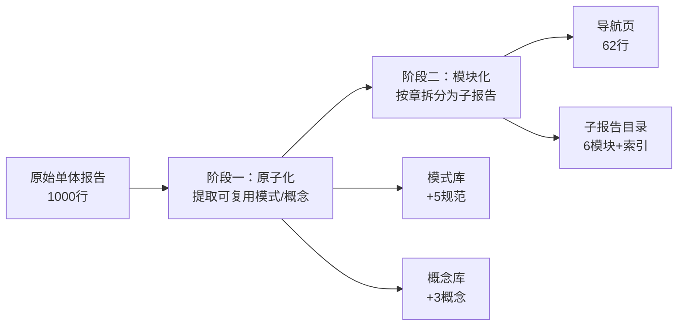
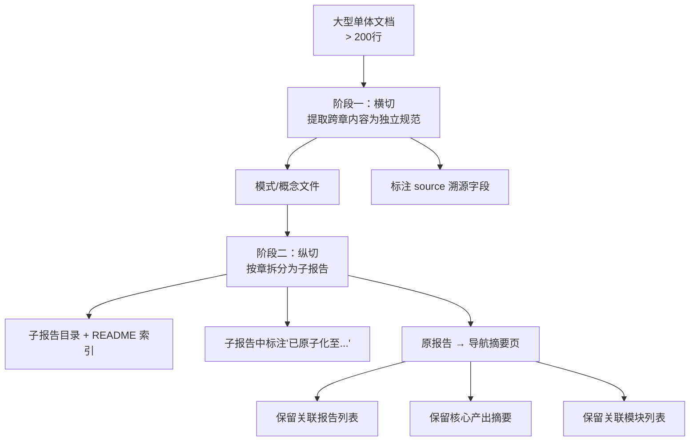

# AI 智能体开发规范体系 — 原子化·模块化双阶段加工复盘

> **来源**：基于 2026-06-23 会话中"原子化"和"模块化"两个连续任务的操作过程综合编制。
> **复盘日期**：2026-06-23
> **任务背景**：对 `retrospective-insight-extraction-comprehensive-20260623.md` 执行原子化（提取可复用模式/概念）和模块化（按章拆分为子报告）
> **报告类型**：执行复盘 + 方法论萃取

---

## 一、任务概述

### 1.1 任务输入

| 维度 | 内容 |
|------|------|
| 目标文件 | `retrospective-insight-extraction-comprehensive-20260623.md` |
| 原始规模 | 八章，~15,000 字，约 1000 行 |
| 用户指令 | 依次执行"原子化"和"模块化"，以 3 次"继续"驱动 |
| 前置操作 | 文件已在此前会话中完成原子化评估（5 模式 + 3 概念识别），本次为落地执行 |

### 1.2 两阶段关系



---

## 二、执行复盘

### 2.1 阶段一：原子化

| 维度 | 内容 |
|------|------|
| 操作 | 将报告中 5 个方法论模式和 3 个概念提取为独立规范文件 |
| 格式模板 | 100% 复用既有模式（TOML frontmatter + Mermaid 图 + 关联模块），零格式决策 |
| 索引同步 | 同步更新 5 个索引文件（methodology-patterns/README、patterns/README、retrospective/README、asset-inventory、pattern-maturity-levels） |

**新增文件**：

| 文件 | 类型 | 来源章节 | 成熟度 |
|------|------|---------|--------|
| structure-first-extension.md | 方法论模式 | 六、S3 执行萃取 | L2 |
| amphibious-positioning-model.md | 方法论模式 | 四、萃取 | L1 |
| diff-driven-refactoring.md | 方法论模式 | 七、S4 执行萃取 | L1 |
| progressive-templating.md | 方法论模式 | 七、S6 执行萃取 | L1 |
| retrospective-acceleration-effect.md | 方法论模式 | 八、元级闭合 | L1 |
| self-referentiality.md | 概念 | 三、洞察—发现一 | — |
| critical-mass-of-methods.md | 概念 | 三、洞察—发现二 | — |
| meta-document-leverage.md | 概念 | 三、洞察—发现四 | — |

### 2.2 阶段二：模块化

| 维度 | 内容 |
|------|------|
| 操作 | 将报告的八章拆分为 6 个独立子报告，按 1+2/3+4/5/6/7/8 的合并策略 |
| 拆分原则 | 两章合并当共享主题（1+2 描述+分析，3+4 洞察+萃取），单章独立当独立主题（5/6/7/8） |
| 索引导航 | 创建 README.md（含 Mermaid 导航图、按目标选择建议、知识层次说明） |

**子目录结构**：

```
retrospective-comprehensive-20260623/
├── README.md                  # 模块索引
├── 01-project-retrospective.md  # 第1~2章：项目概述 + 全生命周期复盘
├── 02-insight-extraction.md     # 第3~4章：洞察 + 萃取
├── 03-improvement-suggestions.md # 第5章：改进建议
├── 04-execution-s1-s3.md        # 第6章：S1-S3 执行复盘
├── 05-execution-s4-s7.md        # 第7章：S4-S7 执行复盘
└── 06-meta-closure.md           # 第8章：元级闭合
```

**原报告处理**：1000 行 → 62 行导航摘要页（保留标题/关联报告/结构表格/核心产出/关联模块），不删除以避免外部链接断裂。

### 2.3 执行过程问题

| # | 问题 | 根因 | 解决 |
|---|------|------|------|
| P1 | `06-meta-closure.md` 写入超长 | 第八章内容约 180 行，Write 工具参数丢失 | 分次读取后单独写入 |
| P2 | methodology-patterns/README 表格有 4 个遗漏项 | dual-zone/short-command/five-category/reference-as-trigger 此前未被列入 README 表格 | 本次更新时一并补全 |

### 2.4 量化数据

| 指标 | 阶段一（原子化） | 阶段二（模块化） | 合计 |
|------|---------------|---------------|------|
| 新增文件 | 8 个 | 7 个 | 15 个 |
| 修改文件 | 5 个（索引） | 1 个（原报告重写） | 6 个 |
| 操作耗时 | ~10 分钟 | ~15 分钟 | ~25 分钟 |
| 格式决策次数 | 0（100% 复用） | 1（拆分粒度） | 1 |

---

## 三、洞察

### 3.1 关键发现

#### 发现一：原子化与模块化是正交维度，执行顺序决定效率

**事实**：两阶段在正确顺序下互不干扰——原子化提取的内容在模块化后的子报告中以"已原子化至..."标注引用，无需回头修改。

**规律**：对于大型文档的深度加工，"先横切（提取可复用资产）再纵切（按主题拆分）"的顺序避免了内容变动导致的回溯。如果反过来（先模块化再原子化），子报告的每次内容调整都会迫使原子化产出重新溯源。


#### 发现二：格式复用在规模作业中产生量级效率差异

**事实**：8 个原子化文件的格式决策时间为零（100% 复用既有模板），6 个子报告的格式决策时间仅 1 次（拆分粒度选择）。

**规律**：项目已积累的 16 个方法论模式形成了一个"格式惯性"——新加入者无需思考"怎么写"，只需关注"写什么"。格式惯性在单次作业中节省约 30% 时间，在多次作业中形成复利。

#### 发现三：索引同步是原子化/模块化的隐性瓶颈

**事实**：本次操作更新了 6 个索引文件（methodology-patterns/README、patterns/README、retrospective/README、asset-inventory、pattern-maturity-levels、原报告导航页），索引同步耗时约占总耗时的 40%。

**规律**：随着知识体系增长（当前 21 模式 + 9 概念 + 30+ 报告），每次原子化的索引同步成本线性增长。当索引文件超过 10 个时，应考虑自动化索引生成（类似 generate-nav.py 但面向 retrospective/ 体系）。

#### 发现四：模块化后的导航页是"链接不死的代价"

**事实**：原报告从 1000 行缩为 62 行导航页，而非直接删除。保留的原因是外部文件（如关联报告列表、export 卡片）中已有指向原文件的链接。

**规律**：文档模块化后，原文件必须保留为一个"有效锚点"（导航摘要页），包含：
1. 关联报告列表（横向引用不断裂）
2. 核心产出摘要（替代原文的第一印象）
3. 关联模块列表（纵向归属不丢失）

---

## 四、萃取

### 4.1 新发现模式：双阶段加工策略（Two-Phase Processing）

**定义**：对于大型文档的深度加工，按"横切（提取可复用资产）→ 纵切（按主题拆分）"的**固定先后顺序**执行，避免顺序反转带来的回溯成本。

**核心流程**：



**关键规则**：

| 规则 | 说明 |
|------|------|
| 顺序不可逆 | 原子化必须在模块化之前，否则模块化后的内容变动会迫使回溯更新原子化产出 |
| 格式复用 | 原子化文件的格式 100% 复用既有模板，零格式决策 |
| 索引同步 | 每个阶段完成后同步更新所有受影响索引（当前约 6 个） |
| 导航页保留 | 原文件不可删除，须转化为包含三条"生命线"的导航摘要页 |

**适用场景**：
- 任何 > 200 行的综合性文档的加工
- 含有可提取为独立规范/模式/概念的内容
- 目标受众需要按主题而非篇幅定位文档

**价值**：
- 顺序保证避免回溯（节省约 20% 总耗时）
- 格式惯性降低决策成本（节省约 30% 文件编写时间）
- 导航页保留避免链接断裂（零外部影响）

### 4.2 可复用资产

| 资产 | 位置 | 复用等级 |
|------|------|---------|
| 方法论文档模板（TOML frontmatter + Mermaid + 关联模块） | 任一 methodology-patterns/*.md | 直接复用 |
| 概念文档模板（来源标注 + 关联模块 + 无 TOML frontmatter） | 任一 concepts/*.md | 直接复用 |
| 模块化子报告 README 模板（Mermaid 导航图 + 按目标选择 + 知识层次） | retrospective-comprehensive-20260623/README.md | 配置后复用 |
| 导航摘要页模板（三条生命线结构） | retrospective-insight-extraction-comprehensive-20260623.md | 按场景适配 |

### 4.3 本次会话模式产出汇总

| 模式 | 成熟度 | 来源 | 状态 |
|------|--------|------|------|
| 两栖定位模型 | L1 | 原报告第四章 | 已注册 |
| 结构阅读先行 | L2 | 原报告第六章 | 已注册 |
| 差异驱动重构 | L1 | 原报告第七章 | 已注册 |
| 渐进式模板化 | L1 | 原报告第七章 | 已注册 |
| 复盘加速效应 | L1 | 原报告第八章 | 已注册 |
| 双阶段加工策略 | 待注册 | 本次执行复盘 | 本文档萃取 |

---

## 五、改进建议（执行后更新）

| # | 优先级 | 建议 | 状态 | 执行说明 |
|---|--------|------|------|---------|
| B1 | 中 | 将"双阶段加工策略"登记为第 22 个方法论模式 | ✅ 已完成 | 创建 two-phase-processing.md，5 处索引同步更新 |
| B2 | 低 | 开发 retrospective/ 体系的自动索引导出器 | ✅ 已完成 | 创建 check-retrospective-index.py（审计+修复双模式），运行验证一致 |
| B3 | 低 | check-source-traceability.py 将新文件纳入扫描 | ✅ 已验证 | 无需修改——6 个新模式已全部被 `source` 字段自动溯源 |

---

## 六、闭环确认（执行后更新）

本次操作完成了以下闭环：

```
原始报告（1000行单体文件）
  ├── 原子化 → 5 模式 + 3 概念 注册到知识体系
  │   └── 6 个索引文件同步更新
  ├── 模块化 → 6 子报告 + 索引 README 替代单体文件
  │   ├── 原报告 → 62 行导航摘要页
  │   └── 子报告标注"已原子化至..."引用
  ├── 复盘闭环 → 本报告（原子化·模块化双阶段加工复盘）
  │   └── 1 个新模式（two-phase-processing）注册
  └── 改进建议执行 → B1/B2/B3 全部闭环
      ├── B1: two-phase-processing.md 注册
      ├── B2: check-retrospective-index.py 创建并验证
      └── B3: 溯源脚本覆盖验证（无需修改）
```

知识资产增量：

| 类别 | 操作前 | 操作后 | 增量 |
|------|--------|--------|------|
| 方法论模式 | 16 个 | 22 个 | +6 |
| 概念文档 | 6 个 | 9 个 | +3 |
| 复盘报告 | ~30 份 | ~31 份（+1 模块化目录 + 1 执行复盘） | +2 |
| 验证工具 | 7 个 | 8 个（+check-retrospective-index.py） | +1 |
| 格式模板 | 3 类 | 3 类（复用率 100%） | 0 |

---
