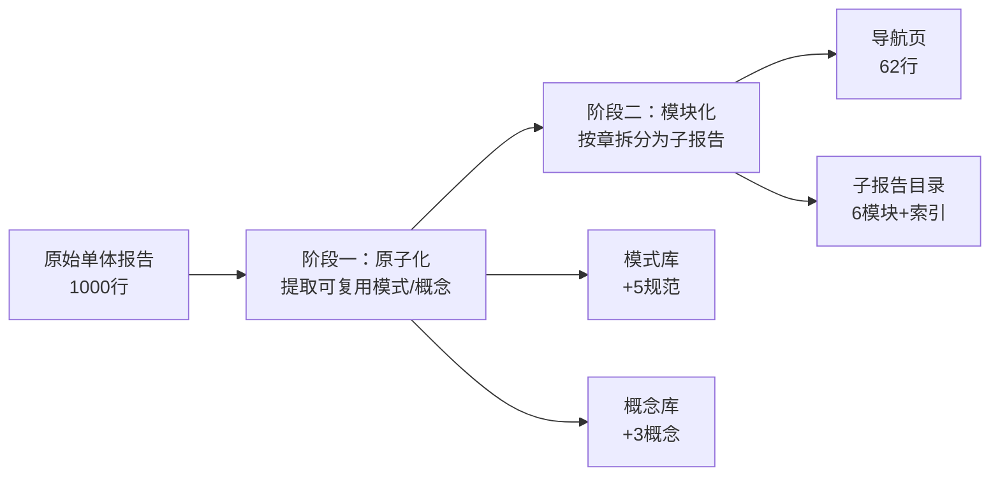

+++
id = "retrospective-atomization-modularization-comprehensive-report-20260623-project-overview"
date = "2026-06-23"
type = "project-overview"
source = "docs/retrospective/reports/retrospective-atomization-modularization-comprehensive-report-20260623.md#一"
+++

# 一、任务概述

> **来源**：基于 2026-06-23 会话中"原子化"和"模块化"两个连续任务的操作过程综合编制。
> **复盘日期**：2026-06-23
> **任务背景**：对 `retrospective-insight-extraction-comprehensive-20260623.md` 执行原子化（提取可复用模式/概念）和模块化（按章拆分为子报告）
> **报告类型**：执行复盘 + 方法论萃取

## 1.1 任务输入

| 维度 | 内容 |
|------|------|
| 目标文件 | `retrospective-insight-extraction-comprehensive-20260623.md` |
| 原始规模 | 八章，~15,000 字，约 1000 行 |
| 用户指令 | 依次执行"原子化"和"模块化"，以 3 次"继续"驱动 |
| 前置操作 | 文件已在此前会话中完成原子化评估（5 模式 + 3 概念识别），本次为落地执行 |

## 1.2 两阶段关系

---

> **关联模块**：[execution-retrospective.md](execution-retrospective.md)、[insight-extraction.md](insight-extraction.md)、[export-suggestions.md](export-suggestions.md)