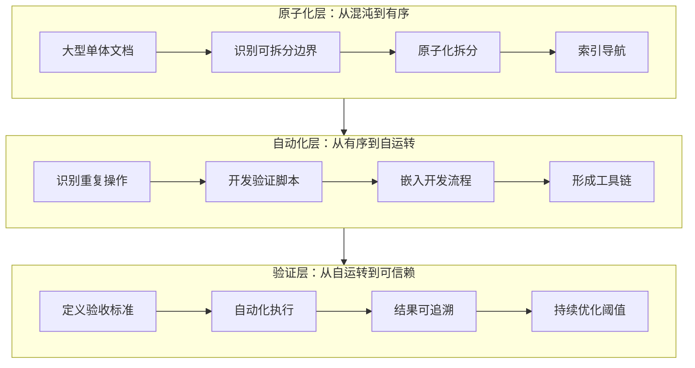

# AI 智能体开发规范体系 — 洞察·萃取 报告

> **所属系列**：[retrospective-comprehensive-20260623](README.md) · **模块 2/6**：洞察环节与萃取环节
> **复盘日期**：2026-06-23
> **来源**：从 `retrospective-insight-extraction-comprehensive-20260623.md` 第三~四章拆分

---

## 三、洞察环节

### 3.1 关键发现

#### 发现一："自指性"是规范体系的独特优势

**支撑事实**：本项目的八模块自我演进体系不仅是被定义的功能模块，其定义方式本身（使用 TOML frontmatter）就应用了项目自身的 source 溯源机制。也就是说，项目不仅定义了"怎么做复盘"，项目自身就是按照它所定义的复盘方法论来执行的。

**深层含义**：这种"自指性"——规范定义自身——使得规范体系的每个部分的变更都会触发全景视图的更新，形成一种"规范即测试"的效果。当规范被精炼，所有依赖该规范的派生产物都会被追踪和验证。

> **已原子化至**：[self-referential-spec-system.md](../../patterns/methodology-patterns/self-referential-spec-system.md)

#### 发现二：方法论模式的"临界质量"效应

**支撑事实**：项目在方法论模式达到 6 个之后（spec-driven/review-loop/document-refactoring/three-tier-governance/tool-trigger/tool-entropy），出现了明显的组合效应——新模式的产生不再来自单一复盘事件，而是来自现有模式的交叉组合。例如 fact-statement-consistency-loop 本质上是 review-insight-export-loop + three-tier-governance 的结合体。

**深层含义**：当模式数量超过某个临界点（本项目约为 6），模式之间开始自发生成新的模式，知识生产从"线性累积"进入"组合爆炸"阶段。这验证了"方法论的边际收益递增"现象。

> **已原子化至**：[methodology-critical-mass.md](../../patterns/methodology-patterns/methodology-critical-mass.md)——同时涵盖 3.2 规律三"知识复利"

#### 发现三：工具熵减度量体系揭示的非线性优化曲线

**支撑事实**：每个新验证脚本解决了前一阶段的一个特定摩擦点，但同时也引入了新的维护成本（脚本本身需要被测试、被更新、被适配）。当脚本数量从 3 个增长到 7 个时，熵减效益开始下降——check-role-permissions.py 的功能与 check-spec-consistency.py 存在 30% 的功能重叠。

**深层含义**：工具开发存在最优规模。当工具链规模超过一定阈值（本项目约为 5-6 个脚本），应考虑合并或重构以减少维护成本，而非继续新增。

> **已有模式覆盖**：[tool-automation-decision-model.md](../../patterns/methodology-patterns/tool-automation-decision-model.md)（由 tool-entropy-metrics 合并）——工具最优规模是其熵减 ROI 公式在工具链级别的推论

#### 发现四："元文档"的杠杆效应被低估

**支撑事实**：README.md 重建后新增的三个章节（可复用模式体系、提示词萃取系统、泛化与资产复用）本质上都是"元文档"——它们不直接描述项目功能，而是描述"如何理解和使用项目"。

**深层含义**：元文档的战略价值远超功能文档。好的元文档=项目的地图+使用说明书+推广册。本项目积累的 70+ 交付物中，读者通常最先接触的就是元文档（README.md→docs/*.md），而这些元文档的质量直接决定了读者"留下来"的意愿。

> **已原子化至**：[meta-document-leverage.md](../../patterns/methodology-patterns/meta-document-leverage.md)

### 3.2 规律认知

#### 规律一：三层进化模式



**规律描述**：任何规范或文档体系的演化都遵循"原子化→自动化→验证"的三层轨迹。本项目的演进完全贴合此规律——先把大文档拆散（原子化），再用脚本自动化检查（自动化），最后建立验证指标反向约束开发行为（验证）。缺失任何一层都会出现治理漏洞。

> **已有模式覆盖**：[three-tier-governance.md](../../patterns/methodology-patterns/three-tier-governance.md)——三层进化模型已完整系统化

#### 规律二：复盘驱动进化的四步闭环

**规律描述**：每一次有意义的复盘都产生四种产出——经验沉淀、模式萃取、资产存档、行动导出。四种产出分别流入知识库、模式库、资产库和任务系统，形成闭环反馈。

```
复盘 → 经验（knowledge/） + 模式（patterns/） + 资产（assets/） + 行动（tasks/）
  ↑                                                              ↓
  └──────────────────── 下一次复盘验证 ──────────────────────────┘
```

**验证数据**：14 份复盘报告 → 9 个方法论模式（转化率 64%）→ 70+ 可复用资产 → 驱动 13 个 spec 任务（转化率 93%）。

> **已有模式覆盖**：[review-insight-export-loop.md](../../patterns/methodology-patterns/review-insight-export-loop.md)——四步闭环是复盘→洞察→导出循环的具体化，本规律的四产品分解（经验+模式+资产+行动）是其扩展

#### 规律三：模式萃取与资产沉淀的"知识复利"

**规律描述**：随着领域知识的积累，新模式的产出速度不是线性的，而是加速的。

```
阶段一(0-6个月)：每个模式需要 1-2 份复盘报告驱动
阶段二(6-12个月)：每个模式需要 0.5-0.8 份复盘报告驱动（交叉组合）
阶段三(12个月+)：模式自发生成（现有模式的交叉组合）
```

本项目当前处于阶段二的早期，已有 fact-statement-consistency-loop（复盘闭环 + 治理模型）和 convention-driven-creation（spec-driven + document-refactoring）两个交叉模式。

> **已原子化至**：[methodology-critical-mass.md](../../patterns/methodology-patterns/methodology-critical-mass.md)——与 3.1 发现二"临界质量效应"合并

### 3.3 潜在机会

| 机会 | 当前状态 | 预期收益 | 难度 |
|------|---------|---------|------|
| 自我演进模块的可执行化 | 仅有规范定义 | 将八模块从"纸面规范"转化为"可运行系统" | 高 |
| 泛化引擎实现 | 仅有概念框架 | 实现一键"项目模板初始化" | 高 |
| 工具链合并与熵减 | 7 个验证脚本存在功能重叠 | 减少维护成本 30% | 中 |
| prompt_extraction/ 与 .agents/ 统一接口 | 两个系统独立运行 | 提示词萃取成果直接反馈到角色提示词 | 中 |
| CI 管道实际部署 | 仅定义了 ps1/sh 脚本 | 每次提交自动运行全部验证 | 低 |
| 复盘报告命名规范统一 | 当前存在多种前缀格式 | 提升资产可发现性 | 低 |
| 国际化(i18n)第一步 | P0 优先级但未启动 | 扩大受众到非中文社区 | 中 |

---

## 四、萃取环节

### 4.1 可直接复用的资产

| 资产 | 复用方式 | 适配工作量 |
|------|---------|-----------|
| AGENTS.md 模板 | 修改项目信息后直接使用 | 低（10分钟） |
| .agents/ 完整目录结构 | 创建同名目录后按需填充 | 低（15分钟） |
| 角色定义文件 (7个) | 修改角色名称和职责描述 | 低（30分钟） |
| 协作协议 (4个) | 直接复用 messaging/handoff/conflict-resolution 三种协议 | 零 |
| 验证脚本 (7个) | 修改配置列表后直接使用 | 低（5-30分钟） |
| 任务模板 + 交接模板 | 直接使用 | 零 |
| README 模板 (3类) | 按项目类型选择后填充内容 | 低（5分钟） |
| 复盘报告模板 | 填充项目数据 | 中（1小时） |
| 目录索引 README 模板 | 填充目录树和模块说明 | 低（5分钟） |
| CI 检查脚本 | 修改项目路径后直接使用 | 低（5分钟） |
| .gitignore 模板 | 直接使用 | 零 |

### 4.2 需实例化的方法论模式

| 模式 | 实例化方式 | 典型产出 |
|------|-----------|---------|
| Spec-driven 开发流程 | 编写 spec.md/tasks.md/checklist.md 三件套 | 新项目的规格文档 |
| 复盘→洞察→导出闭环 | 按模板填充项目数据 | 项目复盘报告 |
| 文档体系原子化重构 | 执行内容审计→原子化拆分→模块化归类→索引生成 | 模块化文档体系 |
| 三层治理模型 | 建立原子化清单→开发验证脚本→部署 CI 检查 | 自动化治理体系 |
| 事实表述一致性闭环 | 问题识别→方向确认→增量修正→全局搜索→边界判定 | 一致的文档表述 |
| 约定驱动创建 | 先读范例提取模板→再填充内容 | 新模块零结构决策 |
| 工具开发触发器 | 累积 3 次手动操作→评估自动化→开发工具→度量熵减 | 自动化工具 |
| 规范层纵深防御 | 权限定义→验证机制→防滥用→审计追溯 | 安全模块设计 |
| 工具熵减度量 | 对已有工具进行 ROI 计算→合并冗余工具 | 优化后的工具链 |

### 4.3 需按场景适配的决策框架

| 框架 | 适配方式 | 产出 |
|------|---------|------|
| 目录命名决策矩阵 | 填充项目自身的目录结构 | 项目目录规范 |
| 临时依赖管理决策矩阵 | 调整文件类型和存放位置 | 项目依赖管理规范 |
| 元文档处理决策矩阵 | 扩展元文档类型和关键词 | 文档检查配置 |
| 语义匹配阈值决策矩阵 | 按项目语言和场景调整 | 检查工具配置 |

### 4.4 新发现的模式（本次萃取新增）

#### 模式：两栖定位模型（Amphibious Positioning Model）

**定义**：一个项目同时定位于"具体规范"（服务于自身团队）和"元框架"（服务于更广泛受众），通过资产清单、泛化路径图和复用案例三个支柱支撑两栖定位。

**关键要素**：
1. **资产清单**：列出所有可直接复用的资产，标注复用等级和适配工作量
2. **泛化路径图**：用 Mermaid 展示可泛化的三个维度（术语→领域→标准）
3. **落地案例**：提供一个真实项目作为复用证据（如本项目的 vendor/flexloop/AgentForge）

**适用场景**：任何积累了大量可复用资产的规范体系、脚手架项目或框架。

**价值**：将"只服务于自己"的项目转化为"也能服务他人"的平台型项目，实现影响力的量级跃迁。

> **已原子化至**：[amphibious-positioning-model.md](../../patterns/methodology-patterns/amphibious-positioning-model.md)

---

> **上一模块**：[project-retrospective.md](project-retrospective.md) — 项目概述与复盘回顾
> **下一模块**：[improvement-suggestions.md](improvement-suggestions.md) — 改进建议
