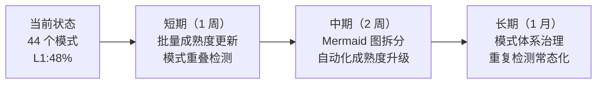

+++
id = "retrospective-entry-detail-migration-20260624-export"
date = "2026-06-24"
type = "export-suggestions"
source = "docs/retrospective/reports/retrospective-entry-detail-migration-20260624.md#四、导出环节"
+++

# 导出建议

## 改进建议

| 问题 | 改进措施 | 优先级 | 预期效果 | 状态 |
|------|---------|--------|---------|------|
| 入口文件受众未分化 | 将"入口-容器分离 + 受众分化"萃取为独立方法论模式 | 高 | 明确两入口文件的精简原则差异 | **已完成** |
| 文档降级策略未模式化 | 将"源文档降级为引用导航"萃取为独立方法论模式 | 高 | 指导大型文档原子化后的处理方式 | **已完成** |
| 模式成熟度偏差 | 批量复核 L1 模式，将已验证 2+ 次的升级至 L2 | 中 | 成熟度分布更准确 | 待规划 |
| 模式重叠未检测 | 基于三维重叠度扫描相似模式对 | 低 | 发现并合并冗余模式 | 待规划 |
| 方法论模式 Mermaid 图过密 | 分领域拆分模式关系图（开发流程/文档治理/知识管理） | 低 | 提高可读性 | 待规划 |

## 行动计划

| 优先级 | 改进项 | 具体措施 | 状态 |
|--------|--------|---------|------|
| 高 | 萃取入口-容器分离模式 | 创建 `entry-container-separation.md`，定义 README/AGENTS/.agents 三层的细节分配原则 | **已完成** |
| 高 | 萃取文档降级模式 | 创建 `source-document-downgrade.md`，定义大型文档原子化后的"降级为引用导航"标准流程 | **已完成** |
| 中 | 批量成熟度更新 | 运行 `check-atomization-coverage.py` 统计各模式验证/复用次数，识别应升级的 L1 模式 | 待规划 |
| 低 | 模式重叠扫描 | 基于 `pattern-merge-boundary.md` 的三维重叠度，对全量模式做交叉对比 | 待规划 |
| 低 | Mermaid 图拆分 | 将方法论模式关系图按领域拆分为 3 个子图 | 待规划 |

## 可萃取模式候选

本阶段实践中识别出以下可萃取为独立模式的候选：

| 候选 | 来源 | 核心机制 | 建议名称 | 状态 |
|------|------|---------|---------|------|
| 入口-容器分离 + 受众分化 | README/AGENTS 精简实践 | README（人类）最大精简、AGENTS（AI）路由级保留、.agents/ 全量承载 | `entry-container-separation.md` | **已萃取** |
| 源文档降级 | 综合报告原子化后的处理 | 大型文档被原子化拆分后，源文档降级为引用导航页（不删除），子模块为唯一权威来源 | `source-document-downgrade.md` | **已萃取** |
| 模式成熟度自动升级 | 成熟度偏差发现 | 扫描模式 frontmatter 的 validation_count，≥2 自动升级至 L2 | 合并入已有 `auto-generate-threshold.md` | 待规划 |

## 后续优化方向

