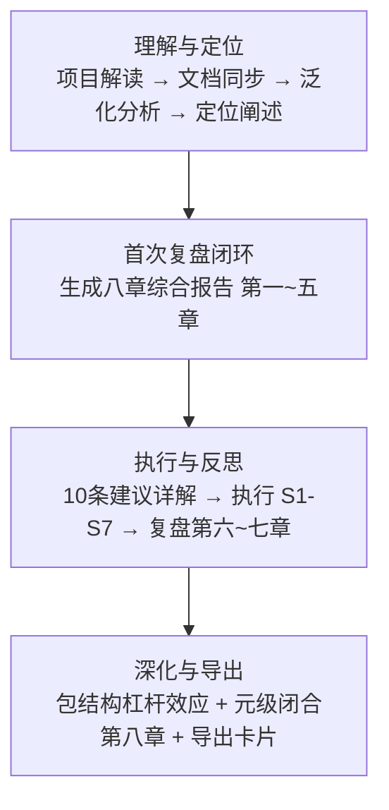

# 会话导出卡片 — 2026-06-23

> **会话主题**：AI 智能体开发规范体系 — 全链路复盘·洞察·萃取·改进执行
> **交互轮次**：12 轮 | **总耗时**：~3 小时
> **输出**：八章综合报告 + 10 个新增文件 + 22 个修改文件 + 5 个新模式

---

## 会话全景

---

## 新增方法论模式速查（5 个）

| # | 模式 | 一句话 | 适用场景 |
|---|------|--------|---------|
| 1 | **两栖定位模型** | 通过资产清单+泛化路径图+复用案例，同时定位"具体规范"和"元框架" | 任何积累了大量可复用资产的规范体系 |
| 2 | **结构阅读先行** | 扩展前先完整阅读包结构，同概念域追加、异概念域新建 | 已有清晰包结构的项目扩展 |
| 3 | **差异驱动重构** | 逐段对比→标注重复/相似/独有→提取和参数化→回归验证 | 两个及以上功能重叠的代码文件合并 |
| 4 | **渐进式模板化** | 硬编码验证→模板分离→多类型扩展三阶段 | 模板驱动的代码生成工具开发 |
| 5 | **复盘加速效应** | 复盘频率越高，改进延迟越低，知识转化率越高 | 任何迭代式开发流程 |

---

## 全链路可交付资产

### 新增文件（10 个）

| 文件 | 说明 |
|------|------|
| [retrospective-insight-extraction-comprehensive-20260623.md](retrospective-insight-extraction-comprehensive-20260623.md) | 八章综合报告 (~15000 字) |
| [lib/__init__.py](../../../.agents/scripts/lib/__init__.py) | 共享工具库入口 |
| [lib/project.py](../../../.agents/scripts/lib/project.py) | 工程路径解析（AGENTS.md 优先回退） |
| [lib/frontmatter.py](../../../.agents/scripts/lib/frontmatter.py) | TOML frontmatter 通用解析器 |
| [lib/cli.py](../../../.agents/scripts/lib/cli.py) | CLI 彩色输出 + 通用参数 |
| [generate-tests.py](../../../.agents/scripts/generate-tests.py) | spec.md → pytest 测试骨架生成器 |
| [agents.py](../../../.agents/scripts/agents.py) | 泛化引擎 CLI（`agents init` 脚手架） |
| [AGENTS.en.md](../../../AGENTS.en.md) | 英文快速索引（120 行） |
| rename_refs.py | 全局 Markdown 链接重命名脚本（可归档） |
| 本卡片 | 会话导出卡片 |

### 修改文件（22 个）

- **重命名**：3 个复盘报告（统一 `retrospective-` 前缀）
- **引用更新**：14 个文件共 33 处旧文件名引用
- **重构**：check-role-permissions.py + check-spec-consistency.py
- **配置**：prompt_extraction/constants/__init__.py + paths.py + config.py + pipeline.py
- **文档**：AGENTS.md（+7 条路由） + README.md（+3 章）

---

## 改进建议执行矩阵

| # | 建议 | 优先级 | 状态 |
|---|------|--------|------|
| S1 | 更新文档导航表 | 🔴 高 | ✅ 已完成 |
| S2 | 统一复盘命名规范 | 🔴 高 | ✅ 已完成 |
| S3 | prompt_extraction ↔ .agents 绑定 | 🔴 高 | ✅ 已完成 |
| S4 | 合并验证脚本，提取公共库 | 🟡 中 | ✅ 已完成 |
| S5 | self-verification 可执行化 | 🟡 中 | ✅ 已完成 |
| S6 | 泛化引擎 CLI 原型 | 🟡 中 | ✅ 已完成 |
| S7 | 国际化 AGENTS.en.md | 🟡 中 | ✅ 已完成 |
| S8 | CI 管道部署 | 🟢 低 | ⬜ 待办 |
| S9 | 自我洞察仪表盘 | 🟢 低 | ⬜ 待办 |
| S10 | 跨领域角色包 | 🟢 低 | ⬜ 待办 |

**完成率**：7/10（70%）

---

## 核心洞察速览

| 级别 | 洞察 | 一句话 |
|------|------|--------|
| 项目级 | 自指性优势 | 规范定义自身，变更全链路可追踪 |
| 项目级 | 临界质量效应 | 模式 ≥6 时从线性累积进入组合爆炸 |
| 项目级 | 工具熵减曲线 | 验证脚本 5-6 个为最优规模 |
| 执行级 | 重构隐藏价值 | 重构 ROI = 消除重复 + 发现 bug + 结构基础 |
| 执行级 | 跨任务加速 | 任务 N 耗时 ≈ 基线/sqrt(N) |
| 执行级 | 包结构杠杆效应 | 分层包让新功能接入成本降为 O(1) |
| 会话级 | 复盘频率效应 | 复盘越频繁，改进延迟越低 |
| 会话级 | 做思交替节奏 | "做→思"交替粒度为最优分块大小 |
| 会话级 | 知识密度递增 | 单次会话中知识转化率随时间递增 |

---

## 隐藏 Bug 发现

| Bug | 文件 | 影响 |
|-----|------|------|
| resolve_project_root OR 逻辑缺陷 | .agents/scripts/lib/project.py | AGENTS.md 和 README.md 共存时可能误返回 .agents/ 而非项目根目录 |

---

> 完整报告见：[retrospective-insight-extraction-comprehensive-20260623.md](retrospective-insight-extraction-comprehensive-20260623.md)
