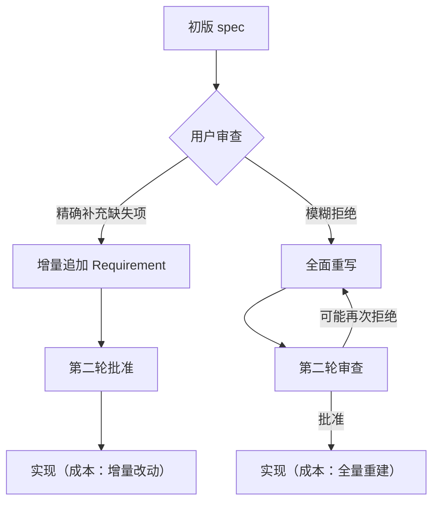

+++
id = "retrospective-insight-create-apps-directory-meta-analysis-insight"
date = "2026-06-23"
type = "insight-extraction"
source = "docs/retrospective/reports/retrospective-insight-create-apps-directory-meta-analysis.md#二"
+++

# 三、五大核心洞察

## 洞察 1：拒批 + 精确补充 = 最低成本的需求收敛

在 spec 阶段，用户对初版执行了一次**拒批**，同时**精确给出两条补充要求**：

```
初版 spec → 用户拒批 + 明确指出：
  (1) .agents/ 也需要添加 apps/ 的管理
  (2) 规则约束：先在 .temp/ 开发，逐步迁移到 apps/
```

**规律**：反馈的精确度决定修订成本。模糊的拒批（"不对，重做"）迫使智能体重新猜测需求，迭代成本高；精确的补充（"还缺 X 和 Y"）允许增量追加，迭代成本低。用户在本项目中选择了后者——spec 仅新增 2 项 ADDED Requirement，tasks 从 3 个增至 5 个，整体结构无需推翻。

**深层含义**：在 AI 协作中，用户作为"需求审查者"的价值不在于批准或拒绝本身，而在于**提供精确的缺失项描述**。这是一种"审查即设计"的模式——审查反馈本身就是增量设计的载体。



---

## 洞察 2：复盘闭环已从"四段式报告"进化为"四阶段执行流"

项目中已文档化的 [复盘→洞察→导出知识闭环](../../patterns/methodology-patterns/review-insight-export-loop.md) 定义为：

```
复盘（回顾事实）→ 洞察（提炼规律）→ 导出（行动计划）→ 驱动下一轮改进
```

但在本次实践中，这条闭环被**实际执行为一个四阶段工作流**，而非仅仅是报告结构：

| 阶段 | 触发 | 产出物类型 | 耗时 |
|------|------|-----------|------|
| 复盘 | `复盘+洞察+萃取` 指令 | 20KB 复盘报告（Markdown） | 单会话 |
| 萃取 | 同上（同一会话） | 2 个方法论模式文件 + 资产清单更新 | 同一会话 |
| 跟进行动 | `跟进行动项` 指令 | 4 个代码/模板修改 | 下一会话 |
| 洞察归档 | `洞察` → `归档洞察报告` 指令 | 1 篇跨周期洞察报告（本文档） | 下一会话 |

**规律**：闭环的四阶段已经从"报告内部的章节结构"进化到"跨会话的实际执行流"。复盘报告不再是终点，而是中继站——它产出的行动项在后续会话中被逐一执行，执行结果又触发新的洞察归档。

**深层含义**：项目的知识管理正在从"文档驱动"向"流程驱动"演进。复盘报告的价值不在于被阅读，而在于**被执行的行动项数量**——行动项完成率 100%（5/5）是这个体系健康的真实指标。

---

## 洞察 3：知识体系呈现"自举式增长"——新资产直接增强旧资产

本次产出的知识资产与既有体系形成双向增强关系：

```
      既有资产（被验证/被增强）              新资产（本次产出）
      ─────────────────────────────      ──────────────────
      spec-driven-development.md   ← 实践 →  双区开发模型
      multi-agent-parallel-execution.md ← 实践 → 生命周期协议三阶段
      review-insight-export-loop.md ← 闭合 → 复盘报告 + 行动项全完成
      spec-template.md             ← 优化 → 新增"关联系统影响分析"字段
      checklist-template.md        ← 优化 → 新增"关联系统影响"检查类别
      app-development-workflow.md  ← 增强 → 新增"迁移失败回退"约束
      asset-inventory.md           ← 扩充 → 新增 3 项模式 + 1 篇报告
```

**规律**：新知识不只是"加入知识库"，而是在**修改和增强已有知识**。模板被优化、协议被补充、索引被更新——新实践推动旧规范的完善，旧规范约束新实践的边界。这是体系的"自举性"（Specification Bootstrapping）在微观层面的体现。

**深层含义**：真正的知识积累不是文件数量的增长，而是**交叉引用密度的提升**。当新产出的模式文件被 asset-inventory.md 索引，被 retrospective README 列出，被复盘报告引用，被其他模式关联——这个文件的"知识价值"才被充分释放。

---

## 洞察 4："复盘即行动"——从发现到修复的零延迟

5 项行动计划的时间线：

```
2026-06-23 会话 1（复盘·洞察·萃取）：
  ✅ 双区开发模型方法论      [即时完成]
  ✅ 生命周期协议三阶段      [即时完成]
  ✅ 资产清单更新            [即时完成]

2026-06-23 会话 2（跟进行动项）：
  ✅ 关联系统影响分析检查项  [< 5 分钟]
  ✅ 迁移失败回退流程        [< 5 分钟]
```

**规律**：需要创造性提炼的行动项（写新文件）在复盘会话内即时完成；需要修改现有文件的行动项在用户触发下一指令后极速完成。没有一项行动需要"排期"或"等待"——全部在 2 个会话内闭环。

**深层含义**：AI 协作环境消除了传统项目管理的最大延迟——"发现问题的人"和"解决问题的人"是同一个实体（用户 + 智能体构成的协作单元）。在传统模式下，复盘出行动项后需要分配、排期、等待资源；在 AI 协作中，识别问题的同一时刻就可以开始解决问题。

---

## 洞察 5：短指令 + 长上下文的"低摩擦协作"模式

本次 7 轮用户指令：

```
/spec 在项目根目录下规划并创建...   → 第一轮（含完整需求描述）
复盘+洞察+萃取                       → 第二轮（3 字）
跟进行动项                          → 第三轮（4 字）
洞察                               → 第四轮（2 字）
归档洞察报告                        → 第五轮（6 字）
```

除首轮 `/spec` 外，后续 4 轮的指令平均仅 3.75 个字。

**规律**：首轮指令承载完整需求描述，后续指令只需**状态迁移关键词**（复盘、洞察、萃取、归档）。智能体基于上下文连续性自动推断当前阶段和预期产出，用户无需重复说明范围或目标。

**深层含义**：这形成了一种"对话式流水线"——用户在每个阶段只需发出一个触发词，智能体自动理解"现在是复盘阶段→应该写复盘报告→应该同时萃取模式→应该更新索引"。用户负担极低（每次 2-6 字），产出密度极高（每次生成多个文件）。

---

> **关联模块**：[project-overview.md](project-overview.md)、[execution-retrospective.md](execution-retrospective.md)、[export-suggestions.md](export-suggestions.md)