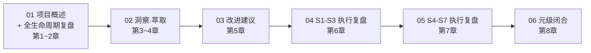

# AI 智能体开发规范体系 — 复盘·洞察·萃取 综合报告（导航页）

> **来源**：本报告基于项目全貌探索、文档同步更新任务的全过程数据综合编制。
> **复盘日期**：2026-06-23
> **项目周期**：基础规范创建 → 角色体系完善 → 复盘体系建立 → 模式萃取 → 泛化与文档同步
> **报告类型**：综合复盘 + 深度洞察 + 资产萃取
> **模块化版本**：[retrospective-comprehensive-20260623/](retrospective-comprehensive-20260623/) — 拆分为 6 个独立模块，支持按主题定位和按需加载

---

## 报告结构

原报告共八章，已拆分为 6 个独立模块，存储于 [retrospective-comprehensive-20260623/](retrospective-comprehensive-20260623/) 子目录中：

| 模块 | 内容范围 | 知识层次 | 链接 |
|------|---------|---------|------|
| 项目概述与复盘 | 第1~2章：项目概述、六阶段历程、关键节点分析 | 描述性 + 分析性 | [01-project-retrospective.md](retrospective-comprehensive-20260623/README.md) |
| 洞察与萃取 | 第3~4章：4 项关键发现、3 条规律、可复用资产 | 推理性 + 交易性 | [02-insight-extraction.md](retrospective-comprehensive-20260623/insight-extraction.md) |
| 改进建议 | 第5章：10 条分级改进建议与行动计划 | 行动性 | [03-improvement-suggestions.md](retrospective-comprehensive-20260623/execution-s1-s3.md) |
| S1-S3 执行复盘 | 第6章：高优先级任务执行复盘、包结构杠杆效应 | 元级 | [04-execution-s1-s3.md](retrospective-comprehensive-20260623/execution-s1-s3.md) |
| S4-S7 执行复盘 | 第7章：中优先级任务执行复盘、跨批次对比 | 元级 | [05-execution-s4-s7.md](retrospective-comprehensive-20260623/execution-s4-s7.md) |
| 元级闭合 | 第8章：全会话元级复盘、核心洞察、资产盘点 | 元元级 | [06-meta-closure.md](retrospective-comprehensive-20260623/meta-closure.md) |

完整模块索引参见 [retrospective-comprehensive-20260623/README.md](retrospective-comprehensive-20260623/README.md)。

## 核心产出

| 类别 | 数量 | 去向 |
|------|------|------|
| 新增方法论模式 | 5 个 | 已原子化至 `../patterns/methodology-patterns/`（两栖定位、结构阅读先行、差异驱动重构、渐进式模板化、复盘加速效应） |
| 新增概念文档 | 3 个 | `concepts/self-referentiality.md`、`critical-mass-of-methods.md`、`meta-document-leverage.md` |
| 改进建议执行 | 7/10 已完成 | 高优 3/3 + 中优 4/4 |
| 新增可运行工具 | 3 个 | `lib/` 公共库、generate-tests.py、agents.py |
| 报告总字数 | ~15,000 | — |

## 关联报告

- [retrospective-report-agents-spec-system-comprehensive.md](retrospective-report-agents-spec-system-comprehensive.md)
- [retrospective-insight-optimization-cycle.md](retrospective-insight-optimization-cycle.md)
- [retrospective-insight-extraction-worlds-collaboration-environment.md](retrospective-insight-extraction-worlds-collaboration-environment.md)
- [retrospective-export-20260623.md](retrospective-export-20260623.md)

---

> **关联模块**：
> - `.agents/modules/self-retrospective.md` — 自我复盘模块定义
> - `.agents/modules/self-insight.md` — 自我洞察模块定义
> - `.agents/modules/self-extraction.md` — 自我萃取模块定义
> - `docs/retrospective/../patterns/methodology-patterns/review-insight-export-loop.md` — 复盘→洞察→导出知识闭环
> - `docs/retrospective/../patterns/methodology-patterns/three-tier-governance.md` — 三层治理模型
> - `docs/retrospective/../patterns/methodology-patterns/convention-driven-creation.md` — 约定驱动创建模型
> - `docs/retrospective/assets/asset-inventory.md` — 资产清单与复用指南
