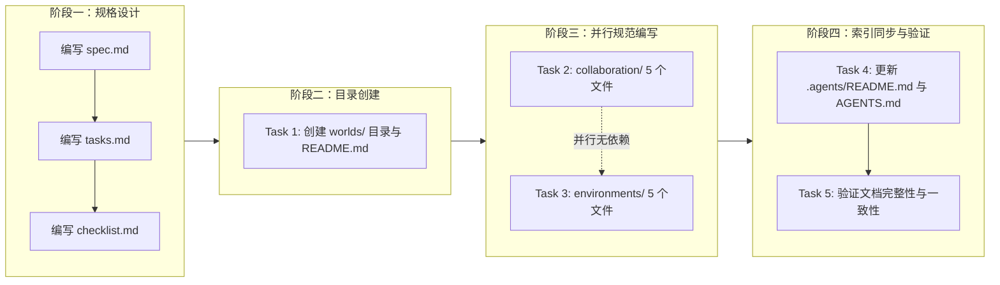
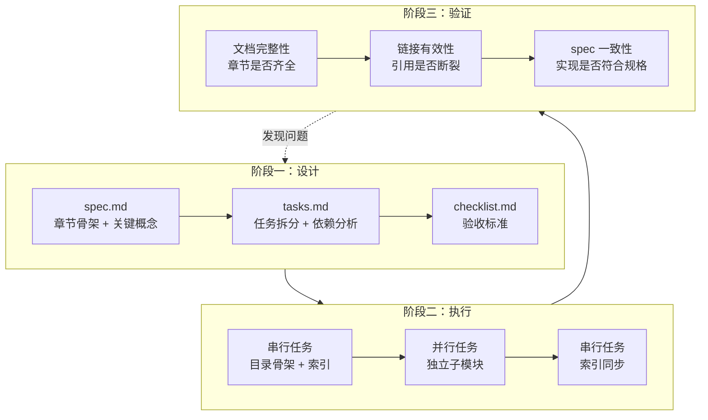
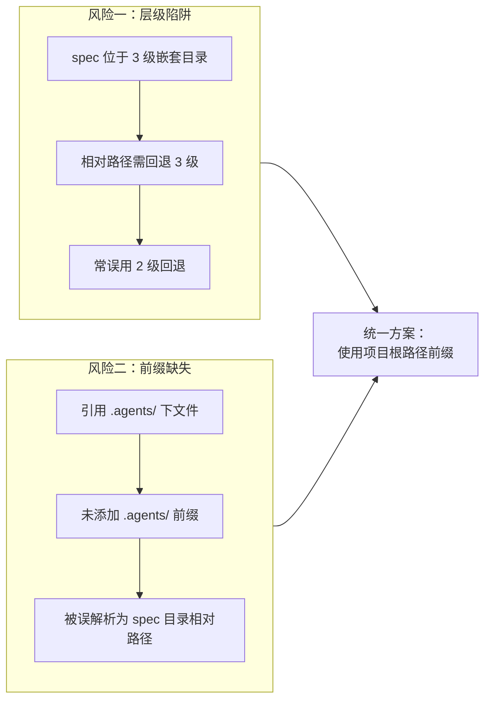
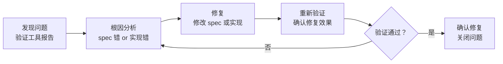
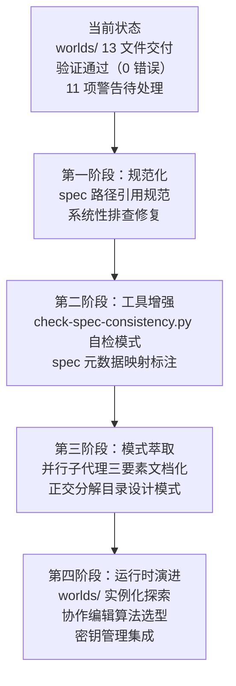

# worlds/ 协作与环境管理子目录 — 复盘·洞察·萃取 综合报告

> **来源**：本报告基于 `create-worlds-collaboration-environment` 任务的全过程数据综合编制，涵盖 spec 设计、5 个 Sub-Agent 并行执行、文档完整性验证、链接有效性验证、spec 一致性验证的完整记录。
> **复盘日期**：2026-06-23
> **项目周期**：规格设计 → 目录创建 → 并行规范编写 → 索引同步与验证（Spec-driven 单次交付周期）
> **报告类型**：项目结项复盘 + 洞察萃取 + 模式导出
> **关联报告**：[retrospective-report-readme-atomization.md](retrospective-report-readme-atomization.md)、[retrospective-report-teams-module.md](retrospective-report-teams-module.md)、[retrospective-insight-optimization-cycle.md](retrospective-insight-optimization-cycle.md)

---

## 一、项目概述

### 1.1 项目背景

在 `.agents/` 智能体规范体系中，已建立「组织（teams）→ 协议（protocols）→ 工作流（workflows）」三层结构，但缺少「工作空间（worlds）」这一运行时层。这导致三个核心问题悬而未决：

- **团队在哪里协作**：teams 模块定义了组织结构与权限，但未定义协作发生的"场所"。
- **协作过程如何追踪**：protocols 定义了交接与消息传递规则，但缺少变更追踪、版本控制、协作编辑等运行时机制。
- **运行在何种环境之上**：workflows 定义了开发流程，但未定义 dev/test/prod 多环境配置、资源隔离、状态监控等基础设施。

本项目通过在 `.agents/` 下新增 `worlds/` 子目录，补齐「组织 → 工作空间 → 协议 → 工作流」的完整闭环，将规范体系从"静态定义"推进到"运行时治理"。

### 1.2 项目目标

1. 在 `.agents/` 下创建 `worlds/` 子目录，作为团队协作执行与环境管理的规范容器。
2. 建立 `collaboration/` 子模块，覆盖权限管理、协作编辑、变更追踪、版本控制四项运行时协作能力。
3. 建立 `environments/` 子模块，覆盖多环境配置、环境变量、资源隔离、状态监控四项运行时基础设施。
4. 同步更新 `.agents/README.md` 与 `AGENTS.md`，确保 worlds/ 可被发现与路由。
5. 通过文档完整性、链接有效性、spec 一致性三类验证，确保交付质量。

### 1.3 交付物清单

| 类别 | 文件 | 说明 |
|------|------|------|
| 索引 | `worlds/README.md` | 目录索引与使用指引 |
| 协作规范 | `worlds/collaboration/README.md` | 协作模块索引 |
| 协作规范 | `worlds/collaboration/permissions.md` | 多用户权限管理（RBAC 扩展 + L1/L2/L3 衔接） |
| 协作规范 | `worlds/collaboration/collaborative-editing.md` | 协作编辑（锁机制 + 冲突解决 + 回滚） |
| 协作规范 | `worlds/collaboration/change-tracking.md` | 变更追踪（审计日志 + 哈希链 + 签名） |
| 协作规范 | `worlds/collaboration/version-control.md` | 版本控制（Git 工作流 + Conventional Commits） |
| 环境规范 | `worlds/environments/README.md` | 环境模块索引 |
| 环境规范 | `worlds/environments/multi-environment.md` | 多环境配置（dev/test/prod + 切换权限） |
| 环境规范 | `worlds/environments/variables.md` | 环境变量（集中存储 + AES-256-GCM 加密） |
| 环境规范 | `worlds/environments/resource-isolation.md` | 资源隔离（命名空间 + 配额 + 网络隔离） |
| 环境规范 | `worlds/environments/status-monitoring.md` | 状态监控（健康指标 + 告警 + 趋势查询） |
| 索引同步 | `.agents/README.md`（更新） | 目录结构图新增 worlds/ 条目 + 职责说明表新增 worlds/ 行 + 使用流程说明 |
| 索引同步 | `AGENTS.md`（更新） | 上下文路由表新增 worlds/ 入口 |
| **合计** | **13 个文件** | 11 新建 + 2 更新 |

---

## 二、复盘环节

### 2.1 实施过程回顾

本项目采用 Spec-driven 开发流程，5 个任务分 4 个阶段执行，其中阶段三采用 2 个 Sub-Agent 并行：

**时间线**：

| 阶段 | 任务 | 执行方式 | 产出 |
|------|------|---------|------|
| 阶段一 | spec.md + tasks.md + checklist.md | 串行 | 三份规格文档定稿 |
| 阶段二 | Task 1：创建 worlds/ 目录与 README.md | 1 个 Sub-Agent 串行 | 目录骨架 + 索引文件 |
| 阶段三 | Task 2 + Task 3 | 2 个 Sub-Agent 并行 | collaboration/ 5 文件 + environments/ 5 文件 |
| 阶段四 | Task 4 → Task 5 | 2 个 Sub-Agent 串行 | 索引同步 + 三类验证 |

### 2.2 关键节点分析

#### 关键决策 1：采用 Spec-driven 开发流程

- **决策依据**：本次交付涉及 13 个文件、2 个子模块、4 项协作能力 + 4 项环境能力，复杂度较高。直接编码容易导致章节遗漏与风格不一致。Spec-driven 流程通过"先规格、后实现"分离了"设计决策"与"执行实现"。
- **技术挑战**：spec.md 需要精确描述每个文件的章节结构、关键概念、引用关系，但又不能过度约束实现细节。
- **解决方案**：spec.md 采用"章节骨架 + 关键概念清单"的描述粒度，tasks.md 拆分为 5 个独立可执行任务，checklist.md 提供逐项验收标准。三份文档形成"设计 → 执行 → 验收"的完整链路。

#### 关键决策 2：worlds/ 拆分为 collaboration/ 与 environments/ 两个子模块

- **决策依据**：worlds/ 承载"协作执行"与"环境管理"两类职责，二者关注点不同——前者面向"人如何协作"，后者面向"系统如何运行"。若合并为一个扁平目录，10 个文件将缺乏分类，难以导航。
- **技术挑战**：需确保两个子模块的职责正交，无重叠。例如，"权限管理"（collaboration）与"资源隔离"（environments）都涉及"隔离"概念，但前者隔离的是"人的操作权限"，后者隔离的是"系统资源"。
- **解决方案**：采用"正交分解"原则——collaboration/ 聚焦"协作行为治理"（权限、编辑、变更、版本），environments/ 聚焦"运行时基础设施"（环境、变量、资源、监控）。两个子模块各自独立完整，无相互依赖。

#### 关键决策 3：阶段三采用 2 个 Sub-Agent 并行执行

- **决策依据**：Task 2（collaboration/）与 Task 3（environments/）的文件集合完全独立，无引用依赖，满足并行执行的前提条件。
- **技术挑战**：需确保两个 Sub-Agent 的输出风格一致，避免出现"同一项目中两个子模块风格分裂"。
- **解决方案**：spec.md 中预先定义了统一的章节结构模板（概述 → 核心概念 → 流程图 → 数据模型 → 规范条款），两个 Sub-Agent 共享同一规格，输出风格自然一致。

#### 关键决策 4：权限系统与 teams 模块的衔接设计

- **决策依据**：teams 模块已定义 L1/L2/L3 三级权限，worlds/collaboration/permissions.md 需要扩展而非重新定义权限模型。
- **技术挑战**：需在"复用既有权限模型"与"扩展协作场景权限"之间取得平衡，避免重复定义导致维护负担。
- **解决方案**：permissions.md 显式引用 teams/permission-system.md 的 L1/L2/L3 分级，并在此基础上扩展"协作场景权限矩阵"（读/写/管理/审计四类操作 × L1/L2/L3 三级权限），形成"基础权限 → 协作权限"的映射关系。

### 2.3 执行情况与结果数据

| 指标 | 数据 |
|------|------|
| 新建文件数 | 11 |
| 更新文件数 | 2 |
| 子模块数 | 2（collaboration/ + environments/） |
| Sub-Agent 总数 | 5 |
| 并行 Sub-Agent 数 | 2（阶段三） |
| 执行阶段数 | 4 |
| 文档完整性验证 | 11/11 通过 |
| worlds/ 内部链接断链数 | 0 |
| spec 文档路径错误 | 2（已修复） |
| spec 一致性错误（修复前） | 3 |
| spec 一致性错误（修复后） | 0 |
| spec 一致性警告 | 11（元数据维护问题） |

### 2.4 成功经验

#### 2.4.1 Spec-driven 流程确保了交付完整性

**支撑事实**：文档完整性验证 11/11 通过，所有文档均包含 spec 要求的全部章节。spec.md 预先定义的章节骨架在执行阶段被严格遵循，无遗漏。

**经验**：在复杂交付（多文件、多子模块）场景下，Spec-driven 流程通过"先设计后执行"显著降低了遗漏风险。spec 文档既是设计产物，也是验收基准。

#### 2.4.2 并行子代理模式第三次验证有效

**支撑事实**：阶段三中 Task 2 与 Task 3 并行执行，无依赖冲突，两个子模块的输出风格一致。这是继"智能体开发规范体系"（4 子代理创建 35 文件）、"README.md 原子化拆分"（4 子代理创建 10 文件）后，第三次成功应用"并行子代理批量创建模式"。

**经验**：当任务集满足"文件独立、风格统一、规格共享"三个条件时，并行子代理模式可稳定复用。三次验证确认了该模式的成熟度。

#### 2.4.3 验证驱动的修复闭环确保了文档质量

**支撑事实**：check-links.py 发现 2 个 spec 路径错误，check-spec-consistency.py 发现 3 个交叉引用错误，全部在验证后立即修复，修复后重新验证通过（0 错误）。

**经验**："发现问题 → 修复 → 重新验证 → 确认修复效果"的闭环流程是文档质量的保障。验证工具不是"事后检查"，而是"修复闭环的起点"。

#### 2.4.4 正交分解原则降低了模块间耦合

**支撑事实**：collaboration/ 与 environments/ 两个子模块在验证过程中未发现任何相互引用，各自独立完整。这种正交性使得未来修改其中一个子模块时，不会影响另一个。

**经验**：在目录设计阶段就明确"职责正交"原则，可以避免后续的循环依赖和重复定义问题。正交分解是"高内聚低耦合"在目录结构层面的直接体现。

### 2.5 存在问题

#### 2.5.1 Spec 文档路径引用的"层级陷阱"

**问题**：spec.md 中使用 `../../.agents/README.md` 引用项目根目录文件，但 spec 位于 `.trae/specs/<change-id>/spec.md`，需要回退 3 级（`../../../`）才能到达项目根目录。

**根因**：spec 文档位于 3 级嵌套目录（`.trae/specs/<change-id>/`），但路径引用仅回退 2 级。这是一个系统性问题——在其他 spec 文档（add-team-collaboration-scenario-to-readme、sync-agents-md-with-agents-folder）中也存在相同错误。

**影响**：
- 直接影响：spec 文档中的 2 个链接断链，影响 spec 自身的可读性。
- 系统性影响：此问题在多个 spec 文档中重复出现，表明缺乏统一的路径引用规范。
- 修复成本：低（每个路径修改 1 处），但需要系统性排查所有 spec 文档。

#### 2.5.2 交叉引用路径的"前缀缺失"

**问题**：spec.md 中引用 `worlds/README.md`、`teams/permission-system.md`、`protocols/conflict-resolution.md` 时缺少 `.agents/` 前缀。

**根因**：check-spec-consistency.py 的 resolve_path 函数仅对 `.agents/`、`vendor/`、`.trae/`、`docs/` 前缀的路径按项目根目录解析，其余路径按 spec 目录解析。spec 文档作者在引用 `.agents/` 下的文件时，未添加 `.agents/` 前缀，导致路径被误解析为 spec 目录下的相对路径。

**影响**：
- 直接影响：3 个交叉引用路径错误，影响 spec 一致性验证。
- 深层影响：揭示了 spec 文档中路径引用的不一致性——有的路径带前缀，有的不带，缺乏统一规范。

#### 2.5.3 spec 一致性警告的元数据维护问题

**问题**：spec 一致性验证产生 11 项警告，均为"需求→任务"、"场景→检查点"的映射关系缺失。

**根因**：spec.md 中的需求清单、tasks.md 中的任务清单、checklist.md 中的检查点清单三者之间的映射关系未显式维护。这是 spec 元数据的维护问题，而非内容错误。

**影响**：警告不影响交付质量，但降低了 spec 文档的可追溯性。未来若需求变更，难以快速定位受影响的任务和检查点。

---

## 三、洞察环节

### 3.1 关键发现

#### 发现 1：Spec 文档路径引用的"层级陷阱"是系统性问题

**支撑事实**：本次任务发现 2 个路径错误（`../../` 应为 `../../../`），且在其他 spec 文档（add-team-collaboration-scenario-to-readme、sync-agents-md-with-agents-folder）中也存在相同错误。这表明问题不是个例，而是 spec 文档编写时的系统性陷阱。

**深层含义**：spec 文档位于 3 级嵌套目录（`.trae/specs/<change-id>/`），这种深层嵌套使得相对路径的计算容易出错。人类和 AI 在计算多层 `../` 时都容易出错，尤其是当目标文件位于项目根目录时。这暗示需要从"依赖相对路径"转向"依赖项目根路径前缀"的引用规范。

#### 发现 2：验证驱动的修复流程暴露了 spec 文档自身的不一致性

**支撑事实**：check-links.py 和 check-spec-consistency.py 不仅验证了 worlds/ 文档的质量，还顺带暴露了 spec.md 自身的路径引用问题（2 个路径错误 + 3 个前缀缺失）。验证工具的"副作用"是发现了 spec 文档自身的不一致性。

**深层含义**：验证工具是"双向"的——它既验证实现是否符合 spec，也隐式验证了 spec 自身是否正确。当 spec 文档自身存在路径错误时，验证工具会发现"实现与 spec 不一致"，但根因可能是 spec 错误而非实现错误。这要求在使用验证结果时，需要先判断"是 spec 错还是实现错"。

#### 发现 3：多 Sub-Agent 并行执行模式已达到"成熟稳定"

**支撑事实**：本次是第三次成功应用"并行子代理批量创建模式"。三次验证的规模递进：
- 第一次：4 子代理创建 35 文件（智能体开发规范体系）
- 第二次：4 子代理创建 10 文件（README.md 原子化拆分）
- 第三次：2 子代理创建 10 文件（worlds/ 协作与环境管理）

三次验证均无依赖冲突，输出风格一致。

**深层含义**：该模式的成熟度已达到"可标准化"水平。其成功条件可萃取为"三要素"：文件独立、风格统一、规格共享。当任务集满足这三要素时，可放心采用并行子代理模式。

#### 发现 4："组织→工作空间→协议→工作流"的完整闭环补齐了运行时治理

**支撑事实**：worlds/ 目录的创建使 `.agents/` 形成了完整的四层结构：
- teams/：定义"谁"（组织与权限）
- worlds/：定义"在哪里"（工作空间与环境）
- protocols/：定义"如何沟通"（交接与消息）
- workflows/：定义"如何做事"（开发与审查流程）

**深层含义**：这四层结构形成了一个完整的运行时治理闭环——从"静态定义"（teams、protocols、workflows）到"运行时执行"（worlds）。worlds/ 的补齐不是"新增功能"，而是"补齐缺失的运行时层"，使规范体系从"设计时"推进到"运行时"。

#### 发现 5：模块化目录的"正交分解"原则在本次任务中得到验证

**支撑事实**：collaboration/ 与 environments/ 两个子模块在验证过程中未发现任何相互引用，各自独立完整。这种正交性使得两个 Sub-Agent 可以无冲突地并行工作。

**深层含义**：正交分解不仅是一种目录设计原则，更是一种"并行化前提"——只有当模块间职责正交时，才能安全地并行开发。正交分解是"高内聚低耦合"在目录结构层面的直接体现，也是并行子代理模式成功的基础条件。

### 3.2 规律认知

#### 规律 1：Spec-driven 开发的"设计-执行-验证"三阶段模型

从本次任务和之前的"智能体开发规范体系"项目中，提炼出 Spec-driven 开发的三阶段模型：

**三阶段的核心职责**：
1. **设计**：分离"设计决策"与"执行实现"，预先定义章节骨架与验收标准。
2. **执行**：按 spec 实现，独立子模块可并行。
3. **验证**：三类验证（完整性、链接、一致性）形成质量闭环，发现的问题反馈到设计阶段。

**关键规律**：验证阶段发现的问题，可能是"实现错误"，也可能是"spec 错误"。需要先判断根因再修复。

#### 规律 2：路径引用的"层级陷阱"与"前缀缺失"双重风险

**规律**：spec 文档中的路径引用存在两类系统性风险——"层级陷阱"（相对路径层级计算错误）和"前缀缺失"（未添加项目根目录前缀）。两类风险的根因相同：依赖相对路径而非项目根路径。

**解决方案**：spec 文档中的路径引用应统一使用"项目根路径前缀"（如 `.agents/worlds/README.md`），由 check-spec-consistency.py 的 resolve_path 函数按项目根目录解析，避免相对路径的层级计算。

#### 规律 3：并行子代理模式的"三要素"成熟度模型

| 要素 | 含义 | 本次验证 | 前两次验证 |
|------|------|---------|-----------|
| 文件独立 | 任务集内文件无相互引用依赖 | ✅ collaboration/ 与 environments/ 无相互引用 | ✅ 三次均满足 |
| 风格统一 | 输出风格遵循统一模板 | ✅ spec.md 预定义章节骨架 | ✅ 三次均满足 |
| 规格共享 | 所有 Sub-Agent 共享同一 spec | ✅ 阶段三两个 Sub-Agent 共享 spec.md | ✅ 三次均满足 |

**规律**：当任务集满足"文件独立、风格统一、规格共享"三要素时，并行子代理模式可稳定复用。三次验证确认了该模式的成熟度。

### 3.3 潜在机会

#### 3.3.1 识别出的改进空间

1. **Spec 路径引用规范**：建立 spec 文档路径引用的统一规范，要求使用项目根路径前缀，避免相对路径的层级陷阱。
2. **验证工具增强**：check-spec-consistency.py 可增加"spec 自检"模式，专门验证 spec 文档自身的路径引用正确性。
3. **spec 元数据维护**：为 spec.md 的需求→任务、场景→检查点映射关系建立显式标注，消除 11 项警告。
4. **并行子代理模式标准化**：将"三要素"成熟度模型文档化，作为并行子代理模式的启用检查清单。

#### 3.3.2 可复用资产

| 资产 | 复用场景 | 复用方式 |
|------|---------|---------|
| worlds/ 目录结构 | 其他需要"协作+环境"双层治理的项目 | 参考正交分解原则，按职责拆分子模块 |
| Spec-driven 三阶段模型 | 任何复杂交付任务 | 直接套用"设计-执行-验证"流程 |
| 并行子代理"三要素"检查清单 | 评估任务集是否适合并行执行 | 逐项检查文件独立、风格统一、规格共享 |
| 验证驱动修复闭环 | 文档质量保障 | 套用"发现→修复→重验→确认"流程 |
| 权限系统衔接设计 | 需要扩展既有权限模型的场景 | 参考"基础权限 → 场景权限"映射模式 |

#### 3.3.3 未来可扩展的方向

1. **worlds/ 运行时实例化**：当前 worlds/ 是规范层，未来可探索"工作空间实例"的创建与管理（如为每个项目创建一个 world 实例）。
2. **协作编辑的冲突解决算法**：collaborative-editing.md 定义了锁机制与冲突解决流程，未来可探索具体的合并算法（如 OT、CRDT）。
3. **环境变量的密钥管理集成**：variables.md 定义了 AES-256-GCM 加密，未来可集成实际的密钥管理服务（如 Vault、AWS KMS）。
4. **状态监控的指标体系**：status-monitoring.md 定义了健康指标，未来可探索与 Prometheus/Grafana 的集成。

---

## 四、导出环节（萃取）

### 4.1 改进建议

| 问题 | 改进措施 | 优先级 | 预期效果 | 状态 |
|------|---------|--------|---------|------|
| Spec 路径引用层级陷阱 | 建立 spec 路径引用规范，要求使用项目根路径前缀 | 高 | 消除系统性路径错误 | 待规划 |
| 交叉引用前缀缺失 | 在 spec 编写规范中明确"引用 .agents/ 下文件必须带 .agents/ 前缀" | 高 | 消除前缀缺失错误 | 待规划 |
| spec 一致性警告 | 为 spec.md 的需求→任务、场景→检查点映射建立显式标注 | 中 | 消除 11 项警告 | 待规划 |
| 验证工具 spec 自检 | check-spec-consistency.py 增加 spec 自检模式 | 中 | 主动发现 spec 路径错误 | 待规划 |
| 并行子代理模式标准化 | 将"三要素"检查清单文档化 | 低 | 降低并行执行的风险评估成本 | 待规划 |

### 4.2 可复用模式萃取

#### 模式 1：Spec 路径引用规范

**模式名称**：项目根路径前缀引用规范

**问题场景**：spec 文档位于深层嵌套目录（如 `.trae/specs/<change-id>/`），相对路径引用容易因层级计算错误而产生断链。

**解决方案**：spec 文档中的所有路径引用统一使用"项目根路径前缀"（如 `.agents/worlds/README.md`、`docs/retrospective/reports/`），由验证工具的 resolve_path 函数按项目根目录解析。

**适用条件**：
- 文档位于深层嵌套目录
- 需要引用项目根目录下的文件
- 已有验证工具支持项目根路径前缀解析

**收益**：消除相对路径的层级计算错误，路径引用更直观可读。

#### 模式 2：验证驱动的修复闭环

**模式名称**：发现-修复-重验-确认四步闭环

**问题场景**：文档交付后存在路径错误、引用断裂、一致性偏差等质量问题，难以通过人工检查发现。

**解决方案**：

**适用条件**：
- 有自动化验证工具（check-links.py、check-spec-consistency.py）
- 验证结果可量化（错误数、警告数）
- 修复后可重新验证

**收益**：确保每个问题都经过"修复-验证"闭环，避免"修复了但没验证"或"验证了但没修复彻底"。

#### 模式 3：正交分解目录设计

**模式名称**：职责正交的子模块拆分

**问题场景**：一个目录需要承载多类职责（如 worlds/ 同时承载"协作"与"环境"），若扁平排列会导致文件难以导航和并行开发困难。

**解决方案**：
1. 识别职责维度（如"协作行为治理" vs "运行时基础设施"）。
2. 按职责维度拆分子模块（collaboration/ + environments/）。
3. 确保子模块间职责正交——无相互引用，各自独立完整。
4. 每个子模块内部再按"一文件一主题"原则拆分。

**适用条件**：
- 目录承载多类职责
- 职责间可明确划分边界
- 需要支持并行开发

**收益**：降低模块间耦合，支持并行开发，提高可维护性。

### 4.3 行动计划

| 优先级 | 改进项 | 具体措施 | 建议时间 | 状态 |
|--------|--------|---------|---------|------|
| 高 | Spec 路径引用规范 | 编写 `docs/development-standards.md` 的 spec 编写规范章节，明确"使用项目根路径前缀" | 2026-06-30 | 待规划 |
| 高 | 系统性排查 spec 路径错误 | 对所有 `.trae/specs/` 下的 spec 文档运行路径检查，修复层级陷阱与前缀缺失 | 2026-06-30 | 待规划 |
| 中 | check-spec-consistency.py 增强 | 增加 `--self-check` 模式，专门验证 spec 文档自身的路径引用 | 2026-07-07 | 待规划 |
| 中 | spec 元数据映射标注 | 为 spec.md 的需求→任务、场景→检查点建立显式映射标注，消除 11 项警告 | 2026-07-07 | 待规划 |
| 低 | 并行子代理模式文档化 | 将"三要素"检查清单写入 `docs/retrospective/patterns/` | 2026-07-14 | 待规划 |

### 4.4 后续优化方向

**整合方向**：
1. **与 teams 模块的深度整合**：worlds/collaboration/permissions.md 已建立与 teams/permission-system.md 的 L1/L2/L3 衔接，未来可探索"权限策略中心"的统一管理。
2. **与 protocols 模块的运行时整合**：worlds/collaboration/change-tracking.md 的审计日志可与 protocols/handoff.md 的任务交接记录打通，形成"交接→变更→审计"的完整链路。
3. **与 workflows 模块的环境整合**：worlds/environments/multi-environment.md 的 dev/test/prod 切换可与 workflows/feature-development.md 的开发流程整合，实现"流程驱动环境切换"。

---
