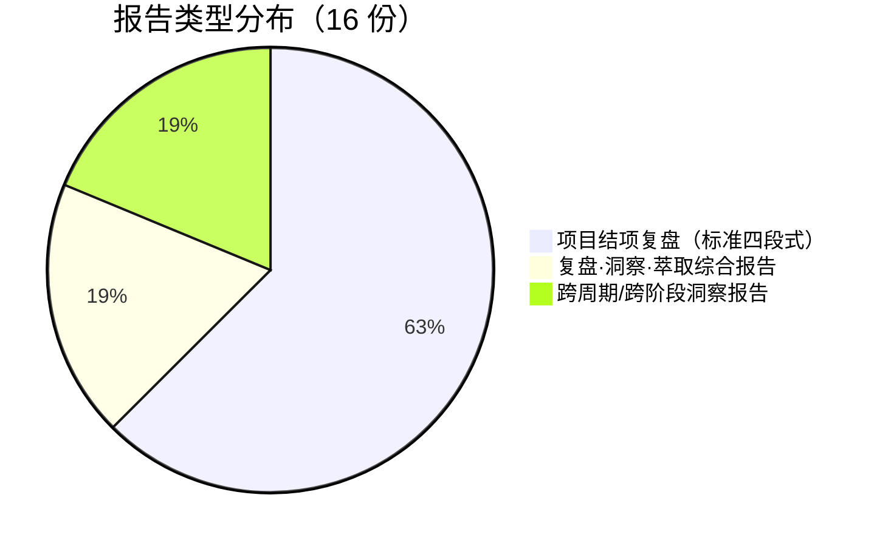

+++
id = "retrospective-meta-analysis-cross-project-project-overview"
date = "2026-06-24"
type = "project-overview"
source = "docs/retrospective/reports/retrospective-meta-analysis-cross-project.md#一"
+++

# 一、项目概述

## 1.1 项目背景

本报告对 `docs/retrospective/reports/` 目录下全部 16 份复盘报告进行跨项目元分析，涵盖 2026-06-22 至 2026-06-23 两日内的全部项目工作。通过系统性扫描报告体系，识别高频模式、顽固问题、演化趋势与资产增长规律，提炼跨周期洞察结论，为体系持续优化提供决策依据。

## 1.2 项目目标

1. 对全部 16 份复盘报告进行跨项目全景扫描
2. 识别高频模式、顽固问题与演化趋势
3. 分析知识资产增长率与沉淀规律
4. 提炼跨周期洞察结论，形成可复用方法论
5. 提出改进建议与行动计划

## 1.3 报告总览

| 指标 | 数值 |
|------|------|
| 报告总数 | 16 |
| 复盘报告（项目结项复盘） | 10 |
| 综合报告（复盘·洞察·萃取） | 3 |
| 洞察报告（跨周期/跨阶段元分析） | 3 |
| 覆盖项目/模块数 | 13 |
| 时间跨度 | 2 日（2026-06-22 至 2026-06-23） |
| 报告总字数（估算） | 约 20 万字 |

### 报告类型分布

## 1.4 覆盖项目与产出概况

| 项目 | 新建文件数 | 修改文件数 | 子代理并行 | 核心贡献 |
|------|-----------|-----------|-----------|---------|
| agents-spec-system | 39 | 0 | 4 子代理 | 建立 .agents/ 规范体系全貌 |
| create-apps-directory | 4 | 2 | 4 子代理 | 双区开发模型 (.temp/ → apps/) |
| readme-atomization | 10 | 1 | 4 子代理 | 434 行 → 90 行入口 + 10 原子文档 |
| cofounder-role-marker | 4 | 3 | 2 子代理并行 | tier 字段 + permissions 表 |
| refactor-retrospective-docs | 18 | 0 | 7 子代理 | 3 巨型文件 → 6 目录 + 18 原子模块 |
| fact-statement-correction | 1 | 4 | 0 | 事实表述一致性闭环方法论 |
| check-spec-consistency | 1 脚本 + 3 spec | 1 | 0 | ~950 行 Python 验证工具 |
| readme-subagent-extraction | 9 | 0 | 0（8 路并行 Write） | source 溯源字段约定 |
| teams-module | 6 | 2 | 批量并行 | 权限分级 + 自举规范 |
| system-planning | 1 | 4 | 2 子代理 | 五要素结构 + 四层闭环架构 |
| worlds-collaboration-environment | 11 | 2 | 2 子代理并行 | 补齐运行时治理层 |
| 改进执行（cofounder + insight） | 7 | 8 | 4+5 子代理 | 声明即校验 + 复盘→执行零延迟 |

## 1.5 洞察类型分布（从全部报告萃取）

| 洞察类型 | 出现次数 | 典型来源 |
|---------|---------|---------|
| 方法论/流程规律 | 19 | Spec-driven、复盘闭环、约定驱动 |
| 架构决策规律 | 9 | 并行执行、三层治理、规范化分层 |
| 工具/自动化规律 | 7 | 工具熵减、CI 编排、验证闭环 |
| 知识管理规律 | 6 | 模式萃取、溯源字段、经验→模板跃迁 |
| 跨平台/兼容性规律 | 4 | Windows 差异、路径引用陷阱 |
| 安全/治理规律 | 3 | 纵深防御、声明即校验 |

---

> **关联模块**：[execution-retrospective.md](execution-retrospective.md)、[insight-extraction.md](insight-extraction.md)、[export-suggestions.md](export-suggestions.md)
