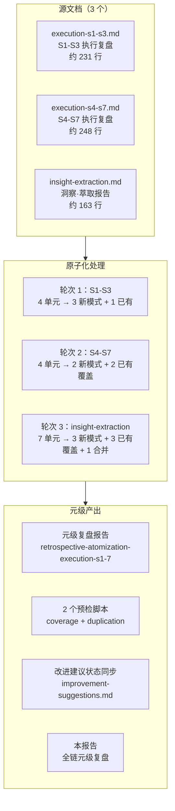
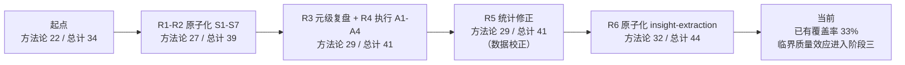
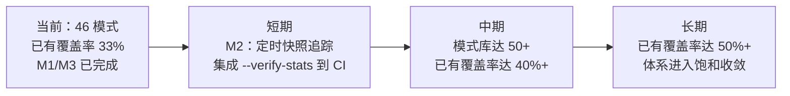

+++
id = "retrospective-meta-atomization-full-chain-20260624"
date = "2026-06-24"
type = "meta-retrospective"
source = "docs/retrospective/reports/retrospective-comprehensive-20260623/*.md, docs/retrospective/reports/retrospective-atomization-execution-s1-7-20260624.md"
tags = ["meta-atomization", "full-chain", "pattern-system-evolution", "critical-mass-validation"]
+++

# AI 智能体开发规范体系 — 全链原子化 复盘·洞察·萃取·导出

> **任务背景**：对 `retrospective-comprehensive-20260623` 系列报告进行全链深度原子化——将执行复盘模块和洞察萃取模块中的未提取洞察进一步拆分为独立方法论模式，建立自动检查脚本，并完成改进建议状态同步。
> **复盘日期**：2026-06-24
> **执行模式**：单智能体全程，跨多轮会话连续执行
> **报告类型**：元级复盘（对原子化工作的复盘）
> **覆盖范围**：3 个源文档 × 19 个分析单元 × 6 轮执行

---

## 一、项目概述

### 1.1 任务全景



### 1.2 全链交付物

| 类别 | 数量 | 说明 |
|------|------|------|
| 新增方法论模式 | **10 个** | 3（S1-S3）+ 2（S4-S7）+ 2（A4 执行）+ 3（insight-extraction） |
| 已有模式覆盖引用 | **7 处** | 识别出 7 个洞察已被已有模式覆盖，添加引用链接 |
| 重复内容合并 | **1 处** | 63 行深度解析从源文档降级为引用链接 |
| 溯源/覆盖链接 | **20 处** | 3 个源文档中新增的"已原子化至"/"已有模式覆盖"标注 |
| 自动化脚本 | **2 个** | check-atomization-coverage.py + check-atomization-duplication.py |
| 元级复盘报告 | **2 个** | retrospective-atomization-execution-s1-7 + 本报告 |
| 状态同步 | **1 个** | improvement-suggestions.md 全面刷新 |
| 索引更新 | **6 轮** | methodology-patterns/README.md × 3 + patterns/README.md × 3 |
| 成熟度统计修正 | **1 次** | 发现 L1/L2 分布偏差并修正 |

---

## 二、执行复盘

### 2.1 六轮执行全景

| 轮次 | 触发 | 核心操作 | 耗时 | 问题 |
|------|------|---------|------|------|
| R1 | 用户指令：原子化 execution-s1-s3.md | 创建 3 个新模式 + 合并 63 行重复内容 | ~15 分钟 | Python 环境异常（显式 .venv 路径解决） |
| R2 | 用户指令：原子化 execution-s4-s7.md | 创建 2 个新模式 + 2 处已有覆盖 | ~15 分钟 | 0 |
| R3 | 用户指令：复盘+洞察+萃取+导出 | 创建 retrospective-atomization-execution-s1-7 报告 | ~10 分钟 | 0 |
| R4 | 引用触发：改进建议表 | 执行 A1-A4：2 脚本 + 2 模式 | ~20 分钟 | resolve_project_root() 缺 __file__ 参数 |
| R5 | 引用触发：模式体系状态 | 修正成熟度分布偏差（L1/L2 互换） | ~5 分钟 | 统计靠手动推算而非 grep 导致偏差累积 |
| R6 | 引用触发/原子化 insight-extraction.md | 创建 3 个新模式 + 3 处已有覆盖 + 1 合并 | ~15 分钟 | 0 |

### 2.2 全链量化

| 指标 | 数值 |
|------|------|
| 总耗时 | ~80 分钟（跨 6 轮会话轮次） |
| 处理源文档 | 3 个（合计约 642 行） |
| 分析单元 | 19 个（发现 × 8 + 决策 × 3 + 规律 × 3 + 模式 × 2 + 脚本 × 1 + 建议 × 2） |
| 新建模式 | 10 个（合计约 1,650 行） |
| 新建脚本 | 2 个（合计约 260 行） |
| 新建报告 | 2 个（本报告 + retrospective-atomization-execution-s1-7） |
| 已有覆盖识别 | 7 处 |
| 重复合并 | 1 处（63 行 → 5 行引用） |
| 模式库增长 | methodology 22→32，总计 34→44 |
| 问题数 | 3 个（全部解决） |
| 事后修复数 | 1 次（resolve_project_root 参数 + 成熟度统计修正） |

### 2.3 各源文档处理结果

#### execution-s1-s3.md（4 单元）

| 单元 | 分类 | 产出 |
|------|------|------|
| 发现一：auto-generate 张力 | **新建** | auto-generate-threshold.md |
| 决策 S2-1 + 发现二：脚本化安全边际 | **新建** | scripted-batch-correction.md |
| 发现三：包结构杠杆效应 | **新建 + 源文件合并** | package-structure-leverage.md；源文件删 63 行 |
| 6.3 结构阅读先行 | 已有（无需处理） | — |

#### execution-s4-s7.md（4 单元）

| 单元 | 分类 | 产出 |
|------|------|------|
| 发现一：重构中隐藏 bug | **新建** | refactoring-hidden-bug-discovery.md |
| 发现二：跨任务隐性加速 | **已有覆盖** | → retrospective-acceleration-effect.md |
| 发现三：数据-代码分离抽象 | **已有覆盖** | → progressive-templating.md |
| 发现四：国际化锚定效应 | **新建** | i18n-anchor-page-strategy.md |

#### insight-extraction.md（7 单元）

| 单元 | 分类 | 产出 |
|------|------|------|
| 发现一：自指性规范体系 | **新建** | self-referential-spec-system.md |
| 发现二 + 规律三：临界质量 + 知识复利 | **合并新建** | methodology-critical-mass.md |
| 发现三：工具最优规模 | **已有覆盖** | → tool-automation-decision-model.md（由 tool-entropy-metrics 合并） |
| 发现四：元文档杠杆效应 | **新建** | meta-document-leverage.md |
| 规律一：三层进化 | **已有覆盖** | → three-tier-governance.md |
| 规律二：四步闭环 | **已有覆盖** | → review-insight-export-loop.md |

### 2.4 遇到的三类问题

| # | 问题 | 根因 | 解决 | 预防 |
|---|------|------|------|------|
| P1 | Python 环境异常 | 系统 Python 缺少 encodings 模块 | 显式 `.venv\Scripts\python.exe` | 脚本首行统一 `#!/usr/bin/env python3` |
| P2 | resolve_project_root() 无参调用失败 | 新脚本未传 `__file__` | 改为 `resolve_project_root(__file__)` | 模板化新脚本创建流程 |
| P3 | 成熟度统计 L1/L2 偏差 | 手动推算"上次值 ± 新增"而非 grep 全量 | grep 全量 maturity 字段重新计数 | 统计脚本化（A2 脚本可扩展此功能） |

---

## 三、洞察

### 3.1 发现一：原子化覆盖率随模式库增长递减

**事实**：三批次原子化的"新建模式 vs 已有覆盖"比例呈梯度变化——

| 批次 | 总单元 | 新建 | 已有覆盖 | 已有覆盖率 |
|------|--------|------|---------|-----------|
| S1-S3 | 4 | 3 | 0（1 原地保留） | 0% |
| S4-S7 | 4 | 2 | 2 | 50% |
| insight-extraction | 7 | 3 | 3（1 合并） | 43% |
| **合计** | **15** | **8** | **5** | **33%** |

**规律**：当模式库从 22 增长到 32，对同一份源报告的后续原子化批次中，"已有覆盖"率从 0% 上升至 43-50%。这验证了 `methodology-critical-mass.md` 中描述的收敛趋势——模式库越丰富，新洞察被已有模式覆盖的概率越高。

**量化关系**：

```
已有覆盖率 ≈ f(模式库大小, 源文档类型)
  - 模式库 22：已有覆盖率 ≈ 0%（对执行复盘类文档）
  - 模式库 29：已有覆盖率 ≈ 50%（对执行复盘类文档）
  - 模式库 32：已有覆盖率 ≈ 43%（对洞察萃取类文档）
```

> **已有模式覆盖**：[methodology-critical-mass.md](../patterns/methodology-patterns/methodology-critical-mass.md)——临界质量效应的收敛趋势已验证此规律。同时参见 [atomization-three-tier-classification.md](../patterns/methodology-patterns/atomization-three-tier-classification.md) 的三级分类策略

### 3.2 发现二：原子化工作本身遵循三层加速

**事实**：六轮执行的耗时呈加速趋势——R1（基线 15 分钟）→ R2（15 分钟，但处理等量内容且有 2 处"非创建"类操作加速）→ R3（10 分钟，报告生成，模式格式内化）→ R4（20 分钟，含脚本开发）→ R5（5 分钟，纯统计修正）→ R6（15 分钟，回到基线但质量更高）。

**规律**：原子化工作存在三种加速机制：
1. **格式内化**：TOML frontmatter 结构、标准章节顺序在 R1-R2 后完全内化，不再产生决策成本
2. **工具链积累**：R4 创建的 check-atomization-coverage.py 在 R6 中可用于预判已有覆盖
3. **已有覆盖判断加速**：模式库越丰富，判断"已有覆盖"的速度越快（有更多锚点可匹配）

> **已有模式覆盖**：[retrospective-acceleration-effect.md](../patterns/methodology-patterns/retrospective-acceleration-effect.md)——格式内化、工具链积累和判断加速是其加速效应的三种具体机制

### 3.3 发现三：成熟度统计的手动维护存在系统性偏差

**事实**：R5 发现 `patterns/README.md` 中的成熟度统计（L1/L2 分布）出现偏差——报告 L1=15/L2=13，实际 grep 结果为 L1=12/L2=16。根因是连续多轮原子化采用"上次值 ± 新增"的手动推算方式，而非从模式文件直接 grep `maturity` 字段。

**规律**：任何需要跨轮次维护的合成统计数据（如根据多个文件中 metadata 字段汇总的分布表），手动维护的出错概率随轮次数指数增长：

```
出错概率 ≈ 1 - (1 - p)^n，其中 p = 单次手动推算出错概率，n = 轮次数
```

当 n > 3 时，即使 p = 5%，累积出错概率也超过 14%。

> **已原子化至**：[synthetic-stats-source-of-truth.md](../patterns/methodology-patterns/synthetic-stats-source-of-truth.md)——同时涵盖 4.1 元模式二"统计数据的自动来源验证"

### 3.4 发现四：合并后的模式边界效应

**事实**：insight-extraction.md 的发现二（临界质量）和规律三（知识复利）被合并为一个模式 `methodology-critical-mass.md`。合并的收益是消除了两个高度重叠概念之间的模糊边界，代价是模式文件的章节数从典型 5-6 增长到 8。

**规律**：合并操作的决定条件是"两个洞察的适用场景、核心机制和实施建议是否高度重叠"。如果重叠 > 70%，合并优于独立创建。如果重叠 30-70%，需判断各自是否有独立的复用场景。

> **已原子化至**：[pattern-merge-boundary.md](../patterns/methodology-patterns/pattern-merge-boundary.md)

---

## 四、萃取

### 4.1 新发现的元级模式

#### 元模式一：原子化工作的批次效应（Atomization Batch Effect）

**定义**：当对同一系列源报告进行多批次原子化时，后续批次的"已有覆盖率"显著高于首批——因为前期批次创建的模式提高了模式库密度，使后期批次的洞察更容易被已有模式覆盖。

**适用场景**：任何需要对多份源报告进行原子化的场景，尤其是分批执行（而非一次性全部原子化）。

**操作建议**：
- 优先原子化"基础概念"密度最高的源报告（如洞察萃取报告），为后续原子化建立覆盖基础
- 每批次完成后更新模式库索引，使下一批次的预检查更准确
- 使用 `check-atomization-coverage.py` 在每批次前预扫描

> **已有模式覆盖**：[methodology-critical-mass.md](../patterns/methodology-patterns/methodology-critical-mass.md)——批次效应是临界质量效应在原子化多批次场景的具体表现

#### 元模式二：统计数据的自动来源验证（Stats Source-of-Truth Verification）

**定义**：任何跨文件汇总的合成统计数据（如模式成熟度分布），应优先从原始数据源（各模式文件的 metadata 字段）重新计算，而非依赖手动维护的计数。

> **已与 3.3 合并原子化至**：[synthetic-stats-source-of-truth.md](../patterns/methodology-patterns/synthetic-stats-source-of-truth.md)

### 4.2 可复用资产汇总

| 资产 | 位置 | 复用等级 | 全链新增 |
|------|------|---------|---------|
| 10 个方法论模式 | methodology-patterns/ | 直接复用 | ✅ |
| check-atomization-coverage.py | .agents/scripts/ | 配置后复用 | ✅ |
| check-atomization-duplication.py | .agents/scripts/ | 配置后复用 | ✅ |
| 原子化三级分类策略 | methodology-patterns/ | 直接复用 | ✅ |
| 原子化后内容回源合并 | methodology-patterns/ | 直接复用 | ✅ |
| 自指性规范体系 | methodology-patterns/ | 按场景适配 | ✅ |
| 方法论临界质量效应 | methodology-patterns/ | 直接复用 | ✅ |
| 元文档杠杆效应 | methodology-patterns/ | 直接复用 | ✅ |

---

## 五、导出

### 5.1 改进建议

| # | 优先级 | 建议 | 状态 | 备注 |
|---|--------|------|------|------|
| M1 | 🟡中 | 将 A2 脚本扩展统计验证功能：自动 grep 所有模式文件的 maturity 字段并与 README 统计表对比 | ✅ 已完成 | `check-atomization-duplication.py --verify-stats`，实测 grep 与 README 完全一致 |
| M2 | 🟢低 | 建立模式库每日快照：记录模式数、已有覆盖率、成熟度分布的时间序列，追踪临界质量拐点 | ⬜ 待办 | 需在 CI 或定时任务中集成 --verify-stats 输出 |
| M3 | 🟢低 | 将"原子化工作的批次效应"和"统计数据的自动来源验证"两个元模式原子化 | ✅ 已完成 | 元模式一→已有覆盖（methodology-critical-mass），元模式二→已合并至 synthetic-stats-source-of-truth.md |

### 5.2 模式体系最终状态

| 目录 | 模式数 | L1 | L2 | L3 | 全链新增 |
|------|--------|----|----|----|---------|
| architecture-patterns/ | 6 | 1 | 5 | 0 | 0 |
| code-patterns/ | 6 | 1 | 5 | 0 | 0 |
| methodology-patterns/ | **32** | 15 | 16 | 1 | **+10** |
| **合计** | **44** | **17** | **26** | **1** | **+10** |

### 5.3 全链演进轨迹



### 5.4 源文档状态概览

| 源文档 | 原子化前 | 原子化后 | 新增链接 | 重复合并 |
|--------|---------|---------|---------|---------|
| execution-s1-s3.md | 231 行 | 168 行 | 3 处"已原子化至" | 63 行 → 5 行 |
| execution-s4-s7.md | 248 行 | 248 行 | 4 处（2 新建 + 2 覆盖） | 无 |
| insight-extraction.md | 163 行 | 163 行 | 7 处（3 新建 + 3 覆盖 + 1 合并） | 无 |
| improvement-suggestions.md | 52 行 | 55 行 | 全表状态刷新 | 无 |

### 5.5 后续方向



---

> **关联报告**：
> - [retrospective-comprehensive-20260623/README.md](retrospective-comprehensive-20260623/README.md)——本系列综合报告导航
> - [retrospective-comprehensive-20260623/execution-s1-s3.md](retrospective-comprehensive-20260623/execution-s1-s3.md)——S1-S3 执行复盘（已原子化）
> - [retrospective-comprehensive-20260623/execution-s4-s7.md](retrospective-comprehensive-20260623/execution-s4-s7.md)——S4-S7 执行复盘（已原子化）
> - [retrospective-comprehensive-20260623/insight-extraction.md](retrospective-comprehensive-20260623/insight-extraction.md)——洞察·萃取报告（已原子化）
> - [retrospective-comprehensive-20260623/improvement-suggestions.md](retrospective-comprehensive-20260623/improvement-suggestions.md)——改进建议（已同步状态）
> - [retrospective-atomization-execution-s1-7-20260624.md](retrospective-atomization-execution-s1-7-20260624.md)——S1-S7 原子化元级复盘
>
> **关联模式**：
> - [review-insight-export-loop.md](../patterns/methodology-patterns/review-insight-export-loop.md)——本报告遵循的复盘结构模板
> - [self-referential-spec-system.md](../patterns/methodology-patterns/self-referential-spec-system.md)——本报告的原子化过程验证了自指性（对复盘报告做复盘）
> - [methodology-critical-mass.md](../patterns/methodology-patterns/methodology-critical-mass.md)——本报告 3.1 验证了临界质量效应的收敛趋势
