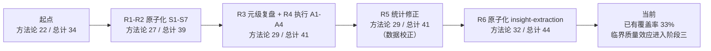
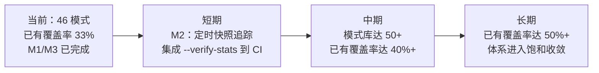

+++
id = "retrospective-meta-atomization-full-chain-export"
date = "2026-06-24"
type = "export-suggestions"
source = "docs/retrospective/reports/retrospective-meta-atomization-full-chain-20260624.md#五"
+++

# 四、导出建议

## 4.1 改进建议

| # | 优先级 | 建议 | 状态 | 备注 |
|---|--------|------|------|------|
| M1 | 🟡中 | 将 A2 脚本扩展统计验证功能：自动 grep 所有模式文件的 maturity 字段并与 README 统计表对比 | ✅ 已完成 | `check-atomization-duplication.py --verify-stats`，实测 grep 与 README 完全一致 |
| M2 | 🟢低 | 建立模式库每日快照：记录模式数、已有覆盖率、成熟度分布的时间序列，追踪临界质量拐点 | ⬜ 待办 | 需在 CI 或定时任务中集成 --verify-stats 输出 |
| M3 | 🟢低 | 将"原子化工作的批次效应"和"统计数据的自动来源验证"两个元模式原子化 | ✅ 已完成 | 元模式一→已有覆盖（methodology-critical-mass），元模式二→已合并至 synthetic-stats-source-of-truth.md |

## 4.2 模式体系最终状态

| 目录 | 模式数 | L1 | L2 | L3 | 全链新增 |
|------|--------|----|----|----|---------|
| architecture-patterns/ | 6 | 1 | 5 | 0 | 0 |
| code-patterns/ | 6 | 1 | 5 | 0 | 0 |
| methodology-patterns/ | **32** | 15 | 16 | 1 | **+10** |
| **合计** | **44** | **17** | **26** | **1** | **+10** |

## 4.3 全链演进轨迹

## 4.4 源文档状态概览

| 源文档 | 原子化前 | 原子化后 | 新增链接 | 重复合并 |
|--------|---------|---------|---------|---------|
| execution-s1-s3.md | 231 行 | 168 行 | 3 处"已原子化至" | 63 行 → 5 行 |
| execution-s4-s7.md | 248 行 | 248 行 | 4 处（2 新建 + 2 覆盖） | 无 |
| insight-extraction.md | 163 行 | 163 行 | 7 处（3 新建 + 3 覆盖 + 1 合并） | 无 |
| improvement-suggestions.md | 52 行 | 55 行 | 全表状态刷新 | 无 |

## 4.5 后续方向

---

> **关联模块**：[project-overview.md](project-overview.md)、[execution-retrospective.md](execution-retrospective.md)、[insight-extraction.md](insight-extraction.md)