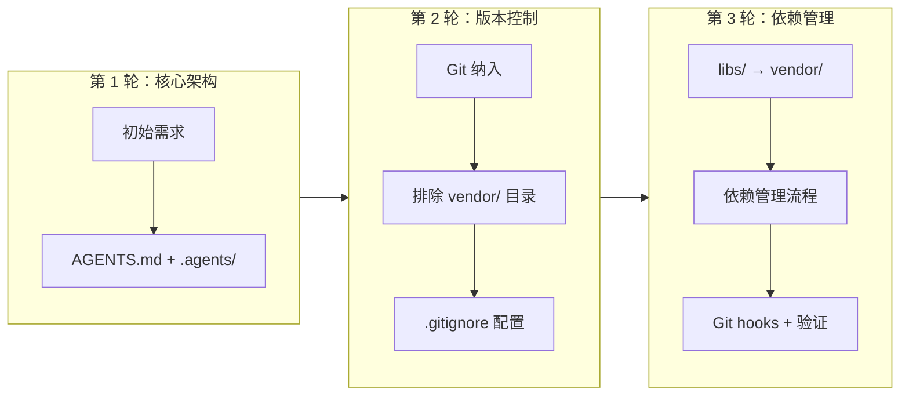
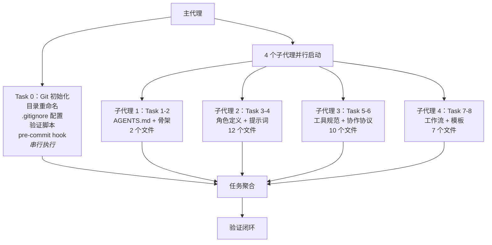
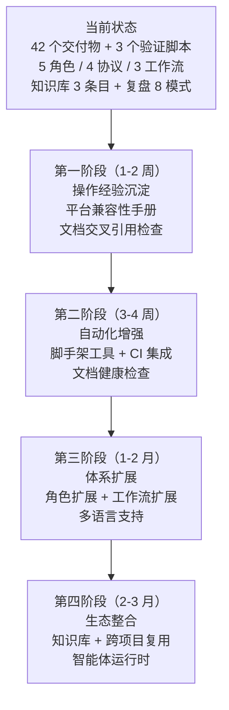

# 智能体开发规范体系 — 全面复盘分析与行动指南

> **项目名称**：智能体开发规范体系（Agents Spec System）
> **复盘日期**：2026-06-23
> **项目周期**：需求分析 → 规格设计 → 并行实施 → 质量验证（单次交付周期，共 3 轮需求迭代）
> **报告类型**：项目结项全面复盘
> **关联报告**：[初版复盘报告](retrospective-report-agents-spec-system.md)

***

## 一、项目全景概述

### 1.1 项目背景与动机

在 AI 辅助开发日益普及的背景下，多智能体协作已成为提升开发效率的重要手段。然而，缺乏统一的角色定义、协作协议与开发规范，将导致智能体间职责不清、交接混乱、输出质量参差不齐。本项目旨在建立一套自包含的智能体协作开发体系，使 AI 智能体能够在明确的规则框架下高效协作。

### 1.2 项目目标分层

本项目的目标可按层次分为三层：

| 层次 | 目标 | 核心产出 |
|------|------|---------|
| **规范层** | 建立智能体开发规范体系 | `AGENTS.md` + `.agents/` 目录（35 个 .md 文件） |
| **工程层** | 纳入 Git 版本控制与依赖管理 | `.gitignore` + pre-commit hook + 验证脚本 |
| **治理层** | 目录重命名与知识沉淀 | `libs/` → `vendor/` + 知识库条目 + 复盘文档 |

### 1.3 交付物全景

| 大类 | 子类 | 数量 | 代表性文件 |
|------|------|------|-----------|
| 全局契约 | 入口文件 | 1 | `AGENTS.md` |
| 角色定义 | 5 角色 + README | 6 | `orchestrator.md`, `architect.md`, ... |
| 提示词 | 每角色 system-prompt + few-shot | 11 | `orchestrator/system-prompt.md`, ... |
| 工具规范 | 4 类工具 + README | 5 | `file-operations.md`, `code-execution.md`, ... |
| 协作协议 | 4 协议 + README | 5 | `handoff.md`, `dependency-management.md`, ... |
| 标准工作流 | 3 工作流 + README | 4 | `feature-development.md`, `testing.md`, ... |
| 模板资产 | 2 模板 + README | 3 | `task-template.md`, `handoff-template.md` |
| 自动化脚本 | 3 验证脚本 + README | 4 | `check-gitignore.py`, `check-links.py`, `check-spec-consistency.py` |
| 版本控制 | .gitignore + hook | 2 | `.gitignore`, `pre-commit` |
| 目录说明 | 入口说明 | 1 | `.agents/README.md` |
| **合计** | | **42** | |

### 1.4 需求演进时间线



每一轮需求迭代都在前一轮确认的基础上叠加增量，形成了"核心架构 → 版本控制 → 依赖管理"的渐进式演进路径。

***

## 二、执行过程深度复盘

### 2.1 执行策略：主代理串行 + 子代理并行的混合模式

本项目采用了一种"混合执行策略"：主代理负责有副作用的任务（文件系统操作），子代理并行执行无依赖的纯文档创建任务。



**策略分析**：

| 维度 | 评估 | 说明 |
|------|------|------|
| 效率 | 高 | 4 个子代理并行，大幅缩短执行时间 |
| 安全性 | 高 | Task 0 涉及文件系统操作，串行执行避免竞态条件 |
| 上下文管理 | 优秀 | 每个子代理仅维护其领域上下文，避免全局上下文膨胀 |
| 可扩展性 | 好 | 新增任务类型可独立分配子代理，无需调整现有代理 |

### 2.2 关键决策节点深度分析

#### 决策 1：采用"入口 + 容器"二元架构（第 1 轮）

**决策内容**：`AGENTS.md` 作为全局入口（路由 + 约束），`.agents/` 作为具体规范容器（角色 + 协议 + 工作流）。

**决策依据**：
- 分离关注点：路由与约束由 AGENTS.md 统一管理，具体规范由子目录按功能分类
- 可扩展性：新增角色或协议只需在 `.agents/` 下添加文件，无需修改 AGENTS.md 结构
- 上下文节省：智能体按需读取对应子目录，而非一次性加载全部规范

**决策质量评估**：这一架构决策奠定了整个规范体系的基础，后续所有扩展（角色、协议、工作流）都遵循了这一模式，未出现架构层面的返工。

#### 决策 2：目录重命名 `libs/` → `vendor/`（第 3 轮）

**决策内容**：将第三方依赖存放目录从 `libs/` 改为 `vendor/`。

**决策矩阵**：

| 候选名称 | 语义明确度 | 行业惯例 | 工具兼容性 | 名称长度 | 综合评分 |
|---------|-----------|---------|-----------|---------|---------|
| `vendor/` | 高 | 广泛（PHP Composer、Go modules） | 优秀 | 短 | **最优** |
| `third_party/` | 高 | 较少（Google 内部） | 一般 | 长 | 一般 |
| `deps/` | 中 | 一般 | 一般 | 短 | 一般 |
| `external/` | 中 | 较少 | 一般 | 一般 | 一般 |

**执行挑战**：Windows 文件占用导致 `Rename-Item` 报 "Access denied"，通过 `Move-Item -Force` 和 `Test-Path` 验证最终确认操作成功。

#### 决策 3：多层次临时依赖管理（第 3 轮）

**决策内容**：不仅配置 `.gitignore`，还建立管理流程文档、pre-commit hook、验证脚本的完整闭环。

**为什么这样做**：单纯的 `.gitignore` 配置只能阻止 git 跟踪，但无法阻止开发者误操作、无法提供管理指导、无法验证规则有效性。完整的闭环管理需要：
1. `.gitignore` 规则（阻止 git 跟踪）
2. pre-commit hook（阻止误提交）
3. 验证脚本（确认规则有效）
4. 管理流程文档（指导开发者）

### 2.3 执行过程的问题与应对

#### 问题矩阵

| 问题编号 | 问题描述 | 类型 | 严重程度 | 根因 | 解决方式 | 是否可预防 |
|---------|---------|------|---------|------|---------|-----------|
| P1 | `Rename-Item` 报 "Access denied" | 平台兼容性 | 中 | Windows 文件锁机制 | 改用 `Move-Item -Force`，通过 `Test-Path` 验证 | 部分是 |
| P2 | `Move-Item -NewName` 参数无效 | 命令语法 | 低 | PowerShell 版本差异 | 改用 `-Destination` 参数 | 是 |
| P3 | `robocopy` EXTRA 文件误报 | 误报 | 低 | 目标目录已存在 | 通过 `Test-Path` 验证实际状态 | 是 |
| P4 | `cmd /c` 被 Windows 安全策略阻止 | 平台限制 | 中 | Windows 安全策略 | 统一改用 PowerShell 原生命令 | 是 |
| P5 | `chmod` 在 Windows 不可用 | 平台兼容性 | 低 | 跨平台命令差异 | 确认 Git for Windows 不需要可执行位 | 是 |

**问题趋势分析**：5 个问题中有 4 个与 Windows 平台差异相关，1 个与 PowerShell 版本差异相关。这表明在 Windows 环境下执行自动化操作时，需要建立平台兼容性手册，避免重复踩坑。

### 2.4 执行效率分析

| 指标 | 数据 | 评估 |
|------|------|------|
| 主任务完成率 | 9/9（100%） | 优秀 |
| 子任务完成率 | 42/42（100%） | 优秀 |
| 需求迭代轮次 | 3 轮 | 合理 |
| 需求变更导致的返工 | 0 次 | 优秀 |
| 操作错误次数 | 5 次 | 可接受 |
| 并行执行收益 | 4 倍加速（估算） | 显著 |

***

## 三、洞察与规律认知

### 3.1 核心发现

#### 发现 1：Spec-driven 开发是"零返工"的关键

**数据支撑**：
- 3 轮需求迭代，每轮 spec 更新后用户确认，实施阶段零返工
- 19 个需求、30+ 场景被精确转化为 9 个主任务、42 个子任务
- 60+ 检查点一次性全部通过

**深层含义**：在 AI 辅助开发中，规格文档（spec.md）充当了"人机共识的锚点"——它将用户意图从自然语言转化为结构化需求，成为智能体执行的唯一依据。当规格足够精确时，实施偏差趋近于零。

**推广价值**：任何需要 AI 智能体执行的任务，都应先建立规格文档，再进入实施阶段。

#### 发现 2：并行子代理的核心价值在于"上下文隔离"

**数据支撑**：
- 4 个子代理各负责 2-12 个文件，每个代理仅维护其领域上下文
- 若采用单代理串行模式，上下文窗口将包含 35 个文件的全部内容，极易溢出

**深层含义**：多智能体协作的核心价值不仅在于"分工"，更在于"上下文隔离"——每个子代理聚焦于其职责范围内的上下文，避免了全局上下文的膨胀与污染。这是"关注点分离"原则在 AI 智能体领域的直接映射。

#### 发现 3：验证闭环需要"自动化 + 人工"双重保障

**数据支撑**：
- `check-gitignore.py` 自动检查了 10 条必需规则和 5 类临时路径
- 人工 checklist 覆盖了 11 个检查类别、60+ 个检查点
- 两者交叉验证，确保零遗漏

**深层含义**：自动化验证适用于规则明确、可程序化的检查项（如文件存在性、规则完整性），人工 checklist 适用于需要语义判断的检查项（如内容一致性、流程图可渲染性）。两者的互补关系是质量保障体系的理想形态。

#### 发现 4：Windows 平台差异是自动化流程的主要阻碍因素

**数据支撑**：5 个操作错误中有 4 个与 Windows 平台差异相关。

**深层含义**：在 Windows 环境下执行自动化操作时，不能假设类 Unix 的"惯例"可用。需要建立 Windows 环境下的操作手册，将已验证的命令模式沉淀为可复用的知识。

### 3.2 规律提炼

#### 规律 1：文档密集型项目的"规格先行"模式

```
需求分析 → spec.md（需求规格）→ tasks.md（任务分解）→ checklist.md（验证清单）→ 并行实施 → 验证闭环
```

**核心价值**：将"理解需求"与"执行任务"解耦。规格阶段专注需求表达，实施阶段专注机械执行。

**适用场景**：任何需要创建大量文档或配置文件的 AI 辅助开发任务。

#### 规律 2：多智能体协作的"依赖决定并行度"规律

| 任务特征 | 执行方式 | 原因 |
|---------|---------|------|
| 有副作用（文件系统操作） | 主代理串行 | 确保环境就绪后再并行 |
| 无依赖、纯文档创建 | 子代理并行 | 上下文隔离，效率最大化 |
| 有依赖关系 | 主代理串行 | 依赖顺序不可打破 |

**核心价值**：合理的任务划分应最大化可并行任务的比例，同时确保有副作用的操作串行执行以避免竞态条件。

#### 规律 3：渐进式需求管理的"洋葱模型"

```
第 1 轮：核心架构（最小可行范围）
    ↓
第 2 轮：工程化（版本控制、配置管理）
    ↓
第 3 轮：完善化（流程文档、自动化、验证）
```

**核心价值**：每轮迭代聚焦于当轮增量，避免"大爆炸式"需求定义带来的风险。需求演进过程可控、可追溯。

### 3.3 与其他项目的横向对比

| 维度 | 本项目（Agents Spec System） | 规格一致性检查工具项目 | 复盘文档体系重构项目 |
|------|---------------------------|---------------------|-------------------|
| 需求迭代轮次 | 3 轮 | 3 轮 | 1 轮 |
| 执行模式 | 主代理串行 + 4 子代理并行 | 主代理直接执行 | 主代理直接执行 |
| 产出文件数 | 42 | 1 个脚本 | 30+ 个文件 |
| 并行执行收益 | 高（4 倍加速） | 不适用 | 不适用 |
| 平台兼容性问题 | 5 次（Windows 相关） | 0 次 | 0 次 |

**对比洞察**：当产出文件数量超过 20 个时，并行子代理模式的收益显著；当产出为单一脚本或少量文件时，直接执行即可。

***

## 四、方法论萃取

### 4.1 可复用执行模式

#### 模式 1：并行子代理批量创建模式

**适用场景**：需要创建大量独立文档文件（无依赖关系）。

**执行步骤**：
1. 按功能领域将文件分组（如角色定义、提示词、工具规范、工作流等）
2. 为每个分组分配一个子代理
3. 子代理并行创建文件，各自维护领域上下文
4. 主代理汇总验证

**收益**：上下文隔离 + 效率提升 + 降低单代理上下文窗口溢出风险。

#### 模式 2：Spec → Tasks → Checklist 三层驱动模式

**适用场景**：任何需要"先设计后实施"的 AI 辅助开发任务。

**执行步骤**：
1. 编写 `spec.md`：将用户需求转化为结构化规格（需求 + 场景）
2. 编写 `tasks.md`：将规格分解为可执行任务（主任务 + 子任务 + 依赖关系）
3. 编写 `checklist.md`：将规格转化为验证清单（检查点 + 通过条件）
4. 按 tasks.md 执行实施
5. 按 checklist.md 执行验证

**收益**：需求理解偏差趋近于零 + 验证标准前置 + 实施过程可追溯。

#### 模式 3：多层次依赖管理闭环模式

**适用场景**：需要确保临时依赖不被纳入版本控制的项目。

**执行步骤**：
1. 配置 `.gitignore` 规则（阻止 git 跟踪）
2. 创建 pre-commit hook（阻止误提交）
3. 编写验证脚本（确认规则有效）
4. 建立管理流程文档（指导开发者）

**收益**：从"配置"到"流程"到"验证"的完整闭环，确保零遗漏。

### 4.2 已沉淀的知识资产

| 资产类型 | 资产名称 | 存放位置 | 复用方式 |
|---------|---------|---------|---------|
| 架构决策 | `libs/` → `vendor/` 重命名决策 | `docs/knowledge/decisions/libs-rename-to-vendor.md` | 包含完整决策矩阵，可直接引用 |
| 故障排除 | Move-Item Access Denied 解决方案 | `docs/knowledge/troubleshooting/move-item-access-denied.md` | 包含 3 种替代方案 |
| 操作经验 | PowerShell heredoc 替代方案 | `docs/knowledge/operations/windows-powershell-heredoc.md` | 包含代码示例 |
| 架构模式 | 多智能体并行执行模式 | `docs/retrospective/patterns/architecture-patterns/multi-agent-parallel-execution.md` | 含决策矩阵 |
| 方法论 | Spec-driven 开发流程 | `docs/retrospective/patterns/methodology-patterns/spec-driven-development.md` | 含流程图 |
| 代码模式 | Git 忽略规则验证 | `docs/retrospective/patterns/code-patterns/gitignore-validation.md` | 含完整代码 |
| 决策框架 | 目录命名决策矩阵 | `docs/retrospective/frameworks/directory-naming-matrix.md` | 覆盖 7 类目录 |
| 决策框架 | 临时依赖管理决策矩阵 | `docs/retrospective/frameworks/dependency-management-matrix.md` | 含存放/Git/清理策略 |

### 4.3 可复用的工具资产

| 工具 | 路径 | 可复用场景 | 适配方式 |
|------|------|-----------|---------|
| `check-gitignore.py` | `.agents/scripts/check-gitignore.py` | 任何需要验证 `.gitignore` 的项目 | 修改 `REQUIRED_RULES` 和 `TEMP_PATHS` 列表 |
| `check-spec-consistency.py` | `.agents/scripts/check-spec-consistency.py` | 任何采用 spec → tasks → checklist 三文档体系的项目 | 修改 `SPEC_DIRS` 配置 |
| `check-links.py` | `.agents/scripts/check-links.py` | 任何需要验证 Markdown 链接有效性的项目 | 修改 `DOCS_DIR` 配置 |
| pre-commit hook | `.git/hooks/pre-commit` | 任何需要阻止临时依赖提交的项目 | 修改 `FORBIDDEN_PATTERNS` 列表 |
| `.agents/` 目录骨架 | `.agents/` | 任何需要多智能体协作的项目 | 直接复制骨架，按需调整角色定义 |

***

## 五、改进策略与行动指南

### 5.1 问题驱动的改进措施

| 问题 | 改进措施 | 优先级 | 负责方 | 建议时间 |
|------|---------|--------|--------|---------|
| Windows 平台兼容性问题（P1-P5） | 建立 `docs/platform-compatibility.md` 平台兼容性手册，记录已验证的命令模式 | 高 | 开发者 | 1 周内 |
| 文档交叉引用缺乏自动化检查 | 开发 `check-cross-refs.py` 脚本，验证 `AGENTS.md` 中所有路径引用的有效性 | 高 | 架构师 | 2 周内 |
| 操作经验未系统化沉淀 | 将本项目的 5 个操作错误整理为知识库条目 | 高 | 开发者 | 1 周内 |
| 需求迭代的规格维护成本高 | 开发 spec → tasks → checklist 变更影响分析工具（✅ 已由 `check-spec-consistency.py` 部分实现） | 中 | 架构师 | ✅ 已完成 |
| `.agents/` 初始化手动操作 | 开发 `scaffold-agents.sh` / `scaffold-agents.ps1` 脚手架脚本 | 中 | 开发者 | 3 周内 |
| CI 集成未完成 | 将验证脚本集成到 CI 流水线中 | 中 | 开发者 | 2 周内 |
| 缺乏文档健康检查 | 开发 `check-docs-health.py` 脚本 | 低 | 开发者 | 1 个月内 |
| 仅支持中文 | 提供英文版本规范文件 | 低 | 架构师 | 1 个月内 |

### 5.2 流程优化建议

#### 5.2.1 需求阶段优化

**现状**：3 轮需求迭代，每轮需更新 spec.md、tasks.md、checklist.md。

**建议**：引入"需求冻结"节点，在进入规格设计前明确需求冻结标准（如用户签字确认、需求覆盖检查通过）。此节点后不再接受需求变更，如需变更则走变更流程。

**预期效果**：减少规格维护成本，降低需求变更导致的文档不一致风险。

#### 5.2.2 规格设计阶段优化

**现状**：spec.md → tasks.md → checklist.md 由同一代理编写，缺乏 peer review。

**建议**：引入 peer review 机制，spec.md 编写完成后由架构师或审查者进行 review，确保三者之间的一致性。

**预期效果**：在规格阶段发现并修正不一致，避免实施阶段返工。

#### 5.2.3 实施阶段优化

**现状**：Task 0 的文件系统操作缺乏详细日志。

**建议**：记录操作日志（命令、参数、结果、耗时），便于复盘与经验沉淀。

**预期效果**：操作可追溯，问题可快速定位。

### 5.3 中长期优化路线图



### 5.4 知识体系持续建设建议

1. **每次项目完成后立即复盘**：遵循"复盘 → 洞察 → 导出"的知识闭环，确保经验不流失。
2. **模式库持续更新**：新发现的模式及时添加到 `docs/retrospective/patterns/` 目录。
3. **知识库定期维护**：每月检查知识条目，更新过时内容，补充遗漏信息。
4. **跨项目复用**：新项目启动时，先查阅知识库和模式库，复用已有资产。

***

## 六、总结

### 6.1 项目核心成就

1. **建立了一套完整的智能体协作规范体系**：42 个交付物，覆盖角色、提示词、协议、工作流、模板、自动化脚本、版本控制等全维度。
2. **实现了零返工的高质量交付**：3 轮需求迭代，Spec-driven 开发模式确保实施阶段零返工，60+ 检查点一次性全部通过。
3. **沉淀了 8 个可复用知识资产**：包括架构决策、故障排除、操作经验、架构模式、方法论、代码模式、决策框架等。
4. **建立了验证闭环机制**：自动化脚本 + 人工 checklist 双重保障，确保交付质量。

### 6.2 核心经验总结

| 经验 | 类型 | 可复用性 |
|------|------|---------|
| Spec-driven 是零返工的关键 | 方法论 | 高 |
| 并行子代理的核心价值是上下文隔离 | 架构模式 | 高 |
| 验证闭环需要自动化 + 人工双重保障 | 质量保障 | 高 |
| Windows 平台差异是自动化的主要障碍 | 平台认知 | 中 |
| 渐进式需求管理优于大爆炸式 | 项目管理 | 高 |
| 临时依赖管理需要多层次的完整闭环 | 工程实践 | 高 |

### 6.3 一句话总结

**"先设计后实施，先隔离后并行，先验证后交付"——这是本项目在 AI 辅助开发中验证的高效执行范式。**

***

> **报告编制**：本文档基于项目全生命周期数据（3 轮需求迭代记录、9 主任务/42 子任务执行日志、5 次操作错误记录、60+ 检查点验证结果、知识库与复盘文档体系）综合编制，所有数据均有事实依据支撑。报告采用"事实 → 分析 → 洞察 → 萃取 → 建议"的五段式逻辑结构，确保复盘结论可追溯、改进建议可执行、方法论可复用。
>
> **关联文档**：
> - [初版复盘报告](retrospective-report-agents-spec-system.md)
> - [spec.md](../../../.trae/specs/create-agents-md-and-config/spec.md)
> - [tasks.md](../../../.trae/specs/create-agents-md-and-config/tasks.md)
> - [checklist.md](../../../.trae/specs/create-agents-md-and-config/checklist.md)
> - [知识库索引](../../knowledge/README.md)
> - [复盘文档体系索引](../README.md)