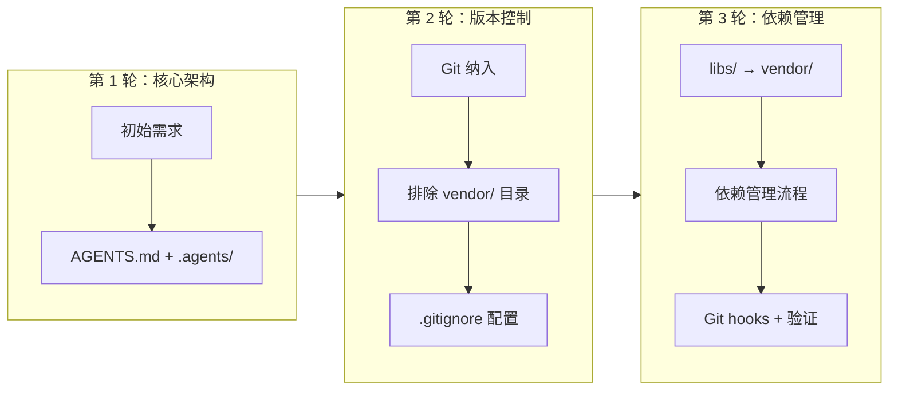

+++
id = "retrospective-report-agents-spec-system-comprehensive-project-overview"
date = "2026-06-23"
type = "project-overview"
source = "docs/retrospective/reports/retrospective-report-agents-spec-system-comprehensive.md#一"
+++

# 一、项目全景概述

## 1.1 项目背景与动机

在 AI 辅助开发日益普及的背景下，多智能体协作已成为提升开发效率的重要手段。然而，缺乏统一的角色定义、协作协议与开发规范，将导致智能体间职责不清、交接混乱、输出质量参差不齐。本项目旨在建立一套自包含的智能体协作开发体系，使 AI 智能体能够在明确的规则框架下高效协作。

## 1.2 项目目标分层

本项目的目标可按层次分为三层：

| 层次 | 目标 | 核心产出 |
|------|------|---------|
| **规范层** | 建立智能体开发规范体系 | `AGENTS.md` + `.agents/` 目录（35 个 .md 文件） |
| **工程层** | 纳入 Git 版本控制与依赖管理 | `.gitignore` + pre-commit hook + 验证脚本 |
| **治理层** | 目录重命名与知识沉淀 | `libs/` → `vendor/` + 知识库条目 + 复盘文档 |

## 1.3 交付物全景

| 大类 | 子类 | 数量 | 代表性文件 |
|------|------|------|-----------|
| 全局契约 | 入口文件 | 1 | `AGENTS.md` |
| 角色定义 | 5 角色 + README | 6 | `orchestrator.md`, `architect.md`, ... |
| 提示词 | 每角色 system-prompt + few-shot | 11 | `orchestrator/system-prompt.md`, ... |
| 工具规范 | 4 类工具 + README | 5 | `file-operations.md`, `code-execution.md`, ... |
| 协作协议 | 4 协议 + README | 5 | `handoff.md`, `dependency-management.md`, ... |
| 标准工作流 | 3 工作流 + README | 4 | `feature-development.md`, `testing.md`, ... |
| 模板资产 | 2 模板 + README | 3 | `task-template.md`, `handoff-template.md` |
| 自动化脚本 | 3 验证脚本 + README | 4 | `check-gitignore.py`, `check-links.py`, `check-spec-consistency.py` |
| 版本控制 | .gitignore + hook | 2 | `.gitignore`, `pre-commit` |
| 目录说明 | 入口说明 | 1 | `.agents/README.md` |
| **合计** | | **42** | |

## 1.4 需求演进时间线

每一轮需求迭代都在前一轮确认的基础上叠加增量，形成了"核心架构 → 版本控制 → 依赖管理"的渐进式演进路径。

---