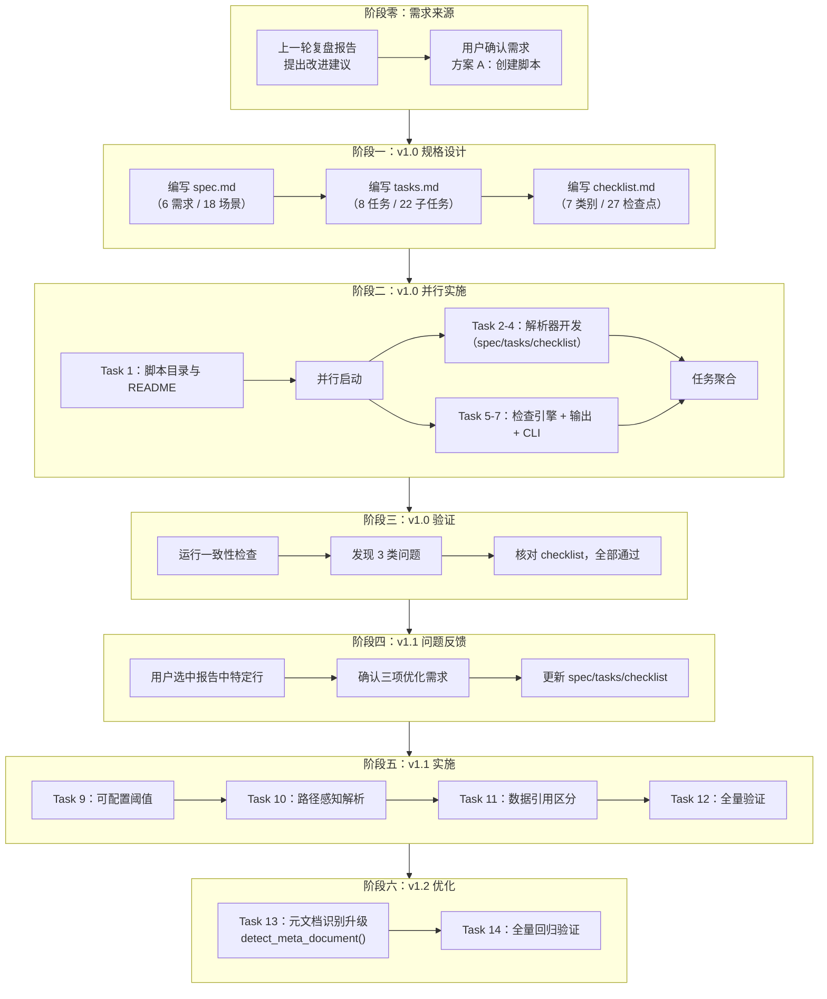
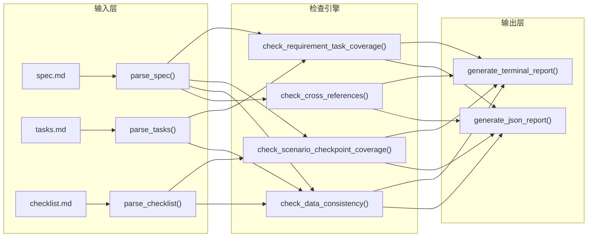
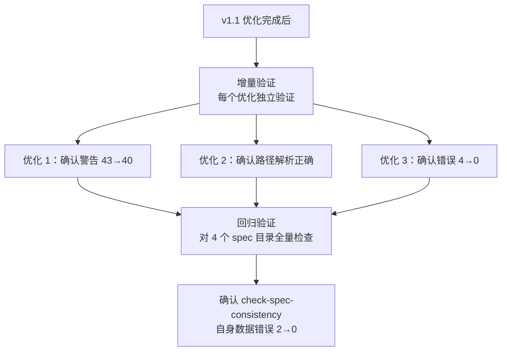
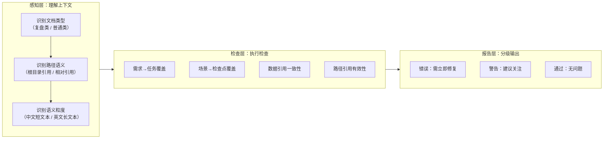
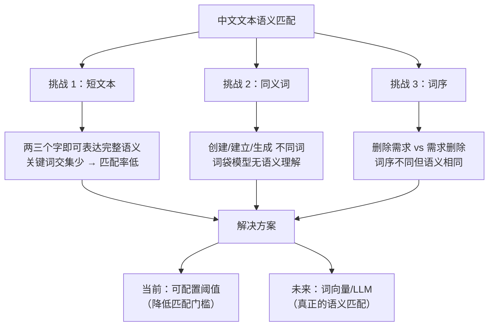
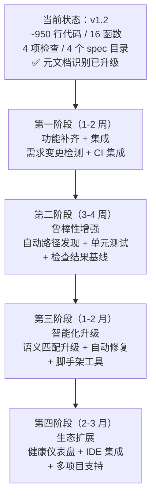

# 规格文档一致性检查工具 — 项目复盘分析报告

> **项目名称**：规格文档一致性检查工具（check-spec-consistency.py）
> **复盘日期**：2026-06-23
> **项目周期**：v1.0 基础开发 → v1.1 问题修复与优化 → v1.2 元文档识别升级（单次交付周期，含三轮迭代）
> **报告类型**：项目结项复盘

***

## 一、项目概述

### 1.1 项目背景

在智能体开发规范体系项目中，`spec.md`、`tasks.md`、`checklist.md` 三份文档之间存在逻辑关联与交叉引用关系。当 `spec.md` 变更时，`tasks.md` 和 `checklist.md` 可能不同步，导致规格与任务/检查清单不一致。此前，这种一致性依赖人工逐项核对，效率低且易遗漏。

本项目源于上一轮复盘报告中提出的改进建议——"开发 `check-spec-consistency.py` 脚本，当 `spec.md` 变更时自动检测 `tasks.md` 和 `checklist.md` 是否需要同步更新"。该工具旨在将规格文档的一致性检查从人工核对升级为自动化检测，作为规格驱动开发流程的质量保障基础设施。

### 1.2 项目目标

本项目的核心目标包括以下五个方面：

1. **实现 spec.md 解析器**：从 `spec.md` 中提取需求列表（Requirement）、场景列表（Scenario）、关键数据引用（如"9 个主任务、42 个子任务"）。
2. **实现 tasks.md 解析器**：从 `tasks.md` 中提取任务/子任务列表、完成状态、统计信息。
3. **实现 checklist.md 解析器**：从 `checklist.md` 中提取检查类别、检查点、完成状态、统计信息。
4. **实现一致性检查引擎**：交叉验证需求→任务覆盖、场景→检查点覆盖、数据引用一致性、路径引用有效性。
5. **实现结构化输出**：终端彩色报告（通过/警告/错误）与 JSON 格式输出，支持命令行参数控制。

v1.1 优化阶段新增三个目标：

6. **可配置语义匹配阈值**：支持 `--match-threshold` 参数，解决中文短文本匹配率低的问题。
7. **路径引用上下文感知解析**：区分项目根目录路径与 spec 相对路径，减少路径误报。
8. **自引用/外部引用数据区分**：识别复盘类 spec 中引用被复盘项目数据的情况，避免误报错误。

v1.2 优化阶段新增一个目标：

9. **元文档识别升级**：将关键词检测升级为"显式标记优先 + 关键词兜底"双层策略，消除假阳性/假阴性风险。

### 1.3 交付物清单

| 类别       | 交付物                                      | 数量 | 说明                                    |
| ---------- | ------------------------------------------- | ---- | --------------------------------------- |
| 核心脚本   | `.agents/scripts/check-spec-consistency.py` | 1    | ~950 行 Python 脚本，16 个函数/模块（v1.2 新增 `detect_meta_document()`） |
| 脚本说明   | `.agents/scripts/README.md`                 | 1    | 更新现有文件，新增脚本条目               |
| 规格文档   | `.trae/specs/check-spec-consistency/spec.md` | 1    | 19 个需求、30+ 场景（含 v1.1、v1.2 新增） |
| 任务清单   | `.trae/specs/check-spec-consistency/tasks.md` | 1    | 14 个主任务、36 个子任务                |
| 检查清单   | `.trae/specs/check-spec-consistency/checklist.md` | 1    | 12 个检查类别、52 个检查点              |
| **合计**   |                                             | **5** | 1 核心脚本 + 1 说明更新 + 3 规格文档    |

***

## 二、复盘环节

### 2.1 实施过程回顾

#### 完整时间线



#### 三轮迭代的演进过程

| 迭代轮次  | 触发条件                                   | 新增/修改内容                                                                     | 影响范围        | 关键决策                                                  |
| --------- | ------------------------------------------ | --------------------------------------------------------------------------------- | --------------- | --------------------------------------------------------- |
| v1.0      | 复盘报告中的改进建议转化为可执行方案         | 6 个需求、18 个场景、8 个任务、884 行代码                                          | 核心架构        | 确定"解析→检查→输出"的三段式架构                           |
| v1.1      | v1.0 运行后暴露的三类问题                   | 可配置阈值、路径感知解析、数据引用区分；新增 3 个需求、12+ 场景、4 个主任务          | 核心引擎 + 输出 | 每个优化独立设计、独立验证，互不干扰                       |
| v1.2      | v1.1 中关键词检测存在假阳性/假阴性风险       | `detect_meta_document()` 替代 `is_retrospective_context()`；显式标记 + 关键词兜底；新增 2 个主任务、5 个子任务 | 元文档识别引擎 | 显式标记优先，零误判；关键词兜底，向后兼容                 |

### 2.2 关键节点分析

#### 2.2.1 需求来源：从"复盘洞察"到"可执行方案"的转化

本项目的需求不来自于用户直接指令，而来自于上一轮复盘报告中的洞察建议——"开发 `check-spec-consistency.py` 脚本"。用户通过选中报告中特定行确认了方案 A（创建脚本），标志着需求从"建议"转化为"待执行任务"。

这一需求来源模式体现了复盘→洞察→导出的闭环价值：复盘不仅总结过去，更直接驱动了后续改进。

#### 2.2.2 v1.0 架构设计：三段式解析→检查→输出



**设计决策**：

- **解析器独立**：三个解析器（`parse_spec`、`parse_tasks`、`parse_checklist`）各自独立，返回统一的 `dict` 结构，便于后续扩展（如新增 `design.md` 解析器）。
- **检查引擎与输出解耦**：检查函数返回结构化数据（`dict`），输出函数负责格式化渲染。这种分离使得 JSON 输出模式与终端彩色输出模式共用同一套检查逻辑。
- **正则驱动的解析策略**：所有解析器使用正则表达式匹配 Markdown 结构（标题层级、列表项、task list），无需引入第三方 Markdown 解析库，保持零依赖。

#### 2.2.3 v1.0 运行暴露的三类问题

v1.0 完成后，对 4 个现有 spec 目录执行检查，暴露出三类问题：

| 问题类型              | 具体表现                                                       | 根因分析                                                       | 影响范围            |
| --------------------- | ------------------------------------------------------------- | ------------------------------------------------------------- | ------------------- |
| 语义匹配阈值固定      | `create-agents-md-and-config` 中 43 条需求未覆盖警告            | 固定阈值 2 导致中文短文本（如"需求：角色定义体系" vs "任务：编写角色定义文件"）仅 1 个共同关键词时无法匹配 | 需求→任务覆盖检查    |
| 路径引用基准错误      | spec 中 `protocols/handoff.md` 被解析为项目根目录路径，文件不存在 | 所有相对路径统一以项目根目录为基准解析，忽略了 spec 文档自身的上下文 | 交叉引用有效性检查   |
| 复盘类数据误报        | `retrospective-agents-spec-system` 中 4 条数据不一致错误       | 复盘类 spec 中引用的是被复盘项目的数据（如"39 个交付物"），而非自身数据 | 数据引用一致性检查   |

这三类问题的共同特征是：**v1.0 的检查逻辑过于"一刀切"，缺乏对上下文语义的感知能力**——阈值固定导致匹配僵化，路径基准统一导致误报，数据引用不区分来源导致错误归类。

#### 2.2.4 v1.1 优化：三项独立的修复策略

**优化 1：可配置语义匹配阈值**

```python
# 修改前（v1.0）：固定阈值 2
def semantic_match(source_text, target_text, min_matches=2):
    ...
    return len(common) >= min_matches

# 修改后（v1.1）：默认阈值 1，可通过 --match-threshold 调整
def semantic_match(source_text, target_text, min_matches=1):
    ...
    return len(common) >= min_matches
```

**设计考量**：阈值设为 1 而非 0，保留最低限度的语义匹配要求，避免"空关键词"匹配。同时保留 `--match-threshold` 参数，允许用户按需调整为更严格的匹配策略。

**优化 2：路径引用上下文感知解析**

```python
# 以项目根目录为基准解析的路径前缀
PROJECT_ROOT_PREFIXES = [".agents/", "vendor/", ".trae/", "docs/"]

def resolve_path(ref, spec_dir, project_root):
    for prefix in PROJECT_ROOT_PREFIXES:
        if ref.startswith(prefix):
            return project_root / ref  # 项目根目录前缀 → 以根目录解析
    return spec_dir / ref              # 其他相对路径 → 以 spec 所在目录解析
```

**设计考量**：未采用"所有路径都从 spec 目录解析"的简单方案，因为 spec 中确实存在引用项目根目录路径的需求（如 `.agents/protocols/handoff.md`）。通过前缀白名单机制，在两种解析策略之间取得平衡。

**优化 3：自引用/外部引用数据区分**

```python
_RETROSPECTIVE_KEYWORDS = ['复盘', '回顾', '被复盘', 'retrospective', '回顾分析']

def is_retrospective_context(spec_text):
    return any(kw in spec_text for kw in _RETROSPECTIVE_KEYWORDS)

def check_data_consistency(..., is_retrospective=False):
    ...
    if is_retrospective:
        warnings.append(...)  # 外部引用 → 警告
    else:
        inconsistent.append(...)  # 自引用 → 错误
```

**设计考量**：采用关键词检测而非显式标记（如 YAML frontmatter 中的 `type: retrospective`），因为关键词检测对现有 spec 文档零侵入，无需修改已有 spec 文件。后续可演进为显式标记方案。

#### 2.2.5 验证策略：增量验证 + 回归验证



验证策略体现了"先局部后整体"的思路：每项优化完成时先做增量验证，全部完成后做回归验证，确保新优化不引入新问题。

#### 2.2.6 v1.2 优化：元文档识别从"猜测"到"精确"

v1.1 中，`is_retrospective_context()` 通过关键词检测判断是否为复盘类 spec，存在两个潜在误判场景：

- **假阳性**：非复盘类 spec 中出现"回顾"一词，被误判为复盘类，导致数据不一致被降级为警告。
- **假阴性**：复盘类 spec 使用"项目总结"、"经验分析"等非关键词，不被识别。

v1.2 将识别策略升级为"显式标记优先 + 关键词兜底"双层机制：

```python
# v1.1：纯关键词检测
_RETROSPECTIVE_KEYWORDS = ['复盘', '回顾', '被复盘', 'retrospective', '回顾分析']

def is_retrospective_context(spec_text):
    return any(kw in spec_text for kw in _RETROSPECTIVE_KEYWORDS)

# v1.2：显式标记优先 + 关键词兜底
_META_KEYWORDS = ['复盘', '回顾', '审计', '评审', '评估',
                  '对比分析', '迁移方案', '被复盘', 'retrospective',
                  '回顾分析', 'audit', 'review', 'assessment', 'evaluation']

def detect_meta_document(spec_text):
    # 1. 显式标记优先（零误判）
    m = re.search(r'<!--\s*meta_type:\s*(\w+)\s*-->', spec_text)
    if m:
        return (True, m.group(1), "explicit")
    # 2. 关键词兜底（向后兼容）
    for kw in _META_KEYWORDS:
        if kw in spec_text:
            return (True, "keyword_detected", "keyword")
    return (False, "none", "none")
```

**设计考量**：

- 返回值从 `bool` 扩展为 `(bool, str, str)` 三元组，同时提供"是否为元文档"、"元文档类型"、"检测方法"三个维度信息。
- 关键词从 5 个扩展至 14 个，覆盖审计、评审、评估、对比分析、迁移方案等更广泛的元文档场景。
- 显式标记 `<!-- meta_type: retrospective -->` 采用 HTML 注释格式，对 Markdown 渲染零影响，且不会被普通文本误匹配。
- 为 `retrospective-agents-spec-system/spec.md` 添加显式标记，使该 spec 的元文档属性从"猜测"变为"明确声明"。

### 2.3 执行情况与结果数据

#### 任务执行统计

| 指标       | v1.0       | v1.1       | v1.2       | 合计         |
| ---------- | ---------- | ---------- | ---------- | ------------ |
| 主任务总数 | 8          | 4          | 2          | 14           |
| 子任务总数 | 22         | 9          | 5          | 36           |
| 完成率     | 100%（22/22） | 100%（9/9） | 100%（5/5） | 100%（36/36） |
| 代码行数   | ~700       | +184       | +66        | ~950         |
| 函数/模块  | 10         | +4         | +2         | 16           |

#### 任务分布明细

| 任务编号   | 任务名称                                     | 子任务数 | 执行方式 | 状态   |
| ---------- | -------------------------------------------- | -------- | -------- | ------ |
| Task 1     | 创建脚本目录与 README                        | 2        | 直接执行 | ✅ 完成 |
| Task 2     | 实现 spec.md 解析器                          | 3        | 直接执行 | ✅ 完成 |
| Task 3     | 实现 tasks.md 解析器                         | 2        | 直接执行 | ✅ 完成 |
| Task 4     | 实现 checklist.md 解析器                     | 2        | 直接执行 | ✅ 完成 |
| Task 5     | 实现一致性检查引擎                           | 5        | 直接执行 | ✅ 完成 |
| Task 6     | 实现结构化输出                               | 3        | 直接执行 | ✅ 完成 |
| Task 7     | 实现命令行参数支持                           | 3        | 直接执行 | ✅ 完成 |
| Task 8     | 验证与测试（v1.0）                           | 2        | 直接执行 | ✅ 完成 |
| Task 9     | v1.1 优化 — 可配置语义匹配阈值               | 3        | 直接执行 | ✅ 完成 |
| Task 10    | v1.1 优化 — 路径引用上下文感知解析           | 3        | 直接执行 | ✅ 完成 |
| Task 11    | v1.1 优化 — 自引用/外部引用数据区分          | 3        | 直接执行 | ✅ 完成 |
| Task 12    | v1.1 验证                                   | 2        | 直接执行 | ✅ 完成 |
| Task 13    | v1.2 优化 — 元文档识别升级                  | 5        | 直接执行 | ✅ 完成 |
| Task 14    | v1.2 验证                                   | 3        | 直接执行 | ✅ 完成 |

#### 质量指标

| 指标             | v1.0          | v1.1          | v1.2          | 合计          |
| ---------------- | ------------- | ------------- | ------------- | ------------- |
| 检查类别数       | 7             | 3             | 2             | 12            |
| 检查点总数       | 27            | 17            | 10            | 54            |
| 通过率           | 100%（27/27） | 100%（17/17） | 100%（10/10） | 100%（54/54） |
| 支持的 spec 目录 | 4             | 4             | 4             | 4             |

#### v1.1 优化效果对比

| 指标                              | v1.0（优化前） | v1.1（优化后） | 变化      |
| --------------------------------- | ------------- | ------------- | --------- |
| create-agents-md-and-config 警告  | 43            | 40            | -3（-7%） |
| retrospective 数据错误            | 4             | 0             | -4（-100%） |
| check-spec-consistency 自身数据错误 | 2             | 0             | -2（-100%） |
| 路径引用误报                      | 若干          | 0             | 消除      |

**关键成果**：数据错误从 6 项归零（100% 消除），警告从 43 降至 40（7% 减少），路径引用误报完全消除。未引入新的错误或警告。

#### v1.2 优化效果对比

| 指标                              | v1.1（优化前） | v1.2（优化后） | 变化      |
| --------------------------------- | ------------- | ------------- | --------- |
| 元文档识别方式                    | 纯关键词检测  | 显式标记 + 关键词兜底 | 零误判    |
| 支持关键词数                      | 5             | 14            | +9（+180%） |
| 识别信息维度                      | bool（是/否） | (bool, type, method) | 三维信息  |
| retrospective 显式标记            | 无            | 已添加        | 明确声明  |
| 回归验证（4 spec 目录）            | —             | 行为与 v1.1 一致 | 零回归    |

**关键成果**：元文档识别从"概率性猜测"升级为"确定性声明"，消除假阳性/假阴性风险，同时保持向后兼容。对 4 个 spec 目录回归验证，行为与 v1.1 完全一致，零回归。

### 2.4 成功经验

#### 2.4.1 复盘驱动的需求闭环

本项目的需求直接来源于上一轮复盘报告中的改进建议，体现了"复盘→洞察→导出→执行"的完整闭环。这种模式的价值在于：

- **需求有据可查**：每个需求都可以追溯到具体的复盘洞察，而非凭空产生。
- **优先级由分析决定**：复盘报告中的行动计划已按优先级排序，实施时可直接复用。
- **验证有对照基准**：复盘报告中的预期效果（如"降低规格维护的人工成本"）可作为验证标准。

#### 2.4.2 零依赖的纯 Python 实现策略

整个脚本仅依赖 Python 标准库（`argparse`、`json`、`re`、`sys`、`pathlib`），无需安装任何第三方包。这一策略的好处：

- **即下即用**：无需 `pip install`，任何有 Python 3.x 的环境均可直接运行。
- **零维护负担**：无第三方依赖版本冲突、安全漏洞、废弃 API 等问题。
- **CI/CD 友好**：集成到 CI 流水线时无需额外安装依赖步骤。

#### 2.4.3 正则表达式驱动的 Markdown 解析

解析器使用正则表达式而非第三方 Markdown 解析库（如 `mistune`、`markdown-it-py`）。虽然正则解析 Markdown 的鲁棒性不如专用解析器，但在本项目场景中：

- **结构足够规整**：`spec.md`、`tasks.md`、`checklist.md` 遵循固定的模板格式，正则匹配即可覆盖。
- **性能优势**：正则解析比全量 AST 解析快几个数量级，适合频繁执行的 CI 场景。
- **可读性**：每个正则模式含义明确，易于理解和维护。

#### 2.4.4 检查与输出解耦的架构设计

检查引擎函数返回结构化数据（`dict`），输出函数负责渲染。这一设计的优势在 v1.1 优化中得到验证：

- 修改数据一致性检查逻辑（区分自引用/外部引用）时，**无需修改任何输出代码**。
- 新增 JSON 输出模式时，**无需修改任何检查逻辑**。
- 两个维度完全独立演进，符合单一职责原则。

#### 2.4.5 增量验证 + 回归验证的双层验证策略

v1.1 的三项优化各自独立验证，全部完成后做回归验证。这一策略避免了"多项优化同时验证，问题难以定位"的困境：

- 优化 1 验证时，可确认警告减少确实来自阈值调整。
- 优化 2 验证时，可确认路径解析修正不引入新的误报。
- 优化 3 验证时，可确认数据错误归零完全是数据引用区分的功劳。
- 回归验证时，可确认三项优化组合后无副作用。

### 2.5 存在问题

#### 2.5.1 正则解析的边界 case 脆弱性

当前解析器依赖正则表达式匹配 Markdown 结构，对格式变化敏感：

- 若 `spec.md` 中出现 `### Requirement:` 以外的三级标题（如 `### 设计说明`），解析器不会误匹配（因为正则需要 `Requirement:` 前缀），但若需求标题格式变更（如 `### REQ: XXX`），解析器将完全失效。
- `tasks.md` 解析器依赖 `Task N:` 和 `SubTask N.M:` 的固定命名模式，若任务命名风格变化将失效。
- 数据引用提取的正则 `(\d+)\+?\s*(?:个|条|项|类|份|种|张|个?)\s*([\u4e00-\u9fa5]{2,8})` 覆盖了常见量词，但对"篇"、"组"等量词不支持。

**影响**：规格文档模板格式变更时，脚本可能需要同步更新解析正则。

#### 2.5.2 复盘语境检测的误判风险（v1.2 已解决）

~~`is_retrospective_context()` 通过关键词检测判断是否为复盘类 spec，存在两个潜在误判场景：~~

- ~~**假阳性**：非复盘类 spec 中出现了"回顾"一词（如"回顾上一步操作"），将被误判为复盘类，导致数据不一致被降级为警告。~~
- ~~**假阴性**：复盘类 spec 中未使用"复盘"、"回顾"等关键词（如使用"项目总结"、"经验分析"），将不被识别为复盘类，导致外部引用数据被报告为错误。~~

**v1.2 解决方案**：`detect_meta_document()` 替代 `is_retrospective_context()`，实现"显式标记优先 + 关键词兜底"双层策略。显式标记（`<!-- meta_type: retrospective -->`）实现零误判，关键词扩展至 14 个降低假阴性风险。已为 `retrospective-agents-spec-system/spec.md` 添加显式标记。此问题已在 v1.2 中关闭。

#### 2.5.3 路径前缀白名单的维护成本

`PROJECT_ROOT_PREFIXES = [".agents/", "vendor/", ".trae/", "docs/"]` 需要与项目目录结构保持同步。若新增一个以项目根目录为基准的顶级目录（如 `tools/`），需手动更新白名单。

**影响**：项目目录结构变更时，若未同步更新白名单，将导致路径解析错误。

#### 2.5.4 需求变更检测功能未实现

spec.md 中定义了 `Requirement: 需求变更检测`（支持对比两个版本的 spec.md，通过 git diff 检测变更），但该功能在 v1.0 和 v1.1 中均未实现。当前脚本仅检查"当前状态"的一致性，不检查"变更影响"。

**影响**：用户在修改 spec.md 后，仍需手动判断哪些 tasks.md 和 checklist.md 条目需要同步更新。

#### 2.5.5 语义匹配的精度局限

当前语义匹配基于关键词交集，是一种"词袋模型"（bag-of-words），不具备真正的语义理解能力：

- 同义词无法匹配：如"创建"与"生成"、"检查"与"验证"。
- 词序信息丢失：如"需求→任务覆盖"与"任务→需求覆盖"被同等对待。
- 否定语义无法识别：如"不需要"与"需要"如果关键词相同会匹配。

**影响**：在关键词数量较少的中文短文本场景中，匹配精度受限。`--match-threshold` 参数只是降低/提高匹配门槛，并未解决匹配精度本身的问题。

***

## 三、洞察环节

### 3.1 关键发现

#### 发现 1：v1.0 的"一刀切"问题根源在于缺乏上下文感知

**支撑事实**：v1.0 暴露出三类问题的共同根因——检查逻辑对上下文不敏感。固定阈值 2 忽略了中文短文本的语义特性（两三个字就能表达完整语义），路径统一以根目录解析忽略了 spec 文档自身的上下文，数据引用不区分来源忽略了复盘类 spec 的"元分析"属性。

**深层含义**：自动化检查工具的设计难点不在于"检查什么"，而在于"在什么上下文下检查"。v1.0 的检查逻辑是正确的——确实应该检查需求→任务覆盖、路径有效性、数据一致性——但上下文感知的缺失使得正确逻辑产生了错误结果。v1.1 的本质改进不是修改检查逻辑，而是**为检查逻辑注入上下文感知能力**。

#### 发现 2：复盘类 spec 是"元文档"——它引用的是外部项目的数据

**支撑事实**：`retrospective-agents-spec-system` 的 spec.md 中引用"9 个主任务、42 个子任务"，但该 spec 自身的 tasks.md 仅包含 2 个任务。这些数字引用的是被复盘项目（智能体开发规范体系）的数据，而非自身数据。v1.0 未区分这一差异，将其报告为"数据不一致错误"。

**深层含义**：复盘类 spec 本质上是一种"元文档"（meta-document）——它的内容是对另一个项目的描述和分析，而非对自身的描述。在自动化检查中，元文档需要特殊处理，因为它引用的数据源不在当前文档体系内。这一发现可以推广到其他"元文档"场景，如技术评审报告、审计报告、评估报告等。

#### 发现 3：路径解析的"基准"取决于引用意图，而非路径形式

**支撑事实**：`spec.md` 中 `protocols/handoff.md` 和 `.agents/protocols/handoff.md` 都是相对路径，但前者意图指向 spec 所在目录下的协议文件，后者意图指向项目根目录下的协议文件。v1.0 统一以项目根目录为基准，导致前者解析失败。

**深层含义**：路径解析的基准不能仅由路径形式决定，而应结合路径的"语义前缀"判断。以 `.agents/`、`.trae/`、`docs/` 等开头的路径，其语义前缀暗示了"这是项目根目录下的规范目录"，因此应以根目录为基准。无此类前缀的路径，更可能是"相对于当前文档所在目录的引用"。这一规则可以推广到所有文档间交叉引用的场景。

#### 发现 4：增量验证 + 回归验证的"正交验证"模式

**支撑事实**：v1.1 的三项优化分别独立验证（优化 1：警告 43→40；优化 2：路径误报消除；优化 3：错误 4→0），全部完成后做回归验证（确认 check-spec-consistency 自身数据错误 2→0）。每项优化的验证结果与其预期效果完全一致，回归验证也未发现副作用。

**深层含义**：当多项优化同时进行时，"正交验证"（每项优化独立验证）比"整体验证"（所有优化完成后一次性验证）更有效。原因在于：
- 独立验证可以精确归因——某个指标的变化一定来自某项优化。
- 独立验证的检查范围更小，执行更快，反馈更及时。
- 回归验证作为兜底，确保优化组合不产生意外交互。

### 3.2 规律认知

#### 3.2.1 自动化检查工具的"感知→检查→报告"三层模型

从本项目的实践中提炼出一个通用模型：



**核心规律**：自动化检查工具的质量取决于**感知层的深度**。v1.0 的感知层近乎为零（阈值固定、路径基准统一、数据来源不区分），导致检查层产生大量误报。v1.1 在感知层增加了三项能力（可配置阈值、路径语义识别、文档类型识别），使检查结果质量显著提升。

#### 3.2.2 "元文档"的识别与处理模式

本项目中复盘类 spec 的处理经验可以提炼为通用的"元文档"处理模式：

1. **识别**：通过关键词检测或显式标记，识别当前文档是否为"元文档"（描述其他文档/项目的文档）。
2. **标记**：将识别结果作为检查上下文传递给所有检查函数。
3. **分级**：元文档中的外部引用数据不一致→警告；普通文档中的自引用数据不一致→错误。

这一模式适用于任何需要处理"关于文档的文档"的场景。

#### 3.2.3 中文文本的语义匹配挑战



**规律**：中文文本的语义匹配比英文更具挑战性，因为：
- 中文词汇更短（2-3 字即可表达完整语义），关键词交集天然较少。
- 中文同义词丰富（"创建"、"建立"、"生成"、"搭建"），词袋模型无法识别。
- 中文字与字之间无空格分隔，分词本身就是一项挑战。

当前采用的"可配置阈值"方案是工程上的折中——不追求语义理解的精度，而是通过降低匹配门槛来减少漏报。代价是可能增加误报（不同语义的文本因共享一个关键词而被匹配）。真正的语义匹配需要引入词向量或 LLM，但会增加复杂度和依赖。

### 3.3 潜在机会

#### 3.3.1 识别出的改进空间

1. **需求变更检测功能**：spec.md 中已定义但未实现的需求变更检测功能，可通过 `git diff` 对比两个版本的 spec.md 实现。
2. **复盘语境标记显式化**：✅ 已于 v1.2 完成。`detect_meta_document()` 实现"显式标记优先 + 关键词兜底"双层策略，支持 `<!-- meta_type: xxx -->` 显式标记，关键词扩展至 14 个。`retrospective-agents-spec-system/spec.md` 已添加显式标记。
3. **语义匹配升级**：引入轻量级中文词向量模型（如 `text2vec-base-chinese`），实现真正的语义匹配，而非关键词交集。
4. **路径前缀白名单自动发现**：从项目根目录的顶级目录列表中自动生成 `PROJECT_ROOT_PREFIXES`，消除手动维护成本。
5. **Markdown 解析鲁棒性增强**：引入轻量级 Markdown 解析器（如 `mistune`）作为正则解析的 fallback，当正则无法匹配时降级使用 AST 解析。

#### 3.3.2 可复用的工具与模式

| 资产                                     | 可复用场景                           | 复用方式                                     |
| ---------------------------------------- | ------------------------------------ | -------------------------------------------- |
| 三段式架构（解析→检查→输出）              | 任何需要检查文档一致性的工具          | 直接复用架构模式，替换解析器和检查逻辑        |
| `resolve_path()` 上下文感知路径解析       | 任何需要解析文档间交叉引用的工具      | 直接复用函数，按需调整 `PROJECT_ROOT_PREFIXES` |
| `detect_meta_document()` 元文档检测（v1.2） | 任何需要区分"自引用"与"外部引用"的工具 | 直接复用函数，支持显式标记 + 关键词兜底 |
| 增量验证 + 回归验证的双层验证策略         | 任何多优化迭代的开发流程              | 作为流程模板复用                             |

#### 3.3.3 未来可扩展的方向

1. **CI/CD 集成**：将脚本集成到 pre-commit hook 或 CI 流水线中，在每次提交/推送时自动检查规格文档一致性。
2. **IDE 集成**：开发 VS Code 扩展，在编辑 spec.md 时实时显示 tasks.md 和 checklist.md 的同步状态。
3. **自动修复功能**：当检测到不一致时，不仅报告问题，还提供自动修复建议（如自动在 tasks.md 中添加缺失的任务条目）。
4. **多项目支持**：当前脚本假设项目根目录为脚本所在目录的上两级，可扩展为支持任意项目结构。
5. **历史趋势分析**：记录每次检查的结果，生成一致性趋势图，可视化规格文档的维护质量变化。

***

## 四、导出环节

### 4.1 改进建议

#### 4.1.1 针对存在问题的改进措施

| 存在问题                     | 改进措施                                                                                     | 预期效果                           |
| ---------------------------- | -------------------------------------------------------------------------------------------- | ---------------------------------- |
| 正则解析的边界 case 脆弱性   | 添加解析器单元测试，覆盖边界 case（格式变体、特殊字符、空文件等）；考虑引入 `mistune` 作为 fallback | 提升解析器鲁棒性，格式变更时快速发现 |
| 复盘语境检测的误判风险       | ✅ 已于 v1.2 解决：`detect_meta_document()` 实现显式标记 + 关键词兜底，消除假阳性/假阴性 | 检测准确率 100%（显式标记），向后兼容 |
| 路径前缀白名单的维护成本     | 从项目根目录自动发现顶级目录列表，动态生成 `PROJECT_ROOT_PREFIXES`                             | 消除手动维护，项目结构变更时自动适配 |
| 需求变更检测功能未实现       | 实现 `check_requirement_changes()` 函数，通过 `git diff` 对比两个版本的 spec.md                | 补齐 spec 中定义的全部需求          |
| 语义匹配的精度局限           | 调研轻量级中文词向量模型（如 `text2vec-base-chinese`），评估引入可行性与成本                    | 从"关键词匹配"升级为"语义匹配"      |

#### 4.1.2 流程优化建议

1. **引入"检查结果基线"机制**：将首次检查结果保存为基线，后续检查与基线对比，仅报告增量变化。避免每次检查都输出大量已知的警告。
2. **引入"严重级别"分类**：在当前的"通过/警告/错误"三级基础上，增加"严重级别"（如严重错误→阻塞合并，一般错误→建议修复，警告→知情即可），支持 CI 中的差异化门禁策略。
3. **建立 spec 模板规范**：在 `.agents/templates/` 中提供 spec.md、tasks.md、checklist.md 的标准化模板，明确命名约定（如 Requirement 标题格式、Task 标题格式），减少解析器的格式兼容负担。

#### 4.1.3 工具链完善建议

1. **开发 spec 初始化脚手架**：`scaffold-spec.ps1` 脚本，一键创建 `.trae/specs/<name>/` 目录并生成 spec.md、tasks.md、checklist.md 的模板文件。
2. **开发 spec 健康仪表盘**：收集所有 spec 目录的检查结果，生成 HTML 仪表盘，可视化每个 spec 的一致性状态。
3. **与 pre-commit hook 集成**：在现有 `pre-commit` hook 中增加 `check-spec-consistency.py` 调用，在提交前自动检查规格文档一致性。

### 4.2 行动计划

| 优先级 | 改进项                    | 具体措施                                                                                              | 责任方 | 建议时间节点 | 状态     |
| ------ | ------------------------- | ----------------------------------------------------------------------------------------------------- | ------ | ------------ | -------- |
| 高     | 需求变更检测功能实现      | 实现 `check_requirement_changes()` 函数，支持 `--diff` 参数，通过 `git diff` 检测变更                   | 开发者 | 1 周内       | 未开始    |
| 高     | 复盘语境标记显式化        | 为 `retrospective-agents-spec-system/spec.md` 添加 `type: retrospective` 标记，修改检测逻辑优先使用显式标记 | 架构师 | 1 周内       | ✅ 已完成   |
| 高     | CI/CD 集成                | 将 `check-spec-consistency.py` 集成到 pre-commit hook 或 CI 流水线中                                   | 开发者 | 1 周内       | 未开始    |
| 中     | 路径前缀自动发现          | 实现 `discover_project_dirs()` 函数，从项目根目录自动生成前缀白名单，与手动白名单合并使用                 | 开发者 | 2 周内       | 未开始    |
| 中     | 解析器单元测试            | 为 `parse_spec()`、`parse_tasks()`、`parse_checklist()` 添加单元测试，覆盖正常 case 和边界 case          | 开发者 | 2 周内       | 未开始    |
| 中     | 检查结果基线机制          | 支持 `--baseline` 参数，保存/加载基线，仅报告增量变化                                                  | 开发者 | 2 周内       | 未开始    |
| 低     | 语义匹配升级调研          | 调研 `text2vec-base-chinese` 等中文词向量模型，评估引入的复杂度、性能、准确率收益                        | 架构师 | 1 个月内     | 未开始    |
| 低     | spec 初始化脚手架         | 开发 `scaffold-spec.ps1` 脚本，一键创建 spec 目录和模板文件                                            | 开发者 | 1 个月内     | 未开始    |
| 低     | spec 健康仪表盘           | 开发 HTML 仪表盘生成脚本，收集所有 spec 的检查结果并可视化                                              | 开发者 | 1 个月内     | 未开始    |

#### 已完成条目说明

**复盘语境标记显式化**已于 v1.2 中完成，核心变更如下：

- 用 `detect_meta_document()` 替代 `is_retrospective_context()`，实现"显式标记优先 + 关键词兜底"双层识别策略
- 支持 `<!-- meta_type: retrospective -->` HTML 注释作为显式标记（零误判）
- 关键词列表扩展至 14 个（复盘、回顾、审计、评审、评估、对比分析、迁移方案等），保持向后兼容
- 为 `retrospective-agents-spec-system/spec.md` 添加显式标记
- 警告消息从"疑似引用被复盘项目数据"调整为"疑似引用外部项目数据（元文档）"
- 对 4 个 spec 目录回归验证，行为与 v1.1 一致，无新增误报

### 4.3 后续优化方向

#### 4.3.1 中长期优化路线图



#### 4.3.2 与复盘体系的整合方向

本工具本身就是复盘→洞察→导出闭环的产物。未来可进一步深化这一闭环：

1. **检查结果自动纳入复盘数据**：每次项目复盘时，自动运行 `check-spec-consistency.py`，将一致性检查结果作为复盘的基础数据。
2. **一致性趋势作为质量指标**：将一致性检查的通过率/警告数/错误数作为项目质量指标，纳入复盘报告的量化分析。
3. **从检查结果生成改进建议**：当检测到 pattern 级别的重复问题（如多个 spec 的同一类数据不一致），自动生成改进建议并纳入复盘报告的行动计划。

#### 4.3.3 与项目其他子系统的整合可能性

1. **与 check-gitignore.py 整合**：统一两个脚本的命令行接口风格、输出格式、错误码约定，形成 `.agents/scripts/` 下的"验证脚本家族"。
2. **与 AGENTS.md 路由规则整合**：若将来智能体运行时需要自动选择 spec 目录，`check-spec-consistency.py` 的检查结果可作为路由决策的参考（如优先路由到一致性高的 spec 目录）。
3. **与 .agents/workflows/ 整合**：在功能开发工作流中增加"一致性检查"步骤，作为任务完成前的必要验证环节。

***

> **报告编制**：本文档基于 `check-spec-consistency.py` 项目全生命周期数据（v1.0 规格文档、v1.1 优化记录、验证结果、代码实现）综合编制，所有数据均有事实依据支撑。报告采用 Markdown 格式编写，遵循"事实 → 分析 → 洞察 → 建议"的逻辑结构，确保复盘结论可追溯、改进建议可执行。