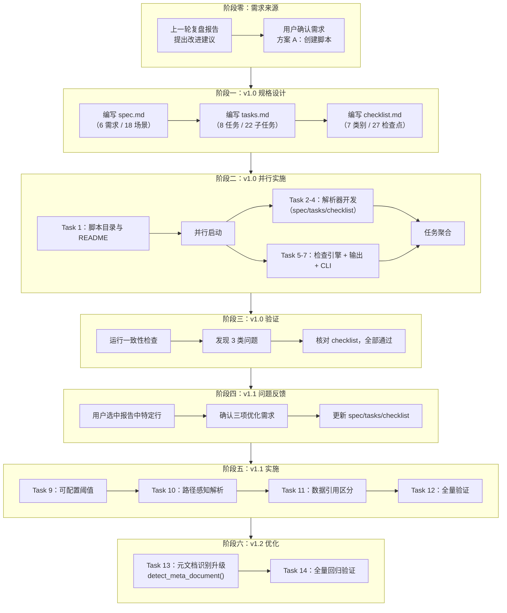
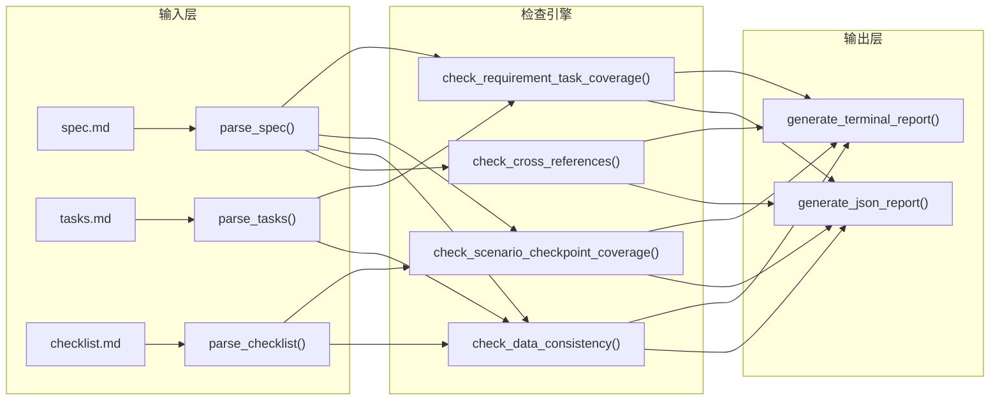
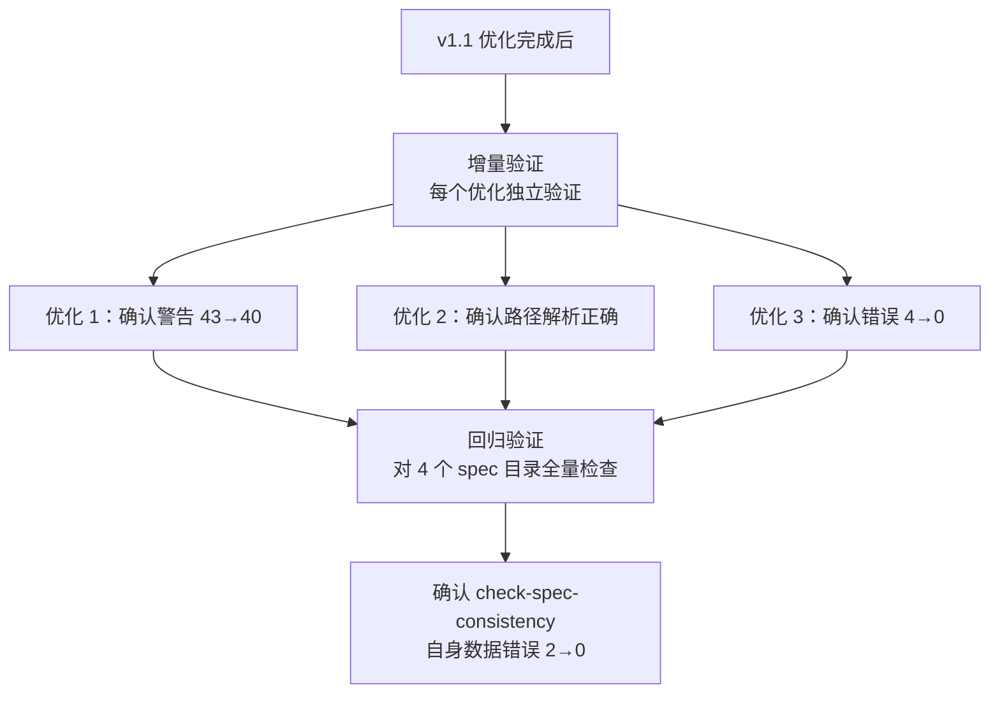

+++
id = "retrospective-report-check-spec-consistency-execution"
date = "2026-06-23"
type = "execution-retrospective"
source = "docs/retrospective/reports/retrospective-report-check-spec-consistency.md#二、复盘环节"
+++

# 执行复盘

## 2.1 实施过程回顾

### 完整时间线



### 三轮迭代的演进过程

| 迭代轮次  | 触发条件                                   | 新增/修改内容                                                                     | 影响范围        | 关键决策                                                  |
| --------- | ------------------------------------------ | --------------------------------------------------------------------------------- | --------------- | --------------------------------------------------------- |
| v1.0      | 复盘报告中的改进建议转化为可执行方案         | 6 个需求、18 个场景、8 个任务、884 行代码                                          | 核心架构        | 确定"解析→检查→输出"的三段式架构                           |
| v1.1      | v1.0 运行后暴露的三类问题                   | 可配置阈值、路径感知解析、数据引用区分；新增 3 个需求、12+ 场景、4 个主任务          | 核心引擎 + 输出 | 每个优化独立设计、独立验证，互不干扰                       |
| v1.2      | v1.1 中关键词检测存在假阳性/假阴性风险       | `detect_meta_document()` 替代 `is_retrospective_context()`；显式标记 + 关键词兜底；新增 2 个主任务、5 个子任务 | 元文档识别引擎 | 显式标记优先，零误判；关键词兜底，向后兼容                 |

## 2.2 关键节点分析

### 2.2.1 需求来源：从"复盘洞察"到"可执行方案"的转化

本项目的需求不来自于用户直接指令，而来自于上一轮复盘报告中的洞察建议——"开发 `check-spec-consistency.py` 脚本"。用户通过选中报告中特定行确认了方案 A（创建脚本），标志着需求从"建议"转化为"待执行任务"。

这一需求来源模式体现了复盘→洞察→导出的闭环价值：复盘不仅总结过去，更直接驱动了后续改进。

### 2.2.2 v1.0 架构设计：三段式解析→检查→输出



**设计决策**：

- **解析器独立**：三个解析器（`parse_spec`、`parse_tasks`、`parse_checklist`）各自独立，返回统一的 `dict` 结构，便于后续扩展（如新增 `design.md` 解析器）。
- **检查引擎与输出解耦**：检查函数返回结构化数据（`dict`），输出函数负责格式化渲染。这种分离使得 JSON 输出模式与终端彩色输出模式共用同一套检查逻辑。
- **正则驱动的解析策略**：所有解析器使用正则表达式匹配 Markdown 结构（标题层级、列表项、task list），无需引入第三方 Markdown 解析库，保持零依赖。

### 2.2.3 v1.0 运行暴露的三类问题

v1.0 完成后，对 4 个现有 spec 目录执行检查，暴露出三类问题：

| 问题类型              | 具体表现                                                       | 根因分析                                                       | 影响范围            |
| --------------------- | ------------------------------------------------------------- | ------------------------------------------------------------- | ------------------- |
| 语义匹配阈值固定      | `create-agents-md-and-config` 中 43 条需求未覆盖警告            | 固定阈值 2 导致中文短文本（如"需求：角色定义体系" vs "任务：编写角色定义文件"）仅 1 个共同关键词时无法匹配 | 需求→任务覆盖检查    |
| 路径引用基准错误      | spec 中 `protocols/handoff.md` 被解析为项目根目录路径，文件不存在 | 所有相对路径统一以项目根目录为基准解析，忽略了 spec 文档自身的上下文 | 交叉引用有效性检查   |
| 复盘类数据误报        | `retrospective-agents-spec-system` 中 4 条数据不一致错误       | 复盘类 spec 中引用的是被复盘项目的数据（如"39 个交付物"），而非自身数据 | 数据引用一致性检查   |

这三类问题的共同特征是：**v1.0 的检查逻辑过于"一刀切"，缺乏对上下文语义的感知能力**——阈值固定导致匹配僵化，路径基准统一导致误报，数据引用不区分来源导致错误归类。

### 2.2.4 v1.1 优化：三项独立的修复策略

**优化 1：可配置语义匹配阈值**

```python
# 修改前（v1.0）：固定阈值 2
def semantic_match(source_text, target_text, min_matches=2):
    ...
    return len(common) >= min_matches

# 修改后（v1.1）：默认阈值 1，可通过 --match-threshold 调整
def semantic_match(source_text, target_text, min_matches=1):
    ...
    return len(common) >= min_matches
```

**设计考量**：阈值设为 1 而非 0，保留最低限度的语义匹配要求，避免"空关键词"匹配。同时保留 `--match-threshold` 参数，允许用户按需调整为更严格的匹配策略。

**优化 2：路径引用上下文感知解析**

```python
# 以项目根目录为基准解析的路径前缀
PROJECT_ROOT_PREFIXES = [".agents/", "vendor/", ".trae/", "docs/"]

def resolve_path(ref, spec_dir, project_root):
    for prefix in PROJECT_ROOT_PREFIXES:
        if ref.startswith(prefix):
            return project_root / ref  # 项目根目录前缀 → 以根目录解析
    return spec_dir / ref              # 其他相对路径 → 以 spec 所在目录解析
```

**设计考量**：未采用"所有路径都从 spec 目录解析"的简单方案，因为 spec 中确实存在引用项目根目录路径的需求（如 `.agents/protocols/handoff.md`）。通过前缀白名单机制，在两种解析策略之间取得平衡。

**优化 3：自引用/外部引用数据区分**

```python
_RETROSPECTIVE_KEYWORDS = ['复盘', '回顾', '被复盘', 'retrospective', '回顾分析']

def is_retrospective_context(spec_text):
    return any(kw in spec_text for kw in _RETROSPECTIVE_KEYWORDS)

def check_data_consistency(..., is_retrospective=False):
    ...
    if is_retrospective:
        warnings.append(...)  # 外部引用 → 警告
    else:
        inconsistent.append(...)  # 自引用 → 错误
```

**设计考量**：采用关键词检测而非显式标记（如 YAML frontmatter 中的 `type: retrospective`），因为关键词检测对现有 spec 文档零侵入，无需修改已有 spec 文件。后续可演进为显式标记方案。

### 2.2.5 验证策略：增量验证 + 回归验证



验证策略体现了"先局部后整体"的思路：每项优化完成时先做增量验证，全部完成后做回归验证，确保新优化不引入新问题。

### 2.2.6 v1.2 优化：元文档识别从"猜测"到"精确"

v1.1 中，`is_retrospective_context()`