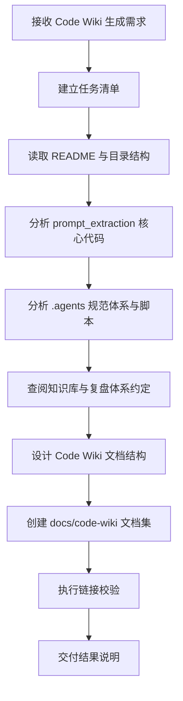

# Code Wiki 文档生成任务复盘分析报告

> **项目名称**：Code Wiki 文档生成任务
> **复盘日期**：2026-06-24
> **项目周期**：2026-06-24
> **报告类型**：项目结项复盘

---

## 一、项目概述

### 1.1 项目背景

用户提出“分析并理解这个项目仓库，生成结构化的完整的 Code Wiki 文档(md文件)”，要求覆盖项目整体架构、主要模块职责、关键类与函数说明、依赖关系以及项目运行方式等关键信息。

该任务发生在一个文档与代码混合型仓库中。仓库主体是一套 AI 智能体开发规范体系，同时包含 `prompt_extraction/` Python 子项目。因此，Code Wiki 不能只描述代码文件，也需要同时解释规范体系、知识库、复盘体系和自动化治理脚本之间的关系。

### 1.2 项目目标

| 目标 | 说明 | 完成情况 |
|---|---|---|
| 理解项目整体结构 | 识别仓库的主要目录、入口文件与资产分层 | 已完成 |
| 分析项目整体架构 | 解释 `AGENTS.md`、`.agents/`、`docs/`、`prompt_extraction/` 的关系 | 已完成 |
| 梳理主要模块职责 | 覆盖规范体系、文档体系、Python 子项目与自动化脚本 | 已完成 |
| 说明关键类与函数 | 聚焦 `PromptRecord`、`Pipeline`、输入解析、清洗、特征提取、评估、优化、UI | 已完成 |
| 梳理依赖关系 | 覆盖 Python 依赖、模块依赖、文档资产依赖与脚本依赖 | 已完成 |
| 说明运行与验证方式 | 提供 Streamlit、pytest、治理脚本等运行命令 | 已完成 |
| 导出 Markdown 文档 | 在 `docs/code-wiki/` 生成结构化文档集 | 已完成 |
| 验证文档链接 | 对 Code Wiki 目录执行链接检查 | 已完成 |

### 1.3 交付物清单

| 文件 | 类型 | 说明 |
|---|---|---|
| `docs/code-wiki/README.md` | Code Wiki 入口 | 文档目录、阅读路径、核心结论 |
| `docs/code-wiki/project-overview.md` | 总览文档 | 项目定位、目录职责、设计原则 |
| `docs/code-wiki/architecture.md` | 架构文档 | 入口路由、规范体系、流水线、UI、验证架构 |
| `docs/code-wiki/modules.md` | 模块文档 | 顶层模块、`.agents/`、`docs/`、`prompt_extraction/`、脚本职责 |
| `docs/code-wiki/key-apis.md` | API 文档 | 数据模型、流水线、解析、清洗、提取、评分、优化、UI 关键函数 |
| `docs/code-wiki/dependencies.md` | 依赖文档 | Python 依赖、模块依赖、规范依赖、测试依赖 |
| `docs/code-wiki/runtime.md` | 运行指南 | 安装、运行、测试、验证、输入格式和导出说明 |

---

## 二、复盘环节

### 2.1 实施过程回顾



### 2.2 关键节点分析

#### 关键节点一：识别仓库是“规范体系 + Python 子项目”的复合结构

初始观察显示仓库中既有大量 `.agents/`、`docs/`、`.trae/specs/` 文档资产，也有 `prompt_extraction/` 可执行 Python 子项目。若按传统代码仓库方式只分析 Python 源码，会遗漏项目最核心的智能体规范体系。

**处理方式**：将 Code Wiki 的组织思路从“源码 API 文档”扩展为“项目认知 Wiki”，覆盖架构、规范、文档、代码、依赖和运行验证。

#### 关键节点二：采用“先总览、再深入”的分析顺序

执行过程中先读取 `README.md`、目录结构、`.agents/README.md`、`docs/project-structure.md`、`docs/tech-stack.md`，建立项目全景，再深入 `prompt_extraction/pipeline.py`、`models.py`、`ui/app.py` 和核心模块文件。

**处理方式**：避免从单个代码文件出发造成局部理解偏差，先建立资产分层，再进入函数级分析。

#### 关键节点三：使用既有知识库约定约束文档形态

任务执行前查阅了 `docs/knowledge/README.md` 与 `docs/retrospective/README.md`，确认仓库偏好模块化、结构化、kebab-case 命名、Mermaid 图示和资产索引。

**处理方式**：新建 `docs/code-wiki/` 目录，生成 7 个模块化 Markdown 文件，而不是单个长文档。

#### 关键节点四：以链接校验作为文档质量门禁

Code Wiki 内部包含 27 个本地引用。文档生成后执行：

```powershell
python .agents\scripts\check-links.py --path docs\code-wiki
```

校验结果显示所有链接有效。

### 2.3 执行情况与结果数据

| 指标 | 数值 | 说明 |
|---|---:|---|
| 新增 Code Wiki 文件 | 7 个 | 覆盖总览、架构、模块、API、依赖、运行等主题 |
| 文档目录 | 1 个 | `docs/code-wiki/` |
| Mermaid 图 | 多处 | 用于架构、流水线、依赖与验证关系表达 |
| 本地链接 | 27 个 | 全部通过校验 |
| 链接校验结果 | 通过 | `check-links.py --path docs\code-wiki` 返回退出码 0 |
| 涉及源码主模块 | 8+ 个 | `input`、`preprocessing`、`extraction`、`assessment`、`optimization`、`ui`、`constants`、`tests` |

### 2.4 成功经验

1. **先建立仓库资产地图，再进入代码细节**  
   对文档型、规范型、代码型混合仓库，直接从源码入口切入会造成认知偏差。先识别项目资产类型，有助于生成更完整的 Code Wiki。

2. **按读者阅读路径拆分文档**  
   本次将 Code Wiki 拆分为总览、架构、模块、API、依赖、运行指南，降低了单文档过长带来的阅读负担。

3. **使用 Mermaid 固化结构理解**  
   架构关系、流水线流程、依赖关系通过 Mermaid 表达，比纯文字更适合作为长期维护的 Wiki 内容。

4. **链接校验应成为文档交付门禁**  
   文档内大量相对链接容易出错，使用现有 `check-links.py` 能快速提升交付可信度。

### 2.5 存在问题

| 问题 | 根因 | 影响 | 后续建议 |
|---|---|---|---|
| Code Wiki 未自动注册到主导航 | 本次优先完成文档集，未运行导航生成 | README 导航中暂未出现 Code Wiki 入口 | 后续可运行 `generate-nav.py` 并审查导航变更 |
| 既有工作区存在无关修改 | 任务开始前已有未提交变更 | Git 状态中混杂非本次文件 | 后续应在复盘中明确区分“本次新增”和“既有变更” |
| CI 脚本与脚本清单存在潜在不一致 | `ci-check.ps1` 引用 `check-filename-convention.py`，但脚本清单读取时未确认该文件存在 | 综合 CI 运行可能失败 | 需单独核查 CI 脚本与实际脚本目录一致性 |

---

## 三、洞察环节

### 3.1 关键发现

#### 发现一：Code Wiki 的完整性取决于“仓库类型识别”，而不只是代码扫描深度

本仓库的核心价值并不只在 Python 代码，而在智能体规范体系、知识库、复盘体系和自动化治理之间的组合。若未先识别仓库是复合型知识工程项目，就会遗漏最关键的 `.agents/` 与 `docs/retrospective/`。

#### 发现二：模块化 Wiki 比单篇长文更适合知识型仓库

知识型仓库的读者可能有不同入口：架构师关注架构，开发者关注关键 API，维护者关注运行验证，智能体关注路由与模块职责。模块化拆分可以让不同读者按需进入。

#### 发现三：既有验证脚本可以反向塑造文档质量标准

本项目已有链接检查、导航生成、规格一致性等脚本。Code Wiki 不是孤立产物，应纳入这些脚本构成的质量门禁体系。

### 3.2 规律认知


可归纳为“资产地图驱动的 Code Wiki 生成模式”：先识别仓库中有哪些资产类型，再按读者路径设计 Wiki，而不是机械地按目录展开。

### 3.3 潜在机会

| 机会 | 说明 | 优先级 |
|---|---|---|
| 将 Code Wiki 加入主导航 | 使新文档更容易被发现 | 高 |
| 抽取 Code Wiki 生成模式 | 形成可复用方法论，服务其他仓库 | 高 |
| 增加自动化 Wiki 质量检查 | 可检查是否覆盖架构、模块、API、依赖、运行方式等章节 | 中 |
| 建立 Code Wiki 更新触发规则 | 当源码或规范入口变化时提示更新 Wiki | 中 |

---

## 四、导出环节

### 4.1 改进建议

| 问题 | 改进措施 | 优先级 | 预期效果 | 状态 |
|---|---|---|---|---|
| Code Wiki 可发现性不足 | 将 `docs/code-wiki/README.md` 注册到主 README 或 docs README 导航 | 高 | 提升新文档入口可见性 | 待规划 |
| Wiki 更新缺少触发机制 | 在复盘模式中登记“Code Wiki 生成模式”，明确更新条件 | 高 | 后续类似任务可复用 | 进行中 |
| 文档质量只做链接校验 | 增加覆盖项检查清单：架构、模块、API、依赖、运行方式 | 中 | 提升 Wiki 完整性 | 待规划 |
| CI 脚本与脚本目录可能不一致 | 单独执行脚本清单核查 | 中 | 避免综合验证失败 | 待规划 |

### 4.2 行动计划

| 优先级 | 改进项 | 具体措施 | 建议时间 | 状态 |
|---|---|---|---|---|
| 高 | 导出可复用模式 | 新建 Code Wiki 生成方法论模式文件 | 2026-06-24 | 进行中 |
| 高 | 导出洞察报告 | 将本次关键规律单独写入洞察报告 | 2026-06-24 | 进行中 |
| 中 | 更新资产清单 | 将新报告和新模式注册到 `asset-inventory.md` | 2026-06-24 | 待规划 |
| 中 | 导航更新 | 运行或评估 `generate-nav.py` 对主导航的影响 | 后续 | 待规划 |

### 4.3 模式成熟度更新

| 模式 ID | 成熟度变化 | 触发原因 | 更新时间 | 验证/复用次数 |
|---|---|---|---|---|
| `asset-map-driven-code-wiki` | 新增 L1 | 本次 Code Wiki 生成任务验证了“资产地图 → Wiki 结构 → 模块化导出 → 链接验证”流程 | 2026-06-24 | 1 |
| `short-command-patterns` | 验证次数 +1 | 用户使用“复盘+洞察+萃取+导出”短指令触发完整知识导出流程 | 2026-06-24 | 3 |

### 4.4 后续优化方向

1. 将 Code Wiki 文档入口纳入导航体系。
2. 为 Code Wiki 建立覆盖率检查清单。
3. 对 `ci-check.ps1` 与实际脚本目录进行一致性审计。
4. 将本次任务沉淀为可迁移的 Code Wiki 生成模板。

---

> **报告编制**：本文档基于 Code Wiki 生成任务的实际执行过程编制，采用“事实 → 分析 → 洞察 → 建议”的复盘结构，所有结论均来自本次仓库分析、文档生成与链接校验过程。
