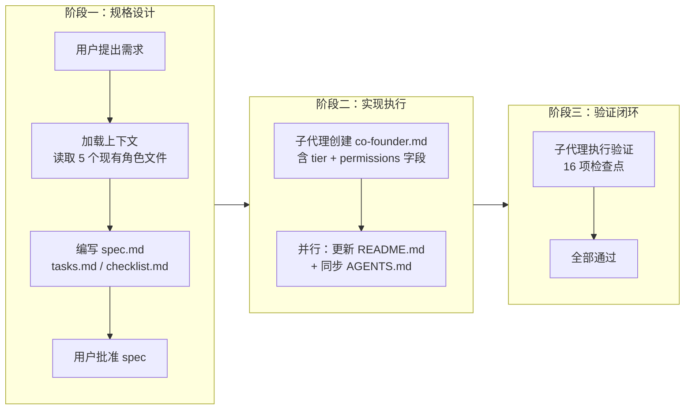
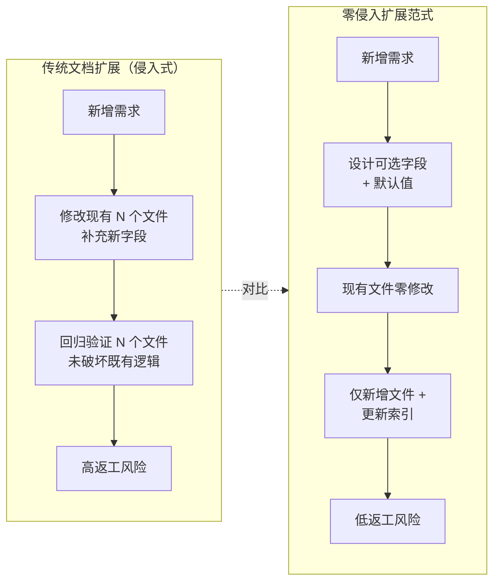
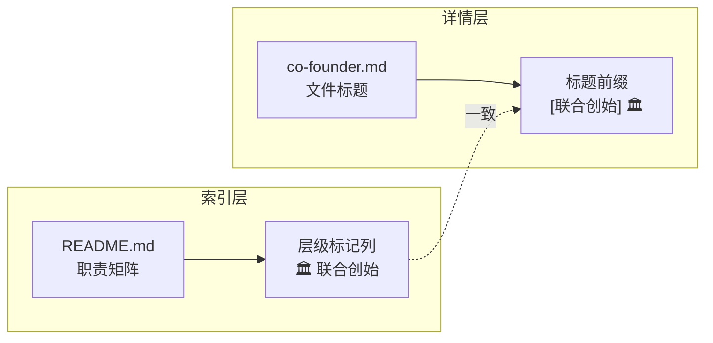

# 联合创始角色特殊标记 — 项目复盘分析报告

> **项目名称**：联合创始角色特殊标记
> **复盘日期**：2026-06-23
> **项目周期**：单次交付（spec → 实现 → 验证全闭环）
> **报告类型**：项目结项复盘

***

## 一、项目概述

### 1.1 项目背景

项目 `.agents/roles` 角色管理模块中现有五个角色（orchestrator、architect、developer、reviewer、tester）采用同质化呈现，无法区分项目初创阶段的"联合创始"角色与普通角色。需要为联合创始角色引入特殊标记机制，在角色数据模型、索引清单与详情页面中保持一致的高辨识度视觉呈现，并通过权限声明约束其查看与管理范围。

### 1.2 项目目标

- 在角色数据模型（TOML frontmatter）中新增 `tier` 标识字段与 `[permissions]` 权限表
- 新增联合创始角色定义文件 `co-founder.md`
- 在 `README.md` 角色职责矩阵中新增"层级标记"列与视觉徽章（🏛️）
- 在角色详情文件标题中应用统一文字前缀 `[联合创始] 🏛️`
- 在 `README.md` 中补充权限控制说明章节
- 同步 `AGENTS.md` 角色定义索引表

### 1.3 交付物清单

| 类别 | 文件 | 说明 |
|------|------|------|
| 规格文档 | `.trae/specs/add-cofounder-role-marker/spec.md` | 任务规格说明 |
| 任务清单 | `.trae/specs/add-cofounder-role-marker/tasks.md` | 主任务 5 项 + 子任务 12 项 |
| 检查清单 | `.trae/specs/add-cofounder-role-marker/checklist.md` | 验证检查项 16 项 |
| 角色文件 | `.agents/roles/co-founder.md` | 新建联合创始角色定义 |
| 索引更新 | `.agents/roles/README.md` | 新增层级标记列、联合创始行、权限控制章节 |
| 全局契约 | `AGENTS.md` | 角色定义索引表追加联合创始角色行 |
| 复盘报告 | `docs/retrospective/reports/retrospective-report-cofounder-role-marker.md` | 本报告 |
| **合计** | **7 个文件** | 3 新建 + 4 修改 |

***

## 二、复盘环节

### 2.1 实施过程回顾

### 2.2 关键节点分析

#### 决策 1：`tier` 字段采用可选枚举而非布尔值

**决策依据**：选择 `tier = "co-founder" / "standard"` 枚举字段而非 `co_founder = true` 布尔字段。枚举设计具备可扩展性，未来可支持更多角色层级（如 `core`、`contributor`）而无需修改字段结构。

**技术挑战**：需确保现有角色文件未声明 `tier` 时按默认值 `standard` 处理，实现向后兼容。

**解决方案**：在 spec 中明确"未声明时按 `standard` 默认值处理"，现有 5 个角色文件无需任何修改。

#### 决策 2：视觉标记采用"徽章 + 文字前缀"双要素

**决策依据**：单一标记手段（仅徽章或仅文字）在 Markdown 渲染环境中辨识度不足。采用 🏛️ 徽章 + `[联合创始]` 文字前缀双要素，确保在纯文本、Markdown 预览、终端渲染等多种环境下均可识别。

**技术挑战**：需在索引清单（表格单元格）与详情页（标题行）两处保持标记一致性。

**解决方案**：索引清单表格"层级标记"列显示 `🏛️ 联合创始`，详情页标题以 `# [联合创始] 🏛️` 起始，两处均包含徽章与文字，形成双点一致。

#### 决策 3：权限声明采用 frontmatter 元数据而非独立章节

**决策依据**：权限控制信息放在 TOML frontmatter `[permissions]` 表中，而非 Markdown 正文章节。决策依据是 frontmatter 是机器可读的结构化数据，便于未来工具脚本解析与校验。

**技术挑战**：需同时提供人类可读的权限说明。

**解决方案**：在 frontmatter 声明 `view` 与 `manage` 字段（机器可读），同时在 README.md 新增"权限控制"章节以表格形式呈现（人类可读），形成"元数据 + 文档说明"双层表达。

### 2.3 执行情况与结果数据

| 指标 | 数据 |
|------|------|
| 主任务数 | 5 |
| 子任务数 | 12 |
| 检查点数 | 16（全部通过） |
| 新建文件 | 3（spec.md、tasks.md、checklist.md、co-founder.md） |
| 修改文件 | 3（README.md、AGENTS.md、checklist.md） |
| 子代理调用 | 4 次（1 创建 + 2 并行更新 + 1 验证） |
| 并行执行 | Task 3 与 Task 4 并行 |
| frontmatter 新增字段 | 2（`tier`、`[permissions]` 表） |
| 视觉标记要素 | 2（🏛️ 徽章 + `[联合创始]` 文字前缀） |
| 链接校验 | 联合创始角色相关链接全部有效 |

### 2.4 成功经验

#### 2.4.1 Spec 一次批准即执行无返工

spec.md、tasks.md、checklist.md 三件套在批准后全程未修改，实现"一次设计、零返工执行"。这归功于加载上下文阶段完整读取了 5 个现有角色文件，充分理解了 frontmatter 结构与 Markdown 正文规范。

#### 2.4.2 并行子代理执行提升效率

Task 3（更新 README.md）与 Task 4（同步 AGENTS.md）无依赖关系，通过并行子代理同时执行，将串行 2 步压缩为并行 1 步。两个子代理均独立完成且无冲突。

#### 2.4.3 可选字段默认值实现零侵入扩展

`tier` 字段设为可选，默认值 `standard`，现有 5 个角色文件无需任何修改即向后兼容。新增字段对既有体系零侵入，这是文档型数据模型扩展的最佳实践。

#### 2.4.4 验证子代理独立校验保证质量

验证子代理独立读取所有相关文件，逐项校验 16 个检查点，并运行 check-links.py 脚本。验证过程与实现过程分离，确保校验客观性。

### 2.5 存在问题

#### 2.5.1 现有角色文件未补充 tier 声明

**问题**：现有 5 个角色文件未显式声明 `tier = "standard"`，依赖默认值机制。

**根因**：spec 中将 `standard` 设为可省略的默认值，遵循"最小改动"原则未要求现有文件补充声明。

**影响**：数据一致性上存在"显式声明"与"隐式默认"两种表达方式。未来若工具脚本解析 `tier` 字段，需处理未声明情况。

#### 2.5.2 权限控制为声明式而非执行式

**问题**：`[permissions]` 表仅声明权限边界，无运行时强制执行机制。

**根因**：文档型角色管理系统无运行时环境，权限控制只能通过元数据声明 + 人工遵循实现。

**影响**：权限控制目前依赖协作者自觉遵循，缺乏技术强制力。

#### 2.5.3 视觉标记在非 Markdown 渲染环境下可能丢失

**问题**：🏛️ 徽章 emoji 在部分终端或纯文本编辑器中可能显示为方框或乱码。

**根因**：emoji 渲染依赖环境字体支持，无法在所有环境中保证一致呈现。

**影响**：在不支持 emoji 的环境中，视觉标记退化为仅 `[联合创始]` 文字前缀，辨识度下降但仍可识别。

***

## 三、洞察环节

### 3.1 关键发现

#### 发现 1：文档型数据模型的"零侵入扩展"范式

**支撑事实**：通过引入可选字段 `tier`（默认值 `standard`）与可选表 `[permissions]`，现有 5 个角色文件零修改即实现向后兼容。新增联合创始角色仅需创建 1 个新文件 + 更新 2 个索引文件。

**深层含义**：文档型数据模型（TOML frontmatter + Markdown）的扩展应遵循"可选字段 + 默认值"范式。这与关系型数据库的 `ALTER TABLE ADD COLUMN ... DEFAULT` 机制异曲同工，但更轻量——无需迁移脚本，无需停机。这一范式可推广至任何基于 frontmatter 的文档体系扩展。

#### 发现 2：视觉标记的"双点一致"原则

**支撑事实**：联合创始角色标记在索引清单（README.md 表格"层级标记"列）与详情页（co-founder.md 标题）两处保持一致，均包含 🏛️ 徽章与"联合创始"文字。用户无论从索引浏览还是直接打开详情，均能立即识别角色层级。

**深层含义**：视觉标记的一致性不应依赖单一呈现点。在文档体系中，"索引"与"详情"是用户接触信息的两个主要入口，标记必须在两处同时存在且保持一致。这是"双点一致"原则——任何角色标识都应在索引层与详情层双重呈现，避免"仅在详情页标记"导致的索引层辨识盲区。

#### 发现 3：权限控制的"声明即治理"模式

**支撑事实**：`[permissions]` 表通过 `view = "core-team"` 与 `manage = "co-founders"` 声明权限边界，README.md"权限控制"章节以表格形式人类可读地呈现同一信息。权限治理通过"元数据声明 + 文档说明"双层表达实现。

**深层含义**：在无运行时环境的文档系统中，权限控制的本质是"声明即治理"——通过结构化元数据声明权限边界，配合人工流程遵循。这与代码系统中的 RBAC（基于角色的访问控制）在理念上一致，但实现形态从"运行时拦截"转变为"声明式约束 + 流程遵循"。这一模式适用于任何文档型管理系统的权限设计。

#### 发现 4：Spec-driven 闭环的"上下文加载"前置价值

**支撑事实**：在编写 spec 前，完整读取了 5 个现有角色文件（README.md、orchestrator.md、architect.md、developer.md、tester.md），充分理解了 frontmatter 结构、正文三段式规范与索引表格格式。这一前置上下文加载使 spec 一次批准即执行无返工。

**深层含义**：Spec-driven 开发的效率瓶颈往往不在 spec 编写本身，而在上下文加载的充分性。充分理解现有体系后编写的 spec，其执行返工率趋近于零。这是"磨刀不误砍柴工"在 spec-driven 开发中的具体体现——上下文加载投入与执行返工成本呈反比。

### 3.2 规律认知

**文档型数据模型扩展的"侵入式 vs 零侵入"曲线**：传统侵入式扩展中，每次新增字段需修改所有现有文件并回归验证，成本随文件数线性增长（O(n)）。零侵入扩展范式中，通过"可选字段 + 默认值"设计，现有文件零修改，扩展成本恒定为"新增文件 + 更新索引"（O(1)）。当文件数超过 3 个时，零侵入范式的总成本显著低于侵入式扩展。

### 3.3 潜在机会

- **`tier` 字段可扩展为多层级角色体系**：当前仅 `co-founder` 与 `standard` 两级，未来可扩展 `core`（核心）、`contributor`（贡献者）等层级，形成完整的角色层级体系
- **`[permissions]` 表可萃取为权限声明标准模式**：`view` + `manage` 双字段结构可复用于任何需要权限声明的文档型管理对象
- **视觉标记方案可模板化**：🏛️ 徽章 + `[文字前缀]` 的双要素标记方案可萃取为角色标记模板，供未来新增特殊角色复用
- **权限声明可接入校验工具**：未来可开发脚本自动校验 `[permissions]` 表的完整性与一致性，实现"声明即校验"

***

## 四、导出环节

### 4.1 改进建议

| 问题 | 改进措施 | 优先级 | 预期效果 | 状态 |
|------|---------|--------|---------|------|
| 现有角色文件未补充 tier 声明 | 为现有 5 个角色文件显式补充 `tier = "standard"` 声明 | 低 | 提升数据一致性，消除隐式默认 | 已完成 |
| 权限控制为声明式而非执行式 | 开发 frontmatter 权限校验脚本，自动检查 `[permissions]` 表完整性 | 中 | 实现"声明即校验"，增强权限治理技术力 | 已完成 |
| emoji 在部分环境可能丢失 | 在权限控制章节补充文字说明，明确联合创始角色标识不依赖 emoji 单一呈现 | 低 | 确保非 emoji 环境下标记仍可识别 | 已完成 |

### 4.2 行动计划

| 优先级 | 改进项 | 具体措施 | 建议时间 | 状态 |
|--------|--------|---------|---------|------|
| 中 | 权限声明校验脚本 | 在 `.agents/scripts/` 下开发脚本，校验所有角色文件 `[permissions]` 表的 view/manage 字段完整性 | 2026-07-15 | 已完成 |
| 低 | 现有角色文件补充 tier 声明 | 为 5 个现有角色文件 frontmatter 补充 `tier = "standard"` 显式声明 | 2026-07-30 | 已完成 |
| 低 | 角色标记模板化 | 在 `docs/retrospective/templates/` 下创建角色视觉标记设计模板 | 2026-07-30 | 已完成 |

### 4.3 后续优化方向

- **构建完整角色层级体系**：基于 `tier` 字段扩展多层级角色分类，配合不同视觉标记（徽章 + 颜色 + 前缀）形成完整体系
- **权限声明接入校验工具链**：将 `[permissions]` 表校验纳入 CI 综合检查（ci-check.ps1 / ci-check.sh），实现权限声明完整性自动化保障
- **角色标记方案模板化**：将"徽章 + 文字前缀"双要素标记方案萃取为可复用模板，供未来新增特殊角色快速应用

***

## 五、知识萃取

### 模式 1：文档型数据模型零侵入扩展范式

- **模式名称**：文档型数据模型零侵入扩展范式（可选字段 + 默认值）
- **结构**：

| 要素 | 设计原则 | 作用 |
|------|---------|------|
| 新增字段 | 可选声明，不强制现有文件修改 | 实现向后兼容 |
| 默认值 | 现有未声明文件按默认值处理 | 消除隐式空值风险 |
| 索引更新 | 仅新增条目，不修改现有条目 | 保持索引稳定性 |
| 新增文件 | 独立文件承载新对象 | 零侵入既有文件 |

- **适用场景**：任何基于 frontmatter（TOML/YAML）的文档体系扩展，包括角色管理、配置管理、元数据管理
- **复用方式**：设计新字段时设为可选并提供默认值，现有文件零修改，仅新增文件与更新索引
- **来源**：本次联合创始角色 `tier` 字段与 `[permissions]` 表设计
- **关联模块**：`concepts/zero-dependency-principle.md`（零依赖原则的延伸应用）

### 模式 2：视觉标记双点一致原则

- **模式名称**：视觉标记双点一致原则（索引层 + 详情层）
- **结构**：

- **适用场景**：任何需要在索引与详情两处呈现的视觉标识，包括角色标记、状态标记、优先级标记
- **复用方式**：在索引表格与详情标题两处同时应用标记，确保双点一致
- **来源**：本次联合创始角色视觉标记设计（README.md 矩阵 + co-founder.md 标题）
- **关联模块**：`patterns/architecture-patterns/perception-check-report-model.md`（多层呈现的延伸）

### 模式 3：声明式权限治理模式

- **模式名称**：声明式权限治理模式（元数据声明 + 文档说明双层表达）
- **结构**：

| 层次 | 载体 | 受众 | 作用 |
|------|------|------|------|
| 元数据层 | TOML frontmatter `[permissions]` 表 | 机器/工具脚本 | 结构化声明权限边界 |
| 文档层 | README.md 权限控制章节 | 人类协作者 | 可读化呈现权限要求 |

- **适用场景**：任何无运行时环境的文档型管理系统的权限设计，包括角色权限、文档访问控制、配置管理权限
- **复用方式**：在 frontmatter 声明 `view` 与 `manage` 字段，在 README 以表格形式呈现同一信息
- **来源**：本次联合创始角色 `[permissions]` 表与 README.md 权限控制章节设计
- **关联模块**：`concepts/meta-document.md`（元文档概念的权限应用）

***

> **报告编制**：本文档基于项目全生命周期数据综合编制，所有数据均有事实依据支撑。报告采用 Markdown 格式编写，遵循"事实 → 分析 → 洞察 → 建议"的逻辑结构，确保复盘结论可追溯、改进建议可执行。
>---

> **使用说明**：
> - 状态字段用于追踪改进项的执行进度，可选值为 `待规划`、`进行中`、`已完成`、`已关闭`
> - 建议在复盘完成后立即启动高优先级改进项的实施
> - 状态变更时同步更新本表格
