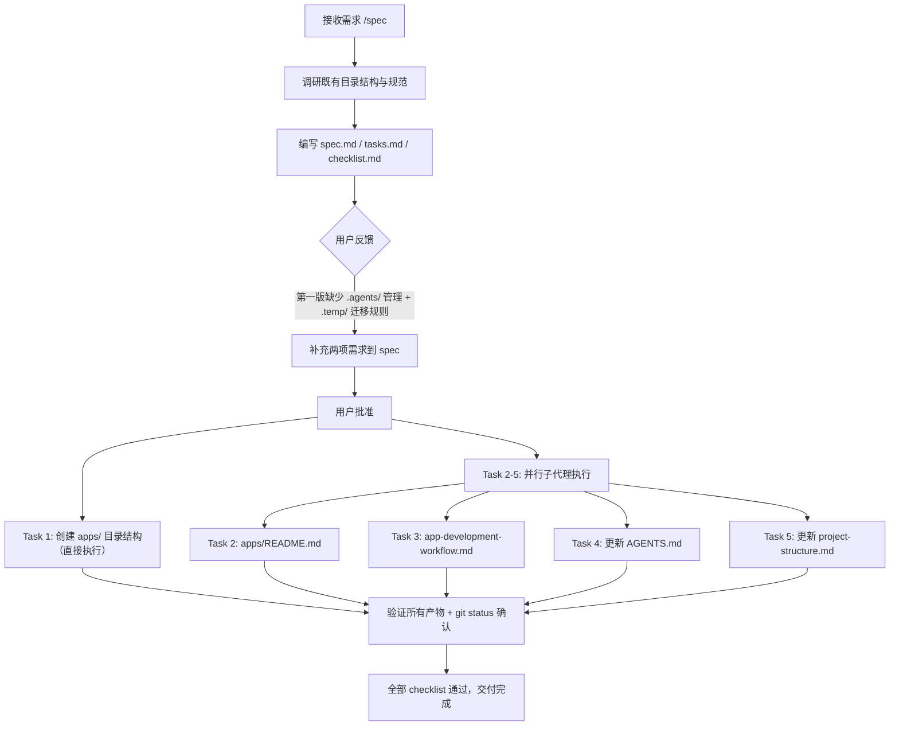
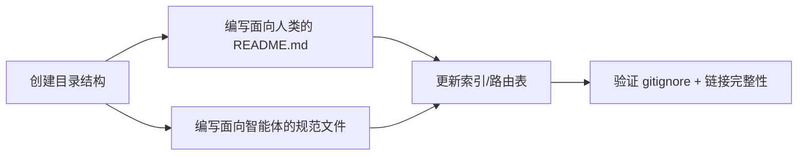
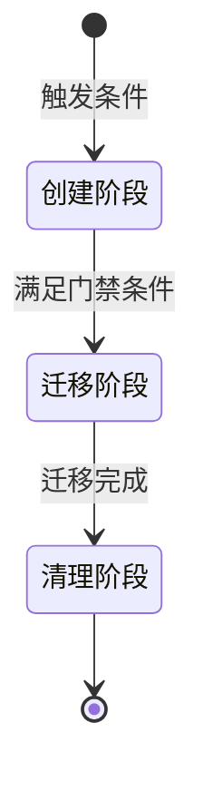

# apps/ 应用开发工作空间创建 — 项目复盘分析报告

> **项目名称**：创建 apps/ 应用开发工作空间（create-apps-directory）
> **复盘日期**：2026-06-23
> **项目周期**：单会话完成（Spec → Implementation → Verification）
> **报告类型**：项目结项复盘 + 洞察萃取
> **关联模块**：`docs/retrospective/reports/retrospective-report-teams-module.md`、`docs/retrospective/patterns/methodology-patterns/review-insight-export-loop.md`

---

## 一、项目概述

### 1.1 项目背景

项目现有的顶级目录（`.agents/`、`docs/`、`prompt_extraction/`、`vendor/`、`.temp/`）各有其专有用途，缺乏一个专门用于开发新应用的独立工作空间。用户要求规划并创建 `apps/` 目录，确保其符合项目既有目录结构规范，具备清晰的层级划分，并为后续新应用开发提供必要的基础环境支持。

用户在第一版规格反馈中提出两项关键补充：(1) `.agents/` 也需要添加对 `apps/` 的管理规范；(2) 新应用须先在 `.temp/` 暂存区开发，再逐步迁移至 `apps/`。

### 1.2 项目目标

1. 在项目根目录下创建 `apps/` 目录作为新应用开发专用工作空间
2. 建立 `apps/shared/` 共享模块子目录
3. 编写 `apps/README.md` 说明使用规范与迁移流程
4. 在 `.agents/protocols/` 下创建 `app-development-workflow.md` 生命周期协议
5. 更新 `AGENTS.md` 上下文路由表与协作协议概要
6. 更新 `docs/project-structure.md` 目录树与职责表格
7. 确保 `apps/` 未被 `.gitignore` 忽略，可纳入版本控制

### 1.3 交付物清单

| 类别 | 文件 | 说明 |
|---|---|---|
| 新增 | `apps/` | 应用开发工作空间根目录 |
| 新增 | `apps/shared/.gitkeep` | 保证空目录被 Git 追踪 |
| 新增 | `apps/README.md` | 目录使用说明（5 节完整内容） |
| 新增 | `.agents/protocols/app-development-workflow.md` | 应用开发生命周期规范（含 Mermaid 状态图 + 流程图） |
| 修改 | `AGENTS.md` | 协作协议概要 + 上下文路由表各新增 1 行 |
| 修改 | `docs/project-structure.md` | 目录树 + 职责说明表格各新增 1 条目 |

**统计**：新增 4 个文件（含目录），修改 2 个文件，共计 6 个文件变更。

---

## 二、复盘环节

### 2.1 实施过程回顾

**时间线**：

| 阶段 | 动作 | 产出 |
|---|---|---|
| 调研 | 读取 project-structure.md、.gitignore、AGENTS.md、dependency-management.md | 理解既有目录命约、gitignore 规则、AGENTS.md 路由表结构、.temp/ 管理规范 |
| 规格设计（初版） | 编写 spec.md + tasks.md + checklist.md | 3 个 spec 文件 |
| 规格修订 | 根据用户反馈新增 .agents/ 管理 + .temp/ → apps/ 迁移规则 | spec 增加 2 项需求，tasks 从 3 个增至 5 个 |
| 实现 | 1 次直接目录创建 + 4 个并行子代理 | 6 个文件变更全部完成 |
| 验证 | 逐项检查 checklist 11 条 + git status 确认 | 全部通过 |

### 2.2 关键节点分析

#### 关键决策 1：app-development-workflow 的定位选择

- **决策依据**：用户要求 `.agents/` 中也需要添加对 `apps/` 的管理，同时约束"先在 `.temp/` 开发，逐步迁移到 `apps/`"。这本质上是一个**开发流程规范**。
- **技术挑战**：应将新文件放在 `worlds/environments/`（环境管理）、`protocols/`（协作协议）还是 `workflows/`（标准工作流）？
- **解决方案**：选择 `protocols/`。理由——(1) 既有的 `dependency-management.md` 也位于 `protocols/`，新协议与其存在强引用关系，放在同一目录利于互指；(2) 它定义的是跨角色协作规则（developer → tester → reviewer → orchestrator），比 `workflows/` 的单流程更具协议性；(3) `worlds/environments/` 侧重运行时环境，而本协议侧重开发生命周期的阶段转移。

#### 关键决策 2：用户反馈驱动的规格增量演进

- **决策依据**：初版 spec 仅覆盖目录创建与文档更新，用户补充了 `.agents/` 管理与 `.temp/` → `apps/` 迁移规则两项核心需求。
- **技术挑战**：增量式追加需求而非推翻重来，需确保新增需求与既有需求无冲突。
- **解决方案**：在 spec 中新增两项 ADDED Requirement（而非 MODIFIED），在 tasks 中新增 Task 3 和 Task 4，保持 Task 1、Task 2、Task 5 不变。这体现了**增量扩展优于全量重写**的原则。

#### 关键决策 3：并行子代理执行策略

- **决策依据**：Task 2-5 之间无依赖关系，可并行执行。
- **技术挑战**：Task 4 和 Task 5 均需修改现有文件（AGENTS.md 和 project-structure.md），但操作的是不同文件，不存在竞态。
- **解决方案**：Task 1 直接执行（mkdir + .gitkeep），Task 2-5 分别使用 4 个独立子代理并行执行。Task 4 和 Task 5 各自使用 SearchReplace 精确替换，互不干扰。

### 2.3 执行情况与结果数据

| 指标 | 数值 | 说明 |
|---|---|---|
| 新增文件数 | 4 | apps/、shared/.gitkeep、README.md、app-development-workflow.md |
| 修改文件数 | 2 | AGENTS.md、project-structure.md |
| 总文件变更 | 6 | 含目录创建 |
| 子代理调用次数 | 4 | 全部并行执行，零失败 |
| Spec 迭代次数 | 2 | 初版 → 修订版 |
| Checklist 通过率 | 100% (11/11) | 全部验收通过 |
| Mermaid 图表数 | 2 | 状态图 + 流程图（均在 app-development-workflow.md 中） |

### 2.4 成功经验

1. **Spec 先行，增量修正**：先出完整 spec 再请求批准，批准前的用户反馈仅需增量追加需求项，避免了推倒重来的浪费。这与项目既有的 Spec-driven 开发方法论一致。

2. **协议就近原则**：将 `app-development-workflow.md` 放在 `protocols/` 而非 `workflows/`，理由是它与 `dependency-management.md` 存在互引用关系，同目录利于维护。这体现了"相关性高于分类纯粹性"的务实策略。

3. **并行子代理最大化效率**：4 个独立任务并行分发给子代理，在同一轮工具调用中完成全部工作，显著缩短了实现阶段的整体耗时。

4. **协议与 README 双轨说明**：`apps/README.md` 面向人类读者提供概要说明，`app-development-workflow.md` 面向 AI 智能体提供详细规范——两者各司其职，符合项目"文档边界分离"原则。

### 2.5 存在问题

| 问题 | 根因分析 | 影响评估 |
|---|---|---|
| 初版 spec 未覆盖 `.agents/` 管理需求 | 对用户"在项目根目录下规划并创建"的表述理解过于字面化，未主动联想到 `.agents/` 治理体系需要同步扩展 | 导致一轮反馈修正，增加约 1 个回合的交互成本。影响可控，因为 spec 修正仅涉及增量追加，未影响已有设计 |

---

## 三、洞察环节

### 3.1 关键发现

#### 发现 1："暂存→正式"双区开发模式具有通用性

本项目引入的 `.temp/` → `apps/` 迁移规则并非孤立设计——它与 `dependency-management.md` 中 `.temp/` 作为中间产物暂存区的定位一脉相承。将这种模式抽象化后，可得到一种通用的"双区开发模型"：**非正式工作区（高熵、允许快速迭代）+ 正式工作区（低熵、受规范严格约束）**。这种模式不仅适用于应用开发，也可推广到文档编写、配置管理等领域。

#### 发现 2：新协议与既有协议的"继承+专项化"关系模式

`app-development-workflow.md` 并非独立存在，它通过显式引用 `dependency-management.md` 建立了"通用章程 → 专项规则"的继承关系。这种模式的价值在于：(1) 避免规则重复定义；(2) 当通用章程变更时，专项规则自动感知（通过引用链）；(3) 降低认知负担——智能体只需在特定场景下加载专项规则，通用场景下仍使用通用章程。

#### 发现 3：路由表采用"追加式"更新无破坏性

`AGENTS.md` 的上下文路由表和协作协议概要均采用**在末尾追加新行**的更新方式，而非插入或重排序。这种方式最大程度降低了修改 `AGENTS.md` 的风险——无需重新计算行号偏移，不破坏已有条目的引用完整性。

### 3.2 规律认知

#### 方法论 1：目录创建的"三件套"模式

当项目中新增一个顶级目录时，可遵循"三件套"模式：
1. **物理创建**：目录 + 必要的子目录 + .gitkeep
2. **双层文档**：面向人类的 README.md + 面向智能体的 .agents/ 规范
3. **索引同步**：更新 project-structure.md + AGENTS.md 路由表

此模式在此次任务中验证有效，已在 `teams/` 模块创建中也有类似体现。

#### 方法论 2：生命周期协议的"三阶段"标准结构

`app-development-workflow.md` 的生命周期定义可抽象为通用模板：

其中每个阶段包含：
- **进入条件**（明确的准入标准）
- **执行规范**（目录结构、操作步骤、参与角色）
- **退出标准**（验证方式、负责角色）
- 阶段之间通过**门禁条件**（必须全部满足的检查项）连接

此结构可复用于任何需要阶段性生命周期管理的场景（如文档审批流程、代码审查流程、部署流水线）。

### 3.3 潜在机会

| 机会 | 描述 | 可行性 |
|---|---|---|
| 双区开发模式推广 | 将 `.temp/` → `正式区` 模式推广到文档编写、配置管理等领域，形成项目级的"非正式→正式"工作流框架 | 高——既有 .temp/ 已用于多种场景 |
| 生命周期协议模板化 | 提炼 `app-development-workflow.md` 的"三阶段+门禁"结构为通用模板，供后续新协议快速复用 | 高——结构清晰，适合模板化 |
| 路由表追加式更新规范化 | 将"AGENTS.md 路由表更新一律在末尾追加"固化为开发规范，降低索引文件修改风险 | 中——需要更多案例验证 |

---

## 四、导出环节

### 4.1 改进建议

| 问题 | 改进措施 | 优先级 | 预期效果 | 状态 |
|------|---------|--------|---------|------|
| 初版 spec 未主动覆盖 `.agents/` 治理扩展 | 在 spec 设计阶段增加"关联系统影响分析"检查项——当创建新的项目实体（目录、模块、角色）时，强制检查是否需要同步更新 AGENTS.md、.agents/ 规范与项目结构文档 | 中 | 减少因遗漏关联更新导致的迭代轮次 | 已完成 |
| 生命周期协议缺乏"回退"路径 | 在 `app-development-workflow.md` 中补充异常处理流程——当迁移后验证失败时，是否回退到暂存区重新开发，还是原地修复 | 低 | 提升协议的健壮性和可操作性 | 已完成 |

### 4.2 行动计划

| 优先级 | 改进项 | 具体措施 | 建议时间 | 状态 |
|--------|--------|---------|---------|------|
| 高 | 萃取双区开发模式为可复用方法论 | 创建 `docs/retrospective/patterns/methodology-patterns/dual-zone-development-model.md` | 2026-06-23 | 已完成 |
| 高 | 萃取生命周期协议三阶段结构为可复用模式 | 创建 `docs/retrospective/patterns/architecture-patterns/lifecycle-protocol-three-phase.md` | 2026-06-23 | 已完成 |
| 中 | 更新资产清单 | 将新报告与新模式注册到 `docs/retrospective/assets/asset-inventory.md` | 2026-06-23 | 已完成 |
| 中 | 关联系统影响分析检查项 | 在 spec 设计阶段模板中增加"关联系统影响分析"，或作为 checklist 默认项 | 2026-06-23 | 已完成 |
| 低 | 补充回退流程到 app-development-workflow.md | 在生命周期协议中新增异常处理章节 | 2026-06-23 | 已完成 |

### 4.3 后续优化方向

1. **双区开发模型深化**：观察后续应用在 `.temp/` → `apps/` 迁移过程中的实际痛点，验证当前门禁条件（功能稳定、测试通过、审查完成、文档完善）是否足够，是否需要增加更细粒度的检查项。

2. **生命周期协议模板化**：在积累 2-3 个生命周期类协议后，提炼通用模板到 `docs/retrospective/templates/` 目录。

3. **路由表更新自动化**：当项目规模继续增长、`AGENTS.md` 路由条目超过 30 条时，考虑开发自动化脚本来验证路由表完整性（类似 `check-links.py`），而非完全依赖人工追加。

---

> **报告编制**：本文档基于 create-apps-directory 项目的完整实施数据编制，遵循"事实 → 分析 → 洞察 → 建议"的逻辑结构。所有数据均有事实依据支撑，复盘结论可追溯，改进建议可执行。
>
> **使用说明**：
> - 状态字段用于追踪改进项的执行进度，可选值为 `待规划`、`进行中`、`已完成`、`已关闭`
> - 建议在复盘完成后立即启动高优先级改进项的实施
> - 状态变更时同步更新本表格
