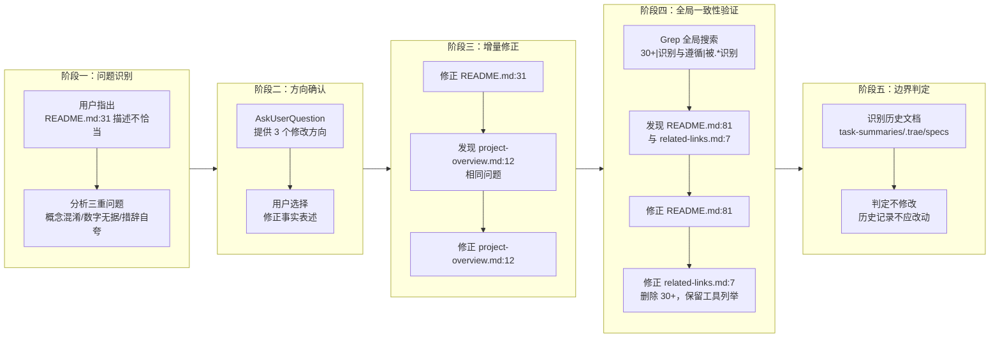
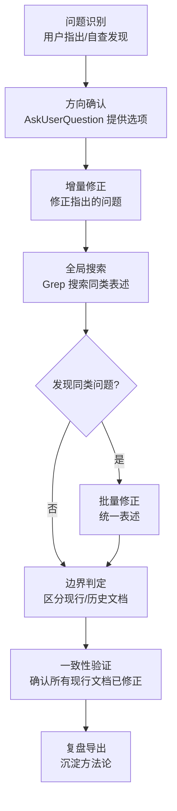
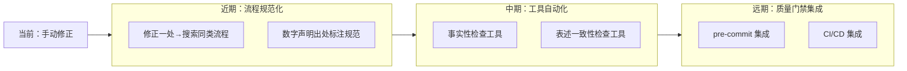

# 事实表述修正 — 项目复盘分析报告

> **项目名称**：事实表述修正（README.md 及关联文档）
> **复盘日期**：2026-06-23
> **项目周期**：单次交付（问题识别 → 方向确认 → 增量修正 → 全局一致性验证）
> **报告类型**：项目结项复盘

***

## 一、项目概述

### 1.1 项目背景

项目根目录的 `README.md` 第 31 行存在事实性偏差的描述：

> 本体系已被 OpenAI Codex、Cursor、GitHub Copilot 等 30+ AI 编码工具识别与遵循，通过单一入口路由与按需加载机制，让多智能体协作具备一致的上下文与质量基线。

该描述存在三重问题：

- **概念混淆**：将"基于 AGENTS.md 开放标准构建"等同于"被工具识别与遵循"。被工具识别与遵循的是 `AGENTS.md` 标准本身，而非本项目自己的规范体系。
- **数字无据**："30+ AI 编码工具"这一数字无明确出处，属于营销式夸大，不符合技术文档的客观性要求。
- **措辞自夸**："识别与遵循"语气过于绝对，与项目作为"规范体系"而非"行业事实标准"的实际定位不符。

### 1.2 项目目标

修正面向读者的现行文档中所有不恰当的事实表述，统一为客观准确的"基于 AGENTS.md 开放标准构建"的表述，同时保留对标准被工具支持的事实描述。

### 1.3 交付物清单

| 类别 | 文件 | 修改内容 |
|------|------|---------|
| 入口文档 | `README.md:31` | "被...30+ 工具识别与遵循" → "基于 AGENTS.md 开放标准构建" |
| 入口文档 | `README.md:81` | "被...30+ 工具识别遵循" → "基于 AGENTS.md 开放标准，可被支持该标准的工具加载" |
| 核心文档 | `docs/project-overview.md:12` | "被...30+ 工具识别与遵循" → "基于 AGENTS.md 开放标准构建" |
| 关联文档 | `docs/related-links.md:7` | 删除"30+"无依据数字，保留工具列举（属事实描述） |
| 复盘报告 | `docs/retrospective/reports/retrospective-report-fact-statement-correction.md` | 本报告 |
| **合计** | **5 个文件** | 4 处修正 + 1 份复盘 |

***

## 二、复盘环节

### 2.1 实施过程回顾

### 2.2 关键节点分析

#### 决策 1：修改方向 — 三选一

**决策依据**：通过 AskUserQuestion 提供三个方向：

| 方案 | 内容 | 优势 | 劣势 |
|------|------|------|------|
| 修正事实表述 | 改为"基于标准构建"，删除"30+" | 保留核心说明，客观准确 | 需重新组织语句 |
| 删除该句 | 仅保留"通过单一入口路由..." | 最简洁 | 丢失"基于标准"的信息 |
| 改写为标准遵循 | 明确区分"标准本身"与"本项目体系" | 表述最精确 | 措辞较长 |

用户选择"修正事实表述"，核心依据是：既保留项目定位说明，又删除无依据数字与夸大措辞，平衡了准确性与可读性。

#### 决策 2：一致性检查范围 — Grep 全局搜索

**决策依据**：修正 README.md:31 与 project-overview.md:12 后，发现两处描述存在相同问题。为避免遗漏，使用 Grep 全局搜索关键词 `30\+.*(工具|AI 编码)|识别与遵循|被.*识别`，覆盖整个项目。

搜索结果发现 29 处匹配，经分析归类为三类：

| 类别 | 数量 | 处理方式 |
|------|------|---------|
| 现行文档（需修正） | 4 处 | 已全部修正 |
| 历史文档（不修改） | 2 类 | task-summaries、.trae/specs |
| 无关匹配（正常表述） | 23 处 | 测试用例、协议文档等，无需修改 |

#### 决策 3：历史文档边界 — 不修改

**决策依据**：`docs/task-summaries/task-summary-readme-creation-20260623.md:436` 与 `.trae/specs/optimize-readme-with-blueprint/` 下的文档属于历史任务记录，记录的是当时的工作过程与成果。修改历史记录会破坏其作为"时间快照"的价值，违背文档的时效性原则。

#### 决策 4：related-links.md 的处理 — 删除数字，保留列举

**决策依据**：`docs/related-links.md:7` 描述的是 AGENTS.md 标准本身被工具支持：

> AGENTS.md 开放标准 — 社区驱动的 AI 指令标准，被 OpenAI Codex、Cursor、GitHub Copilot 等 30+ 工具原生支持

这里"被工具支持"是事实描述（这些工具确实支持 AGENTS.md 标准），但"30+"数字缺乏明确出处。因此删除"30+"，保留工具列举，既保证事实准确，又避免无据数字。

### 2.3 执行情况与结果数据

| 指标 | 数值 |
|------|------|
| 修正文件数 | 4 个 |
| 修正描述数 | 4 处 |
| 全局搜索匹配数 | 29 处 |
| 需修正数 | 4 处 |
| 历史文档保留数 | 2 类 |
| 无关匹配数 | 23 处 |
| 交互轮次 | 2 轮（方向确认 + related-links 确认） |
| 子代理调用 | 0 次（单代理完成） |

### 2.4 成功经验

1. **AskUserQuestion 前置分析**：在询问用户前，先分析出三重问题（概念混淆、数字无据、措辞自夸），并给出三个可选方案，让用户在明确选项的基础上决策，避免开放式讨论的低效。

   **支撑事实**：用户直接选择"修正事实表述"，无额外澄清往返。

2. **增量修正后立即全局搜索**：修正两处后发现相同问题，立即使用 Grep 全局搜索关键词，避免遗漏。这是"修正一处 → 搜索同类"模式的成功实践。

   **支撑事实**：Grep 搜索发现 README.md:81 与 related-links.md:7 两处遗漏，均已修正。

3. **历史文档与现行文档的边界判定**：明确区分"面向读者的现行文档"与"历史任务记录"，对前者修正，对后者保留。

   **支撑事实**：task-summaries 与 .trae/specs 下的历史文档未被修改，保持了时间快照的完整性。

### 2.5 存在问题

1. **问题：初始修正未覆盖全局**

   **根因分析**：首次修正仅针对用户指出的 README.md:31，未主动检查项目中是否存在同类问题。直到修正 project-overview.md:12 时才意识到需要全局搜索。

   **影响评估**：若未进行全局搜索，README.md:81 与 related-links.md:7 的不恰当表述将遗留，破坏文档一致性。

2. **问题：原始描述的来源未追溯**

   **根因分析**：本次修正针对的是"30+ 工具识别遵循"这一表述，但未追溯该表述最初是何时、由哪个任务引入的。从历史文档看，该表述源自 `optimize-readme-with-blueprint` 任务，但本次未深入分析该任务为何采用此表述。

   **影响评估**：无法判断该表述是"有意夸大"还是"参考了某数据源但未标注出处"，影响根因判断的完整性。

***

## 三、洞察环节

### 3.1 关键发现

1. **技术文档的事实性是不可妥协的底线**

   **支撑事实**：本次修正的 4 处描述中，"30+"数字均无明确出处，"被工具识别与遵循"均存在概念混淆。技术文档与营销文档的本质区别在于：技术文档的每个事实陈述都必须可追溯、可验证。

   **深层含义**：文档质量不仅是"无错别字、链接有效"，更是"事实准确、措辞客观"。文档质量检查应包含事实性验证维度。

2. **"修正一处 → 搜索同类"是文档一致性的核心保障**

   **支撑事实**：本次修正中，用户仅指出 1 处问题，但实际存在 4 处同类问题。通过 Grep 全局搜索，才发现并修正了其余 3 处。

   **深层含义**：文档中的表述往往不是孤立的，同一表述会在多处复用。修正任何一处表述后，必须全局搜索同类问题，否则会破坏一致性。

3. **"基于标准构建"与"被工具识别遵循"是本质不同的概念**

   **支撑事实**：本项目是"基于 AGENTS.md 开放标准构建"的自有规范体系，而被工具识别与遵循的是 AGENTS.md 标准本身。两者是"实现"与"被实现"的关系，不可混为一谈。

   **深层含义**：在描述项目定位时，必须明确区分"项目自身"与"项目所基于的标准"，避免将标准的属性误归为项目的属性。

4. **历史文档是时间快照，不应追溯修改**

   **支撑事实**：task-summaries 与 .trae/specs 下的文档记录的是当时的工作过程与成果，即使其中包含现在看来不恰当的表述，也不应修改。

   **深层含义**：历史文档的价值在于"真实记录当时的状态"，而非"保持与现行文档一致"。修改历史文档会破坏其作为时间快照的参考价值。

### 3.2 规律认知

提炼通用方法论：**事实表述一致性闭环**

**核心要素**：

- **问题识别**：可以是用户指出，也可以是自查发现
- **方向确认**：提供明确选项，避免开放式讨论
- **增量修正**：先修正已识别的问题
- **全局搜索**：使用关键词搜索同类表述
- **边界判定**：区分现行文档（修正）与历史文档（保留）
- **一致性验证**：确认所有现行文档已统一

**适用场景**：任何涉及多处表述的文档修正任务，包括但不限于：事实性修正、命名规范统一、术语一致性调整。

### 3.3 潜在机会

1. **文档事实性检查工具**：可开发自动化工具，扫描文档中的数字声明（如"30+"、"100+"），检查是否有出处标注。

2. **表述一致性检查工具**：可扩展 check-links.py，增加"表述一致性检查"功能，扫描同一表述在不同文件中的用法是否一致。

3. **文档质量维度扩展**：现有文档质量检查主要关注"链接有效性"与"路径有效性"，可扩展"事实准确性"与"措辞客观性"维度。

***

## 四、导出环节

### 4.1 改进建议

| 问题 | 改进措施 | 优先级 | 预期效果 | 状态 |
|------|---------|--------|---------|------|
| 初始修正未覆盖全局 | 建立"修正一处 → 搜索同类"的标准流程 | 高 | 避免遗漏同类问题 | 待规划 |
| 原始描述来源未追溯 | 在引入数字声明时，要求标注出处 | 中 | 提高数字声明的可追溯性 | 待规划 |
| 文档事实性检查缺失 | 开发自动化工具扫描无据数字 | 中 | 自动识别无依据的数字声明 | 待规划 |
| 表述一致性检查缺失 | 扩展 check-links.py 增加表述一致性检查 | 低 | 自动识别不一致的表述 | 待规划 |

### 4.2 行动计划

| 优先级 | 改进项 | 具体措施 | 建议时间 | 状态 |
|--------|--------|---------|---------|------|
| 高 | 建立"修正一处 → 搜索同类"流程 | 在开发规范中增加文档修正的标准流程 | 2026-06-30 | 待规划 |
| 中 | 数字声明出处标注规范 | 在文档规范中要求数字声明必须标注出处 | 2026-07-07 | 待规划 |
| 中 | 文档事实性检查工具 | 开发扫描无据数字的自动化工具 | 2026-07-14 | 待规划 |
| 低 | 表述一致性检查工具 | 扩展 check-links.py | 2026-07-21 | 待规划 |

### 4.3 后续优化方向

**整合方向**：将文档事实性检查与表述一致性检查纳入现有的"三层治理模型"（原子化 → 自动化 → 验证），作为"验证"层的新维度，与链接检查、路径检查形成完整的文档质量保障体系。

***

> **报告编制**：本文档基于事实表述修正任务全过程数据编制，所有数据均有事实依据支撑。报告采用 Markdown 格式编写，遵循"事实 → 分析 → 洞察 → 建议"的逻辑结构，确保复盘结论可追溯、改进建议可执行。
>
> **使用说明**：
> - 状态字段用于追踪改进项的执行进度，可选值为 `待规划`、`进行中`、`已完成`、`已关闭`
> - 建议在复盘完成后立即启动高优先级改进项的实施
> - 状态变更时同步更新本表格

> **关联模块**：
> - `patterns/methodology-patterns/review-insight-export-loop.md` — 复盘→洞察→导出知识闭环
> - `patterns/methodology-patterns/three-tier-governance.md` — 三层治理模型
> - `templates/retrospective-report-template.md` — 复盘报告模板
