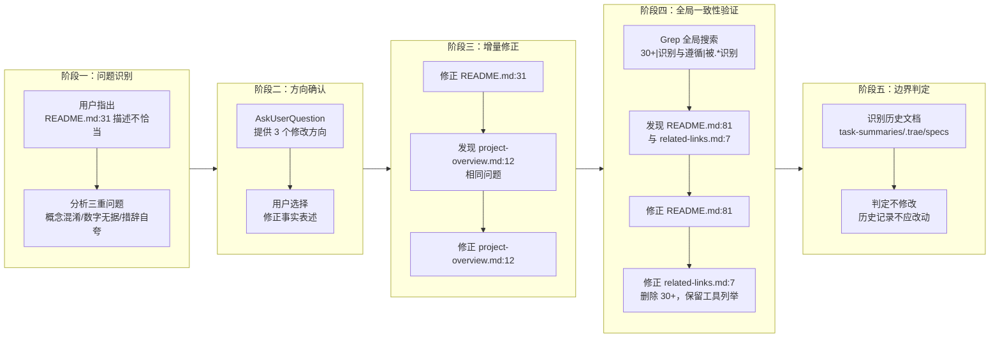

+++
id = "retrospective-report-fact-statement-correction-execution"
date = "2026-06-23"
type = "execution-retrospective"
source = "docs/retrospective/reports/retrospective-report-fact-statement-correction.md#二、复盘环节"
+++

# 执行复盘

## 2.1 实施过程回顾

## 2.2 关键节点分析

### 决策 1：修改方向 — 三选一

**决策依据**：通过 AskUserQuestion 提供三个方向：

| 方案 | 内容 | 优势 | 劣势 |
|------|------|------|------|
| 修正事实表述 | 改为"基于标准构建"，删除"30+" | 保留核心说明，客观准确 | 需重新组织语句 |
| 删除该句 | 仅保留"通过单一入口路由..." | 最简洁 | 丢失"基于标准"的信息 |
| 改写为标准遵循 | 明确区分"标准本身"与"本项目体系" | 表述最精确 | 措辞较长 |

用户选择"修正事实表述"，核心依据是：既保留项目定位说明，又删除无依据数字与夸大措辞，平衡了准确性与可读性。

### 决策 2：一致性检查范围 — Grep 全局搜索

**决策依据**：修正 README.md:31 与 project-overview.md:12 后，发现两处描述存在相同问题。为避免遗漏，使用 Grep 全局搜索关键词 `30\+.*(工具|AI 编码)|识别与遵循|被.*识别`，覆盖整个项目。

搜索结果发现 29 处匹配，经分析归类为三类：

| 类别 | 数量 | 处理方式 |
|------|------|---------|
| 现行文档（需修正） | 4 处 | 已全部修正 |
| 历史文档（不修改） | 2 类 | task-summaries、.trae/specs |
| 无关匹配（正常表述） | 23 处 | 测试用例、协议文档等，无需修改 |

### 决策 3：历史文档边界 — 不修改

**决策依据**：`docs/task-summaries/task-summary-readme-creation-20260623.md:436` 与 `.trae/specs/optimize-readme-with-blueprint/` 下的文档属于历史任务记录，记录的是当时的工作过程与成果。修改历史记录会破坏其作为"时间快照"的价值，违背文档的时效性原则。

### 决策 4：related-links.md 的处理 — 删除数字，保留列举

**决策依据**：`docs/related-links.md:7` 描述的是 AGENTS.md 标准本身被工具支持：

> AGENTS.md 开放标准 — 社区驱动的 AI 指令标准，被 OpenAI Codex、Cursor、GitHub Copilot 等 30+ 工具原生支持

这里"被工具支持"是事实描述（这些工具确实支持 AGENTS.md 标准），但"30+"数字缺乏明确出处。因此删除"30+"，保留工具列举，既保证事实准确，又避免无据数字。

## 2.3 执行情况与结果数据

| 指标 | 数值 |
|------|------|
| 修正文件数 | 4 个 |
| 修正描述数 | 4 处 |
| 全局搜索匹配数 | 29 处 |
| 需修正数 | 4 处 |
| 历史文档保留数 | 2 类 |
| 无关匹配数 | 23 处 |
| 交互轮次 | 2 轮（方向确认 + related-links 确认） |
| 子代理调用 | 0 次（单代理完成） |

## 2.4 成功经验

1. **AskUserQuestion 前置分析**：在询问用户前，先分析出三重问题（概念混淆、数字无据、措辞自夸），并给出三个可选方案，让用户在明确选项的基础上决策，避免开放式讨论的低效。

   **支撑事实**：用户直接选择"修正事实表述"，无额外澄清往返。

2. **增量修正后立即全局搜索**：修正两处后发现相同问题，立即使用 Grep 全局搜索关键词，避免遗漏。这是"修正一处 → 搜索同类"模式的成功实践。

   **支撑事实**：Grep 搜索发现 README.md:81 与 related-links.md:7 两处遗漏，均已修正。

3. **历史文档与现行文档的边界判定**：明确区分"面向读者的现行文档"与"历史任务记录"，对前者修正，对后者保留。

   **支撑事实**：task-summaries 与 .trae/specs 下的历史文档未被修改，保持了时间快照的完整性。

## 2.5 存在问题

1. **问题：初始修正未覆盖全局**

   **根因分析**：首次修正仅针对用户指出的 README.md:31，未主动检查项目中是否存在同类问题。直到修正 project-overview.md:12 时才意识到需要全局搜索。

   **影响评估**：若未进行全局搜索，README.md:81 与 related-links.md:7 的不恰当表述将遗留，破坏文档一致性。

2. **问题：原始描述的来源未追溯**

   **根因分析**：本次修正针对的是"30+ 工具识别遵循"这一表述，但未追溯该表述最初是何时、由哪个任务引入的。从历史文档看，该表述源自 `optimize-readme-with-blueprint` 任务，但本次未深入分析该任务为何采用此表述。

   **影响评估**：无法判断该表述是"有意夸大"还是"参考了某数据源但未标注出处"，影响根因判断的完整性。