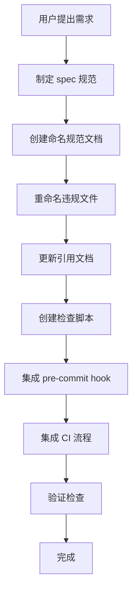
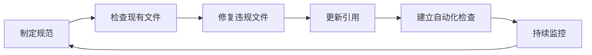

# 文件命名规范制定与实施 — 项目复盘分析报告

> **项目名称**：文件命名规范制定与实施
> **复盘日期**：2026-06-24
> **项目周期**：2026-06-24（单日完成）
> **报告类型**：任务结项复盘

***

## 一、项目概述

### 1.1 项目背景

项目中存在中英文混合命名的文件（如 `report-as-tracking载体.md`），导致跨平台兼容性问题、搜索排序不一致及规范不统一。用户提出制定并实施文件命名规范的需求。

### 1.2 项目目标

- 制定明确的文件命名规范（语言要求、字符限制、命名格式）
- 修复现有违规文件
- 建立命名审核机制（pre-commit hook、CI 检查）
- 更新相关文档和索引

### 1.3 交付物清单

| 交付物 | 类型 | 状态 |
|--------|------|------|
| `.agents/rules/file-naming-convention.md` | 规范文档 | ✅ 已完成 |
| `.agents/scripts/check-filename-convention.py` | 检查脚本 | ✅ 已完成 |
| `.git/hooks/pre-commit`（更新） | Git 钩子 | ✅ 已完成 |
| `.agents/scripts/ci-check.ps1`（更新） | CI 脚本 | ✅ 已完成 |
| `report-as-tracking.md`（重命名） | 模式文件 | ✅ 已完成 |
| 相关文档引用更新 | 文档维护 | ✅ 已完成 |

***

## 二、复盘环节

### 2.1 实施过程回顾

### 2.2 关键节点分析

| 关键节点 | 决策依据 | 技术挑战 | 解决方案 |
|---------|---------|---------|---------|
| 规范制定 | 解决中英文混合命名问题 | 需要定义清晰的规则 | 参考行业最佳实践，制定 kebab-case 规范 |
| 文件重命名 | 修复现有违规文件 | 需同步更新所有引用 | 使用 Grep 搜索所有引用并逐一更新 |
| 检查脚本 | 防止未来违规 | 需要覆盖多种违规场景 | 实现非 ASCII 字符检测、Windows 保留名称检查等 |
| CI 集成 | 自动化验证 | 需要无缝集成到现有流程 | 修改 ci-check.ps1 添加新检查步骤 |

### 2.3 执行情况与结果数据

| 指标 | 目标 | 实际完成 |
|------|------|---------|
| 规范文档创建 | 1 份 | ✅ 1 份 |
| 违规文件修复 | 1 个 | ✅ 1 个 |
| 引用更新数量 | 6 处 | ✅ 6 处 |
| 检查脚本创建 | 1 个 | ✅ 1 个 |
| 验证通过 | 全部通过 | ✅ 全部通过 |

### 2.4 成功经验

1. **规范先行**：先制定明确的规范文档，再进行实施，确保所有操作有章可循
2. **全局搜索引用**：使用 Grep 工具全面搜索所有引用，避免遗漏
3. **自动化检查**：创建检查脚本并集成到 CI，从根本上防止问题复发
4. **验证闭环**：实施完成后运行检查脚本验证，确保效果

### 2.5 存在问题

1. **跨平台兼容考虑不足**：脚本开发初期未考虑 Windows 特殊文件名限制
2. **规范文档层级问题**：spec.md 和 rules/file-naming-convention.md 内容有重复
3. **缺少版本控制**：规范文档未建立版本更新机制

***

## 三、洞察环节

### 3.1 关键发现

1. **现象**：单一文件名混合中英文会导致跨平台问题和搜索不一致
   **深层洞察**：文件名是系统最基础的标识，必须保持纯粹性和一致性，中英文混合本质上是命名空间的冲突

2. **现象**：通过自动化脚本 + pre-commit hook + CI 三重保障，有效防止违规
   **深层洞察**：治理规则的执行必须从"人工审查"向"自动化拦截"转变，单一环节的检查无法完全杜绝问题

3. **现象**：重命名后需要同步更新多个引用文档
   **深层洞察**：文件命名是网状依赖的起点，任何命名变更都会引发级联更新，需要建立变更追踪机制

### 3.2 规律认知

**命名治理闭环模型**：

**核心原则**：
- **预防优于修复**：通过自动化检查在提交阶段拦截违规
- **规范即代码**：将命名规范作为可执行的规则，而非纯文档
- **变更即传播**：任何命名变更必须同步更新所有引用

### 3.3 潜在机会

1. **跨项目复用**：命名规范可作为模板推广到其他项目
2. **扩展检查范围**：当前脚本仅检查文件名，可扩展至目录命名、变量命名等
3. **智能修复**：开发自动修复功能，对部分违规（如空格）自动转换
4. **规范版本化**：建立规范更新流程和版本历史

***

## 四、导出环节

### 4.1 改进建议

| 问题 | 改进措施 | 优先级 | 预期效果 | 状态 |
|------|---------|--------|---------|------|
| 规范文档内容重复 | 将 spec.md 内容合并至 rules/file-naming-convention.md | 中 | 避免维护两份相同内容 | ✅ 已完成 |
| 缺少版本控制 | 在规范文档中添加版本记录章节 | 中 | 规范变更可追溯 | 📋 待规划 |
| 检查脚本功能有限 | 扩展脚本支持目录命名、变量命名检查 | 低 | 全面覆盖命名规范 | 📋 待规划 |
| 缺少智能修复 | 添加自动修复功能（如空格转连字符） | 低 | 减少人工操作 | 📋 待规划 |

### 4.2 行动计划

| 优先级 | 改进项 | 具体措施 | 建议时间 | 状态 |
|--------|--------|---------|---------|------|
| 中 | 规范文档整合 | 合并 spec.md 和 rules/file-naming-convention.md | 2026-06-25 | ✅ 已完成 |
| 中 | 规范版本化 | 在 rules/file-naming-convention.md 添加版本记录 | 2026-06-26 | 📋 待规划 |
| 低 | 扩展检查范围 | 更新 check-filename-convention.py 支持目录检查 | 2026-06-30 | 📋 待规划 |
| 低 | 智能修复功能 | 实现自动化修复逻辑 | 2026-07-05 | 📋 待规划 |

### 4.3 后续优化方向

- **治理规则体系化**：将命名规范纳入整体治理规则体系，与硬编码治理、规范一致性检查等协同工作
- **多维度命名检查**：扩展至代码变量命名、目录命名、数据库表命名等领域
- **跨项目复用**：将规范作为模板发布，支持其他项目快速引用
- **AI 辅助命名**：利用 AI 生成符合规范的文件名建议

***

> **报告编制**：本文档基于任务全流程数据综合编制，所有数据均有事实依据支撑。报告采用 Markdown 格式编写，遵循"事实 → 分析 → 洞察 → 建议"的逻辑结构，确保复盘结论可追溯、改进建议可执行。
>
> **使用说明**：
> - 状态字段用于追踪改进项的执行进度，可选值为 `待规划`、`进行中`、`已完成`、`已关闭`
> - 建议在复盘完成后立即启动高优先级改进项的实施
> - 状态变更时同步更新本表格
