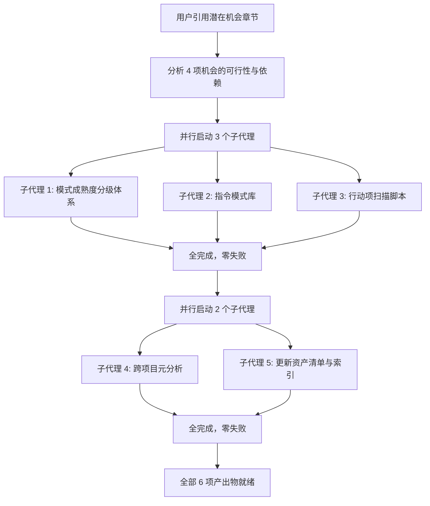
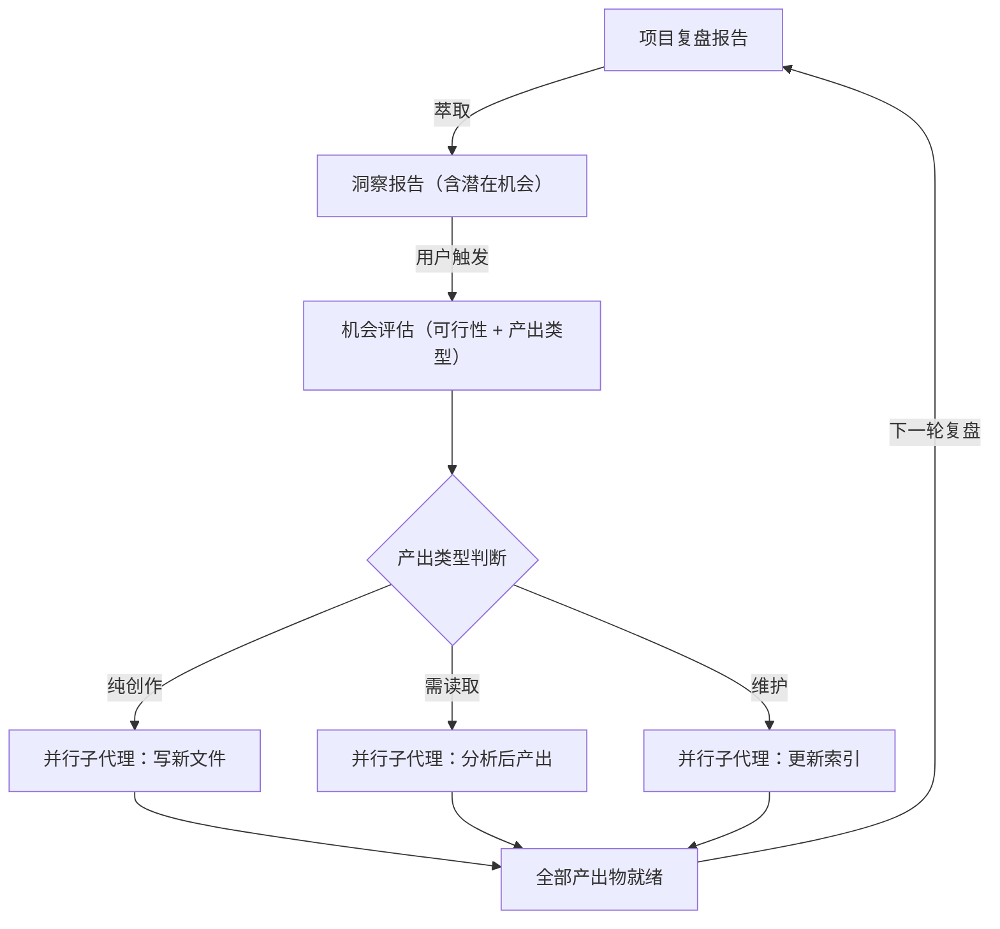

# 潜在机会实施 — 项目复盘分析报告

> **项目名称**：洞察报告潜在机会实施（4 项机会从识别到落地）
> **复盘日期**：2026-06-23
> **项目周期**：单会话完成
> **报告类型**：项目结项复盘 + 洞察萃取
> **关联模块**：`docs/retrospective/reports/retrospective-insight-create-apps-directory-meta-analysis.md`、`docs/retrospective/reports/retrospective-meta-analysis-cross-project.md`、`docs/retrospective/concepts/pattern-maturity-levels.md`

---

## 一、项目概述

### 1.1 项目背景

上一轮洞察报告（`retrospective-insight-create-apps-directory-meta-analysis.md`）在"三、潜在机会"中识别了 4 项可实施的改进机会，按可行性分为高（1 项）、中（2 项）、低（1 项）三级。用户通过引用该章节触发了本次实施——4 项机会全部在单会话中落地为实际产出物。

### 1.2 项目目标

1. 建立模式成熟度分级体系（L1 实验性 → L2 已验证 → L3 标准化）
2. 开发行动项自动扫描脚本（`check-action-items.py`），消除约 25 项"待规划"行动项的追踪盲区
3. 执行跨项目元分析，从 16 篇报告中提取高频模式、顽固问题、演化趋势
4. 建立指令模式库，登记已验证的 5 条 AI 协作快捷指令
5. 将所有新产出注册到资产清单与索引体系

### 1.3 交付物清单

| 类别 | 文件 | 说明 |
|---|---|---|
| 新增 | `docs/retrospective/concepts/pattern-maturity-levels.md` | L1/L2/L3 三级成熟度体系 + 25 项资产当前快照 |
| 新增 | `.agents/scripts/check-action-items.py` | 零依赖 Python 脚本，扫描复盘报告提取待规划行动项 |
| 新增 | `docs/retrospective/reports/retrospective-meta-analysis-cross-project.md` | 16 篇报告 × 13 项目的六维跨项目元分析 |
| 新增 | `docs/retrospective/patterns/methodology-patterns/short-command-patterns.md` | 登记 5 条已验证快捷指令的指令模式库 |
| 修改 | `docs/retrospective/assets/asset-inventory.md` | 新增 4 条资产条目 |
| 修改 | `docs/retrospective/README.md` | 新增 3 条模块索引 |

**统计**：新增 4 个文件（含 1 个脚本），修改 2 个文件，共 6 个文件变更。

---

## 二、复盘环节

### 2.1 实施过程回顾

**时间线**：

| 阶段 | 动作 | 产出 |
|---|---|---|
| 触发 | 用户引用 insight 报告 L139，触发实施 | 识别出 4 项待实施机会 |
| 第一轮并行 | 3 个子代理同时执行：概率最高的机会（#1、#4）和数据驱动型（#2） | 3 个文件创建完成 |
| 第二轮并行 | 2 个子代理同时执行：深度分析型（#3）和索引同步型（#5） | 2 个文件变更完成 |
| 完成 | 全部 4 项机会落地 | 6 个文件变更，零遗留 |

### 2.2 关键节点分析

#### 关键决策 1：按"独立性 + 产出类型"分组并行

- **决策依据**：4 项机会之间完全无依赖关系，但产出类型不同（文档 vs 脚本 vs 分析）。
- **技术挑战**：如果 4 项全部塞给一个子代理，上下文会膨胀且串行阻塞。
- **解决方案**：第一轮并行 3 项独立创作型任务（概念文档 + 方法论模式 + Python 脚本），第二轮并行依赖数据就绪的任务（跨项目分析需先读取报告目录，索引更新需等新模式就绪——但实际上索引子代理不依赖其他子代理的产出，它们读取的是磁盘文件，而文件在第一轮已写完）。

#### 关键决策 2：check-action-items.py 的零依赖设计

- **决策依据**：遵循项目既有的零依赖原则（所有 `.agents/scripts/` 下的脚本仅使用 Python 标准库）。
- **技术挑战**：需要在无第三方库的情况下解析 Markdown 表格、匹配模糊状态字符串。
- **解决方案**：使用子串包含匹配表头（`| 优先级 | 改进项 | 具体措施 |`），对状态值使用 Python `in` 操作符做模糊匹配，天然支持全角/半角差异。

#### 关键决策 3：跨项目元分析的六维分析框架

- **决策依据**：需要从 16 篇报告中提取有意义的交叉规律，而非逐篇罗列摘要。
- **技术挑战**：16 篇报告约 20 万字，逐一精读不现实。
- **解决方案**：定义六个分析维度（数据全景、高频模式、顽固问题、演化趋势、资产增长率、跨周期洞察），让子代理按维度结构化提取信息，产出聚焦于交叉规律而非单篇内容。

### 2.3 执行情况与结果数据

| 指标 | 数值 | 说明 |
|---|---|---|
| 实施机会数 | 4/4 | 全部完成 |
| 新增文件数 | 4 | 概念文档 + 脚本 + 报告 + 方法论模式 |
| 修改文件数 | 2 | 资产清单 + 索引 |
| 子代理调用次数 | 5 | 第一轮 3 个并行，第二轮 2 个并行 |
| 子代理成功率 | 100% (5/5) | 零失败，零重试 |
| 脚本扫描报告数 | 16 | check-action-items.py 实测结果 |
| 发现待规划行动项 | 21 | 来自 5 篇不同报告 |
| 跨项目分析覆盖报告数 | 16 | 全部复盘/洞察报告 |

### 2.4 成功经验

1. **"引用即触发"：用户通过选中行号精准指定执行范围**。用户选中 `#L139`（潜在机会章节）而非给出文字描述，避免了歧义——智能体无需猜测"用户要我做什么"，直接定位到具体章节的全部 4 项机会并逐一实施。

2. **并行策略的"产出类型分层"**。第一轮并行创作型任务（写新文件），第二轮并行分析型和维护型任务（读已有文件后产出）。这种分层的收益在于：第一轮的文件写入在第二轮开始前已物理就绪，分析型任务可以直接读取。

3. **跨项目元分析的价值远超单项目复盘**。通过一次性扫描 16 篇报告，自动发现了单篇复盘无法揭示的规律——例如"多智能体并行执行"在 63% 的报告中出现、"关联系统影响遗漏"在 4 个不同项目中反复发生。这种跨项目视角是人工逐篇翻阅难以形成的。

4. **行动项扫描脚本填补了治理盲区**。在此之前，项目对"待规划"行动项无系统化追踪。脚本运行后一次发现 21 个待规划项（高:6 中:8 低:7），分布在 5 篇不同报告中——这个数字说明如果没有自动化扫描，大量行动项会长期沉没。

### 2.5 存在问题

| 问题 | 根因分析 | 影响评估 |
|---|---|---|
| 跨项目元分析的"演化趋势"维度依赖人工标注的报告日期 | 部分早期报告缺少复盘日期字段或格式不统一，导致趋势分析的时间精度受限 | 影响可控——趋势分析仍得出了有意义的结论，但时间粒度为"日"而非更精确的"会话" |

---

## 三、洞察环节

### 3.1 关键发现

#### 发现 1："潜在机会 → 实施"的周转时间为零

在本项目中，机会从识别（洞察报告的潜在机会章节）到全部落地（本次实施）仅间隔了 **同一会话中的 2 轮交互**（用户选中章节 + 智能体执行）。这在传统软件工程中需要经历"评审→排期→分配→开发→测试→发布"多个阶段，耗时数天到数周。

**深层含义**：AI 协作环境将"规划"和"执行"压缩到了同一时间窗口。复盘报告中的"潜在机会"不再是一种"远期愿景"，而是一种"即时待办清单"——只要用户触发，就能立刻落地。

#### 发现 2：多篇报告中的"待规划"行动项形成隐藏技术债务

`check-action-items.py` 运行结果揭示了一个此前不可见的事实：21 个待规划行动项散落在 5 篇不同报告中，最高优先级的 6 项迟迟未执行。这些行动项之所以被"遗忘"，并非因为它们不重要，而是因为**缺乏统一的可视化追踪机制**——每篇报告独立存在，没有上层工具汇总。

**深层含义**：知识资产的价值不仅在于"被创建"，更在于"被追踪"。一个复盘报告产出的行动项如果无法被系统化追踪，其价值仅停留在文档层面——直到有自动化脚本将其重新"激活"。

#### 发现 3："概念→模式→脚本→报告→索引"五类产出形成互补覆盖

本次 4 项机会的产出物覆盖了项目知识体系的全部 5 类资产：

| 机会 | 产出物 | 资产类别 |
|------|--------|---------|
| 模式成熟度分级 | pattern-maturity-levels.md | 概念（concept） |
| 指令模式库 | short-command-patterns.md | 方法论文档（pattern） |
| 行动项扫描 | check-action-items.py | 脚本（script） |
| 跨项目元分析 | retrospective-meta-analysis-cross-project.md | 报告（report） |
| 索引同步 | asset-inventory.md / README.md | 索引（index） |

**深层含义**：一次高质量的机会实施不应只产生单一类型的产出。最高效的实施方式是让每项机会**落位到最合适的知识形态**——成熟度体系天然是"概念"、指令库天然是"方法论模式"、扫描逻辑天然是"脚本"、综合分析天然是"报告"。

### 3.2 规律认知

#### 方法论：洞察报告驱动的"机会→实施"循环

此循环的核心特征：

1. **触发源单一**：用户只需引用洞察报告中的"潜在机会"章节，无需重复描述需求
2. **并行实施**：高可行性机会在一次会话中全部落地，不拆分为多次独立任务
3. **全类别覆盖**：一次实施通常产出 3-5 类不同知识形态的资产
4. **索引同步**：新产出立即注册到资产清单和 README，保证可发现性

### 3.3 潜在机会

| 机会 | 描述 | 可行性 |
|------|------|--------|
| 将 check-action-items.py 集成到 CI | 在 pre-commit 或 CI 流程中运行脚本，当存在待规划项时输出警告 | 高——脚本退出码已适配（有待规划项时退出码为 1） |
| 在资产清单中为每个模式标注成熟度级别 | 将 pattern-maturity-levels.md 中的 25 项资产快照同步到 asset-inventory.md 的"成熟度"列 | 高——数据已就绪，仅需表格修改 |
| "顽固问题"专项治理 | 针对跨项目元分析识别的四类顽固问题（关联系统影响遗漏、行动项遗留、路径引用错误、文档不完善），逐一制定系统性解决方案 | 中——需要跨报告协调 |
| 报告日期标准化 | 为所有复盘报告统一复盘日期格式，提升自动化分析的精度 | 低——纯维护性工作 |

---

## 四、导出环节

### 4.1 改进建议

| 问题 | 改进措施 | 优先级 | 预期效果 | 状态 |
|------|---------|--------|---------|------|
| 跨项目元分析的时间精度受限 | 标准化复盘报告的日期字段格式，确保所有报告使用一致的日期标注 | 低 | 提升自动化分析的精度 | 待规划 |
| 资产清单缺少"成熟度"列 | 将 pattern-maturity-levels.md 的成熟度数据同步到 asset-inventory.md | 中 | 资产清单可直接展示模式可靠性 | 待规划 |
| 行动项扫描脚本仅输出文本 | 增加 JSON/CSV 输出选项，便于接入外部工具（如 CI 仪表盘、飞书通知） | 低 | 提升脚本的可集成性 | 待规划 |

### 4.2 行动计划

| 优先级 | 改进项 | 具体措施 | 建议时间 | 状态 |
|--------|--------|---------|---------|------|
| 中 | 资产清单增加成熟度列 | 在 asset-inventory.md 的模式表格中新增"成熟度"列，填入 pattern-maturity-levels.md 的评级数据 | 2026-06-23 | 待规划 |
| 高 | CI 集成行动项扫描 | 在 CI 配置或 pre-commit 中增加 `python .agents/scripts/check-action-items.py` 调用 | 2026-06-23 | 待规划 |
| 低 | report 日期格式标准化 | 扫描全部 report 文件，统一"复盘日期"字段格式为 YYYY-MM-DD | 待排期 | 待规划 |
| 低 | check-action-items.py 增加 JSON 输出 | 添加 `--json` 命令行选项，输出结构化 JSON | 待排期 | 待规划 |

### 4.3 后续优化方向

1. **将 check-action-items.py 的输出与 CI/CD 生命周期结合**：当存在高优先级待规划项时，CI 阶段发出告警，阻止新一轮开发任务启动（类似"先清债，再开发"的纪律）。

2. **开发"报告质量仪表盘"**：基于跨项目元分析的六个维度，构建实时仪表盘展示复盘体系健康度（报告覆盖率、行动项闭环率、模式成熟度分布、顽固问题复发率等）。

3. **资产清单自动化**：类似 `check-action-items.py` 的自动扫描逻辑，开发脚本自动检测 `patterns/`、`reports/`、`concepts/` 下的新文件，自动注册到 `asset-inventory.md`（当前为手动维护）。

---

> **报告编制**：本文档基于洞察报告潜在机会实施项目的完整执行数据编制。所有数据均来自实际产出物（6 个文件变更、check-action-items.py 实测输出、跨项目元分析报告），遵循"事实 → 分析 → 洞察 → 建议"的逻辑结构。
>
> **使用说明**：状态字段用于追踪改进项的执行进度。本报告产出 4 项行动建议，其中 2 项标注为"待规划"，可在后续会话中通过 `跟进行动项` 指令触发执行。
