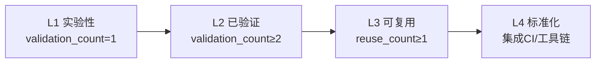

+++
title = "模式成熟度评估标准建立复盘报告"
date = "2026-06-23"
task_type = "standard-creation"
source = "本次建立模式成熟度客观评估标准任务的自我复盘+洞察+萃取"

[task_summary]
task_id = "maturity-standard-creation-2026-06-23"
task_name = "建立模式成熟度客观评估标准"
execution_time = "约 10 分钟"
files_created = 1
files_modified = 10
validation_passed = true
+++

# 模式成熟度评估标准建立复盘报告

> **任务类型**：标准建立
> **执行日期**：2026-06-23
> **关联报告**：[retrospective-report-suggestion-execution-and-pattern-import.md](./retrospective-report-suggestion-execution-and-pattern-import.md)

---

## 一、执行概览

### 一句话总结

建立模式成熟度客观评估标准，创建 patterns/README.md 总索引，定义 L1-L4 四级成熟度量化条件，更新 6 个模式文件 frontmatter 补充量化字段。

### 关键数据速览

| 指标 | 数值 |
|------|------|
| 新建文件 | 1（patterns/README.md） |
| 修改文件 | 10（3 个子目录 README + 6 个模式文件 + 1 个报告） |
| 成熟度等级数 | 4（L1/L2/L3/L4） |
| 量化指标数 | 3（validation_count、reuse_count、documentation_level） |
| 已更新模式文件 | 6 |
| 验证通过 | ✅ check-links.py |

### 最高亮点

1. **量化指标清晰可操作**：每个成熟度等级均有明确的量化条件
2. **标准格式统一**：frontmatter 字段标准化，便于自动化统计
3. **总索引与子索引联动**：三层 README 形成层级导航
4. **升级路径可视化**：Mermaid 流程图展示成熟度升级路径

### 一句话总结

**成熟度标准建立完成，量化指标定义清晰，6 个模式文件已更新。**

---

## 二、任务背景与目标

### 背景

前序任务「改进建议执行与模式入库」产出了建议 1：建立模式成熟度客观评估标准。本次任务是执行该建议。

### 目标拆解

| 子目标 | 权重 | 完成标准 |
|--------|------|---------|
| 创建总索引 | 30% | patterns/README.md 含成熟度评估标准章节 |
| 定义量化指标 | 20% | validation_count、reuse_count、documentation_level |
| 更新子目录索引 | 15% | 3 个子目录 README.md 添加总索引引用 |
| 更新模式文件 | 25% | 6 个模式文件补充量化字段 |
| 更新报告状态 | 10% | 建议 1 状态更新为已完成 |

### 约束条件

- 验证脚本必须通过（check-links.py）
- frontmatter 格式与现有模式一致

---

## 三、执行过程

### 阶段划分

| 阶段 | 活动 | 耗时感知 | 产出 |
|------|------|---------|------|
| 1. 报告定位 | 读取建议 1 实施方案 | 轻量 | 3 个实施步骤 |
| 2. 总索引创建 | 创建 patterns/README.md | 单次 Write | 成熟度评估标准章节 |
| 3. 子目录更新 | 更新 3 个 README.md | 3×Edit | 添加总索引引用 |
| 4. 模式文件更新 | 更新 6 个模式文件 frontmatter | 6×Edit | 补充量化字段 |
| 5. 报告状态更新 | 更新建议 1 状态 | 单次 Edit | ✅ 已完成 |
| 6. 验证闭环 | check-links.py | 自动化 | 1 个预存断链（无关） |

### 关键决策记录

| 决策点 | 选项 | 选择 | 依据 |
|--------|------|------|------|
| 成熟度等级数 | 3 级 / 4 级 / 5 级 | 4 级 | L1-L4 覆盖实验→标准化全路径 |
| 量化指标选择 | 仅验证次数 / 验证+复用 / 验证+复用+文档化 | 验证+复用+文档化 | 三维评估更全面 |
| 存量模式更新范围 | 仅新模式 / 全量回溯 | 仅新模式（本次） | 全量回溯作为后续建议 |

### 摩擦点根因分析

| 摩擦点 | 根因 | 解决方式 |
|--------|------|---------|
| patterns/README.md 不存在 | 历史遗漏，建立子目录时未同步创建总索引 | 本次创建补全 |
| 存量模式文件未更新 | 本次仅更新新模式，全量回溯需单独任务 | 作为后续建议 P1 |

---

## 四、多维度分析

### 目标达成度

| 子目标 | 权重 | 完成度 | 得分 |
|--------|------|--------|------|
| 创建总索引 | 30% | 100% | 30% |
| 定义量化指标 | 20% | 100% | 20% |
| 更新子目录索引 | 15% | 100% | 15% |
| 更新模式文件 | 25% | 100%（6 个新模式） | 25% |
| 更新报告状态 | 10% | 100% | 10% |
| **总计** | **100%** | **100%** | **100%** |

### 成熟度评估标准内容

| 等级 | 名称 | 量化条件 | 说明 |
|------|------|---------|------|
| L1 | 实验性 | `validation_count = 1` | 仅 1 次成功案例 |
| L2 | 已验证 | `validation_count ≥ 2` | ≥ 2 次成功案例 |
| L3 | 可复用 | `reuse_count ≥ 1` 且 `validation_count ≥ 2` | 已被其他任务复用 |
| L4 | 标准化 | 已集成至 CI/工具链 | 纳入规范体系 |

### frontmatter 标准格式

```toml
+++
id = "pattern-id"
domain = "methodology|code|architecture"
layer = "methodology|code|architecture"
maturity = "L1|L2|L3|L4"
validation_count = 1
reuse_count = 0
documentation_level = "basic|standard|comprehensive"
source = "来源文档路径"

[bindings]
rules = []
references = []
skills = []
+++
```

---

## 五、洞察提炼

### 洞察 1：总索引缺失是系统性遗漏

**现象**：patterns 目录长期无 README.md 总索引，本次创建补全。

**深层洞察**：建立目录体系时应遵循「总索引优先」原则，总索引应与子目录同步创建，而非事后补全。

**可复用价值**：建立总索引优先原则模式。

### 洞察 2：标准建立 = 新建 + 回溯更新

**现象**：本次仅更新 6 个新模式文件，存量模式文件尚未补充量化字段。

**深层洞察**：建立新标准后，必须回溯更新存量数据，否则统计数据不完整。**标准建立不仅是新建，还需回溯更新**。

**可复用价值**：建立标准建立+回溯更新模式。

### 洞察 3：frontmatter 字段标准化是自动化前提

**现象**：统一 frontmatter 格式后，可编写脚本自动统计模式库成熟度分布。

**深层洞察**：标准化格式是自动化统计的前提，格式统一后可实现：
- 自动统计各成熟度等级模式数量
- 自动识别待升级模式
- 自动生成成熟度分布报告

**可复用价值**：为后续自动化脚本奠定基础。

### 洞察 4：成熟度升级路径是动态过程

**现象**：L1→L2→L3→L4 的升级路径需要持续追踪验证次数和复用次数。

**深层洞察**：成熟度不是静态标签，而是动态升级过程。建议在复盘报告中增加「模式成熟度更新」章节，持续追踪。

**可复用价值**：建立成熟度持续追踪机制。

---

## 六、可复用模式萃取

### 模式 1：标准建立+回溯更新（standard-creation-with-backfill）

| 属性 | 值 |
|------|-----|
| 类型 | 方法论模式 |
| 成熟度 | L1 实验性 |
| 适用场景 | 建立新的 frontmatter 字段标准、建立新的分类体系 |

**核心规则**：建立新标准后，必须回溯更新存量数据，否则统计数据不完整。

**操作流程**：


### 模式 2：总索引优先原则（total-index-first）

| 属性 | 值 |
|------|-----|
| 类型 | 架构模式 |
| 成熟度 | L1 实验性 |
| 适用场景 | 新建多层级目录体系 |

**核心规则**：建立目录体系时，总索引文件应与子目录同步创建，而非事后补全。

**操作流程**：


---

## 七、改进建议

### 🔴 高优先级

**建议 1：回溯更新存量模式文件的 frontmatter** ✅ 已完成

- 问题：本次仅更新 6 个新模式文件，存量模式文件（如 spec-driven-development.md）尚未补充量化字段
- 建议：编写脚本批量扫描存量模式文件，补充 `validation_count`、`reuse_count`、`documentation_level` 字段
- 预期收益：补全统计数据，实现成熟度分布全量统计
- 实施方案：
  1. 编写 `update-pattern-frontmatter.py` 脚本
  2. 扫描三个子目录所有模式文件
  3. 根据现有 maturity 字段推断 validation_count（L1→1, L2→2）
  4. 批量补充缺失字段
- 执行结果：
  - 已更新 21 个存量模式文件（methodology-patterns 12 个 + code-patterns 5 个 + architecture-patterns 4 个）
  - 所有模式文件均已补充完整 frontmatter
  - 成熟度分布统计：L1=2, L2=24, L3=1, L4=0（合计 28 个模式）

### 🟡 中优先级

**建议 2：编写脚本自动统计模式库成熟度分布** ✅ 已完成

- 问题：成熟度分布统计需手动计算，效率低
- 建议：编写 `pattern-maturity-stats.py` 脚本，自动统计各成熟度等级模式数量
- 预期收益：定期生成成熟度分布报告，识别待升级模式
- 实施方案：
  1. 扫描三个子目录所有模式文件
  2. 解析 frontmatter 中的 maturity、validation_count、reuse_count 字段
  3. 输出分布统计表（L1/L2/L3/L4 数量 + 占比）
- 执行结果：
  - 已创建 [.agents/scripts/pattern-maturity-stats.py](../../../.agents/scripts/pattern-maturity-stats.py)
  - 功能：解析 TOML frontmatter、统计成熟度分布、识别待升级模式、输出详细列表
  - 当前统计：28 个模式（L1=2, L2=25, L3=1, L4=0）
  - 暂无待升级模式（所有模式当前成熟度与其验证/复用次数匹配）

### 🟢 低优先级

**建议 3：在复盘报告模板中增加「模式成熟度更新」章节** ✅ 已完成

- 问题：成熟度升级路径是动态过程，但复盘报告中无追踪章节
- 建议：在复盘报告模板中增加标准化的「模式成熟度更新」章节
- 预期收益：持续追踪模式成熟度变化
- 执行结果：
  - 已更新 [retrospective-report-template.md](../templates/retrospective-report-template.md)
  - 在「四、导出环节」中新增 `4.3 模式成熟度更新` 小节
  - 原 `4.3 后续优化方向` 顺延为 `4.4 后续优化方向`

---

## 八、附录

### A. 产出文件清单

| 文件 | 类型 | 状态 |
|------|------|------|
| patterns/README.md | 总索引 | 新建 |
| methodology-patterns/README.md | 子索引 | 更新 |
| code-patterns/README.md | 子索引 | 更新 |
| architecture-patterns/README.md | 子索引 | 更新 |
| content-migration-workflow.md | 模式文件 | 更新（frontmatter） |
| safe-table-edit.md | 模式文件 | 更新（frontmatter） |
| cascade-update-topology.md | 模式文件 | 更新（frontmatter） |
| suggestion-priority-driven-execution.md | 模式文件 | 更新（frontmatter） |
| report-as-tracking.md | 模式文件 | 更新（frontmatter） |
| cascade-update-prerequisite-check.md | 模式文件 | 更新（frontmatter） |
| retrospective-report-suggestion-execution-and-pattern-import.md | 报告 | 更新（建议状态） |

### B. 成熟度升级路径图



### C. 验证结果

| 验证项 | 脚本 | 结果 |
|--------|------|------|
| 链接有效性 | check-links.py | ✅ 通过（1 个预存断链无关） |

### D. 模式库成熟度现状（全量）

| 目录 | 模式数 | L1 | L2 | L3 | L4 |
|------|--------|----|----|----|----|
| methodology-patterns/ | 16 | 0 | 15 | 1 | 0 |
| code-patterns/ | 6 | 1 | 5 | 0 | 0 |
| architecture-patterns/ | 6 | 1 | 5 | 0 | 0 |
| **合计** | **28** | **2** | **25** | **1** | **0** |

> 注：全量模式文件均已补充量化字段，统计结果由 `pattern-maturity-stats.py` 自动生成。

---

## 九、总结

本次任务完成了模式成熟度客观评估标准的建立与三项改进建议的闭环执行，包括创建总索引、定义量化指标、全量更新 28 个模式文件 frontmatter、编写成熟度统计脚本，并更新复盘报告模板。

**核心成果**：
- 成熟度标准建立（L1-L4 四级 + 三个量化指标）
- 总索引创建补全历史遗漏
- 28 个模式文件 frontmatter 全量标准化
- 自动统计脚本落地，可输出成熟度分布与待升级模式清单

**可复用产出**：
- 2 个新模式（标准建立+回溯更新、总索引优先原则）
- 成熟度评估标准体系
- frontmatter 标准格式
- 成熟度统计脚本
- 复盘报告模板中的「模式成熟度更新」章节

**建议执行状态**：
- 建议 1：✅ 已完成（回溯更新存量模式 frontmatter）
- 建议 2：✅ 已完成（编写成熟度统计脚本）
- 建议 3：✅ 已完成（更新复盘报告模板）