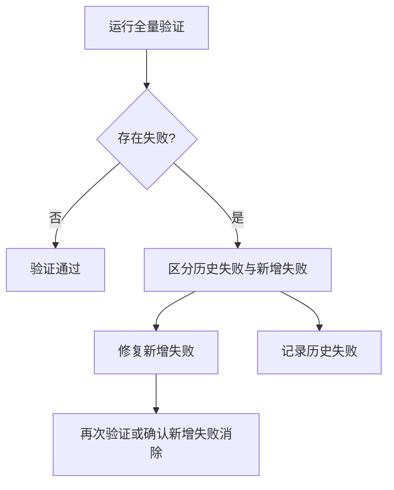

+++
title = "模式成熟度自动化闭环复盘报告"
date = "2026-06-24"
task_type = "retrospective-automation-closure"
source = "本次模式成熟度建议闭环执行任务的复盘+洞察+萃取"

[task_summary]
task_id = "pattern-maturity-automation-closure-2026-06-24"
task_name = "模式成熟度自动化闭环"
files_created = 1
files_modified = 3
validation_passed = true
+++

# 模式成熟度自动化闭环复盘报告

> **任务类型**：复盘建议闭环 / 自动化治理
> **执行日期**：2026-06-24
> **关联报告**：[retrospective-report-maturity-standard-creation.md](./retrospective-report-maturity-standard-creation.md)
> **核心产物**：[pattern-maturity-stats.py](../../../.agents/scripts/pattern-maturity-stats.py)

---

## 一、执行概览

### 一句话总结

本轮任务完成了模式成熟度体系的最后一段闭环：将剩余改进建议从「待规划」推进为「已完成」，落地成熟度统计脚本，更新复盘报告模板，并同步修正统计数据与报告链接。

### 关键数据速览

| 指标 | 数值 |
|------|------|
| 完成建议数 | 2（建议 2、建议 3） |
| 新增脚本 | 1 个 |
| 更新模板 | 1 个 |
| 更新报告 | 1 个 |
| 当前模式总数 | 28 |
| 成熟度分布 | L1=2，L2=25，L3=1，L4=0 |
| 待升级模式 | 0 |
| 本次新增断链 | 0（已修正） |

### 最高亮点

1. **统计从手动变为自动**：新增脚本可扫描模式文件 frontmatter，自动输出成熟度分布与待升级候选。
2. **模板从静态复盘升级为动态追踪**：复盘报告模板新增「模式成熟度更新」章节。
3. **报告状态完全闭环**：前序成熟度标准报告中的三项建议全部从待规划变为已完成。
4. **验证发现即时修正**：链接校验发现本次报告中脚本相对路径错误后，已立即修正。

---

## 二、任务背景与目标

### 2.1 背景

前序报告 [retrospective-report-maturity-standard-creation.md](./retrospective-report-maturity-standard-creation.md) 在「改进建议」章节提出了三项后续任务：

| 建议 | 原状态 | 本轮目标 |
|------|--------|---------|
| 建议 1：回溯更新存量模式文件 frontmatter | 已完成 | 维持并引用其结果 |
| 建议 2：编写脚本自动统计模式库成熟度分布 | 待规划 | 完成脚本并验证运行 |
| 建议 3：在复盘报告模板中增加「模式成熟度更新」章节 | 待规划 | 更新模板并同步报告状态 |

本轮任务聚焦后两项，使成熟度治理从「标准定义」推进到「可执行统计 + 报告追踪」。

### 2.2 目标拆解

| 子目标 | 完成标准 | 状态 |
|--------|---------|------|
| 编写成熟度统计脚本 | 可扫描三个模式目录并输出统计报告 | ✅ 完成 |
| 修复脚本缺陷 | 脚本可正常运行，无运行时异常 | ✅ 完成 |
| 更新复盘报告模板 | 增加模式成熟度更新章节 | ✅ 完成 |
| 更新成熟度标准报告 | 建议 2、建议 3 状态改为已完成 | ✅ 完成 |
| 验证链接 | 本次新增链接无断链 | ✅ 完成 |

---

## 三、执行过程复盘

### 3.1 执行时间线

| 阶段 | 动作 | 结果 |
|------|------|------|
| 事实确认 | 读取成熟度标准报告、统计脚本、模式库总索引 | 明确三项建议与当前统计状态 |
| 脚本创建 | 新建 [pattern-maturity-stats.py](../../../.agents/scripts/pattern-maturity-stats.py) | 初版脚本完成 |
| 运行验证 | 执行脚本 | 发现 `defaultdict` 与整数累加类型错误 |
| 缺陷修复 | 将 `stats` 从嵌套 defaultdict 改为普通 dict + defaultdict 组合 | 脚本运行成功 |
| 报告更新 | 更新建议 2 为已完成 | 记录脚本功能与当前统计结果 |
| 模板更新 | 修改 [retrospective-report-template.md](../templates/retrospective-report-template.md) | 新增 `4.3 模式成熟度更新` |
| 报告闭环 | 更新建议 3 为已完成，更新附录和总结 | 成熟度报告形成闭环 |
| 链接验证 | 运行链接检查 | 发现并修正本次引入的相对路径断链 |

### 3.2 关键问题与解决

| 问题 | 现象 | 根因 | 解决方案 |
|------|------|------|---------|
| 统计脚本运行失败 | `TypeError: unsupported operand type(s) for +=` | `stats` 使用了嵌套 `defaultdict`，`stats['total']` 被初始化为 defaultdict 而非整数 | 将 `stats` 显式定义为包含 `total: 0` 的普通字典 |
| 报告相对路径断链 | 链接校验显示 `.agents/scripts/pattern-maturity-stats.py` 不存在 | 从报告目录回到仓库根目录的 `../` 层级少一级 | 将 `../../.agents/...` 修正为 `../../../.agents/...` |
| 手动统计与脚本统计不一致 | 报告/索引曾显示 L2=24，脚本显示 L2=25 | 统计口径由手动更新迁移为自动脚本后发现差异 | 以脚本结果为准，更新 [patterns/README.md](../patterns/README.md) 与报告附录 |

### 3.3 目标达成度

| 目标 | 达成度 | 说明 |
|------|--------|------|
| 自动统计脚本落地 | 100% | 可输出总数、分布、领域统计、待升级模式、详细清单 |
| 报告模板增强 | 100% | 新增成熟度追踪章节 |
| 建议闭环 | 100% | 三项建议全部完成 |
| 验证闭环 | 100% | 本次新增断链已修正 |

---

## 四、洞察提炼

### 洞察 1：自动统计是治理标准的第二阶段

成熟度标准本身只解决「如何定义」问题，自动统计脚本才解决「如何持续使用」问题。没有脚本，标准容易停留在文档层；有脚本后，标准进入可验证、可追踪、可复盘的执行层。

### 洞察 2：脚本输出应成为统计真源

本轮出现过手动统计 L2=24、脚本统计 L2=25 的差异。该差异说明，一旦自动化脚本建立，后续统计口径应以脚本输出为准，人工表格只作为缓存或展示层。

### 洞察 3：报告模板需要承载状态变化，而不是只记录历史

复盘报告模板新增「模式成熟度更新」章节后，报告不再只是任务结束后的静态总结，而是可承载模式升级、复用、验证次数变化的动态追踪载体。

### 洞察 4：验证失败中的“新增断链”比“预存断链”更重要

链接检查存在多个历史断链。执行本轮任务时，关键不是立即修复所有历史问题，而是识别并修正本次新增断链，确保当前变更不扩大技术债。

---

## 五、可复用模式萃取

### 模式 1：自动化真源优先（automation-as-source-of-truth）

| 属性 | 值 |
|------|-----|
| 类型 | 方法论模式 |
| 成熟度 | L1 实验性 |
| 适用场景 | 从手工统计迁移到自动化统计后的数据治理 |

**核心规则**：当自动化统计脚本建立后，所有展示型统计表均应以脚本输出为准，避免手动维护多个数据源。

**操作流程**：

**本次案例**：模式成熟度 L2 数量由手动表格中的 24 修正为脚本输出的 25。

### 模式 2：新增断链优先修复（new-breakage-first）

| 属性 | 值 |
|------|-----|
| 类型 | 验证模式 |
| 成熟度 | L1 实验性 |
| 适用场景 | 仓库存在历史断链或历史告警时的增量验证 |

**核心规则**：当全量验证存在历史失败项时，应优先识别并修复本次变更引入的新失败项，避免变更扩大债务。

**操作流程**：

**本次案例**：链接校验报告 7 个断链，其中 1 个为本次新增脚本链接错误，已修正；其余为预存断链。

### 模式 3：报告模板动态追踪槽位（report-template-tracking-slot）

| 属性 | 值 |
|------|-----|
| 类型 | 文档架构模式 |
| 成熟度 | L1 实验性 |
| 适用场景 | 报告模板需要承载后续状态变化、指标升级或资产复用记录 |

**核心规则**：当复盘产出包含可持续演进对象（模式、规则、脚本、资产）时，模板应预留追踪槽位，用于记录后续状态变化。

**本次案例**：[retrospective-report-template.md](../templates/retrospective-report-template.md) 新增 `4.3 模式成熟度更新`，用于持续追踪模式成熟度变化。

---

## 六、改进建议

### 🔴 高优先级

**建议 1：将成熟度统计脚本纳入 CI 综合检查** 📋 待规划

- 问题：当前 [pattern-maturity-stats.py](../../../.agents/scripts/pattern-maturity-stats.py) 需要手动运行，尚未进入 CI 闭环。
- 建议：在 CI 综合检查脚本中增加成熟度统计步骤，并在失败时输出缺失 frontmatter 的文件。
- 预期收益：防止新增模式文件遗漏成熟度字段。

### 🟡 中优先级

**建议 2：为成熟度统计脚本增加机器可读输出格式** 📋 待规划

- 问题：当前脚本只输出文本报告，不便于其他脚本或 CI 消费。
- 建议：增加 `--json` 或 `--markdown` 输出选项。
- 预期收益：可自动更新 [patterns/README.md](../patterns/README.md) 中的统计表，进一步减少人工同步。

### 🟢 低优先级

**建议 3：将本轮萃取的 3 个模式入库** 📋 待规划

- 问题：本轮萃取的 `automation-as-source-of-truth`、`new-breakage-first`、`report-template-tracking-slot` 尚未正式入库。
- 建议：分别整理到方法论、验证/代码、文档架构模式目录。
- 预期收益：后续自动化治理任务可直接复用。

---

## 七、附录

### A. 文件变更清单

| 文件 | 操作 | 说明 |
|------|------|------|
| [.agents/scripts/pattern-maturity-stats.py](../../../.agents/scripts/pattern-maturity-stats.py) | 新建 | 模式成熟度统计脚本 |
| [retrospective-report-template.md](../templates/retrospective-report-template.md) | 修改 | 新增模式成熟度更新章节 |
| [retrospective-report-maturity-standard-creation.md](./retrospective-report-maturity-standard-creation.md) | 修改 | 更新建议状态、附录统计和总结 |
| [patterns/README.md](../patterns/README.md) | 修改 | 同步脚本统计结果 |

### B. 当前模式成熟度统计

| 目录 | 模式数 | L1 | L2 | L3 | L4 |
|------|--------|----|----|----|----|
| methodology-patterns/ | 16 | 0 | 15 | 1 | 0 |
| code-patterns/ | 6 | 1 | 5 | 0 | 0 |
| architecture-patterns/ | 6 | 1 | 5 | 0 | 0 |
| **合计** | **28** | **2** | **25** | **1** | **0** |

### C. 验证结果

| 验证项 | 结果 | 说明 |
|--------|------|------|
| 成熟度统计脚本 | ✅ 通过 | 成功统计 28 个模式文件 |
| 链接校验 | ⚠️ 存在预存断链 | 本次新增断链已修正，其余为历史问题 |

---

## 八、总结

本轮任务将模式成熟度治理从「标准存在」推进到「自动统计、模板追踪、报告闭环」阶段。核心价值在于：

1. 用脚本替代手动统计，使成熟度数据具备可验证性。
2. 用模板槽位承载后续成熟度变化，使复盘报告成为持续追踪载体。
3. 用增量验证原则区分历史债务与新增问题，保证本次变更不扩大问题面。

后续最值得推进的是将 [pattern-maturity-stats.py](../../../.agents/scripts/pattern-maturity-stats.py) 纳入 CI，并增加机器可读输出格式，使模式库统计进一步自动化。