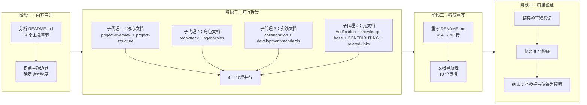
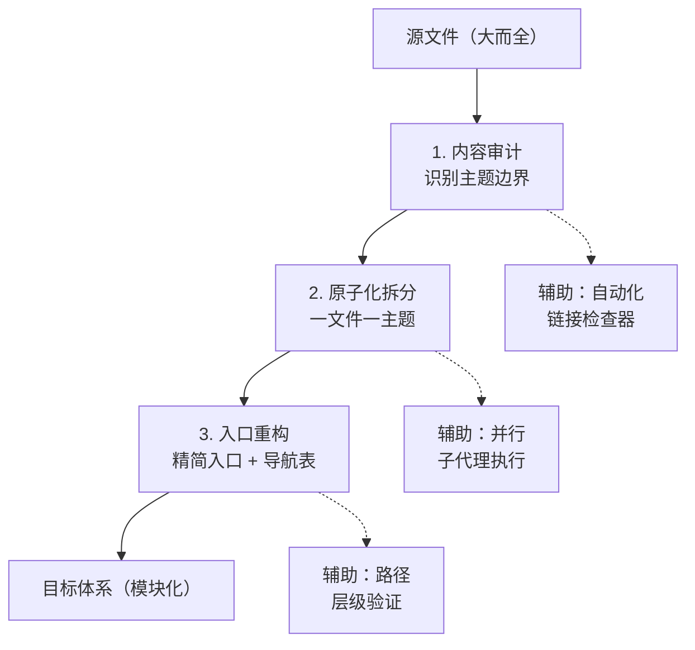
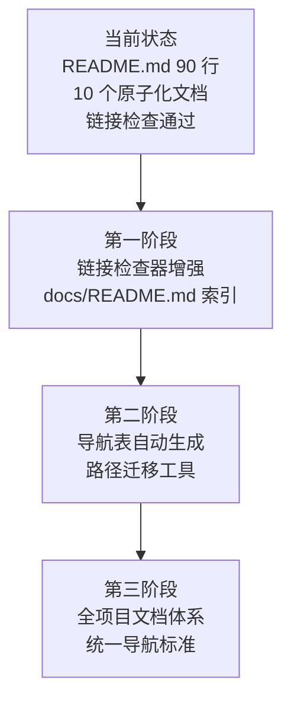

# README.md 原子化拆分 — 项目复盘分析报告

> **项目名称**：README.md 原子化拆分
> **复盘日期**：2026-06-23
> **项目周期**：单次交付（内容审计 → 并行拆分 → 精简重写 → 链接修复）
> **报告类型**：项目结项复盘

***

## 一、项目概述

### 1.1 项目背景

项目根目录的 `README.md` 长期作为"万能入口"，承载了项目概述、设计理念、核心特性、项目结构、技术栈、环境要求、角色体系、协作协议、工作流、开发规范、验证自动化、知识库、贡献指南、相关链接等 14 个不同主题的内容，文件膨胀至 434 行。这种"大而全"的结构导致：

- 单文件维护困难，修改一处需要翻阅大量无关内容
- 新成员难以快速定位所需信息
- 不同主题的内容混杂，缺乏清晰的模块边界
- 与项目既有的模块化文档体系（`docs/retrospective/`、`docs/knowledge/`）风格不一致

### 1.2 项目目标

将 `README.md` 从 434 行精简为 90 行入口文件，其余内容按主题拆分为 10 个原子化文档，建立清晰的"入口 → 详情"导航层次。

### 1.3 交付物清单

| 类别 | 文件 | 说明 |
|------|------|------|
| 入口文件 | `README.md` | 精简为 90 行，含快速开始 + 文档导航 |
| 核心文档 | `docs/project-overview.md` | 项目定位、设计理念、核心特性 |
| 核心文档 | `docs/project-structure.md` | 完整目录树与职责说明 |
| 核心文档 | `docs/tech-stack.md` | 技术栈与环境要求 |
| 角色文档 | `docs/agent-roles.md` | 5 个核心角色概览 |
| 协作文档 | `docs/collaboration.md` | 4 项协作协议 + 3 个标准工作流 |
| 实践文档 | `docs/development-standards.md` | 代码风格、提交规范、测试要求、文档边界 |
| 实践文档 | `docs/verification-automation.md` | 临时依赖治理、验证脚本 |
| 实践文档 | `docs/knowledge-base.md` | 技术知识库与复盘体系概览 |
| 元文档 | `CONTRIBUTING.md` | 贡献指南（标准文件名） |
| 元文档 | `docs/related-links.md` | 外部标准、工具文档、项目仓库 |
| **合计** | **11 个文件** | 10 新建 + 1 重写 |

***

## 二、复盘环节

### 2.1 实施过程回顾

### 2.2 关键节点分析

#### 决策 1：拆分粒度 — 10 个文件 vs 更少/更多

**决策依据**：遵循"一文件一主题"原则，每个文件聚焦一个独立可引用的主题。决策矩阵：

| 方案 | 文件数 | 优势 | 劣势 |
|------|--------|------|------|
| 保守（5 个） | 5 | 维护简单 | 部分文件仍混合多主题 |
| **均衡（10 个）** | **10** | **主题独立，每个文件可独立引用** | **需要维护导航表** |
| 激进（15 个） | 15 | 极细粒度 | 文件碎片化，导航复杂 |

选择 10 个文件的均衡方案，核心依据是：每个拆分后的文件都可以被独立引用和独立更新。例如，`CONTRIBUTING.md` 使用标准文件名，可被 GitHub 自动识别；`docs/agent-roles.md` 可被角色相关文档独立引用。

#### 决策 2：CONTRIBUTING.md 的位置 — 根目录 vs docs/

**决策依据**：`CONTRIBUTING.md` 是 GitHub 社区标准文件名，放在根目录可被 GitHub 自动识别并在 PR 页面显示"请阅读贡献指南"提示。这是一个平台兼容性决策，而非纯粹的文档组织决策。

#### 决策 3：并行执行策略 — 4 个子代理

**决策依据**：10 个文件无依赖关系，可完全并行。按文件内容量均衡分配：

| 子代理 | 文件数 | 内容量 | 执行结果 |
|--------|--------|--------|---------|
| 子代理 1 | 2 | 中 | 成功 |
| 子代理 2 | 2 | 中 | 成功 |
| 子代理 3 | 2 | 中 | 成功 |
| 子代理 4 | 4 | 中 | 成功 |

这是继"智能体开发规范体系"项目后，第二次验证"并行子代理批量创建模式"的有效性。

### 2.3 执行情况与结果数据

| 指标 | 数据 |
|------|------|
| 原始 README.md 行数 | 434 |
| 精简后 README.md 行数 | 90 |
| 精简比例 | 79.3% |
| 新建文件数 | 10 |
| 重写文件数 | 1 |
| 子代理数 | 4 |
| 执行模式 | 全并行 |
| 链接检查断链数 | 13（6 实际 + 7 模板占位符） |
| 修复断链数 | 6 |
| 残留断链数 | 7（均为模板占位符，预期行为） |

### 2.4 成功经验

#### 2.4.1 复用既有方法论降低了决策成本

本次拆分严格遵循项目既有的[文档体系原子化重构方法论](patterns/methodology-patterns/document-system-refactoring.md)（六步流程：内容审计 → 原子化拆分 → 模块化归类 → 命名规范 → 引用追溯 → 索引生成），无需重新设计拆分策略。方法论的复用使得决策阶段缩短为一次内容审计，直接进入执行阶段。

#### 2.4.2 并行子代理模式再次验证有效

4 个子代理并行创建 10 个文件，每人负责 2-4 个文件。这是继"智能体开发规范体系"项目（4 子代理创建 35 个文件）后，第二次成功应用该模式。两次验证确认了该模式在文档批量创建场景下的稳定性和可复用性。

#### 2.4.3 链接检查器作为质量门禁

在拆分完成后立即运行 `check-links.py`，发现 13 个断链。其中 6 个为实际断链（路径层级错误），及时修复；7 个为模板占位符（`{子目录名}` 等），确认为预期行为。链接检查器在此充当了"自动化质量门禁"的角色，防止断链进入最终交付。

#### 2.4.4 标准文件名的平台兼容性考量

将贡献指南命名为 `CONTRIBUTING.md`（而非 `docs/contributing.md`），利用了 GitHub 社区标准文件名的自动识别能力。这种"面向平台优化"的命名决策，体现了在文档组织与平台兼容性之间的权衡意识。

### 2.5 存在问题

#### 2.5.1 拆分后路径层级变化导致断链

**问题**：原 README.md 中的部分链接基于根目录计算相对路径，拆分到 `docs/` 子目录后路径层级发生变化，导致 6 个断链。

**根因**：拆分过程中，内容从根目录的 README.md 迁移到 `docs/` 子目录，但部分链接的 `../` 层级未同步调整。例如：
- `.agents/roles/architect.md` 中的 `docs/knowledge/decisions/` 需要改为 `../../docs/knowledge/decisions/`
- `docs/retrospective/reports/` 中的 `.trae/specs/` 链接需要增加一层 `../`

**影响**：修复成本低（6 个链接，每个修改 1 处），但暴露了"内容迁移时的路径自动更新"这一缺失能力。

#### 2.5.2 模板占位符被链接检查器误报

**问题**：`directory-readme-template.md` 和 `document-system-refactoring.md` 中的 `{子目录名}`、`{文件路径}` 等模板占位符被链接检查器识别为断链，产生 5 个误报。

**根因**：链接检查器无法区分"模板变量"和"实际链接"。模板文件中的 `{placeholder}` 语法在 Markdown 链接中会被解析为路径。

**影响**：误报不影响功能，但增加了人工排查成本。需要为链接检查器添加模板文件排除规则或 `{ }` 占位符识别规则。

#### 2.5.3 文档数量增加带来的导航复杂度

**问题**：拆分后 `docs/` 目录下新增 9 个文件，READM.md 中需要维护一个 10 行的文档导航表。

**根因**：原子化拆分的必然代价——文件数量增加，导航需求随之增加。

**影响**：当前 10 个文档的导航表维护成本可控，但若未来继续拆分，可能需要自动化生成导航表。

***

## 三、洞察环节

### 3.1 关键发现

#### 发现 1：方法论的复用是"零决策成本"的关键

**支撑事实**：本次拆分从决策到执行仅用了一次内容审计，直接复用了既有方法论的全部六步流程。对比"复盘文档体系重构"项目（首次建立方法论时需要探索和试错），本次复用的决策成本接近于零。

**深层含义**：知识资产的真正价值不在于"创建"，而在于"复用"。当方法论被充分文档化和模块化后，后续类似任务可以跳过探索阶段，直接进入执行阶段。这是知识库建设的核心 ROI 所在。

#### 发现 2：链接检查器是文档拆分的必备质量工具

**支撑事实**：拆分后运行链接检查器，发现 6 个实际断链。若没有自动化检查，这些断链可能长期存在，直到某个用户点击链接时才发现。

**深层含义**：文档拆分的最大风险不是"内容遗漏"，而是"引用断裂"。手动检查 106 个文件、153 个本地引用是不现实的，自动化链接检查是确保文档体系完整性的必要基础设施。

#### 发现 3：拆分的价值不在于"减小文件"，而在于"建立模块边界"

**支撑事实**：README.md 从 434 行精简到 90 行，但这个数字变化不是核心价值。核心价值在于：每个主题现在有了明确的文件边界，可以独立引用、独立更新、独立维护。例如，`CONTRIBUTING.md` 可以被 GitHub 自动识别，`docs/agent-roles.md` 可以被角色文档引用而不需要加载整个 README.md。

**深层含义**：文档拆分的根本目的是"降低耦合、提高内聚"——这是软件工程中模块化设计原则在文档领域的直接映射。行数减少只是表象，模块边界才是本质。

### 3.2 规律认知

#### 规律 1：文档拆分的"三要素"模型

从本次拆分和之前的"复盘文档体系重构"中提炼出文档拆分的三个核心要素：

**三要素**：
1. **内容审计**：识别主题边界，确定拆分粒度
2. **原子化拆分**：每个文件聚焦一个独立主题
3. **入口重构**：精简入口文件，建立导航表

**三个辅助工具**：
1. 链接检查器（自动化质量门禁）
2. 并行子代理（提升执行效率）
3. 路径层级验证（防止引用断裂）

#### 规律 2：文档拆分的"收益递减"曲线

| 拆分粒度 | 文件数 | 单文件行数 | 导航复杂度 | 独立引用性 | 推荐度 |
|---------|--------|-----------|-----------|-----------|--------|
| 不拆分 | 1 | 400+ | 无 | 无 | 不推荐 |
| 粗粒度 | 3-5 | 100-200 | 低 | 低 | 可接受 |
| **均衡** | **8-12** | **30-60** | **中** | **高** | **推荐** |
| 细粒度 | 15-20 | 10-30 | 高 | 高 | 谨慎 |
| 过度 | 30+ | <10 | 非常高 | 碎片化 | 不推荐 |

**规律**：当文件数超过 15 个时，导航复杂度开始超过独立引用带来的收益。本次拆分选择 10 个文件，处于"均衡"区间的中心位置。

### 3.3 潜在机会

#### 3.3.1 识别出的改进空间

1. **链接检查器增强**：添加模板占位符识别规则（`{ }` 模式），消除模板文件的误报。
2. **导航表自动生成**：当 `docs/` 下文件超过一定数量时，可开发脚本自动生成导航表。
3. **路径迁移工具**：开发一个"内容迁移时的路径自动更新"工具，在文件移动时自动调整内部链接的 `../` 层级。

#### 3.3.2 可复用资产

本次拆分产出的资产及其复用价值：

| 资产 | 复用场景 | 复用方式 |
|------|---------|---------|
| 10 个原子化文档 | 其他需要模块化 README 的项目 | 参考结构设计，按需裁剪 |
| 拆分决策矩阵（3.2 规律 2） | 任何文档拆分的粒度决策 | 直接参考收益递减曲线 |
| 三要素模型（3.2 规律 1） | 文档拆分的方法论指导 | 直接套用流程 |
| 并行子代理模式（第 2 次验证） | 文档批量创建 | 参考决策矩阵分配子代理 |

#### 3.3.3 未来可扩展的方向

1. **docs/README.md 索引**：为 `docs/` 目录创建一个 README.md 索引文件，统一管理所有文档的导航。
2. **自动化导航表**：当 `docs/` 下文件变更时，自动更新 README.md 中的文档导航表。
3. **模板文件标记**：在模板文件中添加 frontmatter 标记（如 `is_template: true`），让链接检查器自动跳过。

***

## 四、导出环节

### 4.1 改进建议

| 问题 | 改进措施 | 优先级 | 预期效果 |
|------|---------|--------|---------|
| 模板占位符误报 | 为链接检查器添加 `{ }` 占位符识别规则 | 中 | 消除 5 个误报 |
| 路径迁移手动调整 | 开发路径自动更新工具 | 低 | 降低未来拆分时的维护成本 |
| 导航表手动维护 | 开发导航表自动生成脚本 | 低 | 降低文档数量增长时的维护成本 |
| docs/ 目录缺乏索引 | 创建 `docs/README.md` | 中 | 统一管理 docs/ 下所有文档的导航 |

### 4.2 行动计划

| 优先级 | 改进项 | 具体措施 | 建议时间 |
|--------|--------|---------|---------|
| 中 | 链接检查器增强 | 在 `check-links.py` 中添加 `{ }` 占位符识别，跳过模板文件中的变量链接 | 1 周内 |
| 中 | docs/README.md 创建 | 为 `docs/` 目录创建索引文件，统一管理文档导航 | 1 周内 |
| 低 | 导航表自动生成 | 开发脚本，从 `docs/` 目录的文件 frontmatter 中提取标题和描述，自动生成导航表 | 1 个月内 |
| 低 | 路径迁移工具 | 开发"文件移动时自动调整内部链接层级"的工具 | 1 个月内 |

### 4.3 后续优化方向

***

> **报告编制**：本文档基于 README.md 原子化拆分的全过程数据（内容审计、4 子代理并行执行、链接检查结果、6 个断链修复记录）综合编制。报告遵循"事实 → 分析 → 洞察 → 建议"的逻辑结构，适用于小规模文档拆分任务的复盘。
>
> **关联文档**：
> - [README.md](../../README.md)
> - [文档体系原子化重构方法论](../patterns/methodology-patterns/document-system-refactoring.md)
> - [复盘→洞察→导出 知识闭环](../patterns/methodology-patterns/review-insight-export-loop.md)
> - [多智能体并行执行模式](../patterns/architecture-patterns/multi-agent-parallel-execution.md)