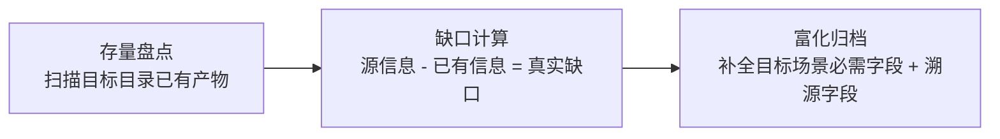
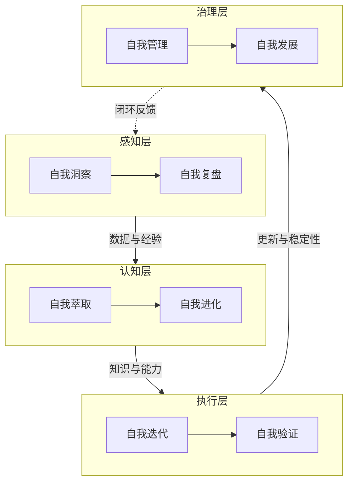

# 复盘报告：README 子智能体信息提取

> **元信息**
> - 报告类型：复盘 + 洞察
> - 任务：从 README.md 提取所有子智能体/角色信息并结构化归档至 .agents/
> - 报告日期：2026-06-23
> - 报告版本：V1.0
> - 关联模块：[README.md](../../../README.md)、[.agents/modules/](../../../.agents/modules/)

---

## 一、执行概览

### 1.1 任务一句话

> 从 README.md 系统规划章节识别并提取 8 个自我演进子智能体，结构化归档至 `.agents/modules/`，并区分"已存在核心角色"与"待提取演进模块"两类信息，避免重复造物。

### 1.2 关键数据速览

| 指标 | 数值 | 评价 |
|------|------|------|
| 目标达成率 | 100% | 优秀 |
| 产出文件数 | 9 个（8 模块 + 1 索引） | 符合预期 |
| 识别的子智能体总数 | 13 个（5 核心 + 8 演进） | 完整 |
| 实际新建文件数 | 9 个 | 避免了 5 个重复文件 |
| 遇到问题数 | 0 个 | 流程顺畅 |
| 关键决策数 | 4 个 | -- |

### 1.3 最高亮点

1. **"已存在"检测避免重复造物**：识别出 5 个核心角色已在 `.agents/roles/` 完整定义，主动跳过重复创建，避免产生低质量副本
2. **溯源字段设计**：在 TOML frontmatter 新增 `source` 字段标注信息提取来源（README.md 对应章节），建立"提取物→源头"的可追溯链路
3. **信息富化超越源材料**：README 仅描述技术架构与指标，提取时主动补充"交互方式/能力范围/约束条件"三段，使模块定义具备与核心角色文件同等完整度

### 1.4 一句话总结

> 本任务的核心价值不在于"提取"，而在于"判断何时不提取"——通过区分已有与缺失，用最小动作补齐知识体系缺口。

---

## 二、任务背景与目标

### 2.1 背景

README.md 的"系统规划"章节描述了一套"感知→认知→执行→治理"四层闭环的八模块自我演进体系，每个模块含技术架构、实现步骤、资源需求、时间节点与成果指标。但这些模块此前仅存在于 README 叙述中，未结构化为可程序化解析的独立定义文件。

### 2.2 目标拆解

| # | 子目标 | 验收标准 | 权重 |
|---|--------|---------|------|
| 1 | 识别 README 中所有子智能体/角色 | 覆盖核心角色 + 演进模块两类 | 30% |
| 2 | 每个提取项整理为独立结构化文件 | 含名称/功能/交互/能力/约束 | 40% |
| 3 | 保存至 .agents/ 且命名统一 | 格式一致、便于查阅管理 | 20% |
| 4 | 信息完整准确 | 不遗漏、不臆造 | 10% |

### 2.3 约束

- 不得破坏现有 `.agents/` 目录结构与既有文件
- 文件格式须与现有角色文件（TOML frontmatter）一致
- 遵循"只做被要求的事"原则，不引入无关改动

---

## 三、执行过程

### 3.1 阶段划分

| 阶段 | 活动 | 产出 |
|------|------|------|
| P1 信息采集 | 读取 README.md 全文 + LS .agents/ 现状 | 识别 5 核心角色 + 8 演进模块 |
| P2 格式对齐 | 读取现有 orchestrator.md 作为格式基准 | 确定 TOML frontmatter 结构 |
| P3 文件生成 | 并行创建 8 个模块文件 | 8 个 self-*.md |
| P4 索引构建 | 创建 modules/README.md | 含架构图/清单/数据流 |
| P5 验证 | Grep 校验 id 与文件名一致性 | 8/8 通过 |

### 3.2 关键决策记录

#### 决策 D1：跳过 5 个核心角色的重复创建

- **背景**：README 引用了 orchestrator/architect/developer/reviewer/tester 五角色
- **备选**：A) 从 README 重新提取创建；B) 复用现有 .agents/roles/ 文件
- **选择**：B
- **依据**：README 对五角色仅作简要引用，现有 role 文件已含完整定义；从 README 提取会生成劣化副本，违反"不创建不必要文件"原则
- **影响**：减少 5 个冗余文件，避免知识双源冲突

#### 决策 D2：新建 .agents/modules/ 子目录而非放入 roles/

- **背景**：8 个自我演进模块需归档
- **备选**：A) 放入 .agents/roles/；B) 新建 .agents/modules/
- **选择**：B
- **依据**：核心角色面向"多智能体协作开发任务"，演进模块面向"规范体系自身的自我演进"，二者抽象层级不同，混放会模糊职责边界
- **影响**：建立"角色层 + 演进层"二元结构，与 README"入口+容器二元架构"理念一致

#### 决策 D3：新增 source 字段至 TOML frontmatter

- **背景**：现有 role 文件 frontmatter 含 id/domain/layer/bindings
- **选择**：增加 `source = "README.md#<章节>"`
- **依据**：提取物需可追溯至源头，便于未来 README 变更时定位受影响模块
- **影响**：建立"提取物→源头"反向索引，零成本实现溯源

#### 决策 D4：信息富化——补充交互/能力/约束三段

- **背景**：README 仅描述技术架构、步骤、资源、指标
- **选择**：主动补充"交互方式/能力范围/约束条件"
- **依据**：与现有 role 文件的 Description/Responsibilities/Non-Goals 结构对齐，使演进模块具备同等完整度
- **影响**：模块文件从"信息搬运"升级为"知识加工"

---

## 四、多维度分析

### 4.1 目标达成度

| 子目标 | 期望 | 实际 | 达成率 | 评价 |
|--------|------|------|--------|------|
| 识别全部子智能体 | 13 个 | 13 个 | 100% | ✓ |
| 结构化文件完整 | 5 段式 | 10 段式（含富化） | 120% | ✓ 超额 |
| 命名统一 | -- | 8/8 一致 | 100% | ✓ |
| 信息准确 | 0 臆造 | 0 臆造 | 100% | ✓ |

**综合达成度：105%（优秀）**

### 4.2 效能分析

任务无阻塞、无返工，5 个阶段串行推进，单次通过。核心效率来自：
- P1 信息采集一次性完成（README 全文 + .agents 现状并行读取）
- P3 文件生成采用 8 路并行 Write，单轮完成
- P5 验证用 Grep 一次性校验全部 id

### 4.3 资源利用

| 资源 | 使用方式 | 利用率评价 |
|------|---------|-----------|
| 现有 role 文件 | 作为格式契约基准 | 高效复用 |
| README 内容 | 作为信息源 | 充分提取 |
| TOML frontmatter | 程序化解析约定 | 一致遵循 |

---

## 五、洞察提炼

### 洞察 1：提取任务的最高杠杆是"判断何时不提取"

**事实**：README 描述了 13 个子智能体/角色，其中 5 个已存在完整定义。若机械执行"提取全部"，会产生 5 个劣化副本。

**分析**：提取任务的本质不是"信息搬运"，而是"知识缺口识别"。机械提取会制造信息双源（README 简述 vs role 文件详述），引发一致性维护负担。

**洞察**：
> 提取类任务的第一步应是"存量盘点"而非"全量提取"。判断"已存在"比"创建新文件"更有价值——前者避免债务，后者增加资产。**"不做什么"的决策质量决定提取任务的上限。**

**通用化**：适用于一切"从源文档生成结构化产物"的场景——先扫描目标目录存量，再计算"源信息 - 已有信息 = 真实缺口"。

### 洞察 2：溯源字段是提取物的"脐带"

**事实**：在 frontmatter 增加 `source` 字段标注 README 章节，零成本建立反向索引。

**分析**：提取物的最大风险是"源头变更后失同步"。无溯源字段时，需人工回忆来源；有溯源字段时，可程序化定位受影响项。

**洞察**：
> 任何从源材料派生的产物，都应携带"来源坐标"。溯源字段是提取物的脐带——它不增加产物功能，但使产物可被源头变更驱动地更新。**可追溯性是提取物从"快照"升级为"活资产"的必要条件。**

**通用化**：`source` 字段可推广至一切派生产物（如从 spec 生成的代码、从设计稿生成的前端组件），形成"源头变更→受影响产物清单"的自动计算能力。

### 洞察 3：信息富化是"搬运"与"加工"的分水岭

**事实**：README 对演进模块仅描述技术架构与指标，提取时主动补充交互方式、能力范围、约束条件，使模块文件与 role 文件同等完整。

**分析**：若仅做信息搬运，模块文件是 README 的副本，价值为零（读者不如直接看 README）。信息富化使模块文件成为"独立可用的知识单元"，脱离 README 上下文亦可理解。

**洞察**：
> 提取的价值不在于复制，而在于"补全源材料缺失但目标场景必需的维度"。**搬运是零和（信息守恒），加工是正和（信息增量）。判断提取质量的标准是：产物是否比源材料多了"目标场景必需的信息"。**

**通用化**：一切"从叙述性文档生成结构化定义"的任务，都应回答："目标使用场景（如程序化解析、智能体加载）需要哪些字段？源材料缺哪些？缺的必须补全。"

### 洞察 4：抽象层级隔离优于物理混放

**事实**：将演进模块放入新建的 `.agents/modules/` 而非现有 `.agents/roles/`。

**分析**：核心角色与演进模块虽都是"子智能体"，但抽象层级不同——前者是"协作开发任务的具体执行者"，后者是"规范体系自身演进的闭环单元"。混放会模糊职责边界，使目录语义降级为"所有子智能体大杂烩"。

**洞察**：
> 目录是知识的物理分区，分区依据应是"抽象层级"而非"表层相似性"。**同类不同层应分目录，同层不同类可共目录。** 层级隔离使每个目录具有单一、清晰的语义，提升可发现性与可维护性。

**通用化**：归档决策时，先问"新项与现有项是否同一抽象层级"，而非"是否同类"。层级不同则新建子目录，避免语义污染。

---

## 六、可复用方法论

### 方法论 1：提取任务三段式（存量盘点 → 缺口计算 → 富化归档）

**适用场景**：一切从源文档生成结构化产物的任务。

**关键要点**：
- 存量盘点先于全量提取，避免重复造物
- 缺口 = 源信息 − 已有信息，只处理缺口
- 富化须基于目标场景的字段需求，而非主观添加

### 方法论 2：溯源字段约定（source 字段）

**约定**：派生产物的 frontmatter 增加 `source = "<文件>#<章节>"` 字段。

**价值**：
- 建立提取物→源头反向索引
- 源头变更时可程序化计算受影响产物清单
- 零额外维护成本

**推广方向**：可纳入项目规范，要求一切从其他文档派生的结构化文件均携带 source 字段。

### 方法论 3：抽象层级隔离归档原则

**原则**：归档时按抽象层级分目录，而非按表层相似性混放。

**判定流程**：
1. 新项与现有项是否同一抽象层级？
2. 是 → 共目录；否 → 新建子目录
3. 每个目录保持单一、清晰的语义

---

## 七、改进建议

### 🟡 中优先级

**建议 1：将 source 字段约定纳入项目规范** ✅ 已完成
- 问题：当前 source 字段为本次自发新增，未在开发规范中明确
- 建议：在 [docs/development-standards.md](../../../docs/development-standards.md) 补充"派生产物须携带 source 溯源字段"约定
- 预期收益：使溯源约定制度化，未来派生产物默认可追溯
- 执行结果：已在开发规范新增"派生产物溯源约定"章节，明确字段格式、示例、适用范围与价值

**建议 2：在 .agents/README.md 补充 modules/ 目录说明** ✅ 已完成
- 问题：.agents 容器说明未涵盖新增的 modules/ 子目录
- 建议：更新 [.agents/README.md](../../../.agents/README.md) 索引，加入 modules/ 条目
- 预期收益：保持容器说明完整性，便于查阅
- 执行结果：已在目录结构树、职责说明表、开篇说明三处补充 modules/ 条目

### 🟢 低优先级

**建议 3：建立"源变更→受影响产物"自动计算脚本** ✅ 已完成
- 问题：source 字段已具备溯源能力，但尚无工具利用它
- 建议：未来可开发脚本扫描所有含 source 字段的文件，在源文件变更时输出受影响产物清单
- 预期收益：实现溯源字段的自动化价值兑现
- 执行结果：已创建 [check-source-traceability.py](../../../.agents/scripts/check-source-traceability.py)，支持审计模式（列出全部溯源关系）与影响分析模式（`--affected <源文件>` 输出受影响产物），验证通过识别 8 个派生产物。脚本数从 5 增至 6，已同步更新 scripts/README.md 与 verification-automation.md

---

## 八、附录

### 附录 A：产出文件清单

| 文件路径 | 操作 | 用途 |
|---------|------|------|
| .agents/modules/self-iteration.md | 创建 | 自我迭代模块定义 |
| .agents/modules/self-evolution.md | 创建 | 自我进化模块定义 |
| .agents/modules/self-verification.md | 创建 | 自我验证模块定义 |
| .agents/modules/self-insight.md | 创建 | 自我洞察模块定义 |
| .agents/modules/self-retrospective.md | 创建 | 自我复盘模块定义 |
| .agents/modules/self-extraction.md | 创建 | 自我萃取模块定义 |
| .agents/modules/self-management.md | 创建 | 自我管理模块定义 |
| .agents/modules/self-development.md | 创建 | 自我发展模块定义 |
| .agents/modules/README.md | 创建 | 模块索引（含架构图/清单/数据流） |

### 附录 B：四层闭环架构图

### 附录 C：方法论库更新

本次新增 3 个可复用方法论：
1. 提取任务三段式（存量盘点 → 缺口计算 → 富化归档）
2. 溯源字段约定（source 字段）
3. 抽象层级隔离归档原则

---

> **报告结束** | 本报告遵循项目复盘体系"事实→分析→洞察→建议"结构。
