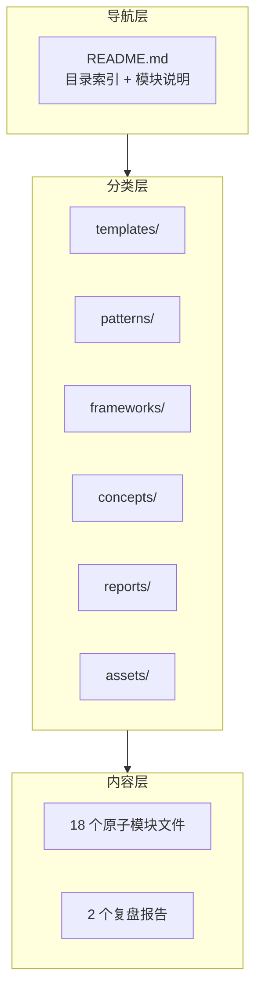

# 复盘文档体系重构 — 项目复盘分析报告

> **项目名称**：复盘文档体系重构（refactor-retrospective-docs）
> **复盘日期**：2026-06-23
> **项目周期**：2026-06-23（同日完成规格设计、实施与验证）
> **报告类型**：项目结项复盘

***

## 一、项目概述

### 1.1 项目背景

`docs/retrospective/` 目录此前仅有 3 个大型 Markdown 文件，其中 `knowledge-extraction.md` 长达 598 行，将代码模式、架构模式、方法论、模板、决策框架、知识概念、资产清单等 7 个维度的内容混杂在单一文件中。随着项目规模扩大，这种"大而全"的组织方式暴露出四个核心问题：定位效率低、模块边界模糊、缺乏目录索引、增量维护困难。

### 1.2 项目目标

将 `docs/retrospective/` 文件夹从"3 个巨型文件"重构为"原子化 + 模块化 + 结构化"的文档体系，建立 6 个功能子目录、18 个原子模块文件、统一命名规范、可追溯引用关系及完整的目录索引。

### 1.3 交付物清单

| 类别 | 交付物 | 数量 |
|------|--------|------|
| 子目录 | templates/、patterns/（含 3 个子目录）、frameworks/、concepts/、reports/、assets/ | 8 |
| 原子模块文件 | 代码模式、架构模式、方法论、模板、决策框架、知识概念、资产清单 | 18 |
| 复盘报告迁移 | 2 份原有复盘报告移入 reports/ | 2 |
| 目录索引 | README.md | 1 |
| 原有文件删除 | knowledge-extraction.md | 1 |

***

## 二、复盘环节

### 2.1 实施过程回顾

**时间线**：

| 阶段 | 操作 | 耗时特征 |
|------|------|---------|
| 规格设计 | 编写 spec.md、tasks.md、checklist.md | 一次性完成，3 个文件同步输出 |
| 目录创建 | 8 个目录一次性创建 | 1 条 PowerShell 命令 |
| 内容拆分 | 7 个子代理并行创建 18 个文件 | 并行执行，互不阻塞 |
| 报告迁移 | 移动 2 个文件 | 与 README 并行执行 |
| 旧文件删除 | 删除 knowledge-extraction.md | 确认后执行 |
| README 生成 | 编写完整目录索引 | 与报告迁移并行 |
| 验证 | 40 项检查点逐一验证 | 子代理自动化验证 |

### 2.2 关键节点分析

#### 节点一：目录结构设计

**决策依据**：按内容的"功能类型"而非"来源文件"划分子目录。6 个子目录分别对应：模板、模式（代码/架构/方法论）、决策框架、知识概念、复盘报告、资产清单。

**技术挑战**：`patterns/` 目录需要进一步细分为 3 个子目录，因为代码模式、架构模式、方法论本质上是不同抽象层级的知识。

**解决方案**：采用二级分类——`patterns/code-patterns/`、`patterns/architecture-patterns/`、`patterns/methodology-patterns/`，确保每个目录的文件数不超过 5 个。

#### 节点二：内容拆分策略

**决策依据**：`knowledge-extraction.md` 的 7 个一级章节天然形成了 7 个独立主题，每个主题下的二级章节（如"1.1 三段式检查工具架构"）可进一步拆分为独立文件。

**技术挑战**：拆分后需要确保每个文件的内容完整性和独立性，同时建立可追溯的引用关系。

**解决方案**：每个文件以 `> **来源**：` 开头标注原始出处，以 `> **关联模块**：` 结尾列出相关文件路径，形成双向可追溯的引用网络。

#### 节点三：并行执行策略

**决策依据**：Task 2-8 之间无依赖关系，每个任务仅涉及文件创建，可以安全并行。

**技术挑战**：7 个子代理同时创建文件，需要确保每个子代理获得精确的内容指令，避免内容错位。

**解决方案**：为每个子代理提供完整的文件内容（而非引用），确保子代理不依赖外部上下文即可独立完成任务。

### 2.3 执行情况与结果数据

| 指标 | 数据 |
|------|------|
| 总任务数 | 12 个主任务 + 22 个子任务 |
| 并行执行的任务 | 7 个（Task 2-8） |
| 创建的文件数 | 18 个原子模块 + 1 个 README |
| 迁移的文件数 | 2 个（复盘报告） |
| 删除的文件数 | 1 个（knowledge-extraction.md） |
| 验证检查点 | 40 项 |
| 检查点通过率 | 100%（40/40） |
| 内容丢失 | 零 |
| 命名规范违规 | 零 |

### 2.4 成功经验

| # | 经验 | 支撑事实 |
|---|------|---------|
| 1 | **Spec 先行显著降低返工风险** | 规格设计阶段明确了 5 个需求、12 个场景、40 个检查点，实施阶段零返工 |
| 2 | **并行执行大幅提升效率** | 7 个子代理同时创建 18 个文件，互不阻塞，整体耗时接近单个文件创建耗时 |
| 3 | **引用追溯设计保障可维护性** | 每个文件标注来源与关联模块，未来修改任一文件时可直接定位影响范围 |
| 4 | **目录索引降低认知负担** | README.md 提供完整目录树 + 模块说明 + 导航链接，新成员无需遍历文件系统即可理解体系结构 |
| 5 | **自动化验证覆盖全面** | 40 项检查点覆盖目录结构、内容完整性、命名规范、引用追溯、交叉引用五大维度 |

### 2.5 存在问题

| # | 问题 | 根因分析 | 影响评估 |
|---|------|---------|---------|
| 1 | README.md 在新增文件后需手动更新 | 目录索引是静态文档，新增模块后需同步更新 README.md 的目录树和链接 | 中：当前文件数较少，手动维护成本可控；文件数超过 50 时需考虑自动化生成 |
| 2 | 关联模块引用为单向链接 | 当前仅在被引用方标注关联模块，引用方未标注"被谁引用" | 低：单向引用已满足"可追溯"的基本需求，反向引用可作为增强项 |
| 3 | 两个复盘报告未添加来源标注 | 迁移的 2 个复盘报告是原始文档而非拆分产物，未添加 `> **来源**：` 标注 | 低：原始报告本身是"来源"而非"派生"，但在风格一致性上存在差异 |

***

## 三、洞察环节

### 3.1 关键发现

#### 发现一：文档重构的本质是"信息架构设计"

**支撑事实**：本次重构的核心工作不是"写新内容"，而是"重新组织已有内容"。6 个子目录的划分、18 个文件的命名、每个文件的引用标注——这些决策本质上是在设计一个信息架构。

**深层含义**：文档重构不应被视为简单的"剪切粘贴"操作，而应视为一次信息架构设计实践。架构的好坏决定了后续查阅和维护的效率。

#### 发现二：kebab-case 命名规范在中文项目中有额外收益

**支撑事实**：原文件 `knowledge-extraction.md` 虽然是英文命名，但之前的文档命名风格不统一（如 `retrospective-report-agents-spec-system.md` 混合了英文和连字符）。统一采用 kebab-case 后，所有文件名风格一致，且由于不含中文，在任何操作系统和终端中均无障碍访问。

**深层含义**：命名规范不只是"看起来整齐"，它直接影响跨平台兼容性、命令行操作效率和自动化工具的处理能力。

#### 发现三：子代理并行模式在文档创建场景中效率极高

**支撑事实**：7 个任务并行执行，每个子代理独立创建 2-5 个文件，互不干扰。如果串行执行，至少需要 7 轮交互；并行执行仅需 1 轮。

**深层含义**：文档创建是"无状态、无副作用、无依赖"的典型场景，天然适合并行化。识别并利用这种场景特征，可以大幅提升批量文档操作的效率。

#### 发现四：来源标注 + 关联模块标注形成了"软引用网络"

**支撑事实**：18 个文件通过 `> **来源**：` 和 `> **关联模块**：` 形成了一个可追溯的引用网络。任一文件的修改都可以通过关联模块标注定位到可能受影响的文件。

**深层含义**：在纯文档系统中，通过 Markdown 引用块模拟"外键关系"，可以实现类似数据库的引用完整性。这比目录结构更灵活，比 Wiki 链接更轻量。

### 3.2 规律认知

#### 规律一：文档体系的三层架构模型

**导航层**：提供全局视图，帮助快速定位目标内容。
**分类层**：按功能类型划分子目录，建立清晰的模块边界。
**内容层**：每个文件聚焦单一主题，内容独立自包含。

#### 规律二：文档拆分的"原子性"判断标准

一个文件是否达到"原子化"标准，可以通过以下三个问题判断：

1. **主题单一性**：该文件是否只讨论一个主题？（是 = 原子化）
2. **独立可读性**：脱离其他文件，该文件是否仍然可理解？（是 = 原子化）
3. **修改独立性**：修改该文件是否不会影响其他文件？（是 = 原子化）

本次拆分的 18 个文件均满足以上三个标准。

#### 规律三：目录结构的"3-5 原则"

每个目录下的文件数应控制在 3-5 个——少于 3 个时目录存在的必要性存疑，多于 5 个时应对目录进行二级细分。本次重构中，`patterns/` 目录因预计包含 10 个文件，被拆分为 3 个子目录（5 + 3 + 2），符合"3-5 原则"。

### 3.3 潜在机会

| # | 机会 | 说明 |
|---|------|------|
| 1 | README.md 自动生成脚本 | 基于目录结构自动生成 README.md，解决手动维护问题 |
| 2 | 反向引用增强 | 在引用方文件中也标注"被以下模块引用"，形成双向引用网络 |
| 3 | 文档体系模板化 | 将本次重构的目录结构 + 命名规范 + README 模板提炼为可复用的"文档体系模板"，用于其他项目的文档目录初始化 |
| 4 | 跨文档一致性检查 | 开发一个检查工具，验证所有关联模块引用路径是否有效，类似 check-spec-consistency.py 但用于文档引用 |

***

## 四、导出环节

### 4.1 改进建议

| # | 建议 | 针对问题 | 优先级 |
|---|------|---------|--------|
| 1 | 在 README.md 中添加"最后更新"时间戳，提示维护者同步更新 | 问题 1（静态索引） | 高 |
| 2 | 为原始复盘报告添加 `> **文档类型**：项目复盘报告` 元数据标注 | 问题 3（风格不一致） | 中 |
| 3 | 考虑开发 README.md 自动生成脚本，扫描目录结构生成目录树 | 问题 1（静态索引） | 低 |
| 4 | 在 README.md 中添加"新增文件操作指南"的 checklist | 问题 1（静态索引） | 中 |

### 4.2 行动计划

| 优先级 | 措施 | 预估工作量 | 依赖 |
|--------|------|-----------|------|
| 高 | 在 README.md 末尾添加 `> 最后更新：2026-06-23` 时间戳 | 5 分钟 | 无 |
| 中 | 为两个复盘报告添加元数据标注块 | 10 分钟 | 无 |
| 中 | 在 README.md 添加"新增文件操作指南"（创建文件 → 更新 README 目录树 → 更新 README 模块说明 → 添加来源与关联标注） | 15 分钟 | 高 |
| 低 | 开发 README.md 自动生成脚本 | 2 小时 | 无 |

### 4.3 后续优化方向

1. **工具链完善**：开发文档引用完整性检查工具，自动验证所有"关联模块"路径是否有效
2. **模板化推广**：将本次重构的文档体系提炼为模板，用于初始化其他项目的文档目录
3. **自动化维护**：README.md 自动生成，消除手动维护的同步延迟
4. **知识图谱**：基于"来源"和"关联模块"标注，构建文档间的引用关系图谱

***

> **报告编制**：本文档基于 `refactor-retrospective-docs` 规格文档（spec.md、tasks.md、checklist.md）及实施过程的完整记录综合编制。所有数据均有事实依据支撑，报告遵循"事实 → 分析 → 洞察 → 建议"的逻辑结构，确保复盘结论可追溯、改进建议可执行。