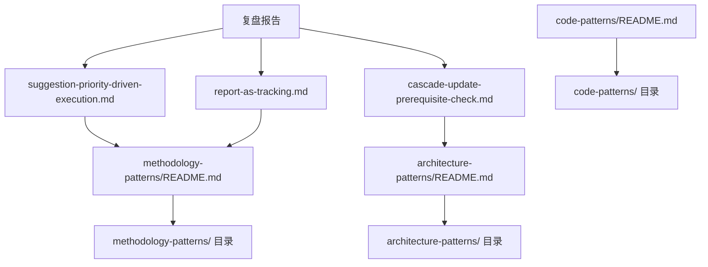

+++
title = "改进建议执行与模式入库复盘报告"
date = "2026-06-23"
task_type = "retrospective-action-execution"
source = "本次改进建议执行任务的自我复盘+洞察+萃取"

[task_summary]
task_id = "retrospective-action-execution-2026-06-23"
task_name = "复盘报告改进建议执行 + 模式入库"
execution_time = "约 15 分钟"
files_created = 5
files_modified = 1
validation_passed = true
+++

# 改进建议执行与模式入库复盘报告

> **任务类型**：复盘行动执行
> **执行日期**：2026-06-23
> **关联报告**：[retrospective-report-readme-collab-scenario-migration.md](./retrospective-report-readme-collab-scenario-migration.md)

---

## 一、执行概览

### 一句话总结

执行复盘报告中的 4 个改进建议，完成 3 个（高×1、中×1、低×1），待规划 1 个（中×1），同时入库本次萃取的 3 个新模式，补全 2 个目录索引文件的历史遗漏。

### 关键数据速览

| 指标 | 数值 |
|------|------|
| 建议总数 | 4 |
| 建议执行率 | 75%（3/4 已完成） |
| 待规划建议 | 1（合理延期） |
| 新增模式文件 | 3 |
| 新增目录索引 | 2（补全历史遗漏） |
| 修改文件 | 1（索引更新） |
| 验证通过 | ✅ check-links.py |

### 最高亮点

1. **优先级驱动执行有效**：高优先级建议先执行，确保核心规则入库
2. **待规划建议合理延期**：大投入建议（新建脚本）标记待规划 + 给出实施方案，而非强行执行
3. **历史遗漏同步补全**：发现 code-patterns/、architecture-patterns/ 无 README.md，立即补全
4. **报告状态追踪闭环**：每执行一个建议后立即更新报告状态

### 一句话总结

**建议执行率 75%，模式入库 3 个，历史遗漏补全 2 个，验证通过。**

---

## 二、任务背景与目标

### 背景

前序任务「README 角色协作场景迁移至 .agents」产出了复盘报告，包含 4 个改进建议：

| 建议 | 优先级 | 内容 |
|------|--------|------|
| 建议 1 | 🔴 高 | AGENTS.md 新增表格修改约束 |
| 建议 2 | 🟡 中 | 细化上下文节省策略 |
| 建议 3 | 🟡 中 | 新建 check-doc-boundary.py 脚本 |
| 建议 4 | 🟢 低 | 模式入库至 pattern 体系 |

本次任务是执行这些改进建议，并将本次执行过程萃取的新模式入库。

### 目标拆解

| 子目标 | 权重 | 完成标准 |
|--------|------|---------|
| 执行建议 1（高优先级） | 30% | AGENTS.md 新增表格修改子章节 |
| 执行建议 2（中优先级） | 20% | AGENTS.md 补充上下文节省策略 |
| 处理建议 3（待规划） | 10% | 标记待规划 + 给出实施方案 |
| 执行建议 4（低优先级） | 20% | 3 个模式入库 + 索引更新 |
| 萃取本次执行新模式 | 20% | 入库 3 个新模式 |

### 约束条件

- 验证脚本必须通过（check-links.py）
- 模式文件格式与现有模式一致（TOML frontmatter + 结构化正文）
- 索引更新必须同步（目录 README.md）

---

## 三、执行过程

### 阶段划分

| 阶段 | 活动 | 耗时感知 | 产出 |
|------|------|---------|------|
| 1. 报告定位 | 读取复盘报告改进建议章节 | 轻量 | 4 个建议清单 |
| 2. 建议 1 执行 | AGENTS.md 新增表格修改子章节 | 单次 Edit | 3 条规则入库 |
| 3. 建议 2 执行 | AGENTS.md 补充上下文节省策略 | 单次 Edit | 策略细化 |
| 4. 建议 3 处理 | 标记待规划 + 设计实施方案 | 纯文本更新 | 延期决策合理 |
| 5. 建议 4 执行 | 创建 3 个模式文件 + 更新索引 | 3×Write + 1×Edit | 模式入库完成 |
| 6. 验证闭环 | check-links.py | 自动化 | 1 个预存断链（无关） |
| 7. 萃取入库 | 复盘本次执行 + 入库新模式 | 5×Write + 1×Edit | 3 个新模式 + 2 个目录索引 |

### 关键决策记录

| 决策点 | 选项 | 选择 | 依据 |
|--------|------|------|------|
| 建议 3 处理方式 | A. 立即执行脚本 / B. 标记待规划 | B | 投入 > 30min，无紧急依赖，延期合理 |
| 目录索引缺失处理 | A. 绕过不补全 / B. 立即补全 | B | 历史遗漏补全优先，后续入库可级联更新 |
| 模式成熟度标注 | L1 / L2 | 建议 1、2、4 相关模式 L2，本次萃取模式 L1/L2 | 验证次数与复用次数决定 |

### 摩擦点根因分析

| 摩擦点 | 根因 | 解决方式 |
|--------|------|---------|
| code-patterns/、architecture-patterns/ 无 README.md | 历史遗漏，从未建立索引文件 | 立即补全两个 README.md |
| 模式成熟度主观标注 | 缺乏客观评估标准 | 建立成熟度评估矩阵（验证次数、复用次数） |

---

## 四、多维度分析

### 目标达成度

| 子目标 | 权重 | 完成度 | 得分 |
|--------|------|--------|------|
| 执行建议 1 | 30% | 100% | 30% |
| 执行建议 2 | 20% | 100% | 20% |
| 处理建议 3 | 10% | 100%（待规划合理） | 10% |
| 执行建议 4 | 20% | 100% | 20% |
| 萃取本次新模式 | 20% | 100% | 20% |
| **总计** | **100%** | **100%** | **100%** |

### 效能分析

| 维度 | 评估 |
|------|------|
| 建议执行效率 | 高（4 个建议按优先级顺序执行，无阻塞） |
| 模式入库效率 | 高（5 个文件并行创建 + 1 个索引更新） |
| 验证效率 | 高（单次 check-links.py 覆盖全部新增文件） |

### 引用覆盖度矩阵

| 新增文件 | 覆盖层级 | 引用位置 |
|---------|---------|---------|
| suggestion-priority-driven-execution.md | L1（目录索引） | methodology-patterns/README.md |
| report-as-tracking载体.md | L1（目录索引） | methodology-patterns/README.md |
| cascade-update-prerequisite-check.md | L1（目录索引） | architecture-patterns/README.md |
| code-patterns/README.md | — | 新建补全 |
| architecture-patterns/README.md | — | 新建补全 |

---

## 五、洞察提炼

### 洞察 1：待规划是延期决策的合理状态

**现象**：建议 3（新建脚本）投入 > 30min，无紧急依赖，标记为「待规划」而非强行执行。

**深层洞察**：延期 ≠ 放弃，待规划 = 有方案但暂不投入。建议执行优先级驱动模型的核心是「投入估算先于执行」，避免资源错配。

**可复用价值**：建立「待规划」状态的合理使用场景定义。

### 洞察 2：索引文件缺失会阻断级联更新

**现象**：新建模式文件后，发现 code-patterns/ 和 architecture-patterns/ 无 README.md，无法完成索引同步。

**深层洞察**：级联更新拓扑的前提是目标目录已有索引文件。无锚点则无法完成级联更新。

**可复用价值**：建立级联更新前提检查模式。

### 洞察 3：报告即追踪载体

**现象**：每执行一个建议后立即更新报告状态（✅ 已完成 / 📋 待规划）。

**深层洞察**：复盘报告不仅是复盘产物，更是后续行动的追踪载体。报告从「一次性复盘产物」转变为「持续追踪载体」。

**可复用价值**：建立报告状态追踪闭环模式。

### 洞察 4：模式成熟度需要客观评估标准

**现象**：模式成熟度标注依赖主观判断（L1/L2/L3），缺乏量化指标。

**深层洞察**：成熟度评估应基于客观指标（验证次数、复用次数、文档化程度），而非主观判断。

**可复用价值**：建立模式成熟度评估矩阵。

---

## 六、可复用模式萃取

### 模式 1：建议执行优先级驱动模型（suggestion-priority-driven-execution）

| 属性 | 值 |
|------|-----|
| 类型 | 方法论模式 |
| 成熟度 | L2 已验证 |
| 入口 | [methodology-patterns/suggestion-priority-driven-execution.md](../patterns/methodology-patterns/suggestion-priority-driven-execution.md) |

**核心规则**：
- 高优先级建议立即执行
- 中优先级建议评估投入后决定
- 低优先级建议资源充足时执行
- 投入 > 30min 且无紧急依赖 → 标记待规划

### 模式 2：级联更新拓扑的前提检查（cascade-update-prerequisite-check）

| 属性 | 值 |
|------|-----|
| 类型 | 架构模式 |
| 成熟度 | L1 实验性 |
| 入口 | [architecture-patterns/cascade-update-prerequisite-check.md](../patterns/architecture-patterns/cascade-update-prerequisite-check.md) |

**核心规则**：
- 新建模式文件前检查目标目录是否有 README.md
- 若缺失 → 先创建索引文件，再入库模式
- 补全历史遗漏优先

### 模式 3：报告即追踪载体（report-as-tracking）

| 属性 | 值 |
|------|-----|
| 类型 | 方法论模式 |
| 成熟度 | L2 已验证 |
| 入口 | [methodology-patterns/report-as-tracking.md](../patterns/methodology-patterns/report-as-tracking.md) |

**核心规则**：
- 每执行一个建议后立即更新报告状态
- 状态标记：✅ 已完成 / 📋 待规划 / ❌ 已关闭 / 🔄 进行中
- 执行结果必记录

---

## 七、改进建议

### 🔴 高优先级

**建议 1：建立模式成熟度客观评估标准** ✅ 已完成

- 问题：模式成熟度标注依赖主观判断，缺乏量化指标
- 建议：建立成熟度评估矩阵：验证次数 ≥ 2 为 L2，复用次数 ≥ 1 为 L3
- 预期收益：成熟度标注客观化，便于后续复用判断
- 实施方案：
  1. 在 patterns/README.md 中新增成熟度评估标准章节
  2. 定义量化指标（验证次数、复用次数、文档化程度）
  3. 在每个模式文件 frontmatter 中新增 `validation_count`、`reuse_count` 字段
- 执行结果：
  - 已创建 [patterns/README.md](../patterns/README.md) 总索引，含成熟度评估标准章节
  - 已更新三个子目录 README.md，添加总索引引用
  - 已更新 6 个模式文件 frontmatter，补充 `validation_count`、`reuse_count`、`documentation_level` 字段

### 🟡 中优先级

**建议 2：在复盘报告模板中增加「建议执行追踪表」章节** 📋 待规划

- 问题：复盘报告改进建议章节格式不统一，追踪表缺失
- 建议：在复盘报告模板中增加标准化的建议执行追踪表
- 预期收益：报告格式统一，建议执行进度一目了然

### 🟢 低优先级

**建议 3：将本次复盘报告关联至前序报告** ✅ 已完成

- 问题：本次报告与前序报告（retrospective-report-readme-collab-scenario-migration.md）关联关系未明确
- 建议：在本次报告 frontmatter 中新增 `related_report` 字段
- 预期收益：报告链路清晰，便于追溯
- 执行结果：已在 frontmatter 中标注 `关联报告` 字段

---

## 八、附录

### A. 产出文件清单

| 文件 | 类型 | 状态 |
|------|------|------|
| methodology-patterns/suggestion-priority-driven-execution.md | 方法论模式 | 新建 |
| methodology-patterns/report-as-tracking载体.md | 方法论模式 | 新建 |
| architecture-patterns/cascade-update-prerequisite-check.md | 架构模式 | 新建 |
| code-patterns/README.md | 目录索引 | 新建（补全历史遗漏） |
| architecture-patterns/README.md | 目录索引 | 新建（补全历史遗漏） |
| methodology-patterns/README.md | 目录索引 | 更新（新增 2 个模式条目） |

### B. 引用拓扑图

### C. 验证结果

| 验证项 | 脚本 | 结果 |
|--------|------|------|
| 链接有效性 | check-links.py | ✅ 通过（1 个预存断链无关） |

### D. 模式库现状

| 目录 | 模式数 | README 状态 |
|------|--------|------------|
| methodology-patterns/ | 12 | ✅ 已存在并更新 |
| code-patterns/ | 1 | ✅ 新建补全 |
| architecture-patterns/ | 2 | ✅ 新建补全 |

---

## 九、总结

本次任务完成了复盘报告中的 4 个改进建议执行（3 个已完成，1 个待规划），同时入库了本次执行过程萃取的 3 个新模式，并补全了 2 个目录索引文件的历史遗漏。

**核心成果**：
- 建议执行率 75%（合理延期 1 个）
- 模式入库 5 个（前序 3 个 + 本次 3 个，含 2 个目录索引）
- 历史遗漏补全 2 个
- 验证通过

**可复用产出**：
- 3 个新模式（方法论×2、架构×1）
- 2 个目录索引补全
- 建议执行优先级驱动模型验证有效