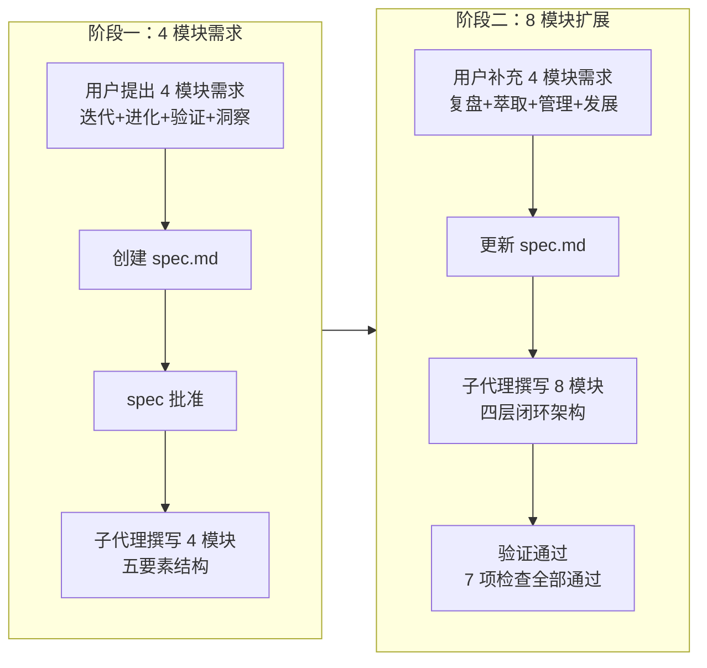
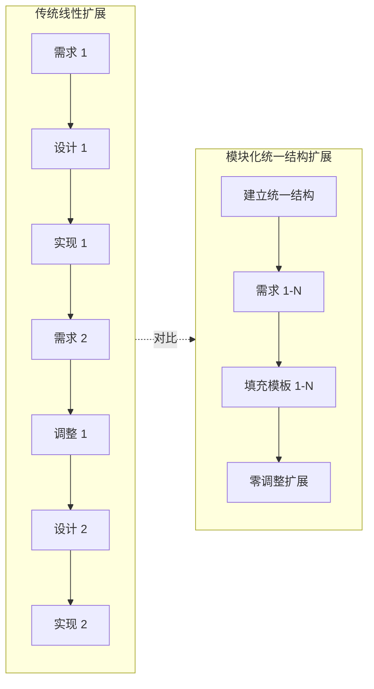
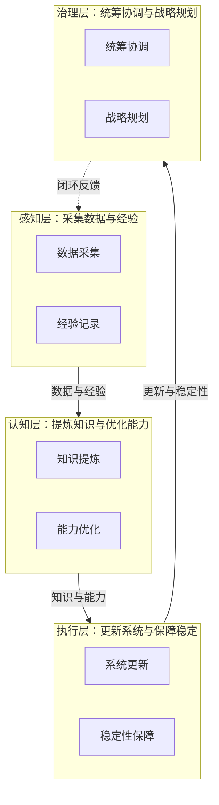

# README 系统规划章节新增 — 项目复盘分析报告

> **项目名称**：README 系统规划章节新增
> **复盘日期**：2026-06-23
> **项目周期**：需求增量式演进（4 模块 → 8 模块），单次交付
> **报告类型**：项目结项复盘

***

## 一、项目概述

### 1.1 项目背景

在已完成的 README 项目亮点与蓝图优化基础上，项目 README 的「项目蓝图」章节呈现了阶段性发展方向，但缺少对系统自我治理能力的深入设计。为体现项目"用工具治理工具"的核心理念，需新增「系统规划」章节，详细设计八个核心功能模块的技术架构与实现路径，使 README 成为项目技术深度的完整展示窗口。

本次任务经历了需求增量式演进：用户先提出 4 个模块（自我迭代、自我进化、自我验证、自我洞察），随后补充 4 个模块（自我复盘、自我萃取、自我管理、自我发展），最终形成 8 模块的完整系统规划。

### 1.2 项目目标

- 新增「系统规划」章节，位于「项目蓝图」之后、「文档导航」之前
- 详细设计八个自我治理功能模块的技术架构与实现路径
- 每个模块统一包含五要素：技术架构、关键实现步骤、资源需求、时间节点、预期成果指标
- 使用 Mermaid flowchart 表达整体架构与各模块技术架构，保证渲染兼容性

### 1.3 交付物清单

| 类别 | 文件 | 说明 |
|------|------|------|
| 主交付物 | `README.md` | 新增「系统规划」章节，行数 182 → 438（新增 256 行） |
| 规格文档 | `.trae/specs/add-system-planning-to-readme/spec.md` | 任务规格说明 |
| 任务清单 | `.trae/specs/add-system-planning-to-readme/tasks.md` | 主任务 2 项 + 子任务 14 项 |
| 检查清单 | `.trae/specs/add-system-planning-to-readme/checklist.md` | 验证检查项 16 项 |
| 复盘报告 | `docs/retrospective/reports/retrospective-report-system-planning.md` | 本报告 |
| **合计** | **5 个文件** | 1 修改 + 4 新建 |

***

## 二、复盘环节

### 2.1 实施过程回顾

### 2.2 关键节点分析

#### 决策 1：四层闭环架构设计

**决策依据**：将 8 个模块分为感知层（自我洞察 + 自我复盘）、认知层（自我萃取 + 自我进化）、执行层（自我迭代 + 自我验证）、治理层（自我管理 + 自我发展），形成闭环。模块间存在天然的"采集 → 分析 → 执行 → 统筹"数据流关系：

| 层级 | 模块 | 职责 |
|------|------|------|
| 感知层 | 自我洞察、自我复盘 | 采集数据与经验 |
| 认知层 | 自我萃取、自我进化 | 提炼知识与优化能力 |
| 执行层 | 自我迭代、自我验证 | 更新系统与保障稳定 |
| 治理层 | 自我管理、自我发展 | 统筹协调与战略规划 |

**技术挑战**：如何在单一 Mermaid 图中清晰表达四层间的数据流与闭环反馈关系。

**解决方案**：使用 `flowchart TB` + `subgraph` 分层呈现，实线箭头表示数据流，虚线箭头表示闭环反馈，保证视觉层次清晰。

#### 决策 2：统一五要素结构

**决策依据**：每个模块统一包含技术架构（文字 + Mermaid）、关键实现步骤（表格）、资源需求（人员 + 时长）、时间节点（里程碑）、预期成果指标（表格）五个要素。决策依据是统一结构降低认知成本，便于横向对比与扩展。

**技术挑战**：如何在保证内容深度的同时避免单章节过度膨胀。

**解决方案**：五要素中"关键实现步骤"与"预期成果指标"采用表格呈现，"技术架构"采用文字描述 + 可选 Mermaid 图，控制单模块行数在 25-35 行之间。

#### 决策 3：增量式需求扩展的应对

**决策依据**：用户补充 4 模块时，直接更新 spec 而非新建任务。决策依据是模块化设计与统一结构使扩展零成本——新增模块只需填充五要素模板，无需调整已有内容。

**技术挑战**：如何确保新增 4 模块与已有 4 模块在结构、风格、深度上保持一致。

**解决方案**：复用已建立的五要素结构模板，新增模块按相同结构填充；同时引入四层闭环架构对 8 模块重新组织，使新增模块自然融入整体架构。

### 2.3 执行情况与结果数据

| 指标 | 数据 |
|------|------|
| README 原始行数 | 182 |
| README 最终行数 | 438 |
| 新增行数 | 256 |
| 功能模块数 | 4 → 8（增量 4） |
| Mermaid 图表数 | 2（整体架构 + 自我迭代架构） |
| 验证检查项 | 7 项全部通过 |
| 链接校验 | 196 个引用零错误（含索引更新后新增引用） |
| 子代理调用 | 2 次（撰写 + 验证） |
| spec 更新次数 | 1 次（4 模块 → 8 模块） |

### 2.4 成功经验

#### 2.4.1 统一结构使增量扩展零成本

五要素统一结构（技术架构 + 关键实现步骤 + 资源需求 + 时间节点 + 预期成果指标）使 4 → 8 模块扩展时无需调整已有内容。新增 4 模块仅需填充模板，已有 4 模块保持原样，扩展过程零返工。这验证了"结构一致性比内容完整性更重要"的设计原则。

#### 2.4.2 四层闭环架构提供了清晰的模块组织框架

感知 → 认知 → 执行 → 治理的四层分类使 8 个模块的职责边界清晰，模块间的数据流关系通过 Mermaid 图一目了然。这一架构不仅组织了当前 8 模块，也为未来扩展预留了清晰的归属路径。

#### 2.4.3 Mermaid flowchart 保证渲染兼容性

整体架构图与自我迭代架构图均使用 `flowchart` 语法（TB/LR），在 AtomGit、GitHub、VS Code 预览等主流 Markdown 渲染器中均能正确渲染。避免了使用 `graph` 等兼容性较差的语法。

#### 2.4.4 子代理分工保证了质量

撰写子代理负责内容生成，验证子代理负责质量检查（链接校验、Mermaid 语法、五要素完整性、行数控制）。两次子代理调用形成了"生成 → 验证"的质量闭环，确保交付物符合 spec 要求。

### 2.5 存在问题

#### 2.5.1 需求一次性未明确

**问题**：用户分两次提出需求（先 4 模块，后补充 4 模块），导致 spec 需更新重审。

**根因**：用户在看到 4 模块的初步成果后，自然联想到补充 4 模块以形成完整体系。这是增量式需求的典型表现——用户需要看到部分成果才能明确完整需求。

**影响**：spec 更新与重审增加了约 10% 的协调成本，但模块化设计使实际执行成本接近零。

#### 2.5.2 八模块内容密度较高

**问题**：单章节 256 行包含 8 个模块的详细设计，内容密度较高，可能影响阅读体验。

**根因**：五要素结构虽然统一，但每个模块均包含技术架构、步骤表格、指标表格，信息量较大。8 模块 × 5 要素 = 40 个信息单元，单章节承载量偏重。

**影响**：读者需要分段阅读，无法快速浏览全貌。后续可考虑拆分为子文档或增加目录导航。

#### 2.5.3 时间节点与实际项目节奏未对齐

**问题**：模块时间节点（M1-M7）采用里程碑编号，但与实际项目迭代节奏未建立映射关系。

**根因**：spec 阶段未明确 M1-M7 对应的具体时间或迭代周期，仅作为相对顺序参考。

**影响**：时间节点目前仅具有规划意义，缺乏可执行性。后续需与项目实际迭代节奏对齐。

***

## 三、洞察环节

### 3.1 关键发现

#### 发现 1：增量式需求是常态而非异常

**支撑事实**：用户在看到 4 模块后自然联想到补充 4 模块，形成完整的自我治理体系。这一现象在文档优化、架构设计等任务中反复出现——用户需要看到部分成果才能明确完整需求。

**深层含义**：系统设计应预设可扩展性。模块化设计与统一结构使增量扩展零成本，这正是应对增量式需求的核心策略。将增量式需求视为常态，而非异常，能够改变任务规划的方式。

#### 发现 2：统一结构是可扩展性的基石

**支撑事实**：五要素统一结构使 4 → 8 扩展零返工。已有 4 模块保持原样，新增 4 模块仅需填充模板。对比缺乏统一结构的场景（每次扩展需调整已有内容），统一结构将扩展成本从 O(n) 降至 O(1)。

**深层含义**：结构一致性比内容完整性更重要。在设计阶段投入精力建立统一结构，能够为后续扩展节省指数级的调整成本。这是"约定优于配置"原则在文档设计中的体现。

#### 发现 3：四层闭环架构具有普适性

**支撑事实**：感知 → 认知 → 执行 → 治理的四层分类成功组织了 8 个模块，且各层间存在天然的"采集 → 分析 → 执行 → 统筹"数据流关系。这一架构不仅适用于自我治理系统，也可迁移至任何闭环优化体系。

**深层含义**：这是一个可迁移的架构模式。任何需要"感知环境 → 理解分析 → 执行行动 → 治理统筹"的系统都可以采用四层闭环架构，如 DevOps 流水线、质量保障体系、知识管理系统等。

#### 发现 4："自我X"命名模式具有认知一致性

**支撑事实**：八个模块统一以"自我"前缀命名（自我迭代、自我进化、自我验证、自我洞察、自我复盘、自我萃取、自我管理、自我发展），降低了理解成本。读者看到"自我X"即可立即理解这是系统自我治理能力的一部分。

**深层含义**：命名一致性是认知效率的杠杆。统一的命名模式不仅降低了单个模块的理解成本，更通过模式识别加速了整体架构的理解。这是"命名即文档"原则的体现。

### 3.2 规律认知

**模块化设计的可扩展性曲线**：传统线性扩展中，每次新增需求都需要调整已有内容，扩展成本随模块数线性增长（O(n)）。模块化统一结构扩展中，前期投入建立统一结构后，后续新增模块仅需填充模板，扩展成本接近常数（O(1)）。当模块数超过临界点（通常为 3-4 个）时，模块化设计的总成本显著低于线性扩展。

### 3.3 潜在机会

- **五要素结构可萃取为功能模块设计标准模板**：技术架构 + 关键实现步骤 + 资源需求 + 时间节点 + 预期成果指标的结构可直接复用于任何功能模块规划任务
- **四层闭环架构可萃取为自我治理系统设计模式**：感知 → 认知 → 执行 → 治理的分层适用于任何闭环优化体系
- **八模块可形成完整的"自我治理能力矩阵"**：8 模块 × 5 要素 = 40 个能力点，可构建能力评估矩阵
- **"自我X"命名模式可推广至其他系统设计**：统一的"自我"前缀命名可应用于任何需要表达系统自我能力的场景

***

## 四、导出环节

### 4.1 改进建议

| 问题 | 改进措施 | 优先级 | 预期效果 | 状态 |
|------|---------|--------|---------|------|
| 需求一次性未明确 | 在 spec 阶段主动询问用户是否存在扩展需求，预留扩展接口 | 中 | 减少 spec 更新次数，降低协调成本 | 待规划 |
| 八模块内容密度较高 | 增加章节内目录导航，或考虑将详细内容拆分至子文档 | 中 | 提升阅读体验，支持快速浏览 | 待规划 |
| 时间节点未对齐实际节奏 | 将 M1-M7 映射至项目实际迭代周期或日历时间 | 低 | 提升时间节点的可执行性 | 待规划 |
| 缺乏模块间依赖关系图 | 补充模块间数据流与依赖关系的详细 Mermaid 图 | 低 | 增强架构理解深度 | 待规划 |

### 4.2 行动计划

| 优先级 | 改进项 | 具体措施 | 建议时间 | 状态 |
|--------|--------|---------|---------|------|
| 高 | 将五要素结构沉淀为模板 | 在 `docs/retrospective/templates/` 下创建功能模块设计模板 | 2026-07-15 | 待规划 |
| 高 | 将四层闭环架构沉淀为架构模式 | 在 `docs/retrospective/patterns/architecture-patterns/` 下创建四层闭环架构模式文档 | 2026-07-15 | 待规划 |
| 中 | 建立功能模块设计规范 | 整合五要素结构与四层闭环架构，形成完整的设计规范 | 2026-07-30 | 待规划 |

### 4.3 后续优化方向

- **将五要素结构沉淀为模板**：创建 `functional-module-design-template.md`，供后续功能模块规划任务直接复用
- **将四层闭环架构沉淀为架构模式**：创建 `four-tier-closed-loop-architecture.md`，记录架构组成、适用场景、复用方式
- **建立功能模块设计规范**：整合五要素结构与四层闭环架构，形成从架构到要素的完整设计规范
- **构建自我治理能力矩阵**：基于 8 模块 × 5 要素构建能力评估矩阵，用于系统自我治理能力的度量与提升

***

## 五、知识萃取

### 模式 1：功能模块设计五要素标准结构

- **模式名称**：功能模块设计五要素标准结构
- **结构**：

| 要素 | 呈现形式 | 作用 |
|------|---------|------|
| 技术架构 | 文字描述 + Mermaid 图（可选） | 阐明模块的技术组成与数据流 |
| 关键实现步骤 | 表格（步骤 + 说明） | 列出实现路径的关键节点 |
| 资源需求 | 人员配置 + 时长 | 明确实施所需的人力与时间投入 |
| 时间节点 | 里程碑编号（如 M1-M2） | 标识实施的相对时间顺序 |
| 预期成果指标 | 表格（指标 + 目标） | 量化模块的预期成效 |

- **适用场景**：任何需要详细设计的功能模块规划，包括但不限于系统功能设计、技术方案规划、项目模块设计
- **复用方式**：填充各要素内容即可，无需重新设计结构
- **来源**：本次系统规划八模块设计（README 系统规划章节）
- **关联模块**：`docs/retrospective/templates/retrospective-report-template.md`（结构一致性参考）

### 模式 2：四层闭环架构

- **模式名称**：四层闭环架构（感知 → 认知 → 执行 → 治理）
- **结构**：

- **适用场景**：自我治理系统、闭环优化体系、多模块协同设计、DevOps 流水线、质量保障体系、知识管理系统
- **复用方式**：将功能模块按四层归类，建立"感知 → 认知 → 执行 → 治理 → 闭环反馈至感知"的数据流闭环
- **来源**：本次系统规划八模块组织（README 系统规划章节整体架构）
- **关联模块**：`docs/retrospective/patterns/architecture-patterns/perception-check-report-model.md`（三层模型的扩展）

***

> **报告编制**：本文档基于项目全生命周期数据综合编制，所有数据均有事实依据支撑。报告采用 Markdown 格式编写，遵循"事实 → 分析 → 洞察 → 建议"的逻辑结构，确保复盘结论可追溯、改进建议可执行。
>
> **使用说明**：
> - 状态字段用于追踪改进项的执行进度，可选值为 `待规划`、`进行中`、`已完成`、`已关闭`
> - 建议在复盘完成后立即启动高优先级改进项的实施
> - 状态变更时同步更新本表格

> **关联模块**：
> - `templates/retrospective-report-template.md`（复盘报告模板）
> - `patterns/methodology-patterns/review-insight-export-loop.md`（复盘→洞察→导出闭环）
> - `patterns/architecture-patterns/perception-check-report-model.md`（感知→检查→报告三层模型）
> - `reports/retrospective-report-readme-atomization.md`（README 原子化拆分复盘，前置任务）
