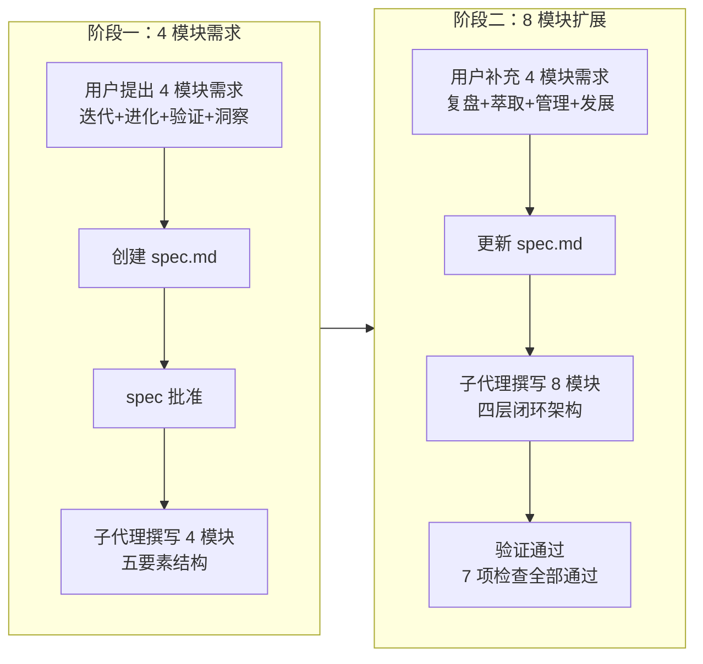

+++
id = "retrospective-report-system-planning-execution"
date = "2026-06-23"
type = "execution-retrospective"
source = "docs/retrospective/reports/retrospective-report-system-planning.md#二"
+++

# 二、复盘环节

## 2.1 实施过程回顾

## 2.2 关键节点分析

#### 决策 1：四层闭环架构设计

**决策依据**：将 8 个模块分为感知层（自我洞察 + 自我复盘）、认知层（自我萃取 + 自我进化）、执行层（自我迭代 + 自我验证）、治理层（自我管理 + 自我发展），形成闭环。模块间存在天然的"采集 → 分析 → 执行 → 统筹"数据流关系：

| 层级 | 模块 | 职责 |
|------|------|------|
| 感知层 | 自我洞察、自我复盘 | 采集数据与经验 |
| 认知层 | 自我萃取、自我进化 | 提炼知识与优化能力 |
| 执行层 | 自我迭代、自我验证 | 更新系统与保障稳定 |
| 治理层 | 自我管理、自我发展 | 统筹协调与战略规划 |

**技术挑战**：如何在单一 Mermaid 图中清晰表达四层间的数据流与闭环反馈关系。

**解决方案**：使用 `flowchart TB` + `subgraph` 分层呈现，实线箭头表示数据流，虚线箭头表示闭环反馈，保证视觉层次清晰。

#### 决策 2：统一五要素结构

**决策依据**：每个模块统一包含技术架构（文字 + Mermaid）、关键实现步骤（表格）、资源需求（人员 + 时长）、时间节点（里程碑）、预期成果指标（表格）五个要素。决策依据是统一结构降低认知成本，便于横向对比与扩展。

**技术挑战**：如何在保证内容深度的同时避免单章节过度膨胀。

**解决方案**：五要素中"关键实现步骤"与"预期成果指标"采用表格呈现，"技术架构"采用文字描述 + 可选 Mermaid 图，控制单模块行数在 25-35 行之间。

#### 决策 3：增量式需求扩展的应对

**决策依据**：用户补充 4 模块时，直接更新 spec 而非新建任务。决策依据是模块化设计与统一结构使扩展零成本——新增模块只需填充五要素模板，无需调整已有内容。

**技术挑战**：如何确保新增 4 模块与已有 4 模块在结构、风格、深度上保持一致。

**解决方案**：复用已建立的五要素结构模板，新增模块按相同结构填充；同时引入四层闭环架构对 8 模块重新组织，使新增模块自然融入整体架构。

## 2.3 执行情况与结果数据

| 指标 | 数据 |
|------|------|
| README 原始行数 | 182 |
| README 最终行数 | 438 |
| 新增行数 | 256 |
| 功能模块数 | 4 → 8（增量 4） |
| Mermaid 图表数 | 2（整体架构 + 自我迭代架构） |
| 验证检查项 | 7 项全部通过 |
| 链接校验 | 196 个引用零错误（含索引更新后新增引用） |
| 子代理调用 | 2 次（撰写 + 验证） |
| spec 更新次数 | 1 次（4 模块 → 8 模块） |

## 2.4 成功经验

#### 2.4.1 统一结构使增量扩展零成本

五要素统一结构（技术架构 + 关键实现步骤 + 资源需求 + 时间节点 + 预期成果指标）使 4 → 8 模块扩展时无需调整已有内容。新增 4 模块仅需填充模板，已有 4 模块保持原样，扩展过程零返工。这验证了"结构一致性比内容完整性更重要"的设计原则。

#### 2.4.2 四层闭环架构提供了清晰的模块组织框架

感知 → 认知 → 执行 → 治理的四层分类使 8 个模块的职责边界清晰，模块间的数据流关系通过 Mermaid 图一目了然。这一架构不仅组织了当前 8 模块，也为未来扩展预留了清晰的归属路径。

#### 2.4.3 Mermaid flowchart 保证渲染兼容性

整体架构图与自我迭代架构图均使用 `flowchart` 语法（TB/LR），在 AtomGit、GitHub、VS Code 预览等主流 Markdown 渲染器中均能正确渲染。避免了使用 `graph` 等兼容性较差的语法。

#### 2.4.4 子代理分工保证了质量

撰写子代理负责内容生成，验证子代理负责质量检查（链接校验、Mermaid 语法、五要素完整性、行数控制）。两次子代理调用形成了"生成 → 验证"的质量闭环，确保交付物符合 spec 要求。

## 2.5 存在问题

#### 2.5.1 需求一次性未明确

**问题**：用户分两次提出需求（先 4 模块，后补充 4 模块），导致 spec 需更新重审。

**根因**：用户在看到 4 模块的初步成果后，自然联想到补充 4 模块以形成完整体系。这是增量式需求的典型表现——用户需要看到部分成果才能明确完整需求。

**影响**：spec 更新与重审增加了约 10% 的协调成本，但模块化设计使实际执行成本接近零。

#### 2.5.2 八模块内容密度较高

**问题**：单章节 256 行包含 8 个模块的详细设计，内容密度较高，可能影响阅读体验。

**根因**：五要素结构虽然统一，但每个模块均包含技术架构、步骤表格、指标表格，信息量较大。8 模块 × 5 要素 = 40 个信息单元，单章节承载量偏重。

**影响**：读者需要分段阅读，无法快速浏览全貌。后续可考虑拆分为子文档或增加目录导航。

#### 2.5.3 时间节点与实际项目节奏未对齐

**问题**：模块时间节点（M1-M7）采用里程碑编号，但与实际项目迭代节奏未建立映射关系。

**根因**：spec 阶段未明确 M1-M7 对应的具体时间或迭代周期，仅作为相对顺序参考。

**影响**：时间节点目前仅具有规划意义，缺乏可执行性。后续需与项目实际迭代节奏对齐。

---

> **关联模块**：[project-overview.md](project-overview.md)、[insight-extraction.md](insight-extraction.md)、[export-suggestions.md](export-suggestions.md)