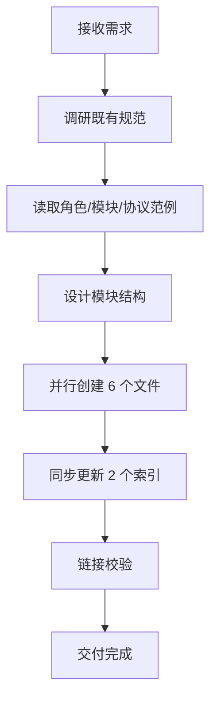
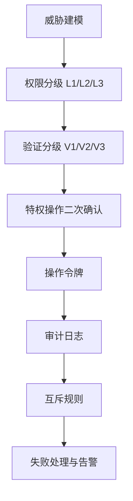
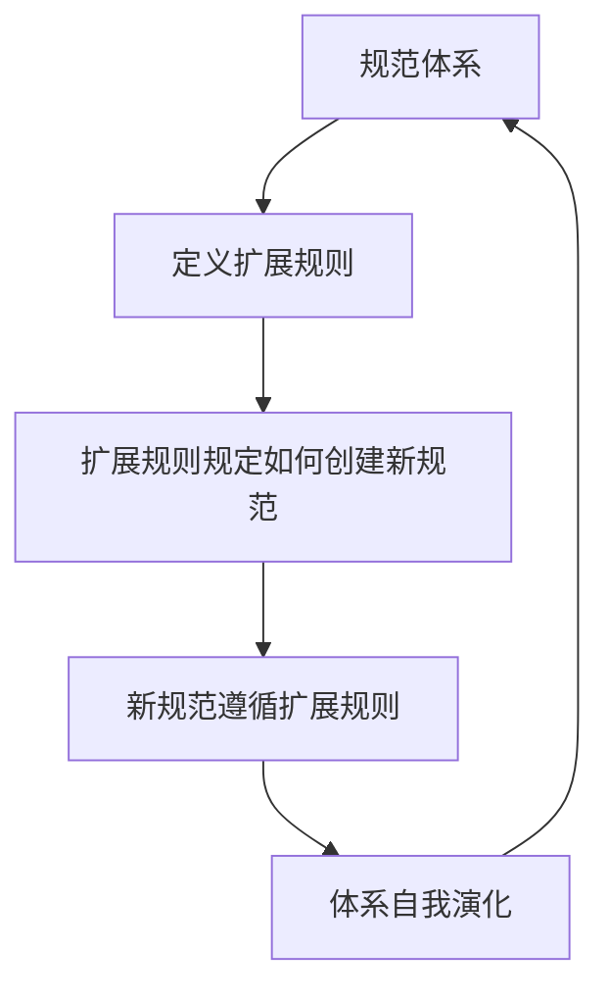

# 团队管理模块创建 — 项目复盘分析报告

> **项目名称**：团队管理功能模块（.agents/teams/）
> **复盘日期**：2026-06-23
> **项目周期**：单会话完成
> **报告类型**：项目结项复盘 + 洞察萃取
> **关联模块**：`docs/retrospective/reports/retrospective-report-agents-spec-system-comprehensive.md`、`docs/retrospective/patterns/methodology-patterns/review-insight-export-loop.md`

---

## 一、项目概述

### 1.1 项目背景

在已建立的智能体规范体系（`.agents/`）基础上，用户要求新增团队管理功能模块，支持团队管理员角色及其自动创建新角色的特权。该模块需覆盖团队生命周期管理、角色权限系统、管理员验证机制与新角色自动创建流程，并保障权限校验安全。

### 1.2 项目目标

1. 在 `.agents/teams/` 目录下建立完整的团队管理功能模块
2. 定义 team-admin 角色及其特权（含自动创建新角色）
3. 设计角色权限系统与管理员验证机制
4. 定义新角色自动创建的触发条件与执行流程
5. 遵循项目既有架构规范，保持代码结构清晰
6. 同步更新相关索引文件，确保模块可被发现

### 1.3 交付物清单

| 类别 | 文件 | 说明 |
|---|---|---|
| 新增 | `.agents/teams/team-admin.md` | 团队管理员角色定义（含特权清单与能力边界） |
| 新增 | `.agents/teams/team-management.md` | 团队数据模型与生命周期管理流程 |
| 新增 | `.agents/teams/permission-system.md` | RBAC 权限模型与三级权限分级 |
| 新增 | `.agents/teams/admin-verification.md` | V1/V2/V3 三级验证与操作令牌机制 |
| 新增 | `.agents/teams/role-auto-creation.md` | 4 类触发条件与 6 步创建执行流程 |
| 新增 | `.agents/teams/README.md` | 模块索引与概念关系图 |
| 修改 | `AGENTS.md` | 角色定义索引、能力边界声明、上下文路由表 |
| 修改 | `.agents/README.md` | 目录结构与职责说明表 |

**统计**：新增 6 个文件，修改 2 个文件，共计 8 个文件变更。

---

## 二、复盘环节

### 2.1 实施过程回顾

**时间线**：

| 阶段 | 动作 | 产出 |
|---|---|---|
| 调研 | 读取 orchestrator.md、architect.md、developer.md、self-management.md、self-evolution.md、handoff.md、messaging.md、conflict-resolution.md、feature-development.md、task-template.md 共 10 个既有文件 | 提取 TOML frontmatter 模式、Mermaid 流程图风格、YAML 数据模型规范 |
| 设计 | 确定模块拆分为 6 个原子文件 | 模块结构定稿 |
| 创建 | 并行调用 5 次 Write + 1 次 Write | 6 个模块文件创建完成 |
| 同步 | 3 次 Edit 更新 AGENTS.md，2 次 Edit 更新 .agents/README.md | 索引同步完成 |
| 验证 | 运行 check-links.py | 新文件零断链 |

### 2.2 关键节点分析

#### 关键决策 1：模块拆分为 6 个原子文件

- **决策依据**：遵循项目既有"原子化"原则（见 `three-tier-governance.md`），每个文件承担单一职责。
- **技术挑战**：需在权限系统、验证机制、角色创建三个文件间建立清晰的引用关系，避免循环依赖。
- **解决方案**：采用单向引用链——`permission-system.md` → `admin-verification.md` → `role-auto-creation.md`，`team-admin.md` 作为角色定义引用全部三者，`team-management.md` 引用权限系统与验证机制。

#### 关键决策 2：权限与验证分离设计

- **决策依据**：安全规范要求"策略与执行分离"原则。
- **技术挑战**：若将权限定义与验证逻辑合并在一个文件，会导致文件过大且职责混杂。
- **解决方案**：`permission-system.md` 定义"有什么权限"（策略层），`admin-verification.md` 定义"如何验证权限"（执行层），两者通过权限级别（L1/L2/L3 ↔ V1/V2/V3）建立映射。

#### 关键决策 3：新角色创建的触发条件设计

- **决策依据**：用户要求"自动创建新角色的权限"，但无限制的自动创建会导致角色膨胀。
- **技术挑战**：需在"管理员特权"与"防止滥用"间取得平衡。
- **解决方案**：定义 4 类触发条件（职责空白、能力缺失、负载溢出、架构演进），每类均有量化判定标准与依据来源，并要求 V3 双重验证 + 操作令牌。

### 2.3 执行情况与结果数据

| 指标 | 数值 |
|---|---|
| 新增文件数 | 6 |
| 修改文件数 | 2 |
| 文件变更总数 | 8 |
| Mermaid 流程图数 | 9 |
| YAML 数据模型数 | 4（团队、令牌、日志、触发报告） |
| TOML frontmatter 文件数 | 5（除 README 外均含） |
| 权限级别数 | 3（L1/L2/L3） |
| 验证级别数 | 3（V1/V2/V3） |
| 触发条件数 | 4 |
| 创建执行步骤数 | 6 |
| 链接校验结果 | 新文件零断链 |
| 既有断链（非本次引入） | 6（均位于 .trae/specs/） |

### 2.4 成功经验

1. **约定驱动创建，零决策成本**
   - 事实：通过先读取 10 个既有文件，提取出 TOML frontmatter 结构、Description/Responsibilities/Non-Goals 三段式正文、Mermaid 流程图风格、YAML 数据模型规范，后续 6 个文件的创建无需任何结构决策，仅需填充业务内容。
   - 经验：在规范体系内创建新模块时，"先读范例再创作"比"先设计再对齐"效率更高，因为既有文件本身就是最准确的模板。

2. **并行创建提升效率**
   - 事实：6 个模块文件通过 2 批并行 Write 调用完成（5+1），相比串行创建节省显著时间。
   - 经验：当文件间无写依赖（内容已设计完毕）时，并行创建是安全且高效的。

3. **索引同步作为交付的必要环节**
   - 事实：主动更新了 AGENTS.md 的角色定义索引、能力边界声明、上下文路由表，以及 .agents/README.md 的目录结构与职责说明。
   - 经验：新模块若不被索引引用，等于不存在。索引同步不是"可选优化"，而是"交付标准"。

4. **链接校验作为质量门禁**
   - 事实：创建完成后立即运行 check-links.py，确认新文件零断链。
   - 经验：既有工具链（check-links.py）是质量保障的基础设施，应在每次文档变更后执行。

### 2.5 存在问题

| 问题 | 根因分析 | 影响评估 | 严重度 |
|---|---|---|---|
| team-admin 角色定义位于 teams/ 而非 roles/ | roles/ 存放通用角色，teams/ 存放团队管理专属角色，存在位置歧义 | 角色查找时可能先查 roles/ 而遗漏 teams/ | 中 |
| 权限互斥规则未提供自动校验脚本 | 仅在规范中定义互斥关系，未实现自动化检查 | 互斥违规只能靠人工发现 | 中 |
| 操作令牌的签名机制未具体化 | 规范中提到"须包含签名"但未定义签名算法 | 令牌防伪能力依赖后续实现 | 低 |
| 团队数据文件存储路径未在 .gitignore 中声明 | team-management.md 提到 `.agents/teams/data/{team-id}.yaml` 但该目录尚不存在 | 运行时数据文件可能被误提交 | 低 |

---

## 三、洞察环节

### 3.1 关键发现

#### 发现 1：规范体系的"自举性"（Bootstrapping）

- **事实**：`role-auto-creation.md` 定义了创建新角色文件的规范，而它本身就是一个由 team-admin 角色定义的"角色相关文件"。即：规范定义了自身的演化规则。
- **深层含义**：一个成熟的规范体系应当具备"自举能力"——规范本身规定了如何扩展规范。这与编程语言中"元编程"的概念同构：`role-auto-creation.md` 是规范体系的"元规范"，它使得体系能够自我演化而不破坏一致性。

#### 发现 2：安全设计的"纵深防御"在规范层的映射

- **事实**：权限系统设计了三层（L1/L2/L3），验证机制对应三层（V1/V2/V3），角色创建设置了四类触发条件 + 双重验证 + 操作令牌 + 审计日志。
- **深层含义**：纵深防御（Defense-in-Depth）原则不仅适用于代码实现，同样适用于规范设计。在规范层就定义多层防护，使得后续实现天然具备安全基线。**安全不是实现阶段的事后补丁，而是设计阶段的一等公民**。

#### 发现 3：策略与执行的分离模式

- **事实**：`permission-system.md`（策略层：定义有什么权限）与 `admin-verification.md`（执行层：定义如何验证权限）分离设计。
- **深层含义**：这是"关注点分离"原则在安全领域的应用。策略变更（如新增权限级别）不影响验证逻辑，验证逻辑升级（如引入新令牌机制）不影响权限定义。**分离使得两部分可独立演化**，降低了维护耦合度。

#### 发现 4：约定复用的"零成本扩展"效应

- **事实**：本次创建 6 个文件，结构决策成本为零——全部沿用既有 TOML frontmatter、三段式正文、Mermaid 流程图、YAML 数据模型规范。
- **深层含义**：当一个规范体系足够成熟时，扩展它的边际成本趋近于"内容创作成本"，而非"结构设计成本 + 内容创作成本"。**规范的成熟度可用"扩展新模块时的结构决策数"来度量**——决策数越少，体系越成熟。

### 3.2 规律认知

#### 方法论 1：约定驱动创建模型（Convention-Driven Creation）

**规律**：在成熟规范体系内创建新模块时，最优路径是"先读范例、提取模板、填充内容"，而非"先设计结构、再对齐规范"。前者将结构决策成本降为零，后者则需反复调整。

**适用条件**：
- 体系内已有 ≥ 3 个同类文件可作为范例
- 范例间结构一致性高（如均使用 TOML frontmatter + 三段式正文）
- 新模块属于既有类别（如新角色、新协议、新工作流）

**与既有方法论的关系**：这是 `spec-driven-development.md`（先设计后实施）的补充——当体系成熟度足够高时，"范例即规格"，可跳过显式 spec 阶段。

#### 方法论 2：规范层的纵深防御模型（Spec-Level Defense-in-Depth）

**规律**：安全规范不应只定义"有什么权限"，还应定义"如何验证权限"、"如何防止滥用"、"如何追溯操作"。四个维度（权限定义、验证机制、防滥用、审计追溯）缺一不可。

**适用条件**：
- 模块涉及特权操作（如创建、删除、权限分配）
- 操作影响范围大（如团队解散、角色创建）
- 安全合规要求高

#### 方法论 3：自举规范模型（Self-Bootstrapping Specification）

**规律**：一个规范体系若要支持可持续演化，须包含"元规范"——定义如何扩展规范的规范。`role-auto-creation.md` 即为本体系的元规范，它规定了新角色文件的格式、触发条件、创建流程，使得体系可在不破坏一致性的前提下无限扩展。

**适用条件**：
- 规范体系需长期维护与扩展
- 扩展操作频繁（如角色、模块会持续增加）
- 一致性要求高（所有扩展须遵循统一格式）

### 3.3 潜在机会

| 机会 | 描述 | 价值 |
|---|---|---|
| 权限互斥自动校验工具 | 开发 check-permission-conflict.py，自动检测角色权限分配是否违反互斥规则 | 将规范层的互斥定义转化为可执行检查 |
| 角色创建自动化脚本 | 开发 create-role.py，根据触发报告自动生成角色文件并更新索引 | 落地 role-auto-creation.md 的执行流程 |
| 规范成熟度度量 | 建立"扩展新模块时的结构决策数"指标，量化规范体系成熟度 | 为规范体系优化提供数据驱动依据 |
| 自举规范检测 | 开发 check-bootstrapping.py，验证规范体系是否包含元规范 | 评估体系的可持续演化能力 |

---

## 四、导出环节

### 4.1 改进建议

| 问题 | 改进措施 | 优先级 | 预期效果 | 状态 |
|---|---|---|---|---|
| 角色位置歧义 | 在 roles/README.md 中增加"团队管理角色位于 teams/"的交叉引用说明 | 高 | 消除查找歧义 | 待规划 |
| 权限互斥无自动校验 | 开发 check-permission-conflict.py 脚本 | 中 | 互斥违规可自动检测 | 待规划 |
| 令牌签名机制未具体化 | 在 admin-verification.md 中补充签名算法说明（如 HMAC-SHA256） | 低 | 令牌防伪能力明确 | 待规划 |
| 团队数据目录未声明 | 在 .gitignore 中增加 `.agents/teams/data/` 规则 | 低 | 防止运行时数据误提交 | 待规划 |
| 规范成熟度无度量 | 建立"结构决策数"指标并纳入规范体系评估 | 低 | 规范优化有数据依据 | 待规划 |

### 4.2 行动计划

| 优先级 | 改进项 | 具体措施 | 建议时间 | 状态 |
|---|---|---|---|---|
| 高 | 角色位置交叉引用 | 在 roles/README.md 增加指向 teams/team-admin.md 的说明 | 2026-06-24 | 待规划 |
| 中 | 权限互斥校验工具 | 开发 check-permission-conflict.py，解析角色权限分配并检测互斥违规 | 2026-06-25 | 待规划 |
| 低 | 令牌签名机制细化 | 补充 HMAC-SHA256 签名算法说明与令牌生成/验证流程 | 2026-06-26 | 待规划 |
| 低 | 团队数据目录声明 | 在 .gitignore 增加 `.agents/teams/data/` 规则 | 2026-06-24 | 待规划 |

### 4.3 后续优化方向

1. **短期**：将规范层定义的权限互斥规则、验证流程落地为可执行脚本，实现"规范即代码"。
2. **中期**：建立权限变更的自动化校验流水线，在角色分配或权限调整时自动触发互斥检查与审计日志。
3. **长期**：建立规范成熟度度量体系，用"扩展新模块时的结构决策数"量化规范体系的演化健康度。

---

## 五、洞察总结

本次团队管理模块创建任务验证了三个核心范式：

1. **约定即模板**：在成熟规范体系内，既有文件本身就是最准确的创建模板。扩展的边际成本趋近于"内容创作成本"，结构决策成本为零。**规范成熟度 = 1 / 扩展时的结构决策数**。

2. **安全设计前置**：纵深防御不应是实现阶段的事后补丁，而应是规范设计阶段的一等公民。在规范层定义权限分级、验证分级、互斥规则、审计追溯，使后续实现天然具备安全基线。

3. **规范的自举性**：一个可持续演化的规范体系须包含"元规范"——定义如何扩展规范的规范。`role-auto-creation.md` 使本体系具备自我演化能力，可在不破坏一致性的前提下无限扩展。

> **一句话总结**：本次任务证明，当规范体系成熟到"范例即模板"时，扩展新模块的本质是"内容填充"而非"结构设计"；而安全规范的自举性设计，使体系具备了可持续演化的基因。

---

> **报告编制**：本文档基于团队管理模块创建任务的全过程数据编制，所有数据均有事实依据支撑。报告采用"事实 → 分析 → 洞察 → 建议"的逻辑结构，确保复盘结论可追溯、改进建议可执行。
