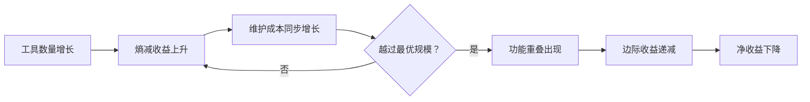

# 工具熵减度量体系揭示的非线性优化曲线

> **来源**：[综合复盘洞察·萃取报告](retrospective-comprehensive-20260623/insight-extraction.md#L29-L35) · 发现三
> **关联模式**：[工具自动化决策模型](../patterns/methodology-patterns/tool-automation-decision-model.md)
> **生成日期**：2026-06-24

---

## 一、核心发现

工具开发存在最优规模。每个新验证脚本在解决特定摩擦点的同时，也引入了新的维护成本。当工具链规模超过一定阈值后，边际熵减收益开始下降，出现功能重叠，新增工具的净收益趋近于零甚至转为负值。

## 二、非线性曲线的形成机制



### 2.1 熵减收益曲线

每个工具定向削减一类特定的熵（重复性手动维护成本）：

| 工具 | 削减的熵类型 | 手动总成本（2年） | ROI |
|------|------------|-----------------|-----|
| check-links.py | 链接断裂熵 | 21,900 分钟 | 243x |
| generate-nav.py | 导航维护熵 | 2,600 分钟 | 43x |
| check-move.py | 路径迁移熵 | 480 分钟 | 6x |
| check-gitignore.py | 依赖泄漏熵 | 2,190 分钟 | 55x |
| ci-check.ps1 | 检查遗漏熵 | 10,950 分钟 | 365x |

### 2.2 维护成本曲线

每个工具引入的隐性成本包括：

- **测试成本**：脚本本身需要被测试、被更新
- **适配成本**：规范变更时需要同步更新工具
- **学习成本**：新成员需要理解每个工具的用途和边界
- **重叠成本**：功能相似的多个工具造成维护工作重复

### 2.3 实证数据

本项目在脚本从 3 个增长到 7 个的过程中，观察到以下现象：

- **功能重叠**：`check-role-permissions.py` 与 `check-spec-consistency.py` 存在约 30% 的功能重叠，两者均执行"一致性校验"，仅入参和输出格式不同
- **边际下降**：第 6-7 个脚本的熵减 ROI 明显低于前 3 个

## 三、最优规模阈值

根据本项目实证数据，工具链的最优规模约为 **5-6 个脚本**。超过此阈值后，应优先考虑以下策略：

| 策略 | 适用场景 | 示例 |
|------|---------|------|
| 合并重构 | 多个工具存在 ≥ 30% 功能重叠 | 将 check-role-permissions 与 check-spec-consistency 合并为统一的 spec-validator |
| 配置化 | 多个工具共享相同的执行框架但参数不同 | 将多个 check-*.py 统一为单一的 check 命令 + 配置文件 |
| 优先级排序 | 资源有限时聚焦高 ROI 工具 | 优先维护 ROI > 10x 的工具，低 ROI 工具降级为手动检查清单 |

## 四、量化决策模型

该发现已被纳入 [工具自动化决策模型](../patterns/methodology-patterns/tool-automation-decision-model.md)，核心公式为：

```
手动总成本 = 操作频率 × 单次耗时 × 预期生命周期
熵减收益   = 手动总成本 - 工具开发成本
工具 ROI   = 熵减收益 / 工具开发成本
```

### 决策规则

| 条件 | 决策 |
|------|------|
| 手动执行次数 < 3 | 继续观察，不开发工具 |
| ROI < 3 | 优先流程改进，而非自动化 |
| ROI ≥ 3 且工具链 < 6 | 启动工具开发 |
| ROI ≥ 3 但工具链 ≥ 6 | 先审计功能重叠，优先合并而非新增 |

## 五、实践指导

### 5.1 工具开发前

1. 套用"手动总成本"公式估算投入产出
2. 确认非一次性任务、非创意性工作、非需人工判断的决策
3. 检查是否与现有工具存在功能重叠

### 5.2 工具链运行中

1. 定期审计功能重叠度（建议每季度一次）
2. 当工具链超过 6 个脚本时，启动合并评估
3. 工具上线后记录实际频率和耗时，定期校准 ROI

### 5.3 工具退役

以下情况应考虑退役工具：

- ROI 持续低于 1x（维护成本超过收益）
- 功能已被其他工具完全覆盖
- 所解决的问题已不再存在（规范结构稳定后不再需要迁移工具）

## 六、深层含义

这条非线性曲线揭示了一个反直觉的规律：**自动化本身也存在规模不经济**。在工具链建设初期，"每新增一个工具都能带来显著熵减"；进入成熟期后，"每新增一个工具都可能制造新的熵"。治理的关键不在于工具数量，而在于在最优规模附近找到动态平衡点。

---

> **关联文档**：
> - [综合复盘洞察·萃取报告](retrospective-comprehensive-20260623/insight-extraction.md)
> - [工具自动化决策模型](../patterns/methodology-patterns/tool-automation-decision-model.md)
> - [验证与自动化](../../verification-automation.md)
