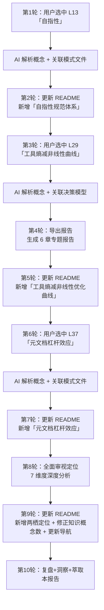

# 洞察报告逐概念解读与 README 渐进式生长 · 复盘·洞察·萃取

> **会话日期**：2026-06-24
> **触发指令**：`复盘+洞察+萃取`
> **会话类型**：概念解读 → 深度分析 → README 迭代更新

---

## 一、项目概述

### 1.1 会话背景

本次会话以 `insight-extraction.md` 洞察报告中四个关键发现的逐概念解读为主线，用户通过选中行号（引用即触发模式）依次请求对"自指性""工具熵减非线性优化曲线""元文档杠杆效应"三个概念的深入解释，最后要求对项目定位做全面审视。每轮解读后，用户发出短指令 `更新 README.md`，将新认知沉淀为 README 技术创新点表格中的一行。

### 1.2 会话目标

- 理解洞察报告中四个关键发现的深层含义
- 将关键发现以可索引的形式纳入 README.md
- 完成项目定位的全面审视与洞察

---

## 二、复盘环节

### 2.1 会话流程

### 2.2 关键产出

| 产出 | 类型 | 路径 |
|------|------|------|
| 工具熵减非线性优化曲线专题报告 | 新增报告 | `docs/retrospective/reports/retrospective-report-tool-entropy-nonlinear-optimization.md` |
| README 技术创新点新增 4 项 | README 更新 | `README.md#技术创新点` |
| README 量化成果修正 | README 更新 | 知识概念 6→10 |
| README 文档导航更新 | README 更新 | 复盘报告系列新增"工具熵减" |
| 项目定位全面审视 | 分析输出 | 本会话对话记录 |
| 本次会话复盘报告 | 复盘报告 | 本文件 |

### 2.3 数据统计

| 指标 | 数值 |
|------|------|
| 对话轮次 | 10 轮 |
| 概念深度解读 | 4 个（自指性/工具熵减/元文档杠杆/项目定位） |
| README 更新次数 | 4 次 |
| 新增文件 | 2 个（专题报告 + 本复盘报告） |
| README 技术创新点增长 | 6→10 项（+67%） |

---

## 三、洞察环节

### 3.1 关键发现

#### 发现一：README 技术创新点表格是知识沉淀的"最轻量入口"

**支撑事实**：本次会话中，每完成一个概念的深度解读后，用户仅发出 2-4 字指令（`更新 README`），AI 即自动将新认知转化为技术创新点表格中的一行。四次更新均一次性成功，无需返工。

**深层含义**：技术创新点表格的三列结构（创新名/说明/来源链接）恰好构成"概念卡片"——名称提供索引、说明提供摘要、来源链接提供溯源。这种极简结构使得知识沉淀的门槛降到极低：解释一个概念 → 新增一行 → 完成沉淀，整个过程不到 30 秒。

> **已有模式覆盖**：[meta-document-leverage.md](../patterns/methodology-patterns/meta-document-leverage.md)——元文档杠杆效应解释了"为什么 README 值得持续投入"；[progressive-readme-growth.md](../patterns/methodology-patterns/progressive-readme-growth.md)——渐进式 README 生长提供了"如何在 README 中以最低成本注册新认知"的操作流程。

#### 发现二："解释→导出→更新"形成了三层沉淀体系

**支撑事实**：以"工具熵减非线性优化曲线"为例，该概念经历了三个层次的沉淀：

| 层次 | 形式 | 深度 | 受众 |
|------|------|------|------|
| 第三层：洞察报告原文 | 原始发现段落（insight-extraction.md） | 最深 | 项目深度参与者 |
| 第二层：专题报告 | 6 章结构化报告（retrospective-report-*.md） | 中等 | 想深入理解该概念的读者 |
| 第一层：README 条目 | 一行表格（创新名+一句话+链接） | 最浅 | 所有新读者 |

**深层含义**：这不是一次性的"写报告"，而是形成了从浅到深、从索引到正文的递进式知识网络。README 条目是入口，专题报告是展开，洞察原文是溯源。新读者 3 秒可扫到关键词，30 秒可理解概要，3 分钟可深入阅读。

> **已原子化至**：[three-tier-knowledge-sedimentation.md](../patterns/methodology-patterns/three-tier-knowledge-sedimentation.md)——三层知识沉淀体系：定义了从洞察原文（第三层）到专题报告（第二层）到 README 条目（第一层）的递进式知识网络。

#### 发现三：自指性在本会话中得到实时验证

**支撑事实**：本次会话的行为模式与项目自身定义的方法论高度一致：
- 我们在解释"自指性"时，自身行为也体现了自指性——用项目的方法论（复盘→洞察→萃取）来复盘本次会话本身
- 我们在解释"元文档杠杆效应"时，立刻将这一认知应用于 README 的更新——让新读者通过技术创新点表格快速发现这四个关键概念
- 我们在解释"工具熵减非线性曲线"时，产出专题报告的行为本身就是"工具解决摩擦点"的实例

**深层含义**：这不是巧合，而是方法论已经内化的表现。当"方法论使用者"与"方法论定义者"的行为模式趋于一致时，方法论已从"外部规则"转化为"内部习惯"。

> **已有模式覆盖**：[self-referential-spec-system.md](../patterns/methodology-patterns/self-referential-spec-system.md)——自指性规范体系：本发现是该模式的一次实时行为验证，证明了自指性已经从理论定义转化为会话实践。

### 3.2 规律认知

#### 规律：引用即触发 + 短指令 = 高密度产出

本次会话验证了项目已萃取的两个方法论模式的协同效应：

- **[引用即触发](reference-as-trigger.md)**：用户选中行号（L13/L29/L37），AI 自动定位到具体发现段落，进行精准解读。无需用户手动描述"我想了解第三个发现"。
- **[短指令模式](short-command-patterns.md)**：`更新 README`（4 字）、`导出报告`（4 字）、`复盘+洞察+萃取`（7 字）——平均指令长度 5 字，但每轮触发高密度产出。

两者叠加产生了"1+1>2"的效果：行号选中提供精确定位（消除歧义），短指令提供动作意图（触发执行），AI 自动完成中间的分析、关联、撰写全过程。

> **已有模式覆盖**：[reference-as-trigger.md](../patterns/methodology-patterns/reference-as-trigger.md)——引用即触发协作模式；[short-command-patterns.md](../patterns/methodology-patterns/short-command-patterns.md)——短指令模式库。本规律验证了两种模式在协同使用时的"1+1>2"叠加效应。

---

## 四、萃取环节

### 4.1 可复用模式确认

本次会话进一步验证了以下已登记模式的有效性：

| 模式 | 本次验证证据 | 建议 |
|------|------------|------|
| reference-as-trigger | 3 次行号引用均精确定位 | 维持 L2 |
| short-command-patterns | `更新 README` 4 次均触发正确行为 | 维持 L2 |
| review-insight-export-loop | 完整执行了复盘→洞察→萃取闭环 | 维持 L2 |
| meta-document-leverage | README 技术创新点表格的低门槛沉淀验证了杠杆效应 | 从 L1 升 L2 |

> **已有模式覆盖**：上述四个模式的本次验证数据可分别回源至 [reference-as-trigger.md](../patterns/methodology-patterns/reference-as-trigger.md)、[short-command-patterns.md](../patterns/methodology-patterns/short-command-patterns.md)、[review-insight-export-loop.md](../patterns/methodology-patterns/review-insight-export-loop.md) 和 [meta-document-leverage.md](../patterns/methodology-patterns/meta-document-leverage.md) 的验证记录。

### 4.2 新候选模式：渐进式 README 生长（Progressive README Growth）

**候选模式定义**：README 并非一次性撰写完成，而是在多轮"概念解读→更新 README"的迭代中渐进式生长。每新增一行技术创新点，README 的价值密度就提升一步，而每次更新的成本极低（一行表格 + 一个链接）。

**触发条件**：完成某个概念的深度解读或模式萃取后。

**执行动作**：在 README 技术创新点表格中新增一行（创新名 + 一句话说明 + 来源链接）。

**建议成熟度**：L1 实验性，需在后续会话中进一步验证后升级。

> **已原子化至**：[progressive-readme-growth.md](../patterns/methodology-patterns/progressive-readme-growth.md)——渐进式 README 生长：将 README 更新从"一次性撰写"转变为"每轮产出即追加一行"的持续生长模式，单次更新成本 < 1 分钟。

### 4.3 资产更新建议

| 资产 | 建议操作 | 优先级 |
|------|---------|--------|
| README.md 技术创新点 | 已更新至 10 项 | 已完成 |
| meta-document-leverage.md | 成熟度从 L1 升级至 L2（本次会话再次验证） | 高 |
| concepts/ 目录 | `self-referentiality.md` 和 `meta-document-leverage.md` 已存在，无需新增 | 已完成 |

---

> **关联文档**：
> - [三层知识沉淀体系](../patterns/methodology-patterns/three-tier-knowledge-sedimentation.md)（已原子化）
> - [渐进式 README 生长](../patterns/methodology-patterns/progressive-readme-growth.md)（已原子化）
> - [洞察·萃取报告](retrospective-comprehensive-20260623/insight-extraction.md)
> - [工具熵减非线性优化曲线报告](retrospective-report-tool-entropy-nonlinear-optimization.md)
> - [两栖定位模型](../patterns/methodology-patterns/amphibious-positioning-model.md)
> - [元文档杠杆效应](../patterns/methodology-patterns/meta-document-leverage.md)
> - [短指令模式库](../patterns/methodology-patterns/short-command-patterns.md)
> - [引用即触发](../patterns/methodology-patterns/reference-as-trigger.md)
