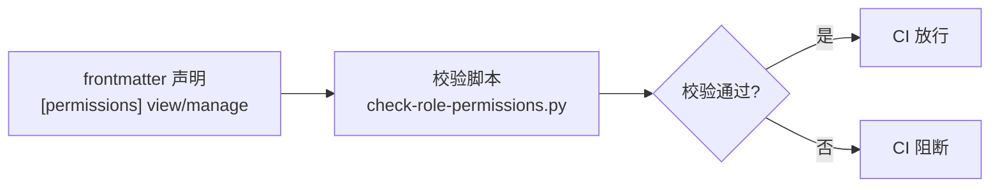
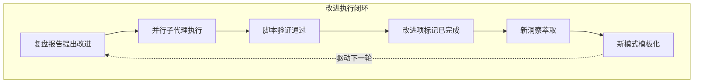

+++
id = "retrospective-report-cofounder-improvement-execution-insight"
date = "2026-06-23"
type = "insight-extraction"
source = "docs/retrospective/reports/retrospective-report-cofounder-improvement-execution.md#二"
+++

# 三、洞察环节

## 3.1 关键发现

### 洞察 1：声明即校验——文档型治理的技术力跃迁

```
改进前：声明式权限（依赖人工遵循）
    [permissions] view = "core-team"  →  人工自觉遵循
    [permissions] manage = "co-founders"  →  人工自觉遵循

改进后：声明即校验（脚本自动验证）
    [permissions] view = "core-team"  →  脚本校验字段存在性
    [permissions] manage = "co-founders"  →  脚本校验字段完整性
```

**核心发现**：复盘报告指出"权限控制为声明式而非执行式"是存在问题，改进措施是开发校验脚本。执行后，权限治理从"声明式约束 + 人工遵循"升级为"声明即校验"——脚本自动验证 `[permissions]` 表的完整性与合法性。

**深层含义**：文档型治理系统（无运行时环境）的权限控制存在三个成熟度层级：

| 层级 | 机制 | 强制力 |
|------|------|--------|
| L1 声明式 | frontmatter 元数据声明 | 无（依赖人工） |
| L2 校验式 | 脚本自动检查声明完整性 | 中（CI 可阻断） |
| L3 执行式 | 运行时拦截 | 强（技术强制） |

本次改进使权限治理从 L1 跃迁至 L2。L3 在文档型系统中无法实现，但 L2 已足够——通过 CI 集成，校验失败可阻断提交，形成技术强制力。这是文档型治理系统能达到的最高成熟度。

### 洞察 2：隐式默认→显式声明的数据一致性闭环

```
改进前：5 个角色文件未声明 tier → 依赖默认值 "standard"（隐式）
改进后：5 个角色文件显式声明 tier = "standard" → 数据自描述（显式）
```

**核心发现**：零侵入扩展范式（可选字段 + 默认值）在扩展阶段是优势——现有文件零修改。但在治理阶段是劣势——存在"显式声明"与"隐式默认"两种表达方式，数据一致性不完整。补充显式声明后，所有角色文件的 tier 字段表达方式统一。

**深层含义**：零侵入扩展与显式声明存在**阶段性的张力**——扩展阶段追求零侵入（最小改动），治理阶段追求显式声明（数据自描述）。这是"扩展效率"与"治理完整性"的权衡。最优策略是：**扩展时零侵入，稳定后补充显式声明**，形成"先扩展后治理"的两阶段闭环。

### 洞察 3：模板化使一次性设计变为可复用资产

```
改进前：联合创始角色标记方案 → 仅存于复盘报告（一次性设计）
改进后：role-marker-design-template.md → 可复用模板（可复用资产）
```

**核心发现**：复盘报告萃取了"双要素标记方案"（徽章 + 文字前缀），但仅以报告章节形式存在。模板化后，该方案成为独立文件，未来新增特殊角色可直接复用模板，无需重新设计。

**深层含义**：知识存在三种形态，价值递增：

| 形态 | 载体 | 复用成本 | 价值 |
|------|------|---------|------|
| 经验 | 隐性记忆 | 高（需重新思考） | 低 |
| 文档 | 报告章节 | 中（需定位提取） | 中 |
| 模板 | 独立文件 | 低（直接填充） | 高 |

模板化是知识从"文档"到"资产"的跃迁——将"需要理解才能复用"变为"填充即可复用"。这是知识工程的核心价值路径。

### 洞察 4：复盘→执行零延迟闭环的再次验证

```
复盘报告提出 3 项改进 → 4 子代理并行执行 → 验证通过 → 改进项状态标记"已完成"
     ↑                                                              |
     └────────────── 闭环反馈 ──────────────────────────────────────┘
```

**核心发现**：从复盘报告提出改进建议到全部执行完毕，整个过程在一次会话中完成，零延迟。问题识别者即解决者，"复盘→执行"的边界消失。

**深层含义**：这是第二次验证"复盘→执行零延迟闭环"（首次验证见 retrospective-report-insight-execution.md）。两次验证证明这不是偶然现象，而是 AI 协作模式的固有特性——当复盘报告包含可执行的行动建议，且执行环境具备工具能力时，闭环延迟趋近于零。

## 3.2 可复用模式

### 模式 1：声明即校验模式（L2 治理成熟度）

- **模式名称**：声明即校验（Declare-and-Verify）
- **结构**：



- **适用场景**：任何文档型治理系统的权限声明、配置声明、元数据声明完整性校验
- **复用方式**：在 frontmatter 声明结构化字段，开发正则解析脚本校验字段存在性与合法性，接入 CI 实现技术强制
- **来源**：本次 check-role-permissions.py 开发
- **关联模块**：`concepts/meta-document.md`、`patterns/code-patterns/three-tier-check-tool.md`

### 模式 2：先扩展后治理的两阶段闭环

- **模式名称**：先扩展后治理（Expand-then-Govern）
- **结构**：

| 阶段 | 目标 | 策略 | 产物 |
|------|------|------|------|
| 扩展阶段 | 快速引入新功能 | 可选字段 + 默认值（零侵入） | 现有文件零修改 |
| 治理阶段 | 数据一致性 | 补充显式声明 | 所有文件统一表达 |

- **适用场景**：任何需要向后兼容的文档型数据模型扩展，包括角色管理、配置管理、元数据扩展
- **复用方式**：扩展时使用可选字段 + 默认值实现零侵入，功能稳定后批量补充显式声明消除隐式默认
- **来源**：本次为 5 个角色文件补充 `tier = "standard"` 显式声明
- **关联模块**：`retrospective-report-cofounder-role-marker.md`（零侵入扩展范式的治理阶段）

### 模式 3：知识形态三阶跃迁

- **模式名称**：经验→文档→模板（Experience→Document→Template）
- **结构**：


- **适用场景**：任何可复用的设计方案、架构模式、工作流程的知识工程
- **复用方式**：复盘时萃取经验为文档章节，稳定后模板化为独立文件，后续任务直接填充模板
- **来源**：本次 role-marker-design-template.md 模板化
- **关联模块**：`patterns/methodology-patterns/retrospective-knowledge/review-insight-export-loop.md`

## 3.3 规律总结



**核心规律**：改进执行闭环的每一轮都在积累两类资产——**工具资产**（校验脚本）与**知识资产**（可复用模板）。工具资产增强技术强制力（L1→L2），知识资产降低复用成本（经验→模板）。两类资产的复利效应使系统的自我治理能力持续提升。

---