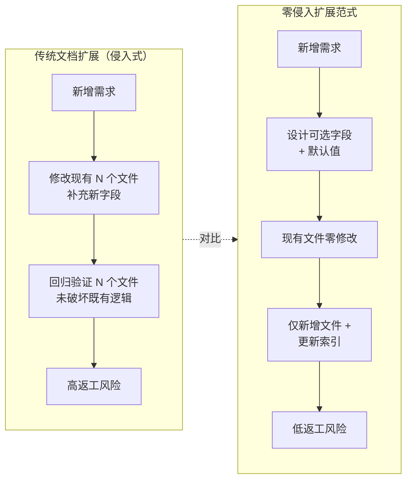

# 三、洞察环节

## 3.1 关键发现

#### 发现 1：文档型数据模型的"零侵入扩展"范式

**支撑事实**：通过引入可选字段 `tier`（默认值 `standard`）与可选表 `[permissions]`，现有 5 个角色文件零修改即实现向后兼容。新增联合创始角色仅需创建 1 个新文件 + 更新 2 个索引文件。

**深层含义**：文档型数据模型（TOML frontmatter + Markdown）的扩展应遵循"可选字段 + 默认值"范式。这与关系型数据库的 `ALTER TABLE ADD COLUMN ... DEFAULT` 机制异曲同工，但更轻量——无需迁移脚本，无需停机。这一范式可推广至任何基于 frontmatter 的文档体系扩展。

#### 发现 2：视觉标记的"双点一致"原则

**支撑事实**：联合创始角色标记在索引清单（README.md 表格"层级标记"列）与详情页（co-founder.md 标题）两处保持一致，均包含 🏛️ 徽章与"联合创始"文字。用户无论从索引浏览还是直接打开详情，均能立即识别角色层级。

**深层含义**：视觉标记的一致性不应依赖单一呈现点。在文档体系中，"索引"与"详情"是用户接触信息的两个主要入口，标记必须在两处同时存在且保持一致。这是"双点一致"原则——任何角色标识都应在索引层与详情层双重呈现，避免"仅在详情页标记"导致的索引层辨识盲区。

#### 发现 3：权限控制的"声明即治理"模式

**支撑事实**：`[permissions]` 表通过 `view = "core-team"` 与 `manage = "co-founders"` 声明权限边界，README.md"权限控制"章节以表格形式人类可读地呈现同一信息。权限治理通过"元数据声明 + 文档说明"双层表达实现。

**深层含义**：在无运行时环境的文档系统中，权限控制的本质是"声明即治理"——通过结构化元数据声明权限边界，配合人工流程遵循。这与代码系统中的 RBAC（基于角色的访问控制）在理念上一致，但实现形态从"运行时拦截"转变为"声明式约束 + 流程遵循"。这一模式适用于任何文档型管理系统的权限设计。

#### 发现 4：Spec-driven 闭环的"上下文加载"前置价值

**支撑事实**：在编写 spec 前，完整读取了 5 个现有角色文件（README.md、orchestrator.md、architect.md、developer.md、tester.md），充分理解了 frontmatter 结构、正文三段式规范与索引表格格式。这一前置上下文加载使 spec 一次批准即执行无返工。

**深层含义**：Spec-driven 开发的效率瓶颈往往不在 spec 编写本身，而在上下文加载的充分性。充分理解现有体系后编写的 spec，其执行返工率趋近于零。这是"磨刀不误砍柴工"在 spec-driven 开发中的具体体现——上下文加载投入与执行返工成本呈反比。

## 3.2 规律认知

**文档型数据模型扩展的"侵入式 vs 零侵入"曲线**：传统侵入式扩展中，每次新增字段需修改所有现有文件并回归验证，成本随文件数线性增长（O(n)）。零侵入扩展范式中，通过"可选字段 + 默认值"设计，现有文件零修改，扩展成本恒定为"新增文件 + 更新索引"（O(1)）。当文件数超过 3 个时，零侵入范式的总成本显著低于侵入式扩展。

## 3.3 潜在机会

- **`tier` 字段可扩展为多层级角色体系**：当前仅 `co-founder` 与 `standard` 两级，未来可扩展 `core`（核心）、`contributor`（贡献者）等层级，形成完整的角色层级体系
- **`[permissions]` 表可萃取为权限声明标准模式**：`view` + `manage` 双字段结构可复用于任何需要权限声明的文档型管理对象
- **视觉标记方案可模板化**：🏛️ 徽章 + `[文字前缀]` 的双要素标记方案可萃取为角色标记模板，供未来新增特殊角色复用
- **权限声明可接入校验工具**：未来可开发脚本自动校验 `[permissions]` 表的完整性与一致性，实现"声明即校验"

---