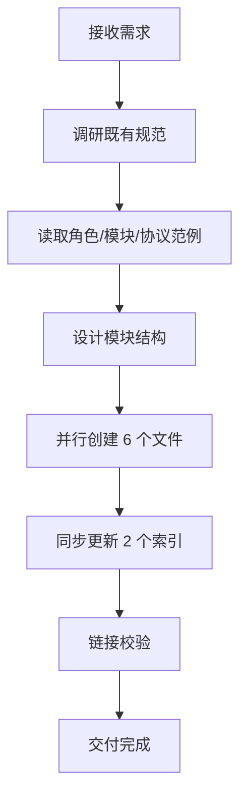

# 二、复盘环节

## 2.1 实施过程回顾

**时间线**：

| 阶段 | 动作 | 产出 |
|---|---|---|
| 调研 | 读取 orchestrator.md、architect.md、developer.md、self-management.md、self-evolution.md、handoff.md、messaging.md、conflict-resolution.md、feature-development.md、task-template.md 共 10 个既有文件 | 提取 TOML frontmatter 模式、Mermaid 流程图风格、YAML 数据模型规范 |
| 设计 | 确定模块拆分为 6 个原子文件 | 模块结构定稿 |
| 创建 | 并行调用 5 次 Write + 1 次 Write | 6 个模块文件创建完成 |
| 同步 | 3 次 Edit 更新 AGENTS.md，2 次 Edit 更新 .agents/README.md | 索引同步完成 |
| 验证 | 运行 check-links.py | 新文件零断链 |

## 2.2 关键节点分析

#### 关键决策 1：模块拆分为 6 个原子文件

- **决策依据**：遵循项目既有"原子化"原则（见 `three-tier-governance.md`），每个文件承担单一职责。
- **技术挑战**：需在权限系统、验证机制、角色创建三个文件间建立清晰的引用关系，避免循环依赖。
- **解决方案**：采用单向引用链——`permission-system.md` → `admin-verification.md` → `role-auto-creation.md`，`team-admin.md` 作为角色定义引用全部三者，`team-management.md` 引用权限系统与验证机制。

#### 关键决策 2：权限与验证分离设计

- **决策依据**：安全规范要求"策略与执行分离"原则。
- **技术挑战**：若将权限定义与验证逻辑合并在一个文件，会导致文件过大且职责混杂。
- **解决方案**：`permission-system.md` 定义"有什么权限"（策略层），`admin-verification.md` 定义"如何验证权限"（执行层），两者通过权限级别（L1/L2/L3 ↔ V1/V2/V3）建立映射。

#### 关键决策 3：新角色创建的触发条件设计

- **决策依据**：用户要求"自动创建新角色的权限"，但无限制的自动创建会导致角色膨胀。
- **技术挑战**：需在"管理员特权"与"防止滥用"间取得平衡。
- **解决方案**：定义 4 类触发条件（职责空白、能力缺失、负载溢出、架构演进），每类均有量化判定标准与依据来源，并要求 V3 双重验证 + 操作令牌。

## 2.3 执行情况与结果数据

| 指标 | 数值 |
|---|---|
| 新增文件数 | 6 |
| 修改文件数 | 2 |
| 文件变更总数 | 8 |
| Mermaid 流程图数 | 9 |
| YAML 数据模型数 | 4（团队、令牌、日志、触发报告） |
| TOML frontmatter 文件数 | 5（除 README 外均含） |
| 权限级别数 | 3（L1/L2/L3） |
| 验证级别数 | 3（V1/V2/V3） |
| 触发条件数 | 4 |
| 创建执行步骤数 | 6 |
| 链接校验结果 | 新文件零断链 |
| 既有断链（非本次引入） | 6（均位于 .trae/specs/） |

## 2.4 成功经验

1. **约定驱动创建，零决策成本**
   - 事实：通过先读取 10 个既有文件，提取出 TOML frontmatter 结构、Description/Responsibilities/Non-Goals 三段式正文、Mermaid 流程图风格、YAML 数据模型规范，后续 6 个文件的创建无需任何结构决策，仅需填充业务内容。
   - 经验：在规范体系内创建新模块时，"先读范例再创作"比"先设计再对齐"效率更高，因为既有文件本身就是最准确的模板。

2. **并行创建提升效率**
   - 事实：6 个模块文件通过 2 批并行 Write 调用完成（5+1），相比串行创建节省显著时间。
   - 经验：当文件间无写依赖（内容已设计完毕）时，并行创建是安全且高效的。

3. **索引同步作为交付的必要环节**
   - 事实：主动更新了 AGENTS.md 的角色定义索引、能力边界声明、上下文路由表，以及 .agents/README.md 的目录结构与职责说明。
   - 经验：新模块若不被索引引用，等于不存在。索引同步不是"可选优化"，而是"交付标准"。

4. **链接校验作为质量门禁**
   - 事实：创建完成后立即运行 check-links.py，确认新文件零断链。
   - 经验：既有工具链（check-links.py）是质量保障的基础设施，应在每次文档变更后执行。

## 2.5 存在问题

| 问题 | 根因分析 | 影响评估 | 严重度 |
|---|---|---|---|
| team-admin 角色定义位于 teams/ 而非 roles/ | roles/ 存放通用角色，teams/ 存放团队管理专属角色，存在位置歧义 | 角色查找时可能先查 roles/ 而遗漏 teams/ | 中 |
| 权限互斥规则未提供自动校验脚本 | 仅在规范中定义互斥关系，未实现自动化检查 | 互斥违规只能靠人工发现 | 中 |
| 操作令牌的签名机制未具体化 | 规范中提到"须包含签名"但未定义签名算法 | 令牌防伪能力依赖后续实现 | 低 |
| 团队数据文件存储路径未在 .gitignore 中声明 | team-management.md 提到 `.agents/teams/data/{team-id}.yaml` 但该目录尚不存在 | 运行时数据文件可能被误提交 | 低 |

---