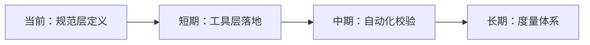

# 四、导出环节

## 4.1 改进建议

| 问题 | 改进措施 | 优先级 | 预期效果 | 状态 |
|---|---|---|---|---|
| 角色位置歧义 | 在 roles/README.md 中增加"团队管理角色位于 teams/"的交叉引用说明 | 高 | 消除查找歧义 | 待规划 |
| 权限互斥无自动校验 | 开发 check-permission-conflict.py 脚本 | 中 | 互斥违规可自动检测 | 待规划 |
| 令牌签名机制未具体化 | 在 admin-verification.md 中补充签名算法说明（如 HMAC-SHA256） | 低 | 令牌防伪能力明确 | 待规划 |
| 团队数据目录未声明 | 在 .gitignore 中增加 `.agents/teams/data/` 规则 | 低 | 防止运行时数据误提交 | 待规划 |
| 规范成熟度无度量 | 建立"结构决策数"指标并纳入规范体系评估 | 低 | 规范优化有数据依据 | 待规划 |

## 4.2 行动计划

| 优先级 | 改进项 | 具体措施 | 建议时间 | 状态 |
|---|---|---|---|---|
| 高 | 角色位置交叉引用 | 在 roles/README.md 增加指向 teams/team-admin.md 的说明 | 2026-06-24 | 待规划 |
| 中 | 权限互斥校验工具 | 开发 check-permission-conflict.py，解析角色权限分配并检测互斥违规 | 2026-06-25 | 待规划 |
| 低 | 令牌签名机制细化 | 补充 HMAC-SHA256 签名算法说明与令牌生成/验证流程 | 2026-06-26 | 待规划 |
| 低 | 团队数据目录声明 | 在 .gitignore 增加 `.agents/teams/data/` 规则 | 2026-06-24 | 待规划 |

## 4.3 后续优化方向

1. **短期**：将规范层定义的权限互斥规则、验证流程落地为可执行脚本，实现"规范即代码"。
2. **中期**：建立权限变更的自动化校验流水线，在角色分配或权限调整时自动触发互斥检查与审计日志。
3. **长期**：建立规范成熟度度量体系，用"扩展新模块时的结构决策数"量化规范体系的演化健康度。

## 4.4 洞察总结

本次团队管理模块创建任务验证了三个核心范式：

1. **约定即模板**：在成熟规范体系内，既有文件本身就是最准确的创建模板。扩展的边际成本趋近于"内容创作成本"，结构决策成本为零。**规范成熟度 = 1 / 扩展时的结构决策数**。

2. **安全设计前置**：纵深防御不应是实现阶段的事后补丁，而应是规范设计阶段的一等公民。在规范层定义权限分级、验证分级、互斥规则、审计追溯，使后续实现天然具备安全基线。

3. **规范的自举性**：一个可持续演化的规范体系须包含"元规范"——定义如何扩展规范的规范。`role-auto-creation.md` 使本体系具备自我演化能力，可在不破坏一致性的前提下无限扩展。

> **一句话总结**：本次任务证明，当规范体系成熟到"范例即模板"时，扩展新模块的本质是"内容填充"而非"结构设计"；而安全规范的自举性设计，使体系具备了可持续演化的基因。

---