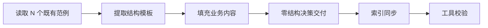
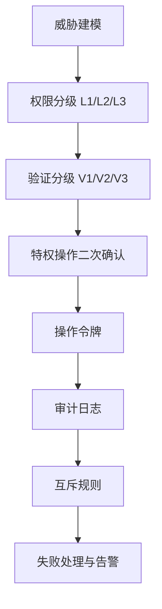
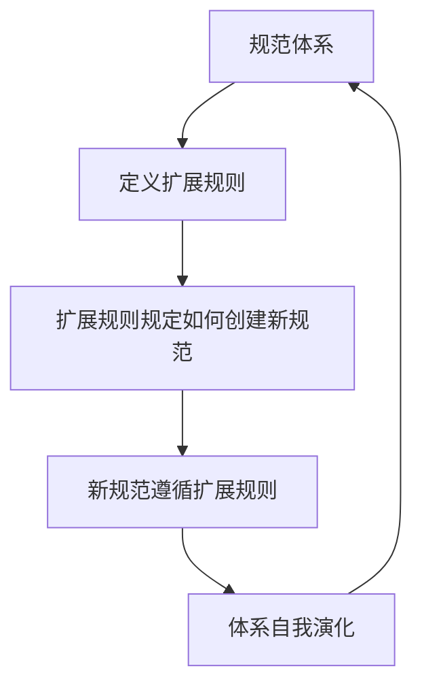

# 三、洞察环节

## 3.1 关键发现

#### 发现 1：规范体系的"自举性"（Bootstrapping）

- **事实**：`role-auto-creation.md` 定义了创建新角色文件的规范，而它本身就是一个由 team-admin 角色定义的"角色相关文件"。即：规范定义了自身的演化规则。
- **深层含义**：一个成熟的规范体系应当具备"自举能力"——规范本身规定了如何扩展规范。这与编程语言中"元编程"的概念同构：`role-auto-creation.md` 是规范体系的"元规范"，它使得体系能够自我演化而不破坏一致性。

#### 发现 2：安全设计的"纵深防御"在规范层的映射

- **事实**：权限系统设计了三层（L1/L2/L3），验证机制对应三层（V1/V2/V3），角色创建设置了四类触发条件 + 双重验证 + 操作令牌 + 审计日志。
- **深层含义**：纵深防御（Defense-in-Depth）原则不仅适用于代码实现，同样适用于规范设计。在规范层就定义多层防护，使得后续实现天然具备安全基线。**安全不是实现阶段的事后补丁，而是设计阶段的一等公民**。

#### 发现 3：策略与执行的分离模式

- **事实**：`permission-system.md`（策略层：定义有什么权限）与 `admin-verification.md`（执行层：定义如何验证权限）分离设计。
- **深层含义**：这是"关注点分离"原则在安全领域的应用。策略变更（如新增权限级别）不影响验证逻辑，验证逻辑升级（如引入新令牌机制）不影响权限定义。**分离使得两部分可独立演化**，降低了维护耦合度。

#### 发现 4：约定复用的"零成本扩展"效应

- **事实**：本次创建 6 个文件，结构决策成本为零——全部沿用既有 TOML frontmatter、三段式正文、Mermaid 流程图、YAML 数据模型规范。
- **深层含义**：当一个规范体系足够成熟时，扩展它的边际成本趋近于"内容创作成本"，而非"结构设计成本 + 内容创作成本"。**规范的成熟度可用"扩展新模块时的结构决策数"来度量**——决策数越少，体系越成熟。

## 3.2 规律认知

#### 方法论 1：约定驱动创建模型（Convention-Driven Creation）

**规律**：在成熟规范体系内创建新模块时，最优路径是"先读范例、提取模板、填充内容"，而非"先设计结构、再对齐规范"。前者将结构决策成本降为零，后者则需反复调整。

**适用条件**：
- 体系内已有 ≥ 3 个同类文件可作为范例
- 范例间结构一致性高（如均使用 TOML frontmatter + 三段式正文）
- 新模块属于既有类别（如新角色、新协议、新工作流）

**与既有方法论的关系**：这是 `spec-driven-development.md`（先设计后实施）的补充——当体系成熟度足够高时，"范例即规格"，可跳过显式 spec 阶段。

#### 方法论 2：规范层的纵深防御模型（Spec-Level Defense-in-Depth）

**规律**：安全规范不应只定义"有什么权限"，还应定义"如何验证权限"、"如何防止滥用"、"如何追溯操作"。四个维度（权限定义、验证机制、防滥用、审计追溯）缺一不可。

**适用条件**：
- 模块涉及特权操作（如创建、删除、权限分配）
- 操作影响范围大（如团队解散、角色创建）
- 安全合规要求高

#### 方法论 3：自举规范模型（Self-Bootstrapping Specification）

**规律**：一个规范体系若要支持可持续演化，须包含"元规范"——定义如何扩展规范的规范。`role-auto-creation.md` 即为本体系的元规范，它规定了新角色文件的格式、触发条件、创建流程，使得体系可在不破坏一致性的前提下无限扩展。

**适用条件**：
- 规范体系需长期维护与扩展
- 扩展操作频繁（如角色、模块会持续增加）
- 一致性要求高（所有扩展须遵循统一格式）

## 3.3 潜在机会

| 机会 | 描述 | 价值 |
|---|---|---|
| 权限互斥自动校验工具 | 开发 check-permission-conflict.py，自动检测角色权限分配是否违反互斥规则 | 将规范层的互斥定义转化为可执行检查 |
| 角色创建自动化脚本 | 开发 create-role.py，根据触发报告自动生成角色文件并更新索引 | 落地 role-auto-creation.md 的执行流程 |
| 规范成熟度度量 | 建立"扩展新模块时的结构决策数"指标，量化规范体系成熟度 | 为规范体系优化提供数据驱动依据 |
| 自举规范检测 | 开发 check-bootstrapping.py，验证规范体系是否包含元规范 | 评估体系的可持续演化能力 |

---