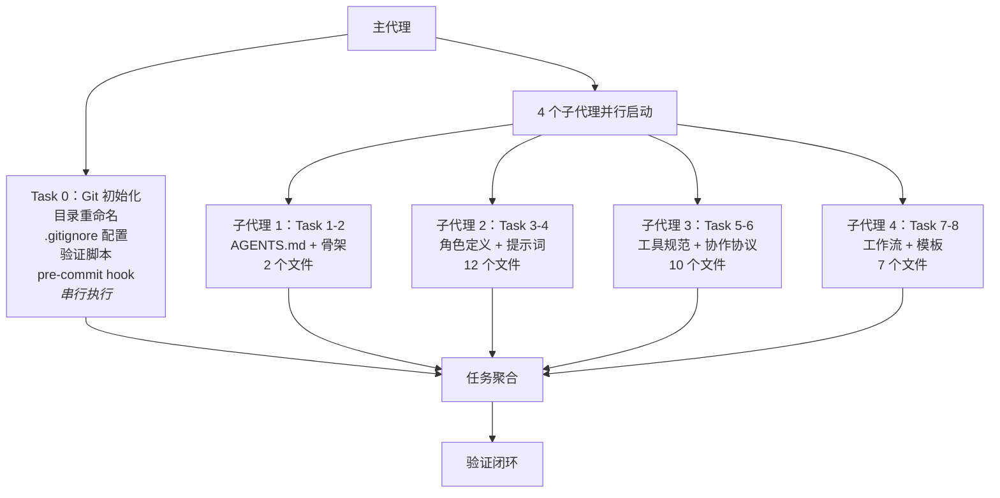

# 二、执行过程深度复盘

## 2.1 执行策略：主代理串行 + 子代理并行的混合模式

本项目采用了一种"混合执行策略"：主代理负责有副作用的任务（文件系统操作），子代理并行执行无依赖的纯文档创建任务。

**策略分析**：

| 维度 | 评估 | 说明 |
|------|------|------|
| 效率 | 高 | 4 个子代理并行，大幅缩短执行时间 |
| 安全性 | 高 | Task 0 涉及文件系统操作，串行执行避免竞态条件 |
| 上下文管理 | 优秀 | 每个子代理仅维护其领域上下文，避免全局上下文膨胀 |
| 可扩展性 | 好 | 新增任务类型可独立分配子代理，无需调整现有代理 |

## 2.2 关键决策节点深度分析

#### 决策 1：采用"入口 + 容器"二元架构（第 1 轮）

**决策内容**：`AGENTS.md` 作为全局入口（路由 + 约束），`.agents/` 作为具体规范容器（角色 + 协议 + 工作流）。

**决策依据**：
- 分离关注点：路由与约束由 AGENTS.md 统一管理，具体规范由子目录按功能分类
- 可扩展性：新增角色或协议只需在 `.agents/` 下添加文件，无需修改 AGENTS.md 结构
- 上下文节省：智能体按需读取对应子目录，而非一次性加载全部规范

**决策质量评估**：这一架构决策奠定了整个规范体系的基础，后续所有扩展（角色、协议、工作流）都遵循了这一模式，未出现架构层面的返工。

#### 决策 2：目录重命名 `libs/` → `vendor/`（第 3 轮）

**决策内容**：将第三方依赖存放目录从 `libs/` 改为 `vendor/`。

**决策矩阵**：

| 候选名称 | 语义明确度 | 行业惯例 | 工具兼容性 | 名称长度 | 综合评分 |
|---------|-----------|---------|-----------|---------|---------|
| `vendor/` | 高 | 广泛（PHP Composer、Go modules） | 优秀 | 短 | **最优** |
| `third_party/` | 高 | 较少（Google 内部） | 一般 | 长 | 一般 |
| `deps/` | 中 | 一般 | 一般 | 短 | 一般 |
| `external/` | 中 | 较少 | 一般 | 一般 | 一般 |

**执行挑战**：Windows 文件占用导致 `Rename-Item` 报 "Access denied"，通过 `Move-Item -Force` 和 `Test-Path` 验证最终确认操作成功。

#### 决策 3：多层次临时依赖管理（第 3 轮）

**决策内容**：不仅配置 `.gitignore`，还建立管理流程文档、pre-commit hook、验证脚本的完整闭环。

**为什么这样做**：单纯的 `.gitignore` 配置只能阻止 git 跟踪，但无法阻止开发者误操作、无法提供管理指导、无法验证规则有效性。完整的闭环管理需要：
1. `.gitignore` 规则（阻止 git 跟踪）
2. pre-commit hook（阻止误提交）
3. 验证脚本（确认规则有效）
4. 管理流程文档（指导开发者）

## 2.3 执行过程的问题与应对

#### 问题矩阵

| 问题编号 | 问题描述 | 类型 | 严重程度 | 根因 | 解决方式 | 是否可预防 |
|---------|---------|------|---------|------|---------|-----------|
| P1 | `Rename-Item` 报 "Access denied" | 平台兼容性 | 中 | Windows 文件锁机制 | 改用 `Move-Item -Force`，通过 `Test-Path` 验证 | 部分是 |
| P2 | `Move-Item -NewName` 参数无效 | 命令语法 | 低 | PowerShell 版本差异 | 改用 `-Destination` 参数 | 是 |
| P3 | `robocopy` EXTRA 文件误报 | 误报 | 低 | 目标目录已存在 | 通过 `Test-Path` 验证实际状态 | 是 |
| P4 | `cmd /c` 被 Windows 安全策略阻止 | 平台限制 | 中 | Windows 安全策略 | 统一改用 PowerShell 原生命令 | 是 |
| P5 | `chmod` 在 Windows 不可用 | 平台兼容性 | 低 | 跨平台命令差异 | 确认 Git for Windows 不需要可执行位 | 是 |

**问题趋势分析**：5 个问题中有 4 个与 Windows 平台差异相关，1 个与 PowerShell 版本差异相关。这表明在 Windows 环境下执行自动化操作时，需要建立平台兼容性手册，避免重复踩坑。

## 2.4 执行效率分析

| 指标 | 数据 | 评估 |
|------|------|------|
| 主任务完成率 | 9/9（100%） | 优秀 |
| 子任务完成率 | 42/42（100%） | 优秀 |
| 需求迭代轮次 | 3 轮 | 合理 |
| 需求变更导致的返工 | 0 次 | 优秀 |
| 操作错误次数 | 5 次 | 可接受 |
| 并行执行收益 | 4 倍加速（估算） | 显著 |

---