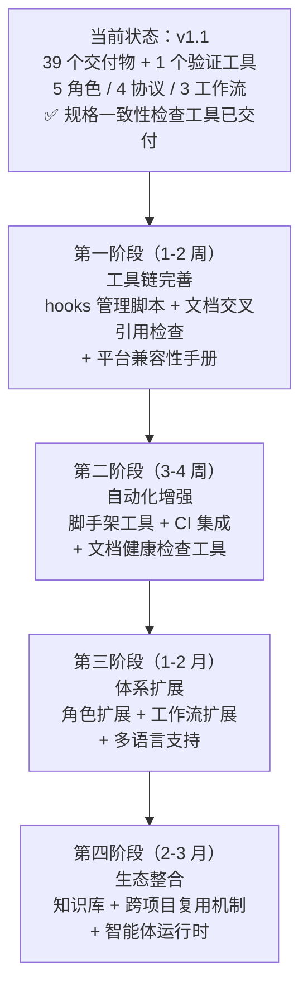

# 四、导出环节

## 4.1 改进建议

### 4.1.1 针对存在问题的改进措施

| 存在问题        | 改进措施                                             | 预期效果            |
| ----------- | ------------------------------------------------ | --------------- |
| 目录重命名操作受阻   | 建立 Windows 环境操作手册，记录已验证的命令模式                     | 避免后续类似操作重复踩坑    |
| 跨平台兼容性不足    | 开发跨平台 hooks 管理脚本，自动适配操作系统                        | 消除平台差异带来的配置障碍   |
| 多轮需求反馈的沟通成本 | 建立规格变更影响分析工具，自动检测 spec → tasks → checklist 的传播路径 | 降低规格维护的人工成本     |
| 错误处理的经验积累   | 建立项目 FAQ 文档，系统化沉淀操作经验                            | 新成员可快速查阅，避免重复试错 |
| 文档一致性维护     | 开发交叉引用检查脚本，自动验证 AGENTS.md 中的路径有效性                | 确保文档体系的长期一致性    |

### 4.1.2 流程优化建议

1. **需求阶段引入"需求冻结"节点**：在进入规格设计前，明确需求冻结标准（如：用户签字确认、需求覆盖检查通过），避免实施阶段的需求变更。
2. **规格设计阶段引入 peer review 机制**：`spec.md`、`tasks.md`、`checklist.md` 在进入实施前应由架构师或审查者进行 peer review，确保三者之间的一致性。
3. **实施阶段记录操作日志**：对 Task 0 这类涉及文件系统操作的任务，应记录操作日志（命令、参数、结果），便于复盘与经验沉淀。

### 4.1.3 工具链完善建议

1. **开发** **`.agents/`** **脚手架工具**：支持一键初始化 `.agents/` 目录骨架，自动生成角色、提示词、协议、工作流、模板的默认文件。
2. **开发文档健康检查工具**：自动检查 `.agents/` 目录下的文件完整性、交叉引用有效性、Mermaid 流程图可渲染性。
3. **开发平台兼容性检测脚本**：在项目初始化时自动检测当前操作系统，提示可能遇到的平台差异问题及建议的解决方案。

## 4.2 行动计划

| 优先级 | 改进项              | 具体措施                                                                                       | 责任方   | 建议时间节点 | 状态     |
| --- | ---------------- | ------------------------------------------------------------------------------------------ | ----- | ------ | ------ |
| 高   | 跨平台 hooks 管理     | 创建 `install-hooks.sh`（Unix）和 `install-hooks.ps1`（Windows）安装脚本，自动检测操作系统并执行正确的 hooks 安装流程    | 项目维护者 | 1 周内   | 未开始    |
| 高   | 文档交叉引用检查         | 开发 `check-cross-refs.py` 脚本，解析 `AGENTS.md` 中的路径引用，验证目标文件是否存在                               | 架构师   | 2 周内   | 部分完成   |
| 高   | 操作经验沉淀           | 整理本项目的操作障碍与解决方案，编写 `docs/platform-compatibility.md` 平台兼容性手册                                | 开发者   | 1 周内   | 未开始    |
| 中   | 规格变更影响分析         | 开发 `check-spec-consistency.py` 脚本，当 `spec.md` 变更时自动检测 `tasks.md` 和 `checklist.md` 是否需要同步更新 | 架构师   | 2 周内   | ✅ 已完成   |
| 中   | `.agents/` 脚手架工具 | 开发 `scaffold-agents.sh` / `scaffold-agents.ps1` 脚本，一键初始化 `.agents/` 目录骨架                   | 开发者   | 3 周内   | 未开始    |
| 中   | CI 集成验证脚本        | 将 `check-gitignore.py` 集成到 CI 流水线中，实现推送阶段的自动校验                                             | 开发者   | 2 周内   | 未开始    |
| 低   | 多语言支持            | 为 `.agents/` 规范文件提供英文版本                                                                    | 架构师   | 1 个月内  | 未开始    |
| 低   | 文档健康检查工具         | 开发 `check-docs-health.py` 脚本，自动检查文件完整性、交叉引用有效性、Mermaid 可渲染性                                | 开发者   | 1 个月内  | 未开始    |

### 已完成条目说明

**规格变更影响分析**（`check-spec-consistency.py`）已于 2026-06-23 完成开发并投入使用，历经三个版本迭代：

| 版本    | 核心能力                                                     | 关键改进                                                         |
| ------- | ------------------------------------------------------------ | ---------------------------------------------------------------- |
| v1.0    | 基础三文档一致性检查（需求→任务、场景→检查点、数据引用）      | 语义匹配、路径解析、数据一致性交叉验证                            |
| v1.1    | 可配置语义匹配阈值、路径上下文感知、自引用/外部引用数据区分   | 新增 `--match-threshold` 参数；修复复盘类 spec 误报（4 错误→0 错误） |
| v1.2    | 元文档识别升级（显式标记优先 + 关键词兜底）                   | 替换 `is_retrospective_context()` 为 `detect_meta_document()`，消除假阳性/假阴性风险 |

该脚本同时内置了**交叉引用路径有效性检查**功能，因此"文档交叉引用检查"条目中关于 spec 内部路径引用的部分已覆盖。但 `AGENTS.md` 中角色索引、协议概要、上下文路由表等指向 `.agents/` 的路径引用检查尚未独立实现，仍需单独开发。

其余 6 项行动计划条目尚未启动。

## 4.3 后续优化方向

### 4.3.1 中长期优化路线图

### 4.3.2 智能体协作体系的持续演进方向

1. **从静态规范到动态执行**：当前 `.agents/` 为静态规范文件，智能体需手动读取。未来可开发智能体运行时（Agent Runtime），自动加载规范并执行上下文路由。
2. **从单项目到组织级**：当前规范体系为单项目定制，未来可抽象为组织级智能体规范框架，通过配置文件适配不同项目。
3. **从文档到可执行工作流**：当前工作流为文档描述，未来可将工作流定义为可执行的 DAG（有向无环图），由编排协调者直接解析执行。

### 4.3.3 与项目其他子系统的整合可能性

1. **与 flexloop 子项目整合**：若项目包含 flexloop 子项目，可将 `.agents/` 规范体系应用于其开发流程中，复用角色定义、协作协议与工作流模板。
2. **与 CI/CD 流水线整合**：将 `check-gitignore.py`、pre-commit hook 等验证机制集成到 CI/CD 流水线中，实现代码推送阶段的自动质量门禁。
3. **与知识管理系统整合**：将操作经验、平台兼容性手册等知识资产纳入项目知识库，实现经验的系统化沉淀与检索。

---