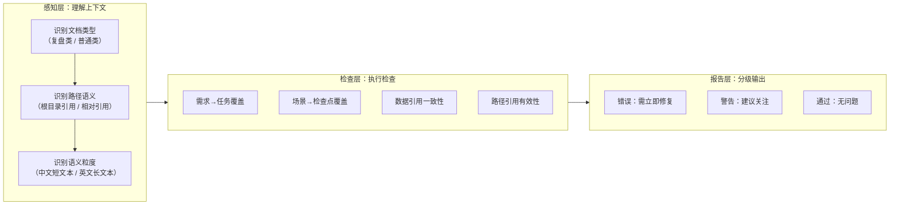
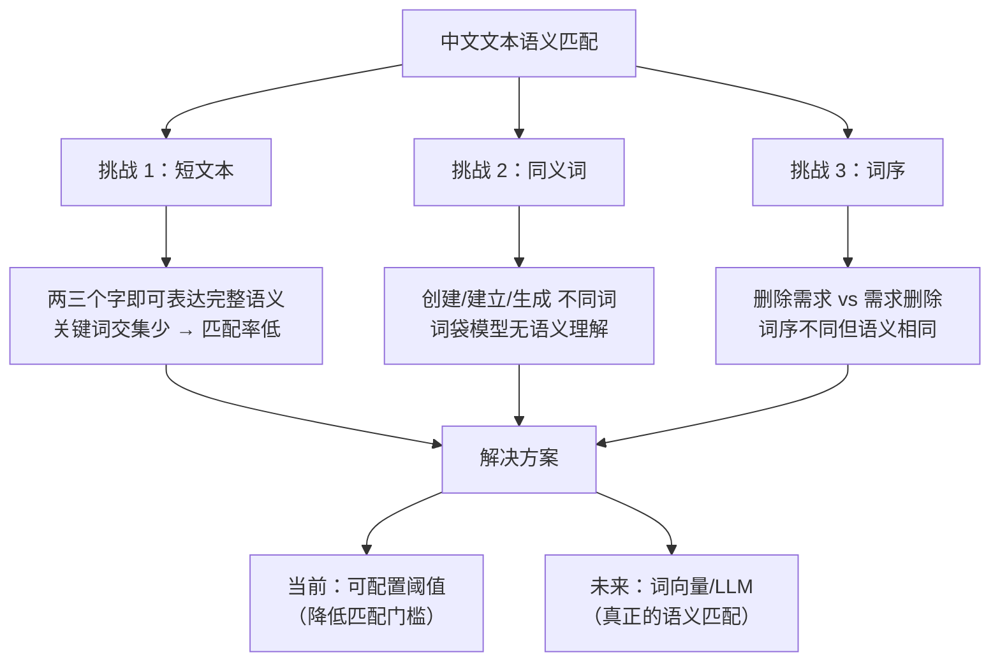

# 洞察萃取

## 3.1 关键发现

### 发现 1：v1.0 的"一刀切"问题根源在于缺乏上下文感知

**支撑事实**：v1.0 暴露出三类问题的共同根因——检查逻辑对上下文不敏感。固定阈值 2 忽略了中文短文本的语义特性（两三个字就能表达完整语义），路径统一以根目录解析忽略了 spec 文档自身的上下文，数据引用不区分来源忽略了复盘类 spec 的"元分析"属性。

**深层含义**：自动化检查工具的设计难点不在于"检查什么"，而在于"在什么上下文下检查"。v1.0 的检查逻辑是正确的——确实应该检查需求→任务覆盖、路径有效性、数据一致性——但上下文感知的缺失使得正确逻辑产生了错误结果。v1.1 的本质改进不是修改检查逻辑，而是**为检查逻辑注入上下文感知能力**。

### 发现 2：复盘类 spec 是"元文档"——它引用的是外部项目的数据

**支撑事实**：`retrospective-agents-spec-system` 的 spec.md 中引用"9 个主任务、42 个子任务"，但该 spec 自身的 tasks.md 仅包含 2 个任务。这些数字引用的是被复盘项目（智能体开发规范体系）的数据，而非自身数据。v1.0 未区分这一差异，将其报告为"数据不一致错误"。

**深层含义**：复盘类 spec 本质上是一种"元文档"（meta-document）——它的内容是对另一个项目的描述和分析，而非对自身的描述。在自动化检查中，元文档需要特殊处理，因为它引用的数据源不在当前文档体系内。这一发现可以推广到其他"元文档"场景，如技术评审报告、审计报告、评估报告等。

### 发现 3：路径解析的"基准"取决于引用意图，而非路径形式

**支撑事实**：`spec.md` 中 `protocols/handoff.md` 和 `.agents/protocols/handoff.md` 都是相对路径，但前者意图指向 spec 所在目录下的协议文件，后者意图指向项目根目录下的协议文件。v1.0 统一以项目根目录为基准，导致前者解析失败。

**深层含义**：路径解析的基准不能仅由路径形式决定，而应结合路径的"语义前缀"判断。以 `.agents/`、`.trae/`、`docs/` 等开头的路径，其语义前缀暗示了"这是项目根目录下的规范目录"，因此应以根目录为基准。无此类前缀的路径，更可能是"相对于当前文档所在目录的引用"。这一规则可以推广到所有文档间交叉引用的场景。

### 发现 4：增量验证 + 回归验证的"正交验证"模式

**支撑事实**：v1.1 的三项优化分别独立验证（优化 1：警告 43→40；优化 2：路径误报消除；优化 3：错误 4→0），全部完成后做回归验证（确认 check-spec-consistency 自身数据错误 2→0）。每项优化的验证结果与其预期效果完全一致，回归验证也未发现副作用。

**深层含义**：当多项优化同时进行时，"正交验证"（每项优化独立验证）比"整体验证"（所有优化完成后一次性验证）更有效。原因在于：
- 独立验证可以精确归因——某个指标的变化一定来自某项优化。
- 独立验证的检查范围更小，执行更快，反馈更及时。
- 回归验证作为兜底，确保优化组合不产生意外交互。

## 3.2 规律认知

### 3.2.1 自动化检查工具的"感知→检查→报告"三层模型

从本项目的实践中提炼出一个通用模型：

**核心规律**：自动化检查工具的质量取决于**感知层的深度**。v1.0 的感知层近乎为零（阈值固定、路径基准统一、数据来源不区分），导致检查层产生大量误报。v1.1 在感知层增加了三项能力（可配置阈值、路径语义识别、文档类型识别），使检查结果质量显著提升。

### 3.2.2 "元文档"的识别与处理模式

本项目中复盘类 spec 的处理经验可以提炼为通用的"元文档"处理模式：

1. **识别**：通过关键词检测或显式标记，识别当前文档是否为"元文档"（描述其他文档/项目的文档）。
2. **标记**：将识别结果作为检查上下文传递给所有检查函数。
3. **分级**：元文档中的外部引用数据不一致→警告；普通文档中的自引用数据不一致→错误。

这一模式适用于任何需要处理"关于文档的文档"的场景。

### 3.2.3 中文文本的语义匹配挑战

**规律**：中文文本的语义匹配比英文更具挑战性，因为：
- 中文词汇更短（2-3 字即可表达完整语义），关键词交集天然较少。
- 中文同义词丰富（"创建"、"建立"、"生成"、"搭建"），词袋模型无法识别。
- 中文字与字之间无空格分隔，分词本身就是一项挑战。

当前采用的"可配置阈值"方案是工程上的折中——不追求语义理解的精度，而是通过降低匹配门槛来减少漏报。代价是可能增加误报（不同语义的文本因共享一个关键词而被匹配）。真正的语义匹配需要引入词向量或 LLM，但会增加复杂度和依赖。

## 3.3 潜在机会

### 3.3.1 识别出的改进空间

1. **需求变更检测功能**：spec.md 中已定义但未实现的需求变更检测功能，可通过 `git diff` 对比两个版本的 spec.md 实现。
2. **复盘语境标记显式化**：✅ 已于 v1.2 完成。`detect_meta_document()` 实现"显式标记优先 + 关键词兜底"双层策略，支持 `<!-- meta_type: xxx -->` 显式标记，关键词扩展至 14 个。`retrospective-agents-spec-system/spec.md` 已添加显式标记。
3. **语义匹配升级**：引入轻量级中文词向量模型（如 `text2vec-base-chinese`），实现真正的语义匹配，而非关键词交集。
4. **路径前缀白名单自动发现**：从项目根目录的顶级目录列表中自动生成 `PROJECT_ROOT_PREFIXES`，消除手动维护成本。
5. **Markdown 解析鲁棒性增强**：引入轻量级 Markdown 解析器（如 `mistune`）作为正则解析的 fallback，当正则无法匹配时降级使用 AST 解析。

### 3.3.2 可复用的工具与模式

| 资产                                     | 可复用场景                           | 复用方式                                     |
| ---------------------------------------- | ------------------------------------ | -------------------------------------------- |
| 三段式架构（解析→检查→输出）              | 任何需要检查文档一致性的工具          | 直接复用架构模式，替换解析器和检查逻辑        |
| `resolve_path()` 上下文感知路径解析       | 任何需要解析文档间交叉引用的工具      | 直接复用函数，按需调整 `PROJECT_ROOT_PREFIXES` |
| `detect_meta_document()` 元文档检测（v1.2） | 任何需要区分"自引用"与"外部引用"的工具 | 直接复用函数，支持显式标记 + 关键词兜底 |
| 增量验证 + 回归验证的双层验证策略         | 任何多优化迭代的开发流程              | 作为流程模板复用                             |

### 3.3.3 未来可扩展的方向

1. **CI/CD 集成**：将脚本集成到 pre-commit hook 或 CI 流水线中，在每次提交/推送时自动检查规格文档一致性。
2. **IDE 集成**：开发 VS Code 扩展，在编辑 spec.md 时实时显示 tasks.md 和 checklist.md 的同步状态。
3. **自动修复功能**：当检测到不一致时，不仅报告问题，还提供自动修复建议（如自动在 tasks.md 中添加缺失的任务条目）。
4. **多项目支持**：当前脚本假设项目根目录为脚本所在目录的上两级，可扩展为支持任意项目结构。
5. **历史趋势分析**：记录每次检查的结果，生成一致性趋势图，可视化规格文档的维护质量变化。