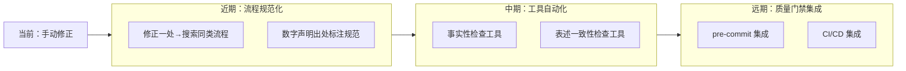

# 导出建议

## 4.1 改进建议

| 问题 | 改进措施 | 优先级 | 预期效果 | 状态 |
|------|---------|--------|---------|------|
| 初始修正未覆盖全局 | 建立"修正一处 → 搜索同类"的标准流程 | 高 | 避免遗漏同类问题 | 待规划 |
| 原始描述来源未追溯 | 在引入数字声明时，要求标注出处 | 中 | 提高数字声明的可追溯性 | 待规划 |
| 文档事实性检查缺失 | 开发自动化工具扫描无据数字 | 中 | 自动识别无依据的数字声明 | 待规划 |
| 表述一致性检查缺失 | 扩展 check-links.py 增加表述一致性检查 | 低 | 自动识别不一致的表述 | 待规划 |

## 4.2 行动计划

| 优先级 | 改进项 | 具体措施 | 建议时间 | 状态 |
|--------|--------|---------|---------|------|
| 高 | 建立"修正一处 → 搜索同类"流程 | 在开发规范中增加文档修正的标准流程 | 2026-06-30 | 待规划 |
| 中 | 数字声明出处标注规范 | 在文档规范中要求数字声明必须标注出处 | 2026-07-07 | 待规划 |
| 中 | 文档事实性检查工具 | 开发扫描无据数字的自动化工具 | 2026-07-14 | 待规划 |
| 低 | 表述一致性检查工具 | 扩展 check-links.py | 2026-07-21 | 待规划 |

## 4.3 后续优化方向

**整合方向**：将文档事实性检查与表述一致性检查纳入现有的"三层治理模型"（原子化 → 自动化 → 验证），作为"验证"层的新维度，与链接检查、路径检查形成完整的文档质量保障体系。

***

> **报告编制**：本文档基于事实表述修正任务全过程数据编制，所有数据均有事实依据支撑。报告采用 Markdown 格式编写，遵循"事实 → 分析 → 洞察 → 建议"的逻辑结构，确保复盘结论可追溯、改进建议可执行。
>
> **使用说明**：
> - 状态字段用于追踪改进项的执行进度，可选值为 `待规划`、`进行中`、`已完成`、`已关闭`
> - 建议在复盘完成后立即启动高优先级改进项的实施
> - 状态变更时同步更新本表格