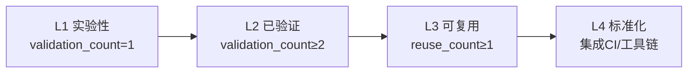

# 四、导出建议

## 4.1 改进建议

### 🔴 高优先级

**建议 1：回溯更新存量模式文件的 frontmatter** ✅ 已完成

- 问题：本次仅更新 6 个新模式文件，存量模式文件（如 spec-driven-development.md）尚未补充量化字段
- 建议：编写脚本批量扫描存量模式文件，补充 `validation_count`、`reuse_count`、`documentation_level` 字段
- 预期收益：补全统计数据，实现成熟度分布全量统计
- 实施方案：
  1. 编写 `update-pattern-frontmatter.py` 脚本
  2. 扫描三个子目录所有模式文件
  3. 根据现有 maturity 字段推断 validation_count（L1→1, L2→2）
  4. 批量补充缺失字段
- 执行结果：
  - 已更新 21 个存量模式文件（methodology-patterns 12 个 + code-patterns 5 个 + architecture-patterns 4 个）
  - 所有模式文件均已补充完整 frontmatter
  - 成熟度分布统计：L1=2, L2=24, L3=1, L4=0（合计 28 个模式）

### 🟡 中优先级

**建议 2：编写脚本自动统计模式库成熟度分布** ✅ 已完成

- 问题：成熟度分布统计需手动计算，效率低
- 建议：编写 `pattern-maturity-stats.py` 脚本，自动统计各成熟度等级模式数量
- 预期收益：定期生成成熟度分布报告，识别待升级模式
- 实施方案：
  1. 扫描三个子目录所有模式文件
  2. 解析 frontmatter 中的 maturity、validation_count、reuse_count 字段
  3. 输出分布统计表（L1/L2/L3/L4 数量 + 占比）
- 执行结果：
  - 已创建 [.agents/scripts/pattern-maturity-stats.py](../../../../../.agents/scripts/pattern-maturity-stats.py)
  - 功能：解析 TOML frontmatter、统计成熟度分布、识别待升级模式、输出详细列表
  - 当前统计：28 个模式（L1=2, L2=25, L3=1, L4=0）
  - 暂无待升级模式（所有模式当前成熟度与其验证/复用次数匹配）

### 🟢 低优先级

**建议 3：在复盘报告模板中增加「模式成熟度更新」章节** ✅ 已完成

- 问题：成熟度升级路径是动态过程，但复盘报告中无追踪章节
- 建议：在复盘报告模板中增加标准化的「模式成熟度更新」章节
- 预期收益：持续追踪模式成熟度变化
- 执行结果：
  - 已更新 [retrospective-report-template.md](../../../templates/retrospective-report-template.md)
  - 在「四、导出环节」中新增 `4.3 模式成熟度更新` 小节
  - 原 `4.3 后续优化方向` 顺延为 `4.4 后续优化方向`

## 4.2 附录

### A. 产出文件清单

| 文件 | 类型 | 状态 |
|------|------|------|
| patterns/README.md | 总索引 | 新建 |
| methodology-patterns/README.md | 子索引 | 更新 |
| code-patterns/README.md | 子索引 | 更新 |
| architecture-patterns/README.md | 子索引 | 更新 |
| content-migration-workflow.md | 模式文件 | 更新（frontmatter） |
| safe-table-edit.md | 模式文件 | 更新（frontmatter） |
| cascade-update-topology.md | 模式文件 | 更新（frontmatter） |
| suggestion-priority-driven-execution.md | 模式文件 | 更新（frontmatter） |
| report-as-tracking.md | 模式文件 | 更新（frontmatter） |
| cascade-update-prerequisite-check.md | 模式文件 | 更新（frontmatter） |
| retrospective-report-suggestion-execution-and-pattern-import.md | 报告 | 更新（建议状态） |

### B. 成熟度升级路径图

### C. 验证结果

| 验证项 | 脚本 | 结果 |
|--------|------|------|
| 链接有效性 | check-links.py | ✅ 通过（1 个预存断链无关） |

### D. 模式库成熟度现状（全量）

| 目录 | 模式数 | L1 | L2 | L3 | L4 |
|------|--------|----|----|----|----|
| methodology-patterns/ | 16 | 0 | 15 | 1 | 0 |
| code-patterns/ | 6 | 1 | 5 | 0 | 0 |
| architecture-patterns/ | 6 | 1 | 5 | 0 | 0 |
| **合计** | **28** | **2** | **25** | **1** | **0** |

> 注：全量模式文件均已补充量化字段，统计结果由 `pattern-maturity-stats.py` 自动生成。

## 4.3 总结

本次任务完成了模式成熟度客观评估标准的建立与三项改进建议的闭环执行，包括创建总索引、定义量化指标、全量更新 28 个模式文件 frontmatter、编写成熟度统计脚本，并更新复盘报告模板。

**核心成果**：
- 成熟度标准建立（L1-L4 四级 + 三个量化指标）
- 总索引创建补全历史遗漏
- 28 个模式文件 frontmatter 全量标准化
- 自动统计脚本落地，可输出成熟度分布与待升级模式清单

**可复用产出**：
- 2 个新模式（标准建立+回溯更新、总索引优先原则）
- 成熟度评估标准体系
- frontmatter 标准格式
- 成熟度统计脚本
- 复盘报告模板中的「模式成熟度更新」章节

**建议执行状态**：
- 建议 1：✅ 已完成（回溯更新存量模式 frontmatter）
- 建议 2：✅ 已完成（编写成熟度统计脚本）
- 建议 3：✅ 已完成（更新复盘报告模板）

---