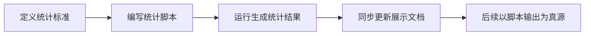
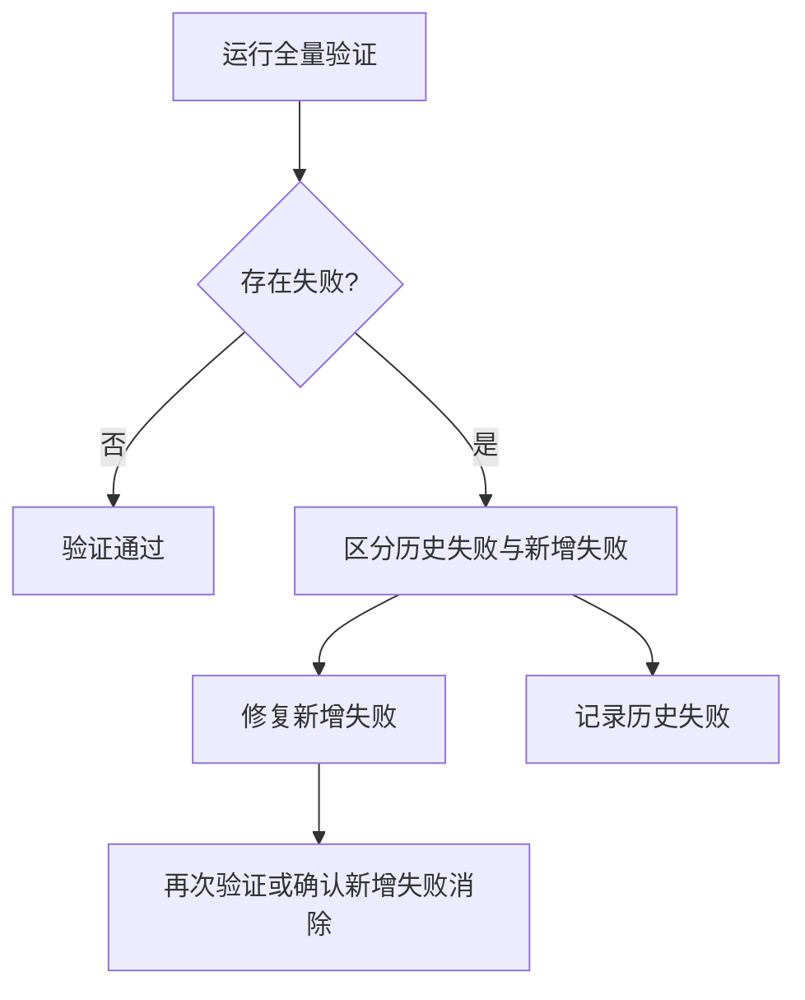

# 三、洞察提炼与模式萃取

## 3.1 洞察提炼

### 洞察 1：自动统计是治理标准的第二阶段

成熟度标准本身只解决「如何定义」问题，自动统计脚本才解决「如何持续使用」问题。没有脚本，标准容易停留在文档层；有脚本后，标准进入可验证、可追踪、可复盘的执行层。

### 洞察 2：脚本输出应成为统计真源

本轮出现过手动统计 L2=24、脚本统计 L2=25 的差异。该差异说明，一旦自动化脚本建立，后续统计口径应以脚本输出为准，人工表格只作为缓存或展示层。

### 洞察 3：报告模板需要承载状态变化，而不是只记录历史

复盘报告模板新增「模式成熟度更新」章节后，报告不再只是任务结束后的静态总结，而是可承载模式升级、复用、验证次数变化的动态追踪载体。

### 洞察 4：验证失败中的“新增断链”比“预存断链”更重要

链接检查存在多个历史断链。执行本轮任务时，关键不是立即修复所有历史问题，而是识别并修正本次新增断链，确保当前变更不扩大技术债。

## 3.2 可复用模式萃取

### 模式 1：自动化真源优先（automation-as-source-of-truth）

| 属性 | 值 |
|------|-----|
| 类型 | 方法论模式 |
| 成熟度 | L1 实验性 |
| 适用场景 | 从手工统计迁移到自动化统计后的数据治理 |

**核心规则**：当自动化统计脚本建立后，所有展示型统计表均应以脚本输出为准，避免手动维护多个数据源。

**操作流程**：

**本次案例**：模式成熟度 L2 数量由手动表格中的 24 修正为脚本输出的 25。

### 模式 2：新增断链优先修复（new-breakage-first）

| 属性 | 值 |
|------|-----|
| 类型 | 验证模式 |
| 成熟度 | L1 实验性 |
| 适用场景 | 仓库存在历史断链或历史告警时的增量验证 |

**核心规则**：当全量验证存在历史失败项时，应优先识别并修复本次变更引入的新失败项，避免变更扩大债务。

**操作流程**：

**本次案例**：链接校验报告 7 个断链，其中 1 个为本次新增脚本链接错误，已修正；其余为预存断链。

### 模式 3：报告模板动态追踪槽位（report-template-tracking-slot）

| 属性 | 值 |
|------|-----|
| 类型 | 文档架构模式 |
| 成熟度 | L1 实验性 |
| 适用场景 | 报告模板需要承载后续状态变化、指标升级或资产复用记录 |

**核心规则**：当复盘产出包含可持续演进对象（模式、规则、脚本、资产）时，模板应预留追踪槽位，用于记录后续状态变化。

**本次案例**：[retrospective-report-template.md](../../../templates/retrospective-report-template.md) 新增 `4.3 模式成熟度更新`，用于持续追踪模式成熟度变化。

---