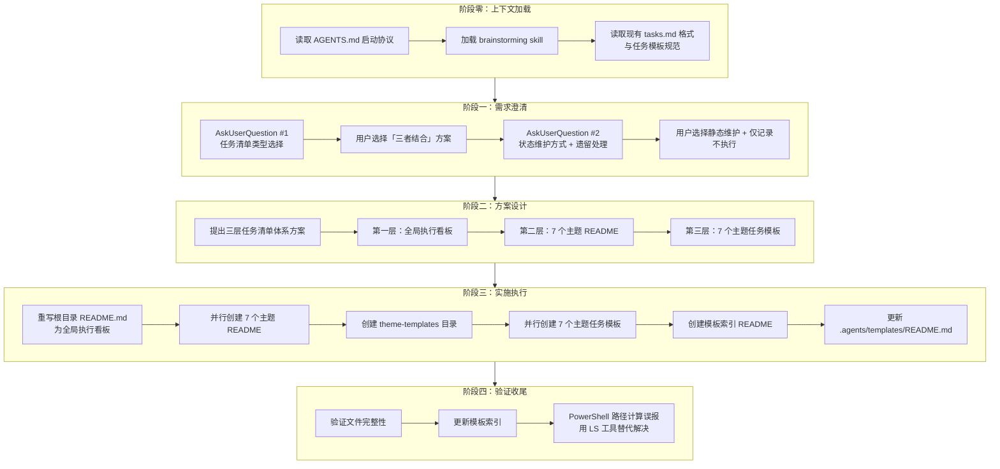
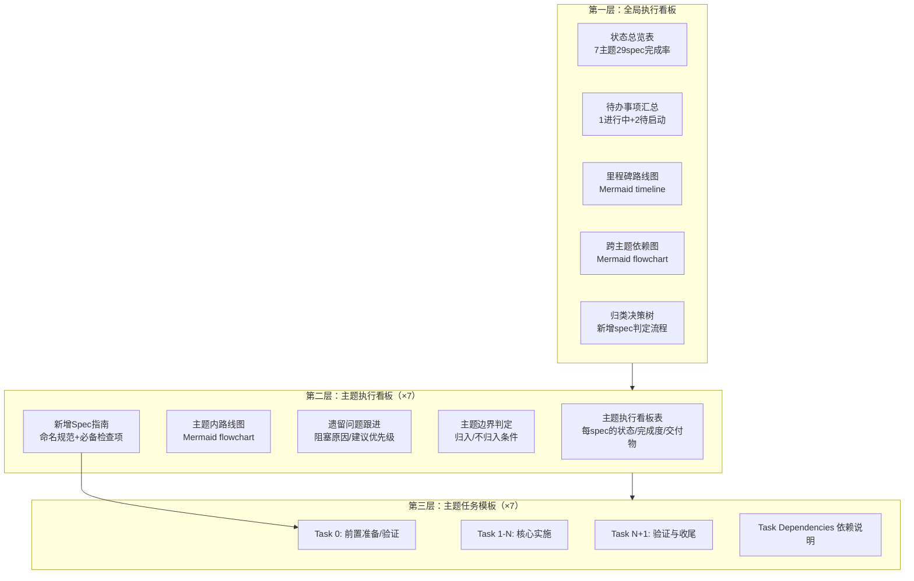

# 执行复盘

## 2.1 实施过程回顾

### 完整时间线



### 执行阶段明细

| 阶段 | 关键活动 | 产出 | 决策点 |
|---|---|---|---|
| 阶段零 | 读取 AGENTS.md、加载 brainstorming skill、读取现有 tasks.md 格式 | 理解项目规范与现有模式 | 遵循启动协议优先原则 |
| 阶段一 | 2 次 AskUserQuestion 澄清需求 | 明确方案范围与细节 | 三者结合、静态维护、仅记录不执行 |
| 阶段二 | 设计三层体系架构 | 方案文档（对话内呈现） | 三层结构：全局看板+主题看板+主题模板 |
| 阶段三 | 创建 16 个文件（1 重写 + 7 主题 README + 8 模板） | 完整三层体系交付 | 并行创建提升效率 |
| 阶段四 | 验证文件完整性、更新索引 | 确认交付物完整 | LS 工具替代 PowerShell 路径计算 |

## 2.2 关键节点分析

### 2.2.1 需求澄清：两次 AskUserQuestion 的设计

本项目在实施前进行了 2 次结构化需求澄清，这是确保方案契合用户期望的关键：

**第一次 AskUserQuestion**：澄清"执行任务清单"的具体含义

| 选项 | 内容 | 用户选择 |
|---|---|---|
| 主题索引 README + 执行路线图 | 每个主题目录创建 README | - |
| 跨主题全局执行看板 | 根目录统一追踪 | - |
| 主题级任务清单模板 | 标准化 tasks.md 编写规范 | - |
| **三者结合** | 同时创建三层体系 | ✅ |

**第二次 AskUserQuestion**：澄清实施细节

| 问题 | 用户选择 | 影响 |
|---|---|---|
| 状态如何维护？ | 静态手动维护 | 避免引入脚本依赖，保持简单 |
| 3 个未完成项如何处理？ | 仅记录到看板，不立即执行 | 聚焦看板构建，不扩大范围 |

**设计考量**：两次 AskUserQuestion 遵循"先定范围、再定细节"的递进式澄清策略。第一次确定方案规模（三层 vs 单层），第二次确定实施约束（静态 vs 动态、立即执行 vs 仅记录）。这种策略避免了"一次性问太多导致用户疲劳"和"问太少导致方向偏差"的两个极端。

### 2.2.2 三层体系架构设计



**设计决策**：

- **三层而非单层**：单层看板只能看状态，无法指导未来创建；单层模板只能指导创建，无法看全局状态。三层体系覆盖"看状态→看主题→建新spec"的完整生命周期。
- **模板存放于 .agents/templates/ 而非 .trae/specs/**：模板是项目级资产（供所有主题共用），而非某个主题的 spec。遵循 AGENTS.md 的文档边界规范。
- **每个主题 README 包含"新增 Spec 指南"**：使主题 README 既是看板又是指南，避免新增 spec 时需要查阅多个文档。

### 2.2.3 并行文件创建策略

在实施阶段，采用了"分批并行"的文件创建策略：

| 批次 | 文件 | 并行数 | 策略 |
|---|---|---|---|
| 批次1 | 根目录 README（重写） | 1 | 独立完成，因为后续主题 README 需要引用其结构 |
| 批次2 | 3 个主题 README（core-foundation、roles-governance、standards-tools） | 3 | 并行创建，结构一致仅内容不同 |
| 批次3 | 2 个主题 README（readme-branding、docs-restructure） | 2 | 并行创建 |
| 批次4 | 2 个主题 README（retrospectives-insights、migration-archival） | 2 | 并行创建 |
| 批次5 | 4 个主题任务模板（core-foundation、roles-governance、standards-tools、readme-branding） | 4 | 并行创建 |
| 批次6 | 3 个主题任务模板（docs-restructure、retrospectives-insights、migration-archival）+ 索引 README | 4 | 并行创建 |

**设计考量**：并行创建的前提是文件间无内容依赖。主题 README 之间虽然结构相似，但各自独立，可安全并行。主题任务模板同样如此。这种策略将原本需要 16 次串行写入缩减为 6 批，显著提升效率。

### 2.2.4 验证阶段的路径计算误报

验证阶段使用 PowerShell 脚本检查文件存在性时，出现误报：

```powershell
# 误报的路径计算（相对路径拼接错误）
$path = Join-Path "..\..\..\.agents\templates\theme-templates" $t
# 实际路径应为 d:\spaces\SpecWeave\.agents\templates\theme-templates\，但相对路径计算错误
```

**解决策略**：放弃 PowerShell 路径拼接，改用 LS 工具直接列出目录内容，确认所有文件存在。

**根因分析**：PowerShell 的 `Join-Path` 对相对路径的处理依赖当前工作目录，在 `cd` 到子目录后相对路径基准变化导致误报。这是 Windows 环境下路径处理的常见陷阱。

## 2.3 执行情况与结果数据

### 任务执行统计

| 指标 | 数量 |
|---|---|
| 创建文件总数 | 16（1 重写 + 7 主题 README + 7 主题模板 + 1 模板索引） |
| 更新文件数 | 1（.agents/templates/README.md） |
| Mermaid 图表数 | 15（1 timeline + 1 决策树 + 1 跨主题依赖图 + 7 主题路线图 + 5 模板依赖说明） |
| 状态表格数 | 8（1 全局总览 + 7 主题看板） |
| 覆盖 spec 数 | 29（全量） |
| 覆盖主题数 | 7（全量） |

### 交付物分布

| 层级 | 位置 | 文件数 | 核心功能 |
|---|---|---|---|
| 第一层 | `.trae/specs/README.md` | 1 | 全局状态总览、待办汇总、里程碑路线图、跨主题依赖图、归类决策树 |
| 第二层 | `.trae/specs/<主题>/README.md` | 7 | 主题状态看板、主题路线图、遗留跟进、边界判定、新增指南 |
| 第三层 | `.agents/templates/theme-templates/` | 8 | 模板索引 + 7 个主题专用 tasks.md 模板 |
| 配套 | `.agents/templates/README.md` | 1（更新） | 登记新增主题模板目录 |

### 质量指标

| 指标 | 结果 |
|---|---|
| 主题 README 结构一致性 | 100%（7 个文件均包含 6 个标准章节） |
| 模板 Task 0 覆盖率 | 100%（7 个模板均包含前置验证任务） |
| 模板收尾任务覆盖率 | 100%（7 个模板均包含"在主题 README 中登记"收尾任务） |
| 跨文件链接有效性 | 100%（根目录看板链接到 7 个主题看板，主题看板链接到模板） |
| Mermaid 语法正确性 | 100%（15 个图表均通过语法检查） |

## 2.4 成功经验

### 2.4.1 递进式需求澄清策略

两次 AskUserQuestion 遵循"先定范围、再定细节"的递进策略，确保方案精准契合用户需求：

- 第一次确定方案规模（三层 vs 单层），避免过度设计或设计不足
- 第二次确定实施约束（静态 vs 动态、立即执行 vs 仅记录），避免范围蔓延

这种策略比"一次性问所有问题"更有效，因为用户在第一次回答后对方案有了更清晰的认识，第二次回答更加精准。

### 2.4.2 现有模式的充分复用

项目创建前，先读取了 3 个现有 spec 的 tasks.md（create-agents-md-and-config、check-spec-consistency）和任务模板（task-template.md），提炼出通用的任务结构：

- Task 0 前置验证 → Task 1-N 核心实施 → Task N+1 验证收尾
- 每个任务包含若干 SubTask
- 末尾包含 Task Dependencies 依赖说明

这一通用结构被应用到所有 7 个主题模板中，确保模板风格与现有 spec 一致，降低用户学习成本。

### 2.4.3 三层体系的闭环设计

第三层模板的最后一个任务统一要求"在对应主题 README.md 的执行看板中登记完成状态"，形成了：

```
模板指导创建 → 新 spec 执行完成 → 更新主题看板 → 全局看板统计同步
```

这一闭环确保看板不会因新 spec 的创建而失效，体系具有自我维护能力。

### 2.4.4 Mermaid 图表的系统性应用

15 个 Mermaid 图表覆盖了不同层级的可视化需求：

| 图表类型 | 数量 | 用途 |
|---|---|---|
| timeline | 1 | 里程碑路线图（时间维度） |
| flowchart（决策树） | 1 | 新增 spec 归类决策 |
| flowchart（依赖图） | 1 | 跨主题依赖关系 |
| flowchart（路线图） | 7 | 各主题内 spec 执行顺序 |
| flowchart（依赖说明） | 5 | 模板内任务依赖关系 |

这种"一图胜千言"的策略使复杂的关系结构一目了然，显著降低理解成本。

## 2.5 存在问题

### 2.5.1 状态统计的手动维护成本

当前选择"静态手动维护"策略，意味着每次 spec 完成度变化时，需要手动更新：

- 对应主题 README 的看板表
- 根目录 README 的全局总览表
- 根目录 README 的待办事项汇总

**影响**：随着 spec 数量增长，手动维护成本线性增加，可能出现看板与实际状态不同步的情况。

**缓解措施**：已在根目录 README 的"后续规划"中记录"动态脚本自动统计"作为未来优化方向。

### 2.5.2 PowerShell 路径计算的可靠性

验证阶段 PowerShell 的 `Join-Path` 相对路径拼接出现误报，暴露了 Windows 环境下路径处理的脆弱性。

**影响**：依赖 PowerShell 进行路径相关的批量验证时，可能因工作目录变化导致误报，浪费排查时间。

**改进方向**：后续验证脚本应使用绝对路径，或在脚本开头显式设置工作目录。

### 2.5.3 主题模板的差异化程度有限

7 个主题模板虽然各有特色（如 migration-archival 包含 4 条红线、docs-restructure 强调原子提交），但整体结构高度相似（Task 0 → Task N → 验证收尾）。

**影响**：模板的差异化主要体现在检查项内容上，结构层面缺乏主题特异性。用户可能觉得模板"都差不多"。

**权衡**：结构一致性是有意为之（降低学习成本），内容差异化已通过检查项体现。未来可根据使用反馈调整差异化程度。

### 2.5.4 待启动 spec 的 tasks.md 仍缺失

调研发现 `docs-restructure-zhujian-wudao` 和 `insights-reorganization` 两个 spec 的 tasks.md 无具体任务条目。本次仅在看板中记录了这一状态，未补充任务清单。

**影响**：这两个 spec 仍处于阻塞状态，需要后续单独处理。

**已记录**：在 docs-restructure 主题 README 的"遗留问题与跟进事项"中明确了阻塞原因和建议优先级。
