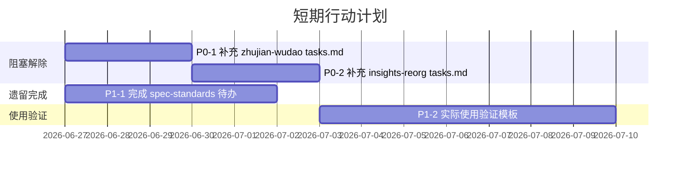

# 导出建议

## 4.1 改进建议

### P0 — 高优先级（建议立即处理）

| 编号 | 建议 | 理由 | 行动项 | 预期效果 |
|---|---|---|---|---|
| P0-1 | 补充 docs-restructure-zhujian-wudao 的 tasks.md | 该 spec 处于阻塞状态，tasks.md 无任务条目，影响 docs-restructure 主题完成率 | 探查竹简悟道子项目现状 → 参照 docs-restructure-task-template.md 编写 tasks.md → 执行 | 解除阻塞，docs-restructure 主题完成率从 60% 提升 |
| P0-2 | 补充 insights-reorganization 的 tasks.md | 依赖 P0-1 完成，同样处于阻塞状态 | 等 P0-1 完成后 → 参照 docs-restructure-task-template.md 编写 → 执行 | 解除阻塞，docs-restructure 主题完成率达 100% |

### P1 — 中优先级（建议近期处理）

| 编号 | 建议 | 理由 | 行动项 | 预期效果 |
|---|---|---|---|---|
| P1-1 | 完成 spec-standards-enhancement 的 3 个待办 | 该 spec 完成度 91%，3 个待办涉及版本号规范、changelog 模板、格式检查脚本 | 逐项完成 3 个待办 → 更新 standards-tools 主题看板 → 更新全局看板 | standards-tools 主题完成率达 100%，全局完成率从 90% 提升至 93%+ |
| P1-2 | 验证三层看板的实际使用效果 | 看板已构建但未经实际使用验证，可能存在易用性问题 | 在下一个新 spec 创建时实际使用主题模板 → 记录使用体验 → 优化模板 | 发现并修复易用性问题，验证闭环机制有效性 |

### P2 — 低优先级（建议择机处理）

| 编号 | 建议 | 理由 | 行动项 | 预期效果 |
|---|---|---|---|---|
| P2-1 | 开发动态状态统计脚本 | 手动维护成本随 spec 数量增长线性增加 | 编写 PowerShell 脚本扫描 tasks.md → 自动生成状态总览 → 集成到看板更新流程 | 消除手动维护成本，看板实时准确 |
| P2-2 | 将看板状态检查集成到 CI | 防止看板与实际状态不同步 | 在 ci-check.ps1 中添加看板一致性检查 → 不一致时警告 | 看板始终保持准确 |
| P2-3 | 参数化主题模板生成器 | 7 个模板结构相似，维护成本可降低 | 设计模板参数 schema → 开发生成脚本 → 迁移现有模板 | 降低模板维护成本，新增主题更快捷 |

### P3 — 长期优化（条件成熟时处理）

| 编号 | 建议 | 理由 | 行动项 | 预期效果 |
|---|---|---|---|---|
| P3-1 | 看板体系复用到 .agents/ 目录 | .agents/ 目录同样需要状态追踪和创建指导 | 分析 .agents/ 现有结构 → 应用三层看板架构 → 创建对应文件 | .agents/ 目录获得同样的管理能力 |
| P3-2 | 看板体系复用到 docs/ 目录 | docs/ 目录文档数量多，缺乏统一看板 | 同 P3-1 | docs/ 目录获得同样的管理能力 |

### P4 — 暂不处理（记录备查）

| 编号 | 建议 | 理由 | 状态 |
|---|---|---|---|
| P4-1 | 主题模板的差异化增强 | 当前结构一致性是有意为之，差异化通过检查项体现 | 待使用反馈积累后再评估 |
| P4-2 | 看板的多语言支持 | 当前项目以中文为主，暂无多语言需求 | 待国际化需求出现后再考虑 |

## 4.2 行动计划

### 短期行动（1-2 周内）

### 中期行动（1-2 个月内）

| 行动项 | 前置条件 | 预计工期 | 负责角色 |
|---|---|---|---|
| P2-1 开发动态状态统计脚本 | P1-2 使用验证完成 | 2-3 天 | developer |
| P2-2 CI 集成看板检查 | P2-1 脚本开发完成 | 1-2 天 | developer |
| P2-3 参数化模板生成器 | 积累 3+ 个新主题使用经验 | 3-5 天 | architect + developer |

### 长期规划（3+ 个月后）

| 行动项 | 前置条件 | 预计工期 | 价值 |
|---|---|---|---|
| P3-1 .agents/ 看板复用 | .agents/ 目录稳定 | 1-2 天 | 扩展看板体系覆盖范围 |
| P3-2 docs/ 看板复用 | docs/ 目录结构稳定 | 1-2 天 | 扩展看板体系覆盖范围 |

## 4.3 风险预警

### 风险 1：看板与实际状态不同步

| 维度 | 内容 |
|---|---|
| 风险描述 | 手动维护策略下，spec 完成度变化后未及时更新看板 |
| 发生概率 | 中（取决于执行者是否遵循模板收尾任务） |
| 影响程度 | 中（看板信息不准确，但不影响 spec 本身） |
| 防范措施 | 1. 模板收尾任务强制要求更新看板；2. 未来开发 P2-2 CI 检查 |
| 应急方案 | 定期（如每月）全量审计看板与实际状态的一致性 |

### 风险 2：模板差异化不足导致误用

| 维度 | 内容 |
|---|---|
| 风险描述 | 7 个模板结构相似，用户可能误用错误主题的模板 |
| 发生概率 | 低（每个模板文件名明确标注主题） |
| 影响程度 | 低（检查项不匹配，但不影响执行） |
| 防范措施 | 1. 模板文件名包含主题名称；2. 模板头部标注适用场景；3. 归类决策树指导选择 |
| 应急方案 | 发现误用时，参考正确主题模板的检查项补充 |

### 风险 3：PowerShell 路径计算误报复发

| 维度 | 内容 |
|---|---|
| 风险描述 | 后续验证脚本中 PowerShell 相对路径拼接再次误报 |
| 发生概率 | 中（Windows 环境下路径处理常见问题） |
| 影响程度 | 低（误报不影响实际文件，仅浪费排查时间） |
| 防范措施 | 1. 验证脚本使用绝对路径；2. 或在脚本开头显式设置工作目录；3. 优先使用 LS/Glob 等专用工具 |
| 应急方案 | 遇到误报时，用 LS 工具直接验证文件存在性 |

## 4.4 工具推荐

| 工具 | 用途 | 推荐理由 |
|---|---|---|
| LS / Glob 工具 | 文件存在性验证 | 不依赖工作目录，比 PowerShell 路径拼接更可靠 |
| AskUserQuestion | 需求澄清 | 支持结构化选项、附带说明、多选/单选 |
| Mermaid Live Editor | 图表语法预检查 | 在写入文件前验证 Mermaid 语法正确性 |
| Grep（`- [x]` / `- [ ]` 模式） | 完成度统计 | 快速统计 tasks.md 中的任务完成状态 |

## 4.5 知识资产登记

### 可复用模式（已标注成熟度）

| 模式 | 成熟度 | 存储位置 | 复用建议 |
|---|---|---|---|
| 三层看板体系架构 | L3（已验证可复用） | 本报告 insight-extraction.md | 可直接复用到其他需要状态追踪的项目 |
| 递进式需求澄清 | L2（已验证有效） | 本报告 insight-extraction.md | 适用于方案有多种实施路径的场景 |
| Mermaid 分层可视化 | L3（已验证可复用） | 本报告 insight-extraction.md | 适用于复杂关系结构的可视化 |
| 模板收尾自维护闭环 | L2（已验证有效） | 本报告 insight-extraction.md | 适用于任何需要持续更新索引的模板体系 |

### 概念沉淀

| 概念 | 定义 | 价值 |
|---|---|---|
| 看-管-建三动作模型 | 看板体系必须覆盖"看全局状态、管主题进度、建新内容"三个动作 | 看板体系设计的完整性检查框架 |
| 递进式需求澄清 | "先定范围、再定细节"的两轮澄清策略 | 避免一次性问太多导致决策疲劳 |
| 模板自维护闭环 | 模板收尾任务要求更新索引，形成自动同步 | 将额外维护动作转化为工作流内置步骤 |

## 4.6 后续优化方向

### 4.6.1 看板体系的度量指标

未来可建立看板体系的健康度度量指标：

| 指标 | 计算方式 | 健康阈值 |
|---|---|---|
| 看板同步率 | 实际状态与看板一致的 spec 数 / 总 spec 数 | ≥ 95% |
| 模板使用率 | 使用主题模板创建的 spec 数 / 新建 spec 总数 | ≥ 80% |
| 闭环完成率 | 执行了"更新看板"收尾任务的 spec 数 / 使用模板的 spec 数 | ≥ 90% |
| 平均补充时长 | 从看板记录待办到补充完成的平均天数 | ≤ 7 天 |

### 4.6.2 看板体系的演进路径

当前处于 v1.0 阶段（静态手动维护），后续按 P2-1 → P2-2 → P3-1/P3-2 的路径逐步演进，最终实现智能看板。
