+++
id = "retrospective-vendor-submodule-collaboration-execution"
date = "2026-06-29"
type = "execution-retrospective"
source = ".trae/specs/standards-tools/establish-vendor-collaboration-framework/tasks.md"
+++

# 执行复盘 — Vendor 外部子模块协同框架

## 二、复盘环节

### 2.1 实施过程回顾

```mermaid
flowchart LR
    A["启动协议<br/>读取 AGENTS.md"] --> B["需求分析<br/>探索 vendor/ 现状"]
    B --> C["Spec 编写<br/>spec+tasks+checklist"]
    C --> D["用户审核<br/>Spec 通过"]
    D --> E["Task 1<br/>元数据文件"]
    E --> F["Task 2<br/>边界划分/接口规范"]
    F --> G["Task 3<br/>版本控制/更新机制"]
    G --> H["Task 5<br/>协议更新"]
    H --> I["Task 6<br/>测试隔离/模式萃取"]
    I --> J["Task 7<br/>VENDOR-INTEGRATION.md"]
    J --> K["Task 4<br/>深度验证脚本"]
    K --> L["Task 8<br/>集成/测试/登记"]
    L --> M["原子提交<br/>d5b3c24"]
    style A fill:#e8f4fd,stroke:#2196F3
    style M fill:#d4edda,stroke:#28a745
```

**任务执行顺序说明**：Task 1-3、5-7 先行完成文档和规范层工作，Task 4（脚本实现）在所有规范定义完成后实施，最后由 Task 8 统一做集成验证和索引登记。这符合"先设计后实施"的 Spec-driven 开发原则。

### 2.2 关键节点分析

**节点 1：submodule 内创建文件导致 dirty 状态（Task 1 期间发现）**

- **问题**：最初计划在 `vendor/flexloop/` 内创建 README.md 来补充子模块元数据，但执行后发现 git submodule 将主项目在子模块目录内创建的文件视为 submodule 内容变更，导致 `vendor/flexloop` 出现"modified content"标记。
- **决策**：调整元数据管理策略——子模块元数据统一通过 `vendor/` 根级文件（README.md、VERSION.md）管理，不在 submodule 目录内创建任何主项目维护的文件。
- **启示**：Git submodule 将子模块目录视为外部 git 仓库的工作树，主项目对其的任何修改都会破坏 submodule 的干净状态。

**节点 2：许可证信息纠偏（Task 1 期间发现）**

- **问题**：初始假设 flexloop 使用 MIT 许可证，后通过检查 flexloop 源码确认实际为 Apache-2.0。
- **决策**：更新 VERSION.md 记录正确许可证，并在文档中使用准确信息。
- **启示**：外部依赖的元数据（特别是许可证）必须通过实际检查确认，不能依赖假设。

**节点 3：pytest 配置缺失警告（Task 4 验证时发现）**

- **问题**：深度检查脚本检测到项目缺少 pytest 配置文件，pytest 在根目录运行时可能收集 vendor/ 下的测试文件。
- **决策**：创建 pytest.ini，配置 norecursedirs 排除 vendor/.temp/.venv/.git/node_modules/.trae，testpaths 限定为 .agents/scripts/tests。
- **启示**：自动化检查脚本应能发现配置缺失并给出修复建议，形成"检测→修复→验证"闭环。

**节点 4：并行任务文件排除（原子提交时发现）**

- **问题**：工作区同时存在其他并行任务（add-development-stage-guardrails 等）的修改文件，需要精确排除不属于本次提交的文件。
- **决策**：通过 `git add` 精确指定 13 个文件路径，其他并行任务文件保持未暂存状态。
- **启示**：原子提交要求提交者明确知道哪些文件属于当前变更，不能使用 `git add .` 等粗粒度操作。

### 2.3 执行情况与结果数据

| 指标 | 数值 |
|------|------|
| 任务数量 | 8 个主任务 |
| 完成率 | 100%（8/8） |
| 新增文件 | 5 个 |
| 修改文件 | 8 个 |
| 总变更量 | +1249 / -16 行 |
| 代码变更 | vendor.py +335 行（深度检查模块） |
| 文档变更 | +895 行（VENDOR-INTEGRATION.md + spec + 协议更新） |
| 新增单元测试通过率 | 100%（vendor 相关 34/34） |
| 深度检查验证 | 0 错误 0 警告 |
| 脚本运行时间 | ~2.6 秒（含 5 项深度检查 + 非法引用扫描） |
| vendor/flexloop 状态 | Clean（无 modified content，无未跟踪文件） |
| 原子提交 | 1 次（d5b3c24），13 文件，单一职责 |
| 并行任务干扰 | 0 个其他文件混入提交 |

### 2.4 成功经验

1. **Spec-driven 流程保障完整性**：通过 spec.md 预先定义 8 个 FR、20 个 AC，tasks.md 分解为 8 个原子任务，checklist.md 列出 50+ 检查项，确保没有遗漏任何协同维度（接口、版本、测试、自动化、文档、登记）。

2. **增量式规范到代码的推进**：先完成文档层（Task 1-3,5-7）定义边界、版本控制策略、测试隔离、操作指南，再基于已确定的规范实现自动化验证脚本（Task 4），最后统一验证登记（Task 8）。这种顺序确保了代码实现有明确规范可依。

3. **深度检查脚本复用现有基础设施**：没有创建独立的 check-vendor-integration.py 脚本，而是扩展现有 [vendor.py](file:///d:/spaces/SpecWeave/.agents/scripts/lib/checks/vendor.py) 添加 `--deep` 参数，通过 repo-check.py 统一入口，保持了工具架构的一致性。

4. **元数据管理策略的及时调整**：发现"submodule 内创建文件导致 dirty"问题后，立即调整策略为根级文件管理元数据，避免了一个会导致长期维护困难的架构问题。

5. **原子提交精确控制**：通过 `git add` 精确指定文件路径，成功将本次 13 个文件从并行任务的工作区变更中隔离出来，确保提交的单一职责。

### 2.5 存在问题

1. **Windows 终端编码问题未根本解决**：脚本中的 emoji 输出在 GBK 终端下导致 UnicodeEncodeError，本次采用设置 `PYTHONIOENCODING=utf-8` 环境变量的方式绕过，但没有从代码层面解决（如检测终端编码自动降级到 ASCII 符号）。这是项目中的已知问题，不限于本次脚本。

2. **check-links.py 对 file:// URL 在 Windows 下的解析有 bug**：链接检查器在解析 `file:///d:/path` 格式 URL 时出现路径拼接错误（将 `d:/spaces/` 解析为 `d:spaces\`），导致部分正确链接被误报为断链。这是预存在问题，不是本次引入的，但影响了本次链接验证的效率。

3. **checklist.md 中部分检查项设计与实际实现有偏差**：初始 checklist 中包含"在 vendor/flexloop/ 内创建 README.md"和"创建 vendor-submodule-update.py 辅助脚本"两项，但实施过程中发现前者会导致 submodule dirty，后者属于过度封装（标准 git 命令足够），因此调整为 N/A。这说明 spec 阶段的 checklist 不一定完全准确，需要在实施中灵活调整。
