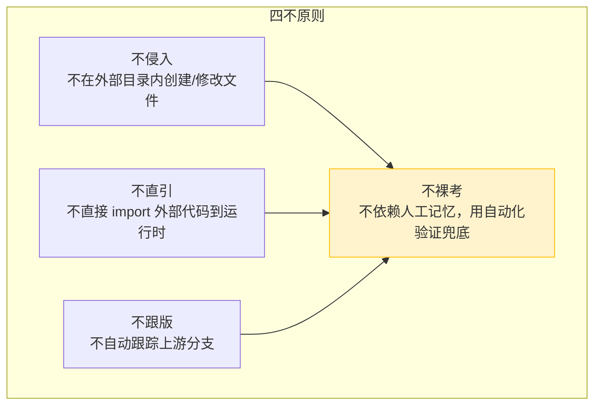

# 洞察萃取 — Vendor 外部子模块协同框架

## 三、洞察环节

### 3.1 关键发现

**发现 1：Git submodule 的"只读引用"本质**

Git submodule 在主项目中本质上是一个**指向特定 commit 的只读引用指针（gitlink）**。主项目不应该、也不能安全地在 submodule 目录内维护自己的文件——因为这会与外部仓库的工作树冲突，导致 submodule 永久处于"modified content"状态。

支撑事实：在 Task 1 尝试在 `vendor/flexloop/` 内创建 README.md 时，submodule 立即标记为 dirty，且无法通过主项目的 git add 来"修正"——因为这些文件属于子模块仓库。

深层含义：这意味着 submodule 的最佳使用方式是"**仅引用、不修改、不侵入**"。所有主项目需要的元数据（版本、用途、许可证等）必须放在 submodule 目录之外。

**发现 2：三区域边界模型是外部依赖管理的通用模式**

本次建立的三区域模型（主项目主权区 / 外部依赖主权区 / 接口层）不仅适用于 git submodule，而是管理任何外部代码依赖的通用模式：

- 主项目主权区：完全自主控制，可以任意修改
- 外部依赖主权区：视为只读，不做任何侵入式修改
- 接口层：主项目维护的适配层（元数据、包装脚本、配置文件），定义两者如何交互

支撑事实：这与之前项目中的"双区开发模型"（.temp/→apps/）有相似之处，但增加了"接口层"概念，更适合管理代码库层面的外部依赖，而非临时开发产物。

**发现 3：固定 commit 策略优于分支跟踪**

对于作为"规范参考实现"引入的外部代码库（如 flexloop），固定 commit 比跟踪分支更安全：

- 参考实现的价值在于提供**稳定的代码形态**作为对照，不需要跟随上游频繁变动
- 主项目对外部代码的引用模式（脚本复用、模式参考）依赖于稳定的代码结构
- 上游的 breaking change 不应该自动传导到主项目，应该经过评估后手动更新

支撑事实：VERSION.md 中记录的 d618849a commit 提供了稳定的代码快照，主项目所有基于 flexloop 的分析和模式萃取都基于此版本。

**发现 4：验证脚本应扩展现有工具而非新建**

本次将深度验证能力作为 `--deep` 参数扩展到现有 `repo-check.py vendor` 子命令中，而非创建独立的 `check-vendor-integration.py` 脚本。这产生了更好的用户体验：

- 用户不需要记住新的脚本名称
- 快速检查（默认）和深度检查（--deep）在同一命令下，形成渐进式验证
- 共享库中的辅助函数（git 命令执行、CLI 输出格式）可以直接复用

支撑事实：深度检查脚本 335 行代码中，大部分复用了现有 vendor.py 的基础设施，没有引入新的第三方依赖。

### 3.2 规律认知

**规律 1：外部代码协同的"四不原则"**

从本次实践中提炼出管理外部代码依赖（submodule/vendored code）的"四不原则"：

- **不侵入**：外部代码目录视为只读，元数据放在外部
- **不直引**：通过模式萃取而非直接 import 复用代码
- **不跟版**：固定 commit，手动评估后更新
- **不裸考**：自动化脚本（--deep）兜底验证所有约束

**规律 2：Spec 实施过程中的"弹性调整"模式**

本次有两处 checklist 设计与实际实现产生偏差（submodule README → N/A，独立更新脚本 → N/A），但都做出了正确的调整决策。这揭示了一个规律：Spec 阶段的 checklist 是**预期设计**，实施过程中遇到新事实（如 git submodule 的 dirty 行为）时，应基于实际情况调整而非教条执行。调整标准：

1. 调整是否有充分的事实依据（而非偷懒）
2. 调整是否仍然满足原始需求目标
3. 调整是否在 checklist.md 中明确标注 N/A 及原因

**规律 3：检查脚本的检查项与项目规范形成"双向验证"**

深度检查脚本的 5 项检查（初始化、清洁度、元数据一致性、非法引用、测试隔离）恰好对应规范文档中定义的关键约束。这形成了一个双向验证关系：

- 规范文档定义"应该怎样"
- 检查脚本验证"确实是这样"
- 每次运行检查都是对规范遵守情况的回归测试

### 3.3 潜在机会

**机会 1：将"四不原则"和三区域模型推广到其他外部依赖**

当前项目只有 flexloop 一个 submodule，但未来可能引入更多外部依赖（如 vendor 下的手动管理库）。三区域模型和四不原则可以作为通用的 vendor 管理框架，为任何新外部依赖提供标准化的接入流程。

**机会 2：submodule 深度检查可以扩展 CI 集成**

当前 `--deep` 检查在本地手动运行，未来可以集成到 CI 流水线（如 pre-commit hook 或 PR check），确保任何 PR 都不会意外引入非法的 vendor 引用或破坏 submodule 的干净状态。

**机会 3：模式萃取流程需要工具化支持**

VENDOR-INTEGRATION.md 中定义了 6 步模式萃取流程（评估→理解→适配→标注→验证→登记），但目前是文档化流程，没有工具辅助。未来可以考虑开发萃取辅助脚本，自动检测候选模式、生成 source 标注、更新资产索引。

**机会 4：check-links.py Windows file:// URL 解析修复**

本次发现 check-links.py 在 Windows 下解析 file:///d:/ URL 时存在路径拼接 bug，这影响了所有 Windows 开发者的链接验证效率。这是一个值得修复的工具缺陷。
