## 2. 核心概念适配性分析

### 2.1 适配性评估方法论

本节从概念映射、语法兼容性、语义对齐度、实现成本四个维度，对MyST核心概念与Agent Spec开发需求进行系统适配性评估。适配度分为三级：

- **高度适配**：概念天然匹配，语法可直接复用，语义高度重合，实现成本低
- **部分适配**：概念部分匹配，需要语法调整或语义扩展，实现成本中等
- **不适配**：概念不匹配，需重大改造或不建议引入

### 2.2 核心概念映射矩阵

| MyST核心概念 | Agent Spec对应需求 | 适配度 | 适配理由 | 改造要点 |
|---|---|---|---|---|
| **Directive块级容器** | 接口定义、参数说明、响应示例、注意事项、版本记录 | 高度适配 | 现有解析器已有基础识别逻辑，块级结构天然适合承载Spec中的结构化单元 | 启用colon_fence，扩展选项解析 |
| **Admonition提示框** | 注意事项、警告、最佳实践、Deprecated标记、版本提示 | 高度适配 | _ADMONITION_TYPES已预定义9种类型，语义完全匹配Spec中的警示类内容 | 统一渲染规范，扩展类型如deprecated/since |
| **:key: value选项** | 参数属性、配置项、元数据标记 | 高度适配 | 现有_OPTION_LINE_RE已支持，是当前唯一实现的选项格式 | 保持兼容，无需修改 |
| **反引号围栏** | 代码示例、接口Schema、JSON示例 | 高度适配 | 当前唯一支持的围栏形式，与代码块语义匹配 | 保持作为代码类指令默认围栏 |
| **Roles行内扩展** | 术语缩写、参数引用、类型标注、交叉引用、版本标记 | 高度适配 | 行内语义标记是Spec文档的高频需求，Roles语法简洁且非侵入 | 需新增Roles解析器，这是当前最大缺口 |
| **冒号围栏（:::）** | 提示框、卡片、折叠面板、表格容器等Markdown内容类指令 | 部分适配 | 降级显示效果好于反引号围栏，但需启用colon_fence插件 | 启用mdit-py-plugins的colon_fence |
| **YAML选项块（---）** | 复杂元数据、多配置项、嵌套属性 | 部分适配 | 适合复杂参数配置场景，但需新增YAML解析逻辑 | 引入轻量YAML解析或限制使用场景 |
| **内联选项（.class/#id）** | 样式类、锚点ID、简短配置 | 部分适配 | 对渲染输出有用，但对Spec语义提取价值有限 | 可暂缓实现，优先满足语义需求 |
| **嵌套Directive** | 复杂组件（如卡片内含代码块、折叠面板内含表格） | 部分适配 | 高级Spec场景需要，但嵌套解析复杂度高，错误恢复难 | 限定嵌套深度（≤3层），提供明确错误提示 |
| **math数学公式** | 算法说明、数值参数描述、计算公式 | 部分适配 | 技术类Spec偶尔需要，但非核心场景 | 通过code-block扩展支持，无需独立math指令 |
| **figure/image图片** | 架构图、流程图、截图引用 | 部分适配 | Spec中图示需求存在，但当前主要用Mermaid代码块 | 可复用现有图片链接语法，不必强绑定figure |
| **include包含指令** | 文档片段复用、共享Schema引用 | 部分适配 | 大型Spec的模块化需求，但文件路径处理和循环引用检测复杂 | 可作为后期增强，初期不建议引入 |
| **toc目录树** | 文档导航、多页Spec结构 | 不适配 | SpecWeave有自身的文档索引机制，toc指令与现有导航体系重复 | 不引入，使用现有docgen生成导航 |
| **cite文献引用** | 外部标准引用、参考文献 | 不适配 | Agent Spec极少需要学术式文献引用，使用普通链接即可 | 不引入，避免过度设计 |
| **tab-set/tab-item标签页** | 多语言示例、多版本对比 | 部分适配 | 展示层需求，对Spec结构化提取无直接帮助 | 可在渲染层实现，解析层无需支持 |
| **dropdown折叠面板** | 可选细节、附加说明、长内容折叠 | 部分适配 | 用户体验优化，但对机器解析语义无增益 | 渲染层增强即可，解析层识别为普通容器 |

### 2.3 Directives适配性详细评估（10+项）

| Directive名称 | 用途 | Agent Spec场景 | 适配度 | 现有支持 | 建议优先级 |
|---|---|---|---|---|---|
| `{note}` | 信息提示 | 补充说明、设计决策背景 | 高度适配 | _ADMONITION_TYPES已包含 | P0 |
| `{warning}` | 警告提示 | 易错点、兼容性问题、安全提示 | 高度适配 | _ADMONITION_TYPES已包含 | P0 |
| `{tip}` | 小技巧建议 | 最佳实践、使用建议 | 高度适配 | _ADMONITION_TYPES已包含 | P0 |
| `{important}` | 重要提示 | 关键约束、必须遵守的规则 | 高度适配 | _ADMONITION_TYPES已包含 | P0 |
| `{caution}` | 注意事项 | 边界条件、特殊情况说明 | 高度适配 | _ADMONITION_TYPES已包含 | P0 |
| `{seealso}` | 另见参考 | 相关文档、关联接口引用 | 高度适配 | _ADMONITION_TYPES已包含 | P0 |
| `{code-block}` | 代码块 | 请求示例、响应示例、Schema定义 | 高度适配 | 现有fence逻辑可扩展 | P0 |
| `{table}` | 表格容器 | 参数表、响应字段表、错误码表 | 高度适配 | 表格是当前核心结构化元素 | P1 |
| `{interface}` | （自定义）接口定义 | API端点、方法签名、输入输出 | 高度适配 | _extract_interfaces_from_directives已预留 | P0 |
| `{param}` | （自定义）参数说明 | 参数名、类型、约束、示例 | 高度适配 | _parse_directive_param已实现 | P0 |
| `{response}` | （自定义）响应说明 | 返回字段、状态码、错误处理 | 高度适配 | _parse_directive_response已实现 | P0 |
| `{deprecated}` | （自定义）弃用标记 | 弃用版本、替代方案、迁移指南 | 高度适配 | 需新增自定义类型 | P1 |
| `{since}` | （自定义）版本标记 | 起始版本、变更说明 | 部分适配 | 需新增自定义类型 | P2 |
| `{card}` | 卡片容器 | 信息分组、概览卡片 | 部分适配 | 渲染价值大于解析价值 | P2 |
| `{dropdown}` | 折叠面板 | 可选细节、附加信息 | 部分适配 | 渲染层功能 | P2 |
| `{list-table}` | 列表格式表格 | 复杂表格、数据驱动表格 | 部分适配 | 现有表格语法已足够 | P3 |
| `{math}` | 数学公式 | 算法公式、数值计算 | 部分适配 | 非核心场景 | P3 |
| `{figure}` | 带标题图片 | 架构图、流程图 | 不适配 | 可用Mermaid替代 | P3 |

### 2.4 Roles适配性详细评估（8+项）

| Role名称 | 用途 | Agent Spec场景 | 适配度 | 现有支持 | 建议优先级 |
|---|---|---|---|---|---|
| `{abbr}` | 缩写（悬停全称） | 领域术语缩写、协议缩写 | 高度适配 | 无，需新增 | P1 |
| `{literal}` | 行内代码样式 | 参数名、字段名、方法名 | 高度适配 | 可复用反引号，但语义更精确 | P0 |
| `{strong}` | 加粗强调 | 关键约束、必填项标记 | 高度适配 | 与**语法重叠，但语义明确 | P1 |
| `{ref}` | 交叉引用 | 接口引用、参数引用、章节引用 | 高度适配 | 无，需新增ID解析 | P1 |
| `{param-ref}` | （自定义）参数引用 | 引用其他接口的参数字段 | 高度适配 | 需新增自定义Role | P0 |
| `{type}` | （自定义）类型标注 | 参数类型、返回类型标记 | 高度适配 | 需新增自定义Role | P0 |
| `{since}` | （自定义）版本标记 | 行内标记版本引入 | 部分适配 | 需新增自定义Role | P2 |
| `{link}` | 外部链接 | 外部文档、标准链接 | 部分适配 | 标准Markdown链接已可替代 | P3 |
| `{sub}`/`{sup}` | 上下标 | 化学式、数学符号、版本号 | 部分适配 | 技术Spec中使用频率低 | P3 |
| `{math}` | 行内数学 | 公式、数值表达式 | 部分适配 | 非核心场景 | P3 |
| `{eq}` | 公式引用 | 公式编号引用 | 不适配 | 数学场景极少 | P3 |
| `{cite}` | 文献引用 | 参考文献 | 不适配 | 用普通链接即可 | 不引入 |

### 2.5 适配性映射可视化

```mermaid
graph TD
    subgraph "MyST 特性空间"
        A1[Admonitions<br/>note/warning/tip/...]
        A2[Code Block<br/>反引号围栏]
        A3[:key: value 选项]
        A4[Roles 行内扩展<br/>abbr/literal/ref]
        B1[Colon Fence<br/>::: 围栏]
        B2[YAML 选项块<br/>--- 包裹]
        B3[自定义 Domain<br/>Directives/Roles]
        B4[嵌套 Directive<br/>≤3层]
        C1[Math 公式]
        C2[Figure/Image]
        C3[Include 包含]
        C4[Toc/Cite 引用]
        C5[Tab/Dropdown<br/>纯UI组件]
    end

    subgraph "Agent Spec 需求空间"
        D1[结构化接口定义]
        D2[参数/响应 Schema]
        D3[警示信息标注]
        D4[术语与类型标注]
        D5[交叉引用]
        D6[代码示例]
        D7[版本/弃用标记]
        E1[复杂元数据]
        E2[内容片段复用]
        E3[图示与架构图]
        F1[学术引用]
        F2[自动目录]
        F3[多标签切换]
    end

    A1 -->|高度适配| D3
    A2 -->|高度适配| D6
    A3 -->|高度适配| D2
    A4 -->|高度适配| D4
    A4 -->|高度适配| D5
    B1 -->|部分适配| D3
    B2 -->|部分适配| E1
    B3 -->|高度适配| D1
    B3 -->|高度适配| D2
    B3 -->|高度适配| D7
    B4 -->|部分适配| D6
    C1 -->|低优先级| E3
    C2 -->|Mermaid替代| E3
    C3 -->|后期增强| E2
    C4 -->|不引入| F1
    C4 -->|不引入| F2
    C5 -->|渲染层实现| F3

    style A1 fill:#90EE90
    style A2 fill:#90EE90
    style A3 fill:#90EE90
    style A4 fill:#90EE90
    style B1 fill:#FFD700
    style B2 fill:#FFD700
    style B3 fill:#90EE90
    style B4 fill:#FFD700
    style C1 fill:#D3D3D3
    style C2 fill:#D3D3D3
    style C3 fill:#D3D3D3
    style C4 fill:#FFB6C1
    style C5 fill:#FFD700

    classDef fit fill:#90EE90,stroke:#333,stroke-width:2px
    classDef partial fill:#FFD700,stroke:#333,stroke-width:2px
    classDef nofit fill:#FFB6C1,stroke:#333,stroke-width:2px
    classDef low fill:#D3D3D3,stroke:#333,stroke-width:2px
```

**图2-1：MyST特性与Agent Spec需求适配性映射图**

图中绿色为高度适配特性（优先引入），黄色为部分适配特性（选择性引入），灰色为低优先级特性（暂缓），红色为不适配特性（不引入）。可见核心适配点集中在Admonitions、代码块、基础选项格式、Roles行内扩展以及自定义Domain扩展这五个维度。

---
