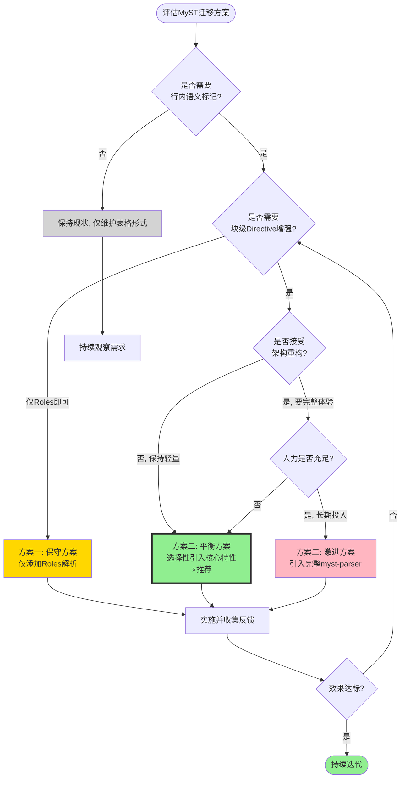

## 4. 实施路径设计

### 4.1 方案总览

基于上述挑战分析，设计三种实施路径方案，分别面向不同的风险偏好和投入产出预期。

| 方案维度 | 保守方案 | 平衡方案（推荐） | 激进方案 |
|---|---|---|---|
| **核心思路** | 最小变更，只补短板 | 选择性引入核心特性 | 全面对齐MyST生态 |
| **新增代码量** | ~200行 | ~800行 | ~2000行+ |
| **新增依赖** | 无新增 | 无强制新增（可选PyYAML） | 引入myst-parser |
| **架构变更** | 无架构变更 | 新增注册表机制 | 替换核心解析器 |
| **实施周期** | 1-2周 | 4-6周 | 8-12周 |
| **兼容性风险** | 极低 | 低 | 中等偏高 |
| **性能影响** | 可忽略 | <5% | 15-30% |
| **生态收益** | 有限 | 良好 | 最大 |

### 4.2 方案一：保守方案——仅补全Roles解析能力

**方案描述：** 不改变现有Directive解析架构，不启用colon_fence，不扩展选项格式，仅新增Roles解析能力并完善自定义Role支持。保持解析器轻量特性，只解决当前最明显的能力缺口（行内语义标记）。

**变更清单：**

| 变更项 | 位置 | 工作量 | 说明 |
|---|---|---|---|
| 新增Roles inline rule | 解析器初始化区域 | 150行 | 实现`{name}``content``识别 |
| 扩展`_extract_inline_text` | 第131-155行 | 30行 | 识别Roles token并正确提取文本 |
| 新增自定义Role注册表 | MDIParser类内 | 30行 | 字典式注册机制 |
| 实现核心Roles | 新代码区域 | 50行 | `{abbr}`/`{literal}`/`{type}`/`{param-ref}` |
| 文档与示例 | docs目录 | 少量 | 编写Roles使用指南 |

**依赖变化：** 无新增依赖，完全基于现有markdown-it-py 2.2.0。

**性能影响：** 解析性能影响<1%，inline规则高效且无回溯。

**兼容性：** 100%向后兼容，不改变任何现有解析行为，存量文档无影响。

**风险：**
- 风险极低，主要风险是Roles语法与普通代码反引号的边界case处理
- 缓解：使用markdown-it-py标准的backtick解析逻辑作为基础，经过充分测试

**适用场景：** 若团队对引入新语法持谨慎态度，或近期交付压力大，可先采用此方案快速获得行内语义标记能力。

### 4.3 方案二：平衡方案——选择性引入核心MyST特性

**方案描述：** 在保持现有markdown-it-py架构的前提下，选择性引入高价值MyST特性：启用colon_fence支持双围栏，扩展选项解析支持YAML块（限自定义指令），新增Roles解析，建立Directive/Role注册表机制。不引入完整myst-parser，保持解析器轻量和可控。

**变更清单：**

| 变更项 | 位置 | 工作量 | 说明 |
|---|---|---|---|
| 启用colon_fence插件 | 第171-172行 | 5行 | 添加mdit-py-plugins colon_fence |
| 重构Directive围栏识别 | 第377-421行 | 80行 | 统一处理双围栏，增加校验逻辑 |
| 扩展`_parse_directive_content` | 第641-672行 | 100行 | 支持YAML块选项（限特定指令） |
| 新增Roles解析完整实现 | 新代码区域 | 200行 | inline rule + 核心Roles实现 |
| 建立Directive注册表 | MDIParser类重构 | 150行 | 将硬编码逻辑重构为可注册处理器 |
| 新增自定义Directive | 注册实现 | 80行 | `{deprecated}`/`{since}`等 |
| 错误处理增强 | 全解析路径 | 100行 | 友好错误提示与容错机制 |
| Codemod迁移脚本 | scripts目录 | 120行 | 表格→Directive自动转换（可选使用） |
| 文档规范与模板 | docs目录 | 中等 | 编写完整的Spec写作规范 |
| 测试用例补充 | tests目录 | 中等 | 覆盖新特性与边界case |

**依赖变化：**
- 必需：无强制新增依赖，使用已有的mdit-py-plugins 0.5.0中的colon_fence
- 可选：若需要完整YAML支持，可引入PyYAML（约600KB）；也可实现简化YAML解析避免依赖

**性能影响：** 解析性能预计下降3-5%，主要来自：1）colon_fence插件的额外token处理；2）Directive注册表查询（可通过内置指令快速路径优化）；3）Roles的inline规则。在可接受范围内。

**兼容性：**
- 99%以上向后兼容
- 潜在风险点：现有文档中若存在`:::`开头的行（极少见），可能被误识别；可通过二次校验（必须匹配`{name}`模式）规避
- 所有现有表格形式的解析逻辑完全保留

**风险与缓解：**

| 风险 | 概率 | 影响 | 缓解措施 |
|---|---|---|---|
| colon_fence导致普通代码块误识别 | 低 | 中 | 二次校验+围栏长度规则+充分测试存量文档 |
| 注册表重构引入回归bug | 中 | 中 | 保留原逻辑作为参考，完善测试覆盖，灰度发布 |
| YAML选项解析复杂度超预期 | 中 | 低 | 先不支持通用YAML，仅为`{interface}`等指令实现专用简化解析 |
| 团队学习成本 | 中 | 低 | 提供模板、示例、cheatsheet，渐进式推广 |

**推荐理由：** 此方案在投入、风险、收益三者间取得最佳平衡。既解决了当前解析器的核心能力缺口（Roles、双围栏、可扩展性），又避免了引入完整myst-parser带来的架构大变动和性能开销。自定义注册表机制为未来扩展预留了空间，符合SpecWeave项目的定位——轻量、专注、领域特定。

### 4.4 方案三：激进方案——引入完整myst-parser生态

**方案描述：** 放弃当前自定义解析器架构，引入myst-parser（Executable Books官方解析器）作为核心解析引擎，在其基础上构建Agent Spec的领域扩展。获得完整体MyST生态支持，包括所有标准Directives/Roles、嵌套、 Sphinx互操作等。

**变更清单：**

| 变更项 | 位置 | 工作量 | 说明 |
|---|---|---|---|
| 替换核心解析依赖 | requirements/导入 | 20行 | 引入myst-parser替换markdown-it-py直接使用 |
| 重构解析器入口 | MDIParser类 | 300行 | 适配myst-parser的API与AST |
| 实现领域扩展 | 新架构 | 400行 | 在myst-parser上注册自定义Directives/Roles |
| 重写接口提取逻辑 | 第1124-1272行 | 200行 | 适配新AST结构 |
| 前端matter/TOML加载适配 | 第248-341行 | 100行 | 适配myst-parser的frontmatter处理 |
| 完整测试重写 | tests目录 | 大 | 所有测试需适配新AST |
| 性能优化 | 全链路 | 200行 | 解决myst-parser性能问题 |
| 全量文档回归测试 | 66份文档 | 大 | 验证所有文档解析结果一致性 |
| 文档全面更新 | docs目录 | 大 | 编写完整MyST+自定义扩展指南 |

**依赖变化：**
- 新增：myst-parser（及依赖链），约5-10个包
- markdown-it-py/mdit-py-plugins变为间接依赖（myst-parser会引入）

**性能影响：** 预计解析性能下降15-30%，myst-parser功能更全但更重。对CI/CD场景有一定影响，需评估。

**兼容性：**
- 中高风险，AST结构完全变化
- 现有自定义解析逻辑需全部重写
- 存量文档若存在myst-parser不兼容的边缘语法可能解析失败
- 输出数据结构变化可能影响下游代码生成器、验证器等消费方

**风险与缓解：**

| 风险 | 概率 | 影响 | 缓解措施 |
|---|---|---|---|
| myst-parser API不稳定 | 中 | 高 | 锁定版本，关注changelog，封装适配层 |
| 性能下降超预期 | 中 | 中 | 性能测试，必要时贡献上游优化或缓存 |
| 下游消费方适配成本高 | 高 | 中 | 提供兼容层输出旧格式，渐进式迁移 |
| 过度设计引入不必要复杂度 | 高 | 中 | 严格评估每个特性是否真的需要，不使用的特性关闭 |
| 调试难度增加 | 中 | 中 | 熟悉myst-parser源码与文档，建立问题排查手册 |

**适用场景：** 若SpecWeave未来计划支持完整的科学出版级文档能力、需要与Sphinx/Jupyter Book生态深度整合、或团队有充足的人力投入到基础设施建设，可考虑此方案。当前阶段建议暂不采用。

### 4.5 实施决策树

**图4-1：实施方案决策树**

### 4.6 推荐方案详细路线图

以平衡方案为推荐方案，建议分四个里程碑实施：

**里程碑1（第1周）：基础准备与colon_fence启用**
- 启用colon_fence插件，完成围栏识别逻辑重构
- 补充围栏解析的测试用例
- 全量回归测试66份存量文档
- 输出：双围栏支持可用，无文档解析错误

**里程碑2（第2-3周）：Roles与注册表架构**
- 新增inline Roles解析规则
- 实现Directive/Role注册表机制
- 将现有硬编码逻辑重构为可注册处理器
- 实现核心自定义Roles（`{type}`/`{param-ref}`）
- 输出：Roles可用，架构具备可扩展性

**里程碑3（第4-5周）：选项扩展与自定义指令**
- 为`{interface}`/`{param}`/`{response}`添加YAML选项支持
- 新增`{deprecated}`/`{since}`等自定义Admonitions
- 增强错误提示与容错处理
- 编写文档规范和模板
- 输出：完整功能可用，文档齐备

**里程碑4（第6周）：工具与迁移辅助**
- 编写表格→Directive自动迁移脚本
- 集成lint规则到CI
- 团队培训与示例推广
- 输出：迁移工具链齐备，可推广使用

---
